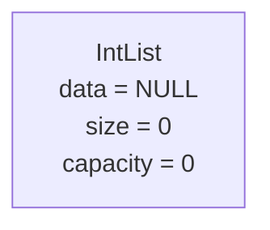
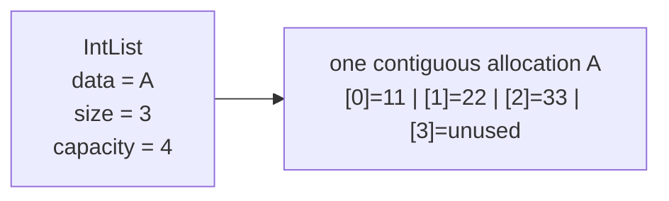
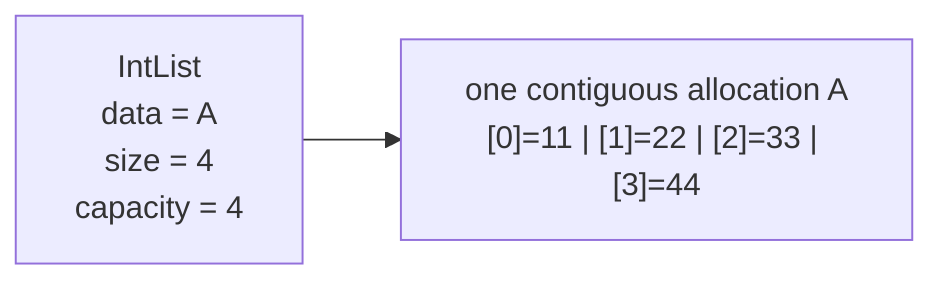
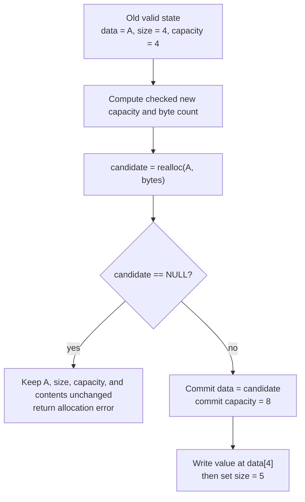
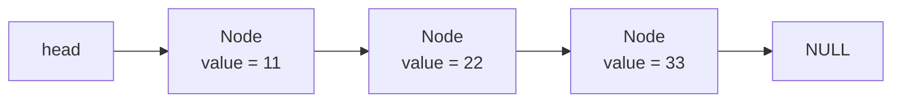

# Module 1 Memory Models

Every visual below has a text equivalent so students may use a diagram, structured table, tactile representation, or verbal description.

## 1. Empty valid list

Text equivalent:

| Object | Field | Value | Meaning |
|---|---|---:|---|
| `IntList` | `data` | `NULL` | No allocation is owned |
| `IntList` | `size` | `0` | No logical elements |
| `IntList` | `capacity` | `0` | No allocated element slots |

## 2. Partially occupied allocation

Text equivalent:

| Index | `0` | `1` | `2` | `3` |
|---|---:|---:|---:|---|
| Slot | `11` | `22` | `33` | unused |
| Logical element? | yes | yes | yes | no |

Valid indexes are `0` through `size - 1`. Capacity describes allocated slots, not initialized logical elements.

## 3. Full list before growth

An append cannot write index `4` yet. Index `4` is one past the four-slot allocation.

## 4. Failure-atomic growth

The important idea is **commit after success**. A failed append must leave the previous valid list usable.

## 5. Successful moving growth

Before:

| Field | Value |
|---|---|
| `data` | address `A` |
| `size` | `4` |
| `capacity` | `4` |
| elements | `[11, 22, 33, 44]` |

After appending `55`, if allocation moves:

| Field | Value |
|---|---|
| `data` | new address `B` |
| `size` | `5` |
| `capacity` | at least `5`; course policy normally produces `8` |
| elements | `[11, 22, 33, 44, 55, unused, unused, unused]` |

An alias such as `int *alias = &list.data[1]` pointed inside allocation `A`. If growth moves storage to `B`, `alias` is stale and must not be dereferenced. Reacquire the location as `&list.data[1]`.

## 6. Linked-node preview

Text equivalent:

| Logical position | Object | Stored value | Link |
|---:|---|---:|---|
| 0 | node at address `P` | `11` | address `Q` |
| 1 | node at address `Q` | `22` | address `R` |
| 2 | node at address `R` | `33` | `NULL` |

Linked nodes need not be physically adjacent. They avoid moving all later elements during a local link change, but they give up direct index arithmetic and add pointer/ownership risks. Full linked-list implementation returns in Module 14.

## 7. Representation invariant

A valid course `IntList` satisfies all of the following:

1. `size <= capacity`.
2. If `capacity == 0`, then `data == NULL` and `size == 0`.
3. If `capacity > 0`, then `data != NULL` and owns storage for at least `capacity` integers.
4. Logical elements occupy exactly indexes `[0, size)`.
5. The list has one cleanup responsibility for the owned allocation.
