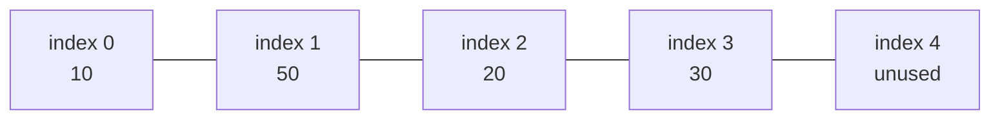
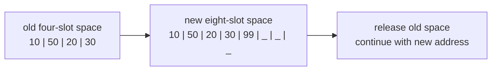

# Module 1 Memory Models

These diagrams use the same values and operations as the Chapter 1 textbook.
Each diagram includes a text equivalent.

## 1. Stored items and unused space



Text equivalent: Five contiguous slots are allocated. Indexes 0 through 3
contain 10, 50, 20, and 30. Index 4 is unused.

## 2. Delete and close the gap

```text
before: [10] [50] [20] [30] [ ]
remove: [10] [ ]  [20] [30] [ ]
after:  [10] [20] [30] [ ]  [ ]
```

The later items move left. The active items still begin at index 0 and contain
no gap.

## 3. Insert without overwriting

```text
before: [10] [20] [30] [ ]  [ ]
shift:  [10] [20] [ ]  [30] [ ]
after:  [10] [20] [99] [30] [ ]
```

Move values from back to front. Moving front to back would overwrite a value
before that value had been copied.

## 4. Expand a full memory space



Text equivalent:

1. The old four-slot space is full.
2. Obtain a new eight-slot space.
3. Copy 10, 50, 20, and 30 in the same order.
4. Add 99 after 30.
5. Release the old four-slot space.
6. Continue using the new starting address.

## 5. Why doubling helps

With one-slot growth, additions repeatedly trigger copying. With doubling,
each expansion creates room for several later additions. Expansions become
farther apart as the array grows. Across many additions, the average work for
one addition remains small.

## 6. Release the final dynamic array

```c
free(arrayList);
arrayList = NULL;
arrayList_size = 0;
arrayList_capacity = 0;
```

The allocation is returned, and the tracking variables no longer describe
released memory.
