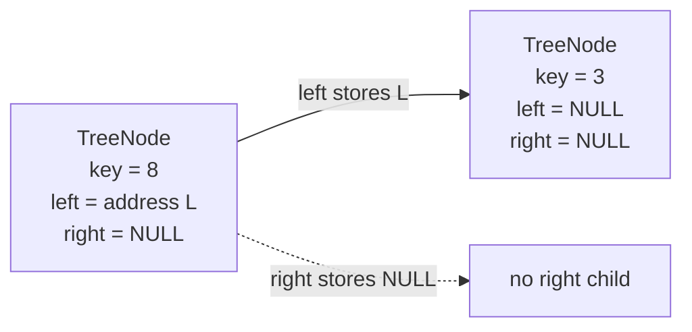
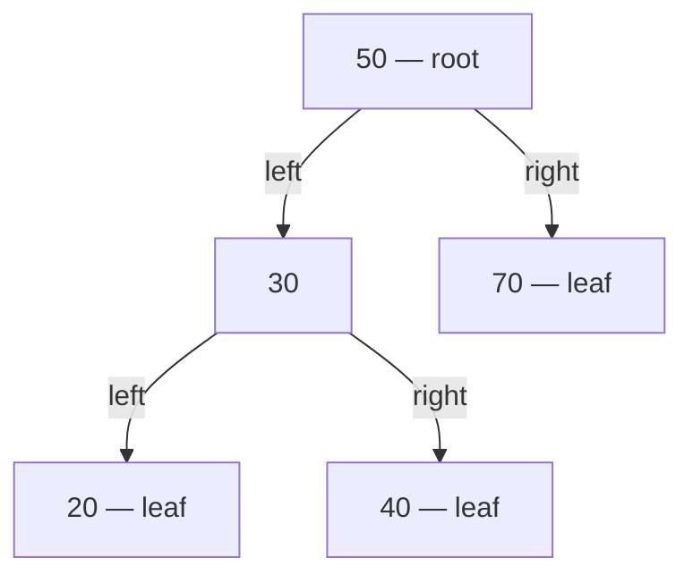
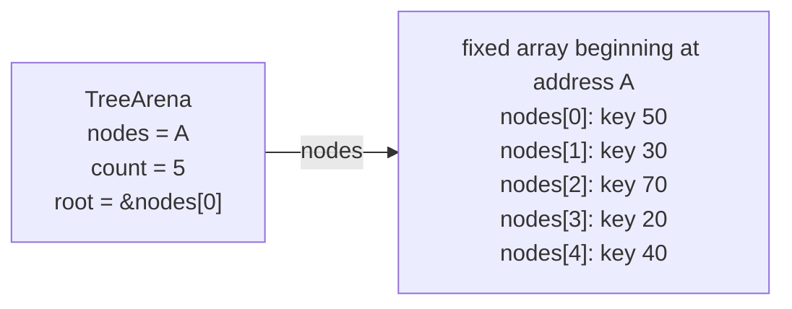
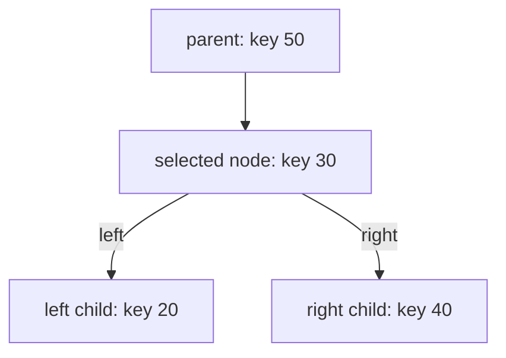
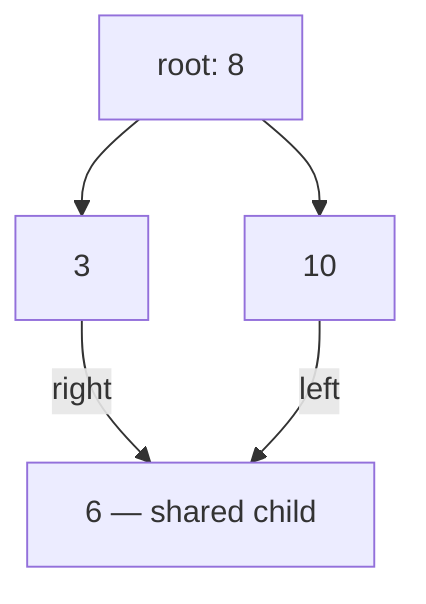
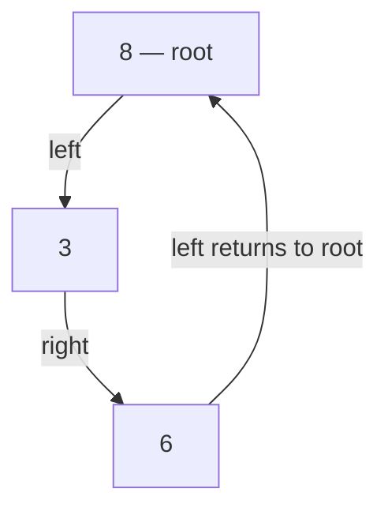
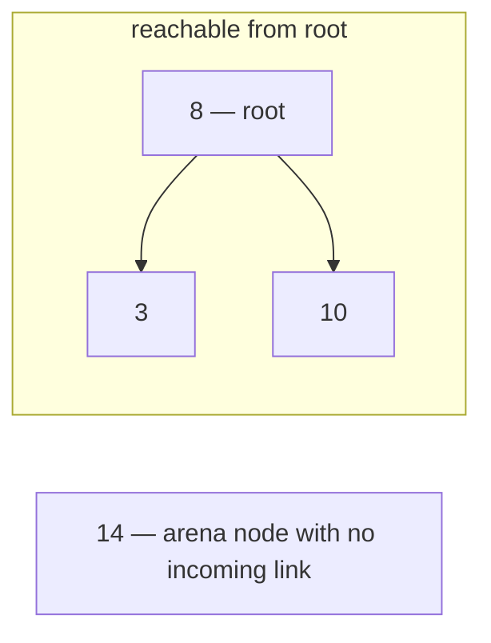
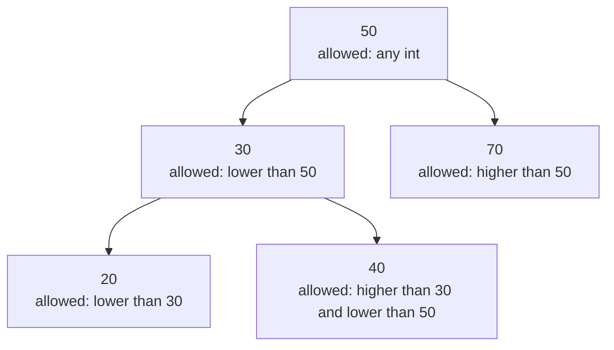
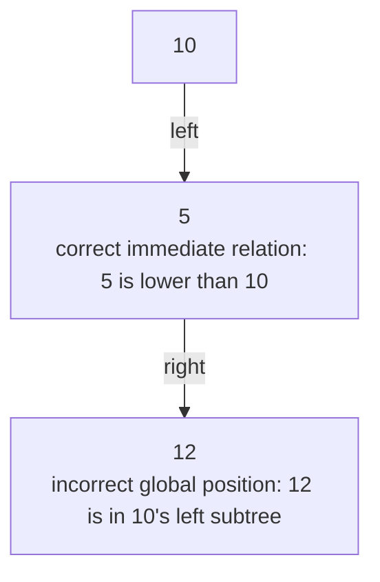
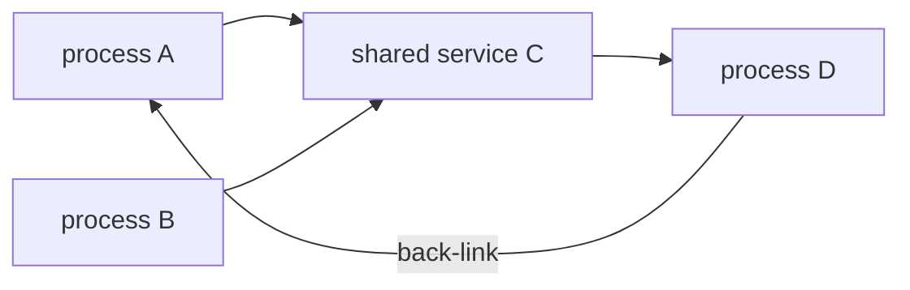

# Module 2 Tree Models

Every visual has a text equivalent. Students may use the diagram, the table,
a tactile arrangement, a structured list, or a spoken description.

## 1. One node and two possible child links

A **node** is one stored object. A **key** is the integer value stored in that
node. An **address** is a memory location, and a **pointer** is a C variable
that stores an address. A **child** is a node directly below another node, and its
**parent** is the node directly above it. `NULL` is a special pointer value
meaning “no object.”



Text equivalent:

| Node | Field | Stored value | Meaning |
|---|---|---|---|
| key `8` | `left` | address of key `3` | key `3` is the left child |
| key `8` | `right` | `NULL` | there is no right child |
| key `3` | `left` | `NULL` | there is no left child |
| key `3` | `right` | `NULL` | there is no right child |

Key `3` is a **leaf**, a node with no children. Key `8` is not a leaf.

## 2. Valid five-node binary tree

A **hierarchy** arranges objects above or below other objects. A **binary
tree** is a hierarchy in which each node has at most two children. The
**root** is the one starting node and has no parent.



Text equivalent:

```text
Root key 50
1. Left child: key 30
   1.1 Left child: key 20; key 20 has no children.
   1.2 Right child: key 40; key 40 has no children.
2. Right child: key 70; key 70 has no children.
```

A **path** is a sequence of connected nodes. One path is
`50 → 30 → 40`.

**Depth** is the number of links from the root. Key `40` has depth two.
**Height** is the greatest number of downward links from a node to a leaf.
The root has height two under the course convention.

## 3. The same tree in a fixed arena

An **arena** in this module is one already created, non-resizing array that
stores all nodes. “Non-resizing” means its number of storage positions and
their addresses do not change during the exercise. An **index** is an array
position; C numbers its first position zero. `TreeArena` is the course name
for the C type that stores the arena's starting address, node count, and root
address.



Text equivalent:

| Arena field | Value | Meaning |
|---|---|---|
| `nodes` | address of `nodes[0]` | beginning of the fixed array |
| `count` | `5` | five nodes belong to the completed tree |
| `root` | `&nodes[0]` | node at index zero is the root |

The child pointers, not the array order, define family relationships:

| Index and key | `left` | `right` |
|---|---|---|
| `nodes[0]`, key `50` | `&nodes[1]` | `&nodes[2]` |
| `nodes[1]`, key `30` | `&nodes[3]` | `&nodes[4]` |
| `nodes[2]`, key `70` | `NULL` | `NULL` |
| `nodes[3]`, key `20` | `NULL` | `NULL` |
| `nodes[4]`, key `40` | `NULL` | `NULL` |

For example, `nodes[4]` is not automatically the child of `nodes[3]` merely
because the indexes are adjacent. The stored pointers decide.

## 4. Immediate family

**Immediate family** in this course means one node’s parent and its direct
left and right children. An **application programming interface (API)** is the
set of functions other code may call. This API reports array indexes rather
than addresses. `TREE_NO_INDEX` means that the requested relative is absent.



Text equivalent:

| Role relative to `nodes[1]`, key `30` | Reported index | Node |
|---|---:|---|
| parent | `0` | key `50` |
| left child | `3` | key `20` |
| right child | `4` | key `40` |

The node does not store its parent. The immediate-family function finds the
parent by checking which arena node points to the selected node.

## 5. Structural invariant

An **invariant** is a rule that must remain true whenever a completed
structure is used. An **active node** is an arena node included in the
current structure. In an empty tree, the root pointer is `NULL`. A valid
nonempty course tree has:

1. a root with no parent;
2. exactly one parent for every other node;
3. every child pointer equal to `NULL` or pointing to an active arena node;
4. every active node reachable from the root;
5. no cycles;
6. at most two children per node; and
7. no node whose left and right fields name the same child.

**Reachable** means that starting at the root and following child pointers can
arrive at the node. A **cycle** is a path that returns to a node already on
that path.

Text-only check:

| Question | Required answer |
|---|---|
| How many parents has the root? | zero |
| How many parents has every other node? | exactly one |
| Where may a non-`NULL` child pointer point? | to an active node in this arena |
| Can every arena node be reached from root? | yes |
| Can following children return to an earlier node on the path? | no |
| How many children may one node have? | zero, one, or two |
| May both fields name the same child? | no |

## 6. Invalid shared child



Text equivalent:

| Child | Parent links |
|---|---|
| key `3` | from key `8` |
| key `10` | from key `8` |
| key `6` | from key `3` and from key `10` |

This is not a valid course tree because key `6` has two parents. A local
child-slot check can accept the second link if that slot is empty; the
supplied whole-tree validator must detect the global violation.

## 7. Invalid cycle



Text equivalent:

```text
Start at key 8.
Follow left to key 3.
Follow right to key 6.
Follow left to key 8 again.
```

The path returns to key `8`, so it contains a cycle. The incoming link also
breaks the rule that the root has no parent.

## 8. Invalid unreachable node



Text equivalent:

| Arena node | Can root reach it? |
|---|---|
| key `8` | yes; it is the root |
| key `3` | yes; follow root’s left pointer |
| key `10` | yes; follow root’s right pointer |
| key `14` | no; no path from the root identifies it |

Key `14` may occupy valid arena storage, but it is not part of a valid
completed tree because it is unreachable.

## 9. Binary search tree ranges

A **binary search tree (BST)** is a binary tree with a global key-ordering
rule. **Global** means that the rule covers the whole structure. Every key in
a node’s entire left subtree is lower than that node’s key, and every key in
its entire right subtree is higher. This course rejects duplicate keys.



Text equivalent:

| Key | Limits inherited from its position | Passes? |
|---:|---|---|
| `50` | any whole-number key | yes |
| `30` | lower than `50` | yes |
| `70` | higher than `50` | yes |
| `20` | lower than `30` and `50` | yes |
| `40` | higher than `30`, lower than `50` | yes |

The supplied **validator**, a function that checks stated rules, passes lower
and upper limits to each node. Students interpret the limits here;
step-by-step procedures for visiting all nodes come later.

## 10. A deep BST violation



Text equivalent:

```text
Key 5 is the left child of key 10.
Key 12 is the right child of key 5.
The two immediate comparisons look correct.
Key 12 is still inside key 10's entire left subtree.
Every key there must be lower than 10, but 12 is higher.
Therefore this tree is not a BST.
```

Checking only parent/child pairs is insufficient.

## 11. Tree → Graph transfer

A **graph** is a collection of objects and relationships without the strict
parent/child rules of a tree. A graph object is often called a **vertex**. A
relationship is often called an **edge**.



Text equivalent:

| Relationship | Tree interpretation | Graph interpretation |
|---|---|---|
| `A → C` and `B → C` | invalid: `C` has two parents | allowed: two vertices link to one vertex |
| `C → D → A` | invalid: the links create a cycle | allowed unless the application forbids it |

The transfer question is:

> When shared, crossing, or backward links are meaningful rather than
> mistakes, which tree rules should be replaced by graph rules?

Later graph search records which vertices have already been visited so a
cycle does not cause endless repeated work.
