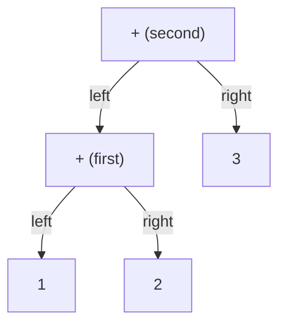

# Chapter 2. Organizing Data in a Hierarchy

## Thinking Logically

### What does hierarchical data look like?

An array stores nodes side by side; child links give them a hierarchy. We first connect letters into a tree, then represent the addition expression `1+2+3` as a tree.

### How do array positions become a tree?

Each node stores a character and two child indices. For example, `nodes[0].left = 1` makes node `B` at index `1` the left child of node `A` at index `0`. Neither node moves.

### How do we access the whole tree?

A root is the index where a tree starts. The alphabet example returns root `5` (`F`). Following its child links reaches seven nodes; `H`, `I`, and `J` remain unconnected.

### How do we connect an item to this data structure?

Store its index in a parent's `left` or `right` member. To introduce a new root, connect the old root beneath the new parent, then update the root index.

### A simple example

The classroom expression is exactly `1+2+3`: single digits alternating with `+`. Its five characters become five nodes. The connection loop groups it as `(1+2)+3`; the final root is index `3`, the second `+`.

### Preparing an addition tree

How can we turn `1+2+3` into a tree? We will build it from left to right, grouping the expression as `(1+2)+3`.

First, prepare one node for each character: `1`, `+`, `2`, `+`, and `3`. The two `+` characters occupy separate nodes. Initially, none of the nodes has children.

1. Start with the first number. The node containing `1` is the root of our initial tree, representing just `1`.
2. Connect the first addition. Make the first `+` node the parent of the current root and the node containing `2`. The old root becomes its left child, and `2` becomes its right child. This `+` becomes the new root, representing `1+2`.
3. Connect the next addition. Make the second `+` node the parent of the current root and the node containing `3`. The entire tree for `1+2` is now on its left, and `3` is on its right. This second `+` becomes the root of the whole expression.



The same rule applies whenever another `+` and number follow: attach the current root on the new operator's left, attach the next number on its right, and make the operator the new root.

Throughout construction, the current root gives us access to everything connected so far. We are recording how the expression is grouped; calculating its value comes next.

### How do we calculate the result of the operation?

A digit returns its integer value. A `+` node first asks its left subtree for a value, then its right subtree, and returns their sum. The final answer is `6`.

## Calculating Efficiency

### How much memory does one item use?

A node stores one `char` and two `int` members. `nodes[10]` reserves ten slots even when only five are in use.

### How much memory is used for iterating over items?

Recursive calls keep temporary state for the current path. Extra memory grows with tree height: `O(h)`.

### How fast is creating or adding one item?

Initializing one node or assigning one child link takes constant time. Initializing or connecting `n` nodes takes `O(n)` time.

### How fast is iterating over items?

Traversal and evaluation take `O(r)` time for `r` nodes reachable from the starting root, assuming a valid tree. Unconnected array entries are not visited.

## Glossary

### Node

One character together with its left and right child indices.

### Tree

A connected hierarchy with one root, no cycles, and one parent per non-root node.

### Binary Tree

A tree with at most two children per node, distinguished as left and right.

### Expression Tree

A tree whose leaves hold digits and whose internal nodes hold operators.

### Root

The node from which a tree is accessed.

### Parent

A node directly above its child.

### Child

A node directly linked below its parent.

### Sibling

Another child of the same parent.

### Ancestor

A node earlier on the path from the root.

### Descendant

A node reached by following child links downward.

### Leaf

A node with no children; both child indices are `-1`.

### Subtree

A node and all its descendants.

### Recursion

A function calling itself, with separate parameter and local values for each call.

### Base Case

A case that finishes without making another recursive call.

## Invariant

### What is the invariant (the golden rule) in this data structure?

- An absent child is `-1`; a present child is an index below `nodes_size` and at least `0`.
- Within one tree, each non-root node has one parent and there are no cycles.
- `nodes_size` counts initialized, in-use array slots, not nodes reachable from a particular root.

### What happens if an invariant is broken?

Shared children can be visited repeatedly. A cycle can make recursion continue indefinitely. The range guard in `tree_recursion` does not detect cycles.

### How do we keep the invariant intact?

Initialize before connecting. Preserve valid child indices and the intended tree shape. `eval` assumes a valid addition tree with a digit leaf or a `+` node with two children; it has no index-range check.

## Coding Plan

### Designing a node

Keep `data`, `left`, and `right` in `struct TreeNode`; store ten such nodes in a shared array.

### Preparing the alphabet tree

1. Initialize ten nodes as `A` through `J`, with no children.
2. Connect `A` to `B` and `C`, and `B` to `D` and `E`.
3. Make `F` the root above `A` and `G`.

### Reading the alphabet tree

Visit the left subtree, then the right subtree, then read the current node. Starting at `F`, the read order is `D E B C A G F`. Reading a character here does not print it.

### Preparing an addition tree

1. Copy the five characters of `1+2+3` into the shared nodes and reset their child links.
2. Start with the first digit as root.
3. For each operator and following digit, attach the old root on the operator's left and the digit on its right.
4. Make that operator the new root.

### Evaluating an expression tree

Return a digit's value directly. Otherwise evaluate the left child into `l`, the right child into `r`, and return `l + r`.

## New C Syntax Explained

### Defining a `struct` tag

`struct TreeNode { ... };` defines a type containing named members. The final semicolon is required.

### Using a `struct` tag

`struct TreeNode nodes[10];` declares an array of ten nodes. Valid physical indices are `0` through `9`.

### `.` (Accessing Members)

`nodes[i].left` selects array element `i`, then its `left` member. The stored integer is a child's index, not the child's character or calculated value.

### Postfix increment

`i++` supplies the old value of `i` and then increases `i` by one. In `int root = i++;`, starting with `i = 0` gives `root = 0` and leaves `i = 1`.

### Recursive Functions

The caller waits while a child call runs, then resumes at the next statement. `tree_recursion` stops at an invalid index; `eval` stops at a digit. Each active `eval` call keeps its own `i`, `l`, and `r`.

## C Code

### Node storage

Explain the type, array, capacity, and number of in-use slots.

```c
struct TreeNode {
    char data;
    int left;
    int right;
};
struct TreeNode nodes[10];
int capacity = 10;
int nodes_size = 0;
```

### Initializing alphabet nodes

Explain how every slot receives a letter and two absent-child markers.

```c
void alphabet_init() {
    nodes_size = capacity;
    for (int i = 0; i < capacity; i++) {
        nodes[i].data = 'A' + i;
        nodes[i].left = nodes[i].right = -1;
    }
}
```

### Connecting the alphabet tree

Explain each link and why the function returns `5`.

```c
int tree_connect() {
    int root = 0;
    nodes[root].left = 1;
    nodes[root].right = 2;
    nodes[1].left = 3;
    nodes[1].right = 4;
    nodes[5].left = root;
    root = 5;
    nodes[5].right = 6;
    return root;
}
```

### Reading nodes recursively

Explain when `data_read` is assigned and what happens for `i = -1`.

```c
void tree_recursion(int i) {
    if (i >= 0 && i < nodes_size) {
        tree_recursion(nodes[i].left);
        tree_recursion(nodes[i].right);
        int data_read = nodes[i].data;
    }
}
```

### Initializing an addition expression

Explain which five characters are copied and why `nodes_size` becomes `5`.

```c
void eq_plus_init() {
    char eq[10] = "1+2+3";
    int eq_size = 5;
    nodes_size = eq_size;
    for (int i = 0; i < eq_size; i++) {
        nodes[i].data = eq[i];
        nodes[i].left = nodes[i].right = -1;
    }
}
```

### Connecting an addition tree

Explain the values of `i`, `op`, `num`, and `root` through both iterations.

```c
int eq_plus_connect() {
    int i = 0;
    int root = i++;
    while (i < nodes_size) {
        int op = i++;
        int num = i++;
        nodes[op].left = root;
        nodes[op].right = num;
        root = op;
    }
    return root;
}
```

### Evaluating an addition tree

Explain why a digit returns immediately and each addition waits for two answers.

```c
int eval(int i) {
    if (nodes[i].data >= '0'
        && nodes[i].data <= '9') {
        return nodes[i].data - '0';
    }
    int l = eval(nodes[i].left);
    int r = eval(nodes[i].right);
    return l + r;
}
```

## Full C Code Explanation

These explanations follow the seven classroom snippets in order. They cover what the code stores, which statements run, and what each call leaves behind.

### 1. Reading declarations, statements, and functions

C source code contains declarations and instructions. A **declaration** introduces a name and its type. `int capacity = 10;` declares an integer variable and initializes it to ten. An **assignment**, such as `nodes_size = capacity;`, replaces an existing variable's value with the value on the right. A semicolon ends these statements. Curly braces group declarations or statements into a body; parentheses hold parameters, arguments, or conditions.

A **function definition** describes a job. Its body runs when the function is called, not merely when the definition appears in the file. The return type precedes the name: `void` means the function does not return a value, while `int` means it returns an integer. In these examples, the functions written with `()` are called without arguments. `tree_recursion(int i)` and `eval(int i)` each receive one integer parameter named `i`.

The alphabet sequence is to call `alphabet_init`, save the index returned by `tree_connect`, and pass that index to `tree_recursion`. The addition sequence is to call `eq_plus_init`, save the index returned by `eq_plus_connect`, and pass that index to `eval`. These are two demonstrations using the same storage. No supplied snippet prints anything; a returned answer and displayed output are separate actions.

### 2. Node storage: types, members, and indices

`struct TreeNode` is a structure type chosen by the programmer. Its body declares three members: `char data` stores a character, and `int left` and `int right` store child indices. `TreeNode` is not a built-in C command. The semicolon after the closing brace ends the type declaration.

`struct TreeNode nodes[10];` reserves an array of ten structures. Square brackets in this declaration specify a count; in `nodes[3]`, they select one element. Indexing starts at zero, so index ten is outside this array. A dot selects a member: `nodes[3].data` is the character in the fourth node.

The array, `capacity`, and `nodes_size` are declared outside functions, so they are shared global storage that lasts for the program's execution. `capacity = 10` records the array limit; changing this variable would not resize `nodes[10]`. `nodes_size = 0` says no slots are in use yet. Global members initially have zero values, but zero is a valid child index, so this is not our empty-child representation. The initialization functions explicitly set child links to `-1`.

Distinguish **index**, **character**, and **answer**. In the addition example, index `4` locates a node storing character `'3'`; evaluating that node returns integer `3`. Changing a child index or root does not move an array element.

### 3. `alphabet_init`: initializing ten separate nodes

`nodes_size = capacity;` sets the in-use count to ten. The `for` statement has three parts separated by semicolons: `int i = 0` runs once; `i < capacity` is checked before each iteration; `i++` runs after the body. The body therefore runs for `i` from zero through nine and stops when `i` becomes ten.

`nodes[i].data = 'A' + i;` starts with the character code for `'A'` and adds the index. In the character encoding used by the class, the results are `A` through `J`. Single quotes denote a character, while an unquoted integer denotes a numeric value.

`nodes[i].left = nodes[i].right = -1;` is a chained assignment. It stores `-1` in `right`, then stores that assigned value in `left`. Each node now has no children. On return, the loop's local `i` is gone, but the global node contents and `nodes_size = 10` remain.

### 4. `tree_connect`: linking existing nodes and replacing the root

`int root = 0;` introduces a local integer holding the index of `A`. Each following assignment stores an index in a child member:

| Statement | Result |
|---|---|
| `nodes[root].left = 1;` | `A` has left child `B`. |
| `nodes[root].right = 2;` | `A` has right child `C`. |
| `nodes[1].left = 3;` | `B` has left child `D`. |
| `nodes[1].right = 4;` | `B` has right child `E`. |
| `nodes[5].left = root;` | `F` has left child `A`, using the current root value `0`. |
| `root = 5;` | The local root index changes to `F`. |
| `nodes[5].right = 6;` | `F` has right child `G`. |
| `return root;` | The function finishes and returns integer `5` to its caller. |

The old subtree remains intact when `F` becomes the root. The resulting shape is `F(A(B(D,E),C),G)`. Seven nodes are reachable from `F`, but `nodes_size` is still ten. `H`, `I`, and `J` are initialized entries outside this tree. They are not reached by this traversal.

### 5. `tree_recursion`: calls go down, execution resumes upward

The parameter `i` is a local copy of the argument for this call. `if (i >= 0 && i < nodes_size)` checks that it lies in the in-use index range. `>=` means greater than or equal to; `<` means less than; `&&` requires both conditions to hold. If the condition is false, the body is skipped and this `void` function finishes without a returned value. This is the base case, including calls with `i = -1`.

For a valid index, the first statement calls the same function with the left child's index. The current call waits until that whole call finishes. It then calls the right child and waits again. Only after both return does `int data_read = nodes[i].data;` run. This order is called **postorder**: left subtree, right subtree, current node.

For leaf `D`, both links are `-1`. Its two child calls each stop immediately; then it reads `D`. The full read order from `F` is `D E B C A G F`. The order of first entering valid calls is different: `F A B D E C G`.

Every call has its own `i`. A child call cannot change the waiting parent's parameter. `data_read` is a local integer initialized from the stored character code; it neither converts a digit by subtracting `'0'`, nor prints the character, nor returns it. It is unused afterward and ceases to exist when that block finishes. A compiler may warn about this unused variable or optimize away these reads.

The guard prevents out-of-range accesses inside this function's body, assuming `nodes_size` itself respects capacity. It cannot stop a cycle made entirely of valid indices. Termination also relies on the child links actually forming a finite tree.

### 6. `eq_plus_init`: copying a local string into global storage

`char eq[10] = "1+2+3";` declares a local character array. Double quotes denote a string. Its first five characters are `'1'`, `'+'`, `'2'`, `'+'`, and `'3'`; the next is the zero character `\0` that terminates the string. The remaining elements also start at zero. The terminator `\0` differs from the digit character `'0'`.

`int eq_size = 5;` records the five expression characters, excluding the terminator. `nodes_size = eq_size;` makes only indices zero through four in use, while the physical node capacity stays ten.

The loop runs five times. `nodes[i].data = eq[i];` copies one character into the corresponding node; the chained assignment clears its two child links. The copy survives after the function returns even though local `eq`, `eq_size`, and `i` do not. If this follows the alphabet demonstration, old contents at indices five through nine can remain in memory, but they are outside the new in-use range.

### 7. `eq_plus_connect`: understanding every increment

`int i = 0;` starts a local cursor over the already initialized nodes. `int root = i++;` uses the old value, zero, for the root and then advances `i` to one. The initial tree is the first digit alone.

`while (i < nodes_size)` repeats while more nodes remain. Inside the body, `int op = i++;` saves the next operator's index and advances the cursor; `int num = i++;` saves the following digit's index and advances it again. The two assignments link the existing root on the operator's left and the new digit on its right. `root = op;` changes the current root to this operator.

| Stage | `op` | `num` | `i` after the increments | New root | Represented expression |
|---|---|---|---|---|---|
| Before the loop | — | — | `1` | `0` | `1` |
| First iteration | `1` | `2` | `3` | `1` | `1+2` |
| Second iteration | `3` | `4` | `5` | `3` | `(1+2)+3` |

The next condition, `5 < 5`, is false. `return root;` returns index `3`. The root's left child is index `1`, the first `+`; its right child is index `4`, digit `'3'`. Loop-local `op` and `num` are temporary, but the links they assigned remain in the global array.

The loop assumes a nonempty, valid sequence of single digits alternating with `+`, ending in a digit. It does not inspect operator characters or validate a missing final operand.

### 8. `eval`: a return value for each subtree

`eval(int i)` receives a node index and returns the integer answer for that subtree. The `if` condition asks whether `data` is between character `'0'` and character `'9'`, inclusive. Both comparisons must hold. The newline before `&&` is formatting; the whole expression is one condition.

For a digit, `return nodes[i].data - '0';` converts its character code to the corresponding integer and immediately finishes that call. Decimal digit codes are consecutive in C, so `'3' - '0'` gives `3`. Its child links are never followed.

Otherwise, `int l = eval(nodes[i].left);` waits for the left subtree's answer and stores it in this call's local `l`. The next statement obtains the right answer in this call's `r`. `return l + r;` adds those integers and passes the sum back to the caller. These variables store evaluated answers, not child indices, and they do not replace `data` in the nodes.

At root index `3`, the left call `eval(1)` obtains `1` and `2` and returns `3`. The waiting root call stores that `3` in its own `l`, obtains `3` from `eval(4)` in its own `r`, and returns `6`. Although the calls reuse variable names, each has separate local storage.

This digit condition is not an index-range check: `nodes[i]` is accessed before the condition can be decided. The function assumes every visited index is valid, every non-digit node is a `+` with two valid children, and there are no cycles. Its final statement always adds; it does not check or implement other operators. Apply it to the addition tree after initialization and connection, with arithmetic results that fit in `int`.
