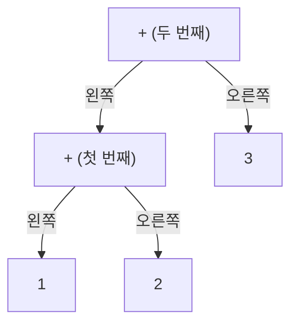

# 제2장. 데이터에 계층을 부여하기

## 논리적으로 생각해 보기

### 데이터에 계층이 있으면 무엇이 좋을까?

배열은 노드를 나란히 저장하고, 자식 링크는 그 노드들에 계층을 부여한다. 먼저 알파벳을 트리로 연결한 뒤, 덧셈 수식 `1+2+3`을 트리로 표현해보자.

### 배열의 위치를 어떻게 트리로 연결할까?

각 노드에 문자 하나와 두 자식의 인덱스를 저장한다. 예를 들어 `nodes[0].left = 1`은 인덱스 `0`의 `A`에게 인덱스 `1`의 `B`를 왼쪽 자식으로 연결한다. 배열 안에서 노드 자체의 위치는 바뀌지 않는다.

### 트리 전체에 어떻게 접근할까?

루트는 트리에 접근하기 시작하는 노드의 인덱스다. 알파벳 예제는 루트 `5`(`F`)를 반환한다. 자식 링크를 따라가면 일곱 노드에 도달하고, `H`, `I`, `J`는 연결되지 않은 상태로 남는다.

### 이 자료구조에 새로운 데이터를 어떻게 연결할까?

부모의 `left` 또는 `right`에 자식의 인덱스를 저장한다. 새 루트를 만들려면 기존 루트를 새 부모 아래에 연결하고, 루트 인덱스를 새 부모의 인덱스로 바꾼다.

### 단순한 예제

수업의 수식은 정확히 `1+2+3`이다. 한 자리 숫자와 `+`가 번갈아 나오며, 다섯 문자를 다섯 노드로 만든다. 연결 반복문은 수식을 `(1+2)+3`으로 묶는다. 최종 루트는 두 번째 `+`인 인덱스 `3`이다.

### 덧셈 트리 준비하기

`1+2+3`을 어떻게 트리로 만들 수 있을까? 수식을 `(1+2)+3`으로 묶어 왼쪽부터 차례로 만들어보자.

먼저 각 문자 `1`, `+`, `2`, `+`, `3`마다 노드를 하나씩 준비한다. 두 개의 `+` 문자는 서로 다른 노드에 저장한다. 처음에는 모든 노드에 자식이 없다.

1. 첫 번째 숫자부터 시작한다. `1`을 저장한 노드가 처음 트리의 루트가 되며, 이 트리는 `1`만을 나타낸다.
2. 첫 번째 덧셈을 연결한다. 첫 번째 `+` 노드를 현재 루트와 `2`를 저장한 노드의 부모로 만든다. 기존 루트는 왼쪽 자식이 되고, `2`는 오른쪽 자식이 된다. 이 `+`가 새로운 루트가 되어 `1+2`를 나타낸다.
3. 다음 덧셈을 연결한다. 두 번째 `+` 노드를 현재 루트와 `3`을 저장한 노드의 부모로 만든다. 이제 왼쪽에는 `1+2`를 나타내는 트리 전체가 있고, 오른쪽에는 `3`이 있다. 이 두 번째 `+`가 전체 수식의 루트가 된다.



뒤에 `+`와 숫자가 더 이어질 때에도 같은 규칙을 적용한다. 새 연산자의 왼쪽에 현재 루트를 연결하고, 오른쪽에 다음 숫자를 연결한 뒤, 그 연산자를 새로운 루트로 삼는다.

트리를 만드는 동안 현재 루트를 통해 지금까지 연결한 모든 노드에 접근할 수 있다. 지금은 수식이 어떻게 묶이는지를 기록하는 과정이다. 그 값을 계산하는 일은 트리를 만든 다음에 한다.

### 이 자료구조에 저장된 수식을 어떻게 계산할까?

숫자 노드는 자신의 정수값을 반환한다. `+` 노드는 왼쪽 서브트리의 값을 먼저 구하고, 오른쪽 서브트리의 값을 구한 다음 두 값의 합을 반환한다. 최종 결과는 `6`이다.

## 효율 계산해보기

### 데이터 하나는 메모리를 얼마나 사용할까?

노드는 `char` 멤버 하나와 `int` 멤버 두 개를 저장한다. `nodes[10]`은 다섯 칸만 사용하더라도 열 칸의 공간을 확보한다.

### 데이터를 반복하는 데는 메모리가 얼마나 사용될까?

재귀 호출은 현재 내려가는 경로의 상태를 임시로 저장한다. 추가 메모리는 트리 높이 `h`에 비례하는 `O(h)`이다.

### 데이터 하나를 추가하는 속도는 얼마나 빠를까?

노드 하나를 초기화하거나 자식 링크 하나를 대입하는 데는 상수 시간이 든다. `n`개의 노드를 초기화하거나 연결하는 데는 `O(n)` 시간이 든다.

### 데이터에 반복하는 속도는 얼마나 빠를까?

올바른 트리에서 순회와 계산에는 시작 루트로부터 도달하는 노드 수 `r`에 비례하는 `O(r)` 시간이 든다. 연결되지 않은 배열 원소는 방문하지 않는다.

## 용어 정리

### 노드 (Node)

문자 하나와 왼쪽·오른쪽 자식의 인덱스를 함께 저장한 것.

### 트리 (Tree)

루트 하나를 가지며, 순환이 없고 루트 이외의 각 노드에 부모가 하나씩 있는 연결된 계층 구조.

### 이진 트리 (Binary Tree)

노드마다 최대 두 자식을 가지며, 왼쪽과 오른쪽을 구분하는 트리.

### 수식 트리 (Expression Tree)

단말 노드에 숫자를, 내부 노드에 연산자를 저장한 트리.

### 루트 (Root)

트리에 접근하기 시작하는 노드.

### 부모 (Parent)

자식 바로 위에 있는 노드.

### 자식 (Child)

부모 바로 아래에 연결된 노드.

### 형제 (Sibling)

부모가 같은 다른 자식 노드.

### 조상 (Ancestor)

루트에서 내려오는 경로에서 현재 노드보다 앞에 있는 노드.

### 자손 (Descendant)

자식 링크를 따라 아래로 내려가면 도달하는 노드.

### 단말 (Leaf)

자식이 없어 두 자식 인덱스가 모두 `-1`인 노드.

### 서브트리 (Subtree)

어떤 노드와 그 노드의 모든 자손으로 이루어진 트리.

### 재귀 (Recursion)

함수가 자기 자신을 호출하는 것. 각 호출은 별도의 매개변수와 지역 변수 값을 가진다.

### 종료 조건 (Base Case)

다른 재귀 호출을 만들지 않고 끝나는 경우.

## 규칙

### 이 자료구조의 규칙은 무엇일까?

- 자식이 없으면 `-1`을 저장한다. 자식이 있으면 `0` 이상 `nodes_size` 미만인 인덱스를 저장한다.
- 한 트리 안에서 루트 이외의 노드는 부모가 하나씩 있으며, 순환이 없다.
- `nodes_size`는 초기화하여 사용 중인 배열 칸의 수다. 특정 루트에서 도달하는 노드의 수가 아니다.

### 규칙이 깨지면 어떻게 될까?

자식을 공유하면 같은 노드를 여러 번 방문할 수 있다. 순환이 있으면 재귀가 끝나지 않을 수 있다. `tree_recursion`의 범위 검사는 순환을 찾아내지 못한다.

### 규칙을 어떻게 지킬까?

연결 전에 초기화하고, 자식 인덱스와 트리 모양이 올바르도록 유지한다. `eval`은 숫자 단말이거나 두 자식이 있는 `+` 노드로 이루어진 올바른 덧셈 트리를 가정한다. 인덱스 범위를 검사하지 않는다.

## 코딩 계획

### 노드 설계하기

`struct TreeNode`에 `data`, `left`, `right`를 두고, 공유 배열에 노드 열 개를 저장한다.

### 알파벳 트리 준비하기

1. 열 노드를 `A`부터 `J`까지의 문자와 자식이 없는 상태로 초기화한다.
2. `A`에 `B`, `C`를 연결하고, `B`에 `D`, `E`를 연결한다.
3. `F`를 `A`와 `G` 위의 루트로 만든다.

### 알파벳 트리 읽기

왼쪽 서브트리, 오른쪽 서브트리, 현재 노드 순서로 읽는다. `F`에서 시작하면 읽는 순서는 `D E B C A G F`이다. 여기서 문자를 읽는다고 화면에 출력되지는 않는다.

### 덧셈 트리 준비하기

1. `1+2+3`의 다섯 문자를 공유 노드에 복사하고 자식 링크를 초기화한다.
2. 첫 숫자를 루트로 시작한다.
3. 각 연산자와 그다음 숫자를 처리하면서 연산자의 왼쪽에 기존 루트를, 오른쪽에 새 숫자를 연결한다.
4. 그 연산자를 새로운 루트로 삼는다.

### 수식 트리 계산하기

숫자이면 값을 바로 반환한다. 그렇지 않으면 왼쪽 자식의 결과를 `l`에, 오른쪽 자식의 결과를 `r`에 저장하고 `l + r`을 반환한다.

## 새로운 C 문법 설명

### `struct` 태그 정의하기

`struct TreeNode { ... };`는 이름 있는 멤버들을 묶은 타입을 정의한다. 마지막 세미콜론도 필요하다.

### `struct` 태그 사용하기

`struct TreeNode nodes[10];`은 노드 열 개의 배열을 선언한다. 실제 배열의 유효한 인덱스는 `0`부터 `9`까지다.

### `.` (멤버 접근하기)

`nodes[i].left`는 배열의 `i`번 원소를 선택한 뒤 그 원소의 `left` 멤버에 접근한다. 저장된 정수는 자식의 인덱스이며, 자식의 문자나 계산 결과가 아니다.

### 후위 증가 연산자

`i++`는 증가하기 전의 `i` 값을 사용한 뒤 `i`를 1 증가시킨다. `i = 0`에서 `int root = i++;`를 실행하면 `root = 0`, `i = 1`이 된다.

### 재귀 함수

호출한 함수는 자식 호출이 끝날 때까지 기다리고, 이후 다음 문장부터 계속한다. `tree_recursion`은 범위 밖 인덱스에서, `eval`은 숫자에서 멈춘다. 실행 중인 각 `eval` 호출은 자신의 `i`, `l`, `r`을 따로 가진다.

## C 코드

### 노드 저장 공간

타입, 배열, 용량, 사용 중인 칸의 수가 각각 무엇인지 설명해보자.

```c
struct TreeNode {
    char data;
    int left;
    int right;
};
struct TreeNode nodes[10];
int capacity = 10;
int nodes_size = 0;
```

### 알파벳 노드 초기화하기

각 칸에 문자와 두 개의 자식 없음 표시가 어떻게 저장되는지 설명해보자.

```c
void alphabet_init() {
    nodes_size = capacity;
    for (int i = 0; i < capacity; i++) {
        nodes[i].data = 'A' + i;
        nodes[i].left = nodes[i].right = -1;
    }
}
```

### 알파벳 트리 연결하기

각 연결과 이 함수가 `5`를 반환하는 이유를 설명해보자.

```c
int tree_connect() {
    int root = 0;
    nodes[root].left = 1;
    nodes[root].right = 2;
    nodes[1].left = 3;
    nodes[1].right = 4;
    nodes[5].left = root;
    root = 5;
    nodes[5].right = 6;
    return root;
}
```

### 재귀로 노드 읽기

언제 `data_read`에 값이 저장되는지, `i = -1`이면 어떻게 되는지 설명해보자.

```c
void tree_recursion(int i) {
    if (i >= 0 && i < nodes_size) {
        tree_recursion(nodes[i].left);
        tree_recursion(nodes[i].right);
        int data_read = nodes[i].data;
    }
}
```

### 덧셈 수식 초기화하기

어떤 다섯 문자가 복사되며 왜 `nodes_size`가 `5`가 되는지 설명해보자.

```c
void eq_plus_init() {
    char eq[10] = "1+2+3";
    int eq_size = 5;
    nodes_size = eq_size;
    for (int i = 0; i < eq_size; i++) {
        nodes[i].data = eq[i];
        nodes[i].left = nodes[i].right = -1;
    }
}
```

### 덧셈 트리 연결하기

두 번의 반복에서 `i`, `op`, `num`, `root` 값이 어떻게 변하는지 설명해보자.

```c
int eq_plus_connect() {
    int i = 0;
    int root = i++;
    while (i < nodes_size) {
        int op = i++;
        int num = i++;
        nodes[op].left = root;
        nodes[op].right = num;
        root = op;
    }
    return root;
}
```

### 덧셈 트리 계산하기

숫자는 왜 즉시 반환하고, 각 덧셈은 왜 두 결과를 기다리는지 설명해보자.

```c
int eval(int i) {
    if (nodes[i].data >= '0'
        && nodes[i].data <= '9') {
        return nodes[i].data - '0';
    }
    int l = eval(nodes[i].left);
    int r = eval(nodes[i].right);
    return l + r;
}
```

## C 코드 전체 설명 (Full C Code Explanation)

수업의 일곱 코드를 순서대로 설명한다. 무엇을 저장하고, 어떤 문장이 실행되며, 호출이 끝난 뒤 무엇이 남는지 살펴보자.

### 1. 선언, 문장, 함수 읽기

C 소스 코드에는 선언과 실행할 명령이 들어 있다. **선언**은 이름과 타입을 소개한다. `int capacity = 10;`은 정수 변수를 선언하고 처음 값을 10으로 정한다. `nodes_size = capacity;`와 같은 **대입**은 기존 변수에 오른쪽 값을 저장한다. 이런 문장 끝에는 세미콜론이 붙는다. 중괄호는 선언이나 문장들을 하나의 본문으로 묶고, 소괄호는 매개변수, 인수, 조건 등을 감싼다.

**함수 정의**는 이름을 가진 작업의 내용을 설명한다. 정의가 파일에 먼저 쓰여 있다고 본문이 즉시 실행되지는 않는다. 함수를 호출해야 실행된다. 이름 앞에는 반환 타입이 온다. `void`는 값을 반환하지 않는다는 뜻이고, `int`는 정수를 반환한다는 뜻이다. 이 예제에서 `()`로 작성된 함수는 인수 없이 호출한다. `tree_recursion(int i)`와 `eval(int i)`는 각각 정수 매개변수 `i` 하나를 받는다.

알파벳 예제는 `alphabet_init`을 호출하고, `tree_connect`가 반환한 인덱스를 저장한 뒤 그 인덱스를 `tree_recursion`에 전달하는 순서로 사용한다. 덧셈 예제는 `eq_plus_init`을 호출하고, `eq_plus_connect`가 반환한 인덱스를 저장한 뒤 그 인덱스를 `eval`에 전달한다. 같은 저장 공간을 사용하는 두 시연이다. 제공된 코드 중 화면에 출력하는 코드는 없다. 결과를 반환하는 것과 화면에 표시하는 것은 별개의 동작이다.

### 2. 노드 저장 공간: 타입, 멤버, 인덱스

`struct TreeNode`는 프로그래머가 정한 구조체 타입이다. 본문에서 멤버 세 개를 선언한다. `char data`는 문자를 저장하고, `int left`와 `int right`는 자식 인덱스를 저장한다. `TreeNode`는 C에 원래 들어 있는 명령이 아니다. 닫는 중괄호 다음의 세미콜론은 이 타입 선언을 끝낸다.

`struct TreeNode nodes[10];`은 구조체 열 개의 배열을 확보한다. 선언의 대괄호는 원소의 개수를 나타내고, `nodes[3]`의 대괄호는 특정 원소 하나를 선택한다. 인덱스는 0부터 시작하므로 인덱스 10은 배열 밖이다. 마침표는 멤버를 선택한다. `nodes[3].data`는 네 번째 노드의 문자다.

배열, `capacity`, `nodes_size`는 함수 밖에 선언된 전역 저장 공간이다. 함수들이 함께 사용하며 프로그램 실행 동안 유지된다. `capacity = 10`은 배열 한도를 기록한다. 이 변수의 값을 바꾸더라도 `nodes[10]`의 크기가 달라지지는 않는다. `nodes_size = 0`은 아직 사용 중인 칸이 없다는 뜻이다. 전역 배열의 멤버들은 처음에 0으로 초기화되지만, 0은 유효한 자식 인덱스다. 따라서 0으로 채워져 있다고 자식이 없는 상태는 아니다. 초기화 함수에서 명시적으로 자식 링크를 `-1`로 정한다.

**인덱스**, **문자**, **계산 결과**를 구분하자. 덧셈 예제의 인덱스 `4`에는 문자 `'3'`이 저장되어 있고, 그 노드를 계산하면 정수 `3`을 반환한다. 자식 인덱스나 루트 값을 바꾼다고 배열의 노드가 다른 칸으로 이동하지는 않는다.

### 3. `alphabet_init`: 열 노드를 각각 초기화하기

`nodes_size = capacity;`는 사용 중인 칸의 수를 10으로 정한다. `for` 문은 세미콜론으로 나뉜 세 부분을 가진다. `int i = 0`은 처음 한 번 실행한다. `i < capacity`는 반복 본문에 들어가기 전에 확인한다. `i++`는 본문 실행 뒤에 실행한다. 따라서 `i`가 0부터 9일 때까지 본문을 실행하고, 10이 되면 멈춘다.

`nodes[i].data = 'A' + i;`는 `'A'`의 문자 코드에 인덱스를 더한다. 수업에서 사용하는 문자 인코딩에서는 그 결과가 `A`부터 `J`까지가 된다. 작은따옴표는 문자를 나타내고, 따옴표 없는 정수는 숫자값을 나타낸다.

`nodes[i].left = nodes[i].right = -1;`은 연속 대입이다. `right`에 `-1`을 저장한 뒤, 그 대입값을 `left`에도 저장한다. 이제 각 노드에는 자식이 없다. 함수가 끝나면 반복문의 지역 변수 `i`는 사라지지만, 전역 노드에 저장된 값과 `nodes_size = 10`은 유지된다.

### 4. `tree_connect`: 기존 노드 연결과 루트 변경

`int root = 0;`은 `A`의 인덱스를 저장하는 지역 정수를 선언한다. 이후 대입문은 자식 멤버에 인덱스를 저장한다.

| 문장 | 결과 |
|---|---|
| `nodes[root].left = 1;` | `A`의 왼쪽 자식이 `B`가 된다. |
| `nodes[root].right = 2;` | `A`의 오른쪽 자식이 `C`가 된다. |
| `nodes[1].left = 3;` | `B`의 왼쪽 자식이 `D`가 된다. |
| `nodes[1].right = 4;` | `B`의 오른쪽 자식이 `E`가 된다. |
| `nodes[5].left = root;` | 현재 루트 값 `0`을 사용하여 `F`의 왼쪽 자식이 `A`가 된다. |
| `root = 5;` | 지역 변수의 루트 인덱스가 `F`로 바뀐다. |
| `nodes[5].right = 6;` | `F`의 오른쪽 자식이 `G`가 된다. |
| `return root;` | 함수를 끝내고 호출한 곳에 정수 `5`를 반환한다. |

`F`가 루트가 되어도 기존 서브트리의 연결은 유지된다. 최종 모양은 `F(A(B(D,E),C),G)`이다. `F`에서 도달하는 노드는 일곱 개지만, `nodes_size`는 여전히 10이다. `H`, `I`, `J`는 초기화되었으나 이 트리에 연결되지 않은 배열 원소다. 이 순회에서는 방문하지 않는다.

### 5. `tree_recursion`: 아래로 호출하고 위로 돌아와 계속하기

매개변수 `i`는 이번 호출에서 전달받은 인수의 지역 복사본이다. `if (i >= 0 && i < nodes_size)`는 사용 중인 인덱스 범위에 드는지 확인한다. `>=`는 이상, `<`는 미만을 뜻하며, `&&`는 두 조건이 모두 참이어야 한다는 뜻이다. 조건이 거짓이면 본문을 건너뛰고, `void` 함수는 반환값 없이 끝난다. `i = -1`인 호출도 여기에 해당한다. 이것이 종료 조건이다.

유효한 인덱스라면 첫 문장은 왼쪽 자식의 인덱스로 같은 함수를 호출한다. 현재 호출은 그 호출이 완전히 끝날 때까지 기다린다. 그다음 오른쪽 자식을 호출하고 다시 기다린다. 두 호출이 모두 끝난 뒤에야 `int data_read = nodes[i].data;`를 실행한다. 이 순서를 **후위 순회**라고 한다. 왼쪽 서브트리, 오른쪽 서브트리, 현재 노드 순서다.

단말 `D`의 두 링크는 모두 `-1`이다. 두 자식 호출은 각각 즉시 끝나고, 그다음 `D`를 읽는다. `F`에서 시작한 전체 읽기 순서는 `D E B C A G F`이다. 유효한 노드의 함수에 처음 들어가는 순서인 `F A B D E C G`와 다르다.

각 호출은 자신의 `i`를 따로 가진다. 자식 호출이 기다리는 부모 호출의 매개변수를 바꾸지는 않는다. `data_read`는 저장된 문자 코드로 초기화하는 지역 정수다. `'0'`을 빼서 숫자로 변환하지도 않고, 문자를 출력하거나 반환하지도 않는다. 이후에는 사용하지 않으며, 해당 블록이 끝나면 사라진다. 컴파일러는 사용하지 않는 변수라고 경고하거나 이 읽기 동작을 최적화로 제거할 수 있다.

`nodes_size` 자체가 배열 용량을 지킨다는 전제에서, 범위 검사는 이 함수 본문의 범위 밖 배열 접근을 막는다. 유효한 인덱스들 사이에 생긴 순환은 막지 못한다. 재귀가 끝나려면 실제 자식 연결도 유한한 트리를 이루어야 한다.

### 6. `eq_plus_init`: 지역 문자열을 전역 저장 공간으로 복사하기

`char eq[10] = "1+2+3";`은 지역 문자 배열을 선언한다. 큰따옴표는 문자열을 나타낸다. 첫 다섯 문자는 `'1'`, `'+'`, `'2'`, `'+'`, `'3'`이고, 그다음에는 문자열의 끝을 나타내는 값 0의 문자 `\0`이 있다. 남은 배열 원소들도 처음 값은 0이다. 종료 문자 `\0`은 숫자 문자 `'0'`과 다르다.

`int eq_size = 5;`는 종료 문자를 제외한 수식의 다섯 문자를 센다. `nodes_size = eq_size;`는 인덱스 0부터 4까지만 사용 중이라고 정한다. 실제 노드 배열의 용량은 여전히 10이다.

반복문은 다섯 번 실행된다. `nodes[i].data = eq[i];`는 문자 하나를 같은 인덱스의 노드에 복사하고, 연속 대입은 그 노드의 두 자식 링크를 초기화한다. 함수가 끝나면 지역 변수 `eq`, `eq_size`, `i`는 사라지지만 복사된 문자는 유지된다. 알파벳 시연 뒤에 실행했다면 인덱스 5부터 9까지의 예전 내용이 메모리에 남아 있을 수 있으나, 새 사용 범위에는 포함되지 않는다.

### 7. `eq_plus_connect`: 모든 증가 연산 따라가기

`int i = 0;`은 이미 초기화된 노드들을 훑는 지역 커서를 만든다. `int root = i++;`는 증가 전 값 0을 루트로 사용한 뒤 `i`를 1로 증가시킨다. 시작 트리는 첫 숫자 하나뿐이다.

`while (i < nodes_size)`는 남은 노드가 있는 동안 반복한다. 본문의 `int op = i++;`는 다음 연산자의 인덱스를 저장하고 커서를 증가시킨다. `int num = i++;`는 그다음 숫자의 인덱스를 저장하고 다시 증가시킨다. 이어지는 두 대입은 연산자의 왼쪽에 기존 루트를, 오른쪽에 새 숫자를 연결한다. `root = op;`는 현재 루트를 이 연산자로 바꾼다.

| 단계 | `op` | `num` | 증가 후 `i` | 새 루트 | 표현하는 수식 |
|---|---|---|---|---|---|
| 반복문 전 | — | — | `1` | `0` | `1` |
| 첫 번째 반복 | `1` | `2` | `3` | `1` | `1+2` |
| 두 번째 반복 | `3` | `4` | `5` | `3` | `(1+2)+3` |

다음 조건 `5 < 5`는 거짓이다. `return root;`는 인덱스 `3`을 반환한다. 루트의 왼쪽 자식은 첫 번째 `+`인 인덱스 `1`이고, 오른쪽 자식은 숫자 `'3'`인 인덱스 `4`다. 반복문 안의 `op`, `num`은 임시 지역 변수지만, 이 변수들을 사용해 저장한 링크는 전역 배열에 남는다.

이 반복문은 비어 있지 않고 한 자리 숫자와 `+`가 번갈아 나오며 숫자로 끝나는 올바른 수식을 가정한다. 연산자 문자를 확인하거나 마지막 피연산자가 빠졌는지 검사하지 않는다.

### 8. `eval`: 서브트리마다 반환값 하나 만들기

`eval(int i)`는 노드 인덱스를 받아 그 서브트리의 계산 결과를 정수로 반환한다. `if` 조건은 `data`가 문자 `'0'` 이상이고 문자 `'9'` 이하인지 확인한다. 두 비교가 모두 참이어야 한다. `&&` 앞에서 줄을 바꾼 것은 배치일 뿐, 전체가 하나의 조건이다.

숫자이면 `return nodes[i].data - '0';`이 문자 코드를 해당 정수로 변환하고 그 호출을 즉시 끝낸다. C에서 십진 숫자의 문자 코드는 연속되어 있으므로 `'3' - '0'`의 결과는 `3`이다. 숫자 노드에서는 자식 링크를 따라가지 않는다.

그렇지 않으면 `int l = eval(nodes[i].left);`가 왼쪽 서브트리의 결과를 기다렸다가 이번 호출의 지역 변수 `l`에 저장한다. 다음 문장은 오른쪽 결과를 이번 호출의 `r`에 저장한다. `return l + r;`은 두 정수를 더한 값을 호출한 곳에 반환한다. `l`, `r`에는 자식 인덱스가 아니라 계산 결과가 들어 있으며, 노드의 `data`를 덮어쓰지 않는다.

루트 인덱스 `3`에서는 왼쪽 호출 `eval(1)`이 `1`과 `2`를 얻어 `3`을 반환한다. 기다리던 루트 호출은 그 `3`을 자신의 `l`에 저장하고, `eval(4)`에서 얻은 `3`을 자신의 `r`에 저장한 뒤 `6`을 반환한다. 호출마다 변수 이름은 같아도 저장 공간은 따로 있다.

숫자인지 확인하는 조건은 인덱스 범위 검사가 아니다. 조건을 판단하기 전에 이미 `nodes[i]`에 접근한다. 이 함수는 방문하는 인덱스가 모두 유효하고, 숫자가 아닌 노드는 모두 유효한 두 자식이 있는 `+`이며, 순환이 없다고 가정한다. 마지막 문장은 항상 덧셈을 한다. 다른 연산자를 확인하거나 처리하지 않는다. 초기화와 연결을 마친 덧셈 트리에 사용하고, 계산 결과는 `int` 범위 안에 있어야 한다.
