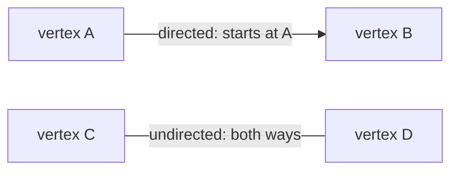
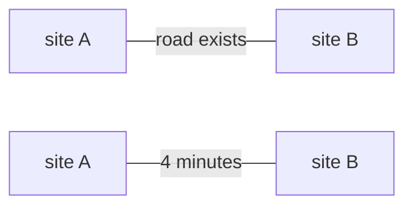
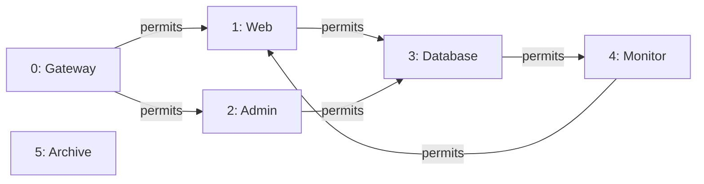
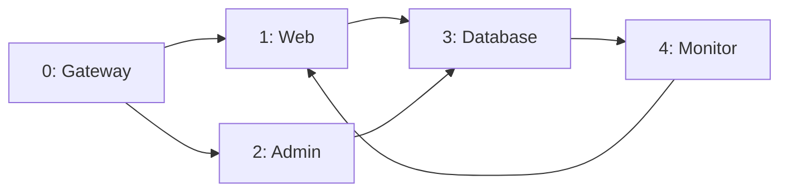
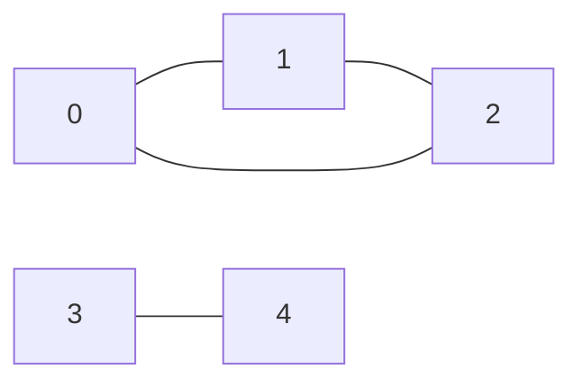
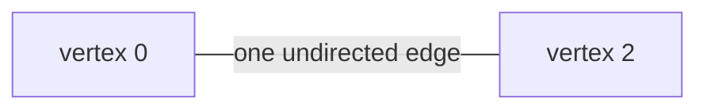
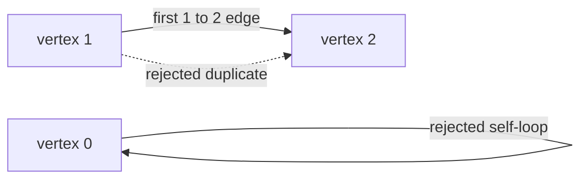

# Module 3 Graph Models

Every visual below has a precise text equivalent. A student may use the
diagram, its table or list, tactile markers, or a spoken description.

## 1. Objects and relationships

A **graph** is a collection of objects and relationships. One graph object is
a **vertex**. Several graph objects are called **vertices**. One relationship
is an **edge**.

A **directed edge** is a one-way relationship. The notation `A → B` means
that the edge starts at `A` and ends at `B`. An **undirected edge** is a
two-way relationship. The notation `{A, B}` names one undirected edge between
`A` and `B`. A **directed graph** uses directed edges, and an **undirected
graph** uses undirected edges.



Text equivalent:

| Relationship | Exact meaning |
|---|---|
| `A → B` | There is a directed edge from `A` to `B`. This alone does not state that an edge goes from `B` to `A`. |
| `{C, D}` | There is one undirected edge between `C` and `D`. The relationship can be used in either direction. |

Direction belongs to the relationship, not to the left-to-right placement on
a page. The arrow or the written edge notation supplies the meaning.

## 2. Unweighted and weighted edges

A **weight** is a number attached to an edge, such as travel time, distance,
or cost. A **weighted graph** stores such a number with each edge. An
**unweighted graph** stores only whether an edge is present or absent.



Text equivalent:

| Model | Stored fact |
|---|---|
| Unweighted | A road connects site `A` and site `B`. |
| Weighted | A road connects site `A` and site `B`, and its modeled travel time is `4` minutes. |

The Module 3 structure is unweighted. It stores one **Boolean value**—either
`true` or `false`—for each possible edge. Weighted graphs are introduced for
comparison, but the lab does not store weights.

## 3. Canonical directed permission graph

A **vertex ID** is a small number used to name one vertex. An **index** is a
numbered position. **Synthetic** means invented for a safe learning exercise
rather than copied from an operating network. A **network** is a group of
devices or services that can communicate.

The following synthetic graph models allowed communication. An edge means
only that the named communication is permitted by this small model. It is not
proof of a **vulnerability**, a weakness in a computer system; an
**exploit**, a method that uses a weakness; or a successful **attack**, an
action intended to gain access or cause harm. A **program** is a group of
instructions a computer can run. A **service** here is a program that
performs a task for other programs.

| Vertex ID | Label |
|---:|---|
| `0` | Gateway |
| `1` | Web |
| `2` | Admin |
| `3` | Database |
| `4` | Monitor |
| `5` | Archive |



Text equivalent:

```text
Vertices: 0 Gateway, 1 Web, 2 Admin, 3 Database, 4 Monitor, 5 Archive
Directed edges:
0 → 1
0 → 2
1 → 3
2 → 3
3 → 4
4 → 1
Vertex 5 has no entering or leaving edge.
No reverse edge is implied.
```

## 4. Neighbors and degrees

A **neighbor** is a vertex directly joined by an edge. Direction requires
more precise words:

- an **out-neighbor** of `u` is at the end of an edge leaving `u`;
- an **in-neighbor** of `u` is at the start of an edge entering `u`;
- **out-degree** is the number of directed edges leaving a vertex;
- **in-degree** is the number of directed edges entering a vertex.

For an undirected graph, **degree** is the number of edges touching a vertex.
The course graph rejects an edge from a vertex to itself, so each touching
edge is counted once.

For the canonical directed graph:

| Vertex | Out-neighbors | In-neighbors | Out-degree | In-degree |
|---:|---|---|---:|---:|
| `0` | `1, 2` | none | `2` | `0` |
| `1` | `3` | `0, 4` | `1` | `2` |
| `2` | `3` | `0` | `1` | `1` |
| `3` | `4` | `1, 2` | `1` | `2` |
| `4` | `1` | `3` | `1` | `1` |
| `5` | none | none | `0` | `0` |

For example, vertex `3` is an out-neighbor of vertex `1`, while vertices `1`
and `2` are in-neighbors of vertex `3`.

## 5. Paths, cycles, and directed reachability

A **route** is a sequence of vertices in which every consecutive pair has
the required edge. In a directed graph, every edge must point in the
direction the route moves. A **path** is a route that does not repeat a
vertex. A **cycle** is a route that returns to its starting vertex without
repeating another vertex.

A vertex is **reachable** from a selected starting vertex when zero or more
allowed edges can lead from the start to that vertex. “Zero edges” means that
the starting vertex is reachable from itself.



Text equivalent:

```text
Displayed directed edges:
0 → 1, 0 → 2, 1 → 3, 2 → 3, 3 → 4, 4 → 1
0 → 1 → 3 → 4 is a directed path from 0 to 4.
1 → 3 → 4 → 1 is a directed cycle.
Starting at 0, vertices 0, 1, 2, 3, and 4 are reachable.
Starting at 1, vertex 0 is not reachable because no allowed arrow leads to 0.
```

This module identifies small paths, cycles, and reachability by inspection,
meaning by carefully reading the given relationships. A **graph-search
procedure** is an ordered method for visiting reachable vertices; formal
graph-search procedures are taught later.

## 6. Connected components belong to the undirected model

Two vertices in an undirected graph are **connected** when an undirected path
joins them. A **connected component** is a largest group of vertices in which
every vertex is connected to every other vertex in the group.



Text equivalent:

```text
Undirected vertices: 0, 1, 2, 3, 4
Undirected edges: {0, 1}, {0, 2}, {1, 2}, {3, 4}
Connected component one: {0, 1, 2}
Connected component two: {3, 4}
There is no edge or path joining the two groups.
```

Use “connected component” only for an undirected graph in this module. For a
directed graph, make a directional statement such as “vertex `4` is
reachable from vertex `1`.”

## 7. Mathematical edge set

A **representation** is a chosen way to record information. A **set** is a
mathematical collection in which an item appears at most once. An **edge
set** is the set of all graph edges. Its written order does not change the
graph.

The **source** is the vertex where a directed edge starts, and the
**destination** is the vertex where it ends. For a directed edge, an
**ordered pair** puts the source first and destination second. The canonical
graph’s edge set is:

```text
{(0, 1), (0, 2), (1, 3), (2, 3), (3, 4), (4, 1)}
```

The braces denote one set. Moving `(4, 1)` to the front would not change the
set or graph.

## 8. Edge-list representation

A **record** is a stored group of related values. An **endpoint** is a vertex
at one end of an edge. An **edge-list representation** is a stored sequence
with one endpoint record per edge. For a directed edge, each stored ordered
pair preserves direction. Unlike the mathematical set, the stored sequence
has numbered positions, although reordering the records does not change the
graph represented.

The canonical directed graph as an edge-list representation is:

| Edge number | `from` | `to` | Written form |
|---:|---:|---:|---|
| `0` | `0` | `1` | `0 → 1` |
| `1` | `0` | `2` | `0 → 2` |
| `2` | `1` | `3` | `1 → 3` |
| `3` | `2` | `3` | `2 → 3` |
| `4` | `3` | `4` | `3 → 4` |
| `5` | `4` | `1` | `4 → 1` |

Vertex `5` does not appear in an edge pair, so the separate vertex count is
needed to preserve that isolated vertex. An **isolated vertex** has degree
zero; in a directed graph it has both in-degree zero and out-degree zero.

## 9. Adjacency-list representation

**Adjacent** means directly joined by an edge. An **adjacency list** keeps one
neighbor list for each vertex. For a directed graph, this course table stores
out-neighbors.

The canonical directed graph as an adjacency list is:

| Vertex | Stored out-neighbor list |
|---:|---|
| `0` | `1, 2` |
| `1` | `3` |
| `2` | `3` |
| `3` | `4` |
| `4` | `1` |
| `5` | empty |

“Empty” means that the vertex has no out-neighbor. The entry for vertex `5`
still records that vertex `5` exists.

## 10. Adjacency-matrix representation

An **adjacency matrix** is a square table in which the row and column
identify a possible edge. A **row** is a horizontal line of cells, and a
**column** is a vertical line of cells. A **cell** is one position in the
table.

This course uses the convention:

```text
adjacency[from][to]
```

Therefore, row `u` is the edge start and column `v` is the edge end. A `1`
below means `true`, or present. A `0` means `false`, or absent.

The canonical directed graph as an adjacency matrix is:

| from \ to | `0` | `1` | `2` | `3` | `4` | `5` |
|---:|---:|---:|---:|---:|---:|---:|
| `0` | 0 | 1 | 1 | 0 | 0 | 0 |
| `1` | 0 | 0 | 0 | 1 | 0 | 0 |
| `2` | 0 | 0 | 0 | 1 | 0 | 0 |
| `3` | 0 | 0 | 0 | 0 | 1 | 0 |
| `4` | 0 | 1 | 0 | 0 | 0 | 0 |
| `5` | 0 | 0 | 0 | 0 | 0 | 0 |

Examples:

- cell `[0][1]` is `1`, so edge `0 → 1` exists;
- cell `[1][0]` is `0`, so the reverse edge `1 → 0` does not exist;
- row `5` contains only zeroes, so vertex `5` has no out-neighbor;
- column `5` contains only zeroes, so vertex `5` has no in-neighbor.

## 11. Why an undirected matrix is symmetric

The **diagonal** is the line of cells `[v][v]`, whose row and column indexes
match. A matrix is **symmetric** when every cell `[u][v]` equals its mirror
cell `[v][u]` across that diagonal. One undirected edge `{u, v}` can be used
in either direction, so an undirected adjacency matrix records both cells as
`true`.



Text equivalent:

```text
Undirected edge: {0, 2}
Matrix cell [0][2] = true.
Mirror cell [2][0] = true.
Both cells describe the same undirected edge.
```

For the two-component undirected graph from Section 6, the matrix is:

| endpoint \ endpoint | `0` | `1` | `2` | `3` | `4` |
|---:|---:|---:|---:|---:|---:|
| `0` | 0 | 1 | 1 | 0 | 0 |
| `1` | 1 | 0 | 1 | 0 | 0 |
| `2` | 1 | 1 | 0 | 0 | 0 |
| `3` | 0 | 0 | 0 | 0 | 1 |
| `4` | 0 | 0 | 0 | 1 | 0 |

The values match across the top-left-to-bottom-right diagonal. Every diagonal
cell is zero because the course graph rejects self-loops.

## 12. The course simple-graph rules

A **self-loop** is an edge from a vertex to itself. **Parallel edges** are
separate edges with the same endpoints and, in a directed graph, the same
direction. A **duplicate edge** is an attempt to add an edge already
present. A **simple graph** in this course has no self-loops or parallel
edges; this course representation does not store them.



Text equivalent:

| Request | Course result | Reason |
|---|---|---|
| Add `0 → 0` | rejected | It is a self-loop. |
| Add `1 → 2` when absent | accepted | The new directed edge is valid. |
| Add `1 → 2` again | rejected | The edge already exists. |

The matrix diagonal must remain `false`. In an undirected graph, the two
mirror cells must also remain equal.

## 13. Comparing three representations

Let `V` mean the number of vertices and `E` mean the number of edges. Here
“storage” means the memory cells or records used to preserve the graph.
An **edge query** asks whether one edge exists without changing the graph.

| Representation | What it stores | Useful strength | Possible cost |
|---|---|---|---|
| Adjacency matrix | A `V` by `V` table of possible edges | One cell answers whether a particular edge exists | It reserves `V × V` cells even when few edges exist |
| Edge list | One endpoint pair per edge | Compact record for reading or processing all edges | Finding one particular edge may require checking many edge records |
| Adjacency list | One neighbor list per vertex | Directly lists the edges leaving each vertex | Its program storage is more involved than the fixed Boolean matrix |

A **sparse graph** has few edges compared with the number of possible edges.
An adjacency matrix may waste cells for a sparse graph. A **dense graph** has
many of its possible edges, so the matrix’s reserved cells may be reasonable.

**Dynamic storage** is computer memory requested or released while a program
is running. The fixed matrix is used in Module 3 because it makes direction,
symmetry, the fixed limit, and edge queries visible without introducing dynamic
storage.

## 14. Same information, different shapes

The following statements are equivalent, meaning they record the same six
directed edges:

```text
Diagram arrows:
0 → 1, 0 → 2, 1 → 3, 2 → 3, 3 → 4, 4 → 1

Mathematical edge set:
{(0,1), (0,2), (1,3), (2,3), (3,4), (4,1)}

Stored edge-list sequence:
(0,1), (0,2), (1,3), (2,3), (3,4), (4,1)

Adjacency lists:
0:[1,2], 1:[3], 2:[3], 3:[4], 4:[1], 5:[]

True matrix cells:
[0][1], [0][2], [1][3], [2][3], [3][4], [4][1]
```

Changing representation does not change the modeled graph. It changes how
the program stores and accesses the relationships.

## 15. What waits for a later module

A **graph search** is a formal procedure for visiting vertices reachable
from a selected start. Depth-first search (DFS) and breadth-first search
(BFS) use different rules for choosing which reachable vertex to process
next. They are named here only to mark the boundary; students do not
implement or trace them in Module 3.
