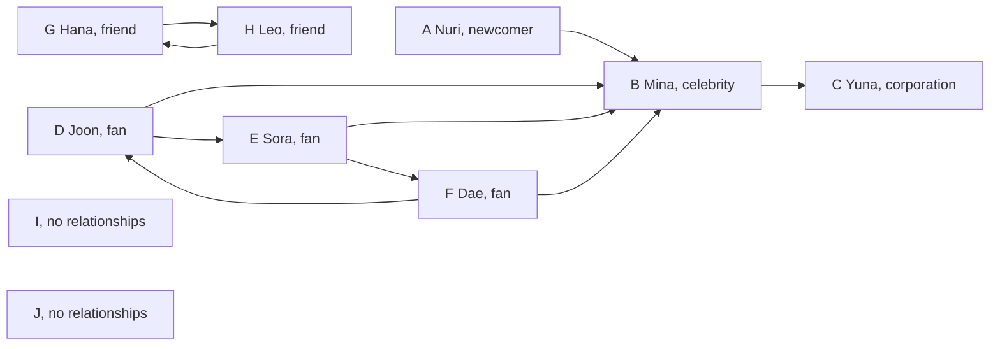

# Chapter 3. Storing Relationships in Multiple Directions

## Thinking Logically

### How do we show who follows whom?

On a social networking service (SNS), one account can follow several accounts, and several accounts can follow the same person. Mina follows Yuna. Yuna follows no one. Nuri is a newcomer who has just made a first follow: Nuri follows Mina.

Draw one dot for each account and one arrow for each follow. This collection is a **graph**. A dot is a **vertex**, and a direct relationship is an **edge**. An arrow points from the follower to the followed account. A graph whose edges have direction is a **directed graph**.

Use letters A through J for ten accounts. I and J have no relationships yet. The graph below shows the network after Nuri's first follow.



Text equivalent: the ten follows are `A -> B`, `B -> C`, `D -> B`, `D -> E`, `E -> B`, `E -> F`, `F -> D`, `F -> B`, `G -> H`, and `H -> G`. I and J have no incoming or outgoing arrows.

### How many followers and follows does an account have?

Sora follows Mina and Dae. Count the arrows leaving Sora, `E -> B` and `E -> F`: two follows. Only Joon follows Sora directly, so Sora has one follower. The number of outgoing edges is the **out-degree**. The number of incoming edges is the **in-degree**.

Mina has four followers: Joon, Sora, Dae, and Nuri. Mina follows just Yuna. Yuna has one follower and follows no one. Having no outgoing edges does not mean having no relationships.

Nuri has one outgoing follow and no followers. Before the first follow, both counts were zero. The new follow increases Mina's follower count without changing whom Mina follows.

### Where can Nuri go by following arrows?

Following `A -> B -> C` takes us from Nuri through Mina to Yuna. This sequence is a **path**. Nuri can reach Yuna even though Nuri does not follow Yuna directly.

The route stops at Yuna because Yuna follows no one. Neither Mina nor Yuna can follow arrows back to Nuri. Direction determines which routes are possible.

### Which accounts are connected?

Now ask which accounts are connected when direction does not matter. Keep all ten accounts. Remove the arrowheads and combine Hana and Leo's two opposite arrows into one line. An edge can now be followed in either direction. This is an **undirected graph** with nine edges:

```text
A—B, B—C, B—D, B—E, B—F, D—E, D—F, E—F, G—H
```

I and J each have no incident edge. Each is an **isolated vertex**. Both are active accounts in the graph. The C example stores this undirected graph. The original arrow directions are no longer part of the stored relationships.

### How should we store an undirected graph?

To leave Sora, collect Sora's direct neighbors. Store one list for each account. This representation is an **adjacency list**. Keep the same array index for each letter throughout the chapter: A is 0, B is 1, through J at 9.

| Index | Account | Neighbor letters | Stored neighbor indices |
|---|---|---|---|
| 0 | A Nuri | B | 1 |
| 1 | B Mina | A, C, D, E, F | 0, 2, 3, 4, 5 |
| 2 | C Yuna | B | 1 |
| 3 | D Joon | B, E, F | 1, 4, 5 |
| 4 | E Sora | B, D, F | 1, 3, 5 |
| 5 | F Dae | B, D, E | 1, 3, 4 |
| 6 | G Hana | H | 7 |
| 7 | H Leo | G | 6 |
| 8 | I | none | empty |
| 9 | J | none | empty |

Each edge appears at both endpoints. `E—F` puts index 5 in E's list and index 4 in F's list. Nine edges need eighteen neighbor entries. A vertex's number of neighbors is its **degree**. B has degree 5.

Each node reserves ten neighbor slots in `adj_list`. `adj_size` records how many are used. Read positions 0 through `adj_size - 1`; an empty list has size 0. The input edge order produces the table's neighbor order.

### How do we find every connected group?

Starting at Nuri, follow neighbors to reach everyone connected to A. The route `B—D—E—B` returns to its starting vertex. Such a route is a **cycle**. Without a visited mark, recursive calls could keep following it.

Mark a vertex before exploring its neighbors. Finish a new neighbor's recursive call before continuing the current vertex's list. This is **depth-first search (DFS)**. For this graph, the first discoveries from A are `A, B, C, D, E, F`. Returning from C lets B continue with D.

Give every vertex reached from A group number 0. This is a **connected component**: a maximal group whose vertices are joined by paths. Maximal means that no outside vertex can be added while preserving that property. It does not mean the largest group.

After A's call returns, scan for the next unvisited vertex. Start at G and label G and H with 1. Then label I with 2 and J with 3. A call on an isolated vertex has no neighbors to explore, but the vertex still forms a group.

```text
Vertex: A B C D E F G H I J
group:  0 0 0 0 0 0 1 1 2 3
groups_count: 4
```

### Which account can split a connected group?

Remove Mina and its incident edges. Joon, Sora, and Dae stay connected, but Nuri and Yuna each become isolated. Together with G–H, I, and J, there are now six groups instead of four. Removing Sora or Dae leaves the other members of their group connected through Mina.

A vertex whose removal increases the number of connected components is a **cut vertex**, also called an articulation point. B, at index 1, is the only cut vertex. An edge whose removal increases the number of components is a **bridge**. Here `A—B`, `B—C`, and `G—H` are bridges.

Trying every removal repeats work. Instead, record when a vertex was discovered and whether its branch can return to an earlier vertex by another edge.

### What do search numbers and back numbers record?

Number vertices as they are first discovered from A. The array `search_num` stores these discovery numbers, starting at 0. The starting vertex has no parent. Each other vertex is first discovered by a call from its parent. These links form the **DFS tree**. The second pass records the links in the `parent` array:

```text
A (0)
└── B (1)
    ├── C (2)
    └── D (3)
        └── E (4)
            └── F (5)
```

Other edges can return from a descendant to an earlier ancestor. For example, `E—B` bypasses E's parent D. The array `back_num` stores the smallest discovery number reachable by moving down zero or more DFS tree edges and then taking at most one non-parent edge to an ancestor. Taking no final edge is allowed. This value is often called a **low-link value**, written `low`; discovery numbers are often written `dfn`.

Start with `back_num[i] = search_num[i]`. For each neighbor:

- If the neighbor is unvisited, set its parent and explore it. On return, lower the current back number if the child's back number is smaller.
- If the neighbor is already visited and is not the parent, compare its discovery number with the current back number. Use `search_num[neighbor]` for this edge.
- Skip the already visited parent. The reverse entry of the arrival edge does not provide another route.

E and F can each reach B by a non-parent edge, so their back numbers become 1. D receives 1 from its child E. C has only its parent edge to B, so its back number stays 2. B cannot use its parent edge to A as an alternative route, so B's back number stays 1.

| Vertex | Index | Group | `search_num` | `back_num` | `parent` |
|---|---:|---:|---:|---:|---:|
| A | 0 | 0 | 0 | 0 | -1 |
| B | 1 | 0 | 1 | 1 | 0 |
| C | 2 | 0 | 2 | 2 | 1 |
| D | 3 | 0 | 3 | 1 | 1 |
| E | 4 | 0 | 4 | 1 | 3 |
| F | 5 | 0 | 5 | 1 | 4 |
| G | 6 | 1 | -1 | -1 | -1 |
| H | 7 | 1 | -1 | -1 | -1 |
| I | 8 | 2 | -1 | -1 | -1 |
| J | 9 | 3 | -1 | -1 | -1 |

Group labeling scans the whole graph. The two number-saving functions start only at A. G–J therefore keep their initial `-1` numbers. Here `-1` means unvisited by those passes. G and H are connected to one another despite having no discovery numbers from A.

### How can these numbers identify cut vertices?

A child's back number reveals whether its branch can reach above its parent. These numbers support the cut-vertex rules used in **Tarjan's algorithm**. The following deductions are a hand analysis; `lab.c` computes the numbers but does not mark cut vertices or bridges.

For a non-root vertex `u`, a DFS child `v` with `back_num[v] >= search_num[u]` makes `u` a cut vertex. The branch can return to `u` at best. Removing `u` separates it from the parent side.

B has DFS children C and D. C gives `2 >= 1`, and D gives `1 >= 1`. Both branches depend on B to reach A. B is a cut vertex. E's back number is `1 < 3`, so D is not a cut vertex. F's back number is `1 < 4`, so E is not one either.

A root has no parent side. It is a cut vertex only when it discovers at least two DFS children. A discovers only B, so A is not a cut vertex. Count DFS children, not all neighbors.

A child edge `u—v` is a bridge when `back_num[v] > search_num[u]`. Thus A–B gives `1 > 0`, and B–C gives `2 > 1`. B–D gives equality, so it is not a bridge. G–H is also a bridge by inspection; the run from A does not compute numbers for it.

### How do the connected pieces meet?

The four vertices B, D, E, and F are all directly connected to one another. They stay connected after any one is removed. We can describe maximal pieces with no cut vertex of their own as **blocks**, or biconnected components. Include each bridge with its two endpoints as a block and each isolated vertex as a singleton block. Some definitions reserve “biconnected” for pieces with at least three vertices; this chapter includes the smaller blocks to cover the whole graph.

The same graph has these six blocks. This table is a hand-worked extension of the stored graph, not output produced by `lab.c`.

| Block | Vertices | Edges |
|---|---|---|
| B1 | `{B, C}` | `B—C` |
| B2 | `{B, D, E, F}` | `B—D, B—E, B—F, D—E, D—F, E—F` |
| B3 | `{A, B}` | `A—B` |
| B4 | `{G, H}` | `G—H` |
| B5 | `{I}` | none |
| B6 | `{J}` | none |

Every edge belongs to one block. The cut vertex B belongs to three blocks. To show how blocks meet, draw a separate node for each block and each cut vertex. Connect each block to the cut vertices it contains. The result for one connected component is a **block-cut tree**.

```text
B1 — cut B — B2       B4       B5       B6
        |
        B3
```

The four connected components produce four trees. This collection is a **forest**. B4, B5, and B6 are one-node trees. The DFS tree records the order of discovering vertices; the block-cut forest records how blocks share cut vertices.

### What assumptions does this example use?

The C example uses ten active vertices and the nine listed undirected edges. It stores only whether vertices are connected, with no numerical edge weights. Every edge has distinct endpoints, and no pair is repeated. Such an undirected graph is called a **simple graph**.

Each stored neighbor index is between 0 and 9. Each node has room for ten neighbors, and the largest list has five entries. Initialization sets each list's size to zero. Adding the known edges appends both endpoint entries once.

Run the example once in a fresh program, starting at A. Save discovery numbers before back numbers. Keep the start index, graph, and neighbor order unchanged between those two passes so they follow the same DFS tree. The functions assume these inputs; they do not validate arbitrary edges or reset every result array for reuse with a different root.

## Calculating Efficiency

### How much work builds the graph?

Initialize ten node records. For each of nine edges, append two neighbor indices. The graph therefore stores eighteen entries. If there are `V` active vertices and `E` edges, this construction takes `O(V + E)` time. Appending one known edge takes constant work when both lists have room.

### How much work finds every connected group?

Clear ten visited marks and scan ten possible starting vertices. Across the recursive calls, process each vertex once and inspect all eighteen neighbor entries. Already visited vertices return without scanning their lists again. The work grows with `V + 2E`, so component labeling takes `O(V + E)` time.

### How much work computes the two sets of numbers?

From A, each numbering pass processes six reachable vertices and sixteen neighbor entries. The reachable group has eight edges. The group G–H and the isolated vertices are not explored by these passes.

Let `V_r` and `E_r` count reachable vertices and edges. Each wrapper also clears the visited array for all `V` active vertices. Each pass takes `O(V + V_r + E_r)` time. Running the two passes doubles the work without changing that growth rate. Recursive calls need at most `O(V_r)` additional space.

### How much memory is reserved and used?

Each of ten nodes reserves ten neighbor slots, for one hundred integer slots. Eighteen are used. The node data, sizes, capacities, and five analysis arrays (`visited`, `group`, `search_num`, `back_num`, and `parent`) add storage proportional to the vertex capacity.

For this fixed program, the reserved array storage is constant. If a version reserves `M` vertices and `M` neighbors per vertex, the adjacency arrays reserve `O(M²)` space even when few edges exist. The active lists contain `2E` entries. An adjacency-list representation that allocates only the needed entries can use `O(V + E)` storage, but this fixed per-node layout reserves the full capacity.

## Glossary

The following names describe the stored relationships and the records created while exploring them.

| Term | Meaning |
|---|---|
| Graph / vertex / edge | A collection of relationships / an object / a direct relationship. |
| Directed / undirected graph | Edges with direction / edges usable in either direction. |
| In-degree / out-degree | Number of incoming / outgoing edges in a directed graph. |
| Path / cycle | A route along edges / a route that returns to its start. |
| Adjacency list / degree | A vertex's direct neighbors / its number of incident edges here. |
| Isolated vertex | An active vertex with no incident edges. |
| Connected component | A maximal set of vertices joined by paths. |
| Depth-first search | Explore a newly reached vertex's branch before continuing the caller's other neighbors. |
| DFS tree / parent | First-discovery links / the vertex whose call first discovered the current vertex. |
| `search_num` / `back_num` | Discovery number / earliest number reachable under the descendant-and-ancestor-edge rule. |
| Cut vertex / bridge | A vertex / edge whose removal increases the component count. |
| Block | A maximal connected piece with no cut vertex of its own, including bridge and singleton pieces here. |
| Block-cut tree / forest | A tree connecting blocks to their shared cut vertices / a collection of trees. |
| Simple graph | An undirected graph with no self-loop or repeated edge. |

## Coding Plan

Build the graph and record what each recursive pass discovers. Use the functions and global arrays from [lab.c](lab.c).

1. Define ten node records and initialize the letters, neighbor capacities, and list sizes.
2. Append both neighbor entries for each of the nine known edges.
3. Clear visited marks and explore neighbors recursively, marking each vertex before continuing.
4. Start a new connected group at every unvisited vertex.
5. Starting at A, save discovery numbers in the first pass.
6. Starting at A again, save parents and back numbers in the second pass.
7. Add a small driver to run the sequence once and print the results.

## C Code

The first six C blocks reproduce `lab.c` in order. The last block adds a driver because `lab.c` has no `main` function. Concatenate all seven blocks into a separate file to run the example as a C11 program.

### Storing and initializing the nodes

Each `GraphNode` contains a character label and an array of neighbor indices. `adj_cap` records the array's capacity, and `adj_size` records its current length. `alphabet_nodes_init` activates all ten nodes, assigns A–J, and starts with empty neighbor lists. The unused slots are not read because every loop stops at `adj_size`.

```c
struct GraphNode {
    char data;
    int adj_list[10];
    int adj_cap;
    int adj_size;
};

struct GraphNode nodes[10];
int nodes_cap = 10;
int nodes_size = 0;

void alphabet_nodes_init() {
    nodes_size = nodes_cap;

    for (int i = 0; i < nodes_cap; i++) {
        nodes[i].data = 'A' + i;
        nodes[i].adj_cap = 10;
        nodes[i].adj_size = 0;
    }
}
```

### Adding the nine edges

Each row of `edges` contains two endpoint indices. For `A—B`, `u` is 0 and `v` is 1. The expression `nodes[u].adj_size++` returns the old size as the insertion position, then increases the size. The two assignments put each endpoint in the other's list.

Call `edges_init` once after initialization. The supplied endpoints are valid and fit the reserved lists. `adj_cap` records capacity but this function does not check it. Entries follow insertion order; this particular edge list gives the neighbor order shown earlier.

```c
void edges_init() {
    int edges[9][2] = {{0, 1}, {1, 2}, {1, 3}, {1, 4}, {1, 5}, {3, 4}, {3, 5}, {4, 5}, {6, 7}};
    int edges_count = 9;
    for (int i = 0; i < edges_count; i++) {
        int u = edges[i][0];
        int v = edges[i][1];
        int u_adj_end = nodes[u].adj_size++;
        int v_adj_end = nodes[v].adj_size++;
        nodes[u].adj_list[u_adj_end] = v;
        nodes[v].adj_list[v_adj_end] = u;
    }
}
```

### Marking before exploring neighbors

The zero entries of `visited` mean unvisited. `visited_init` clears the active entries before a new pass. `graph_recursion` marks a vertex before calling itself on its neighbors. A call on an already visited vertex returns immediately, so cycles terminate.

The local `data_read` shows where a vertex's label can be read. It is unused afterward and does not print anything. A compiler can warn about this unused variable. After `alphabet_nodes_init()` and `edges_init()`, `visited_init(); graph_recursion(0);` visits A–F.

```c
int visited[10] = {0};

void visited_init() {
    for (int i = 0; i < nodes_size; i++) {
        visited[i] = 0;
    }
}

void graph_recursion(int i) {
    if (visited[i] == 0) {
        visited[i] = 1;
        char data_read = nodes[i].data;
        for (int j = 0; j < nodes[i].adj_size; j++) {
            graph_recursion(nodes[i].adj_list[j]);
        }
    }
}
```

### Labeling every connected group

The recursive function now saves a group number as well as a visited mark. All calls within one connected component share `current_group`.

The outer loop in `mark_all_groups` starts another call wherever a vertex remains unvisited. In `current_group = groups_count++`, the old count becomes the label and the count then increases. The first group is 0, and the final count is 4. I and J each receive their own label despite having no neighbors.

```c
int group[10] = {-1, -1, -1, -1, -1, -1, -1, -1, -1, -1};
int groups_count = 0;
int current_group = 0;

void search_connected_group(int i) {
    if (visited[i] == 0) {
        visited[i] = 1;
        group[i] = current_group;
        for (int j = 0; j < nodes[i].adj_size; j++) {
            search_connected_group(nodes[i].adj_list[j]);
        }
    }
}

void mark_all_groups() {
    visited_init();
    groups_count = 0;

    for(int i = 0; i < nodes_size; i++) {
        if (visited[i] == 0) {
            current_group = groups_count++;
            search_connected_group(i);
        }
    }
}
```

### Saving discovery numbers from A

At each first visit, store the current `search_time` and then increase it. Here callers check a neighbor's visited mark before making the recursive call. Every newly reached vertex receives exactly one number.

The wrapper clears visited marks and resets the counter. `start_index` is 0, so the traversal starts at A. It does not restart at G, I, or J. Their discovery numbers remain at the initial value `-1` in this fresh execution.

```c
int search_num[10] = {-1, -1, -1, -1, -1, -1, -1, -1, -1, -1};
int search_time = 0;

void save_search_num(int i) {
    visited[i] = 1;
    search_num[i] = search_time++;
    for (int j = 0; j < nodes[i].adj_size; j++) {
        int neighbor = nodes[i].adj_list[j];
        if (visited[neighbor] == 0) {
            save_search_num(neighbor);
        }
    }
}

int start_index = 0;

void save_search_nums() {
    visited_init();
    search_time = 0;

    save_search_num(start_index);
}
```

### Saving back numbers from the same start

The second pass clears visited marks but keeps the first pass's discovery numbers. Starting at A with unchanged neighbor lists recreates the same DFS tree. Set `parent[neighbor]` before descending into a new neighbor. On return, compare the child's back number with the current vertex's back number.

For an already visited neighbor other than the parent, compare its discovery number instead. If that neighbor is a later descendant, its larger number cannot lower the current value. The useful decreases come from earlier ancestors. Excluding the parent by vertex index works here because each pair has at most one edge.

A's parent stays at its initial `-1`. This example runs each numbering pass once. Before adapting it for a fresh traversal from another root, reset the discovery, back-number, and parent arrays as well as the visited marks.

```c
int back_num[10] = {-1, -1, -1, -1, -1, -1, -1, -1, -1, -1};
int parent[10] = {-1, -1, -1, -1, -1, -1, -1, -1, -1, -1};

void save_back_num(int i) {
    visited[i] = 1;
    back_num[i] = search_num[i];
    for (int j = 0; j < nodes[i].adj_size; j++) {
        int neighbor = nodes[i].adj_list[j];
        if (visited[neighbor] == 0) {
            parent[neighbor] = i;
            save_back_num(neighbor);
            if (back_num[i] > back_num[neighbor]) {
                back_num[i] = back_num[neighbor];
            }
        }
        else if (neighbor != parent[i]) {
            if (back_num[i] > search_num[neighbor]) {
                back_num[i] = search_num[neighbor];
            }
        }
    }
}

void save_back_nums() {
    visited_init();
    save_back_num(start_index);
}
```

### Running the example once

Build the graph, label all groups, and then run the two numbering passes from A in order. The wrappers each reset their own visited marks, so the previous group-labeling pass does not prevent discovery. The driver prints the global result arrays after all three passes.

Append this block after the six blocks above. Alternatively, put it in a separate driver file with `#include "lab.c"` to reuse the existing source.

```c
#include <stdio.h>

int main(void) {
    alphabet_nodes_init();
    edges_init();
    mark_all_groups();
    save_search_nums();
    save_back_nums();

    printf("Connected groups: %d\n", groups_count);
    puts("Node Index Group Search Back Parent");
    for (int i = 0; i < nodes_size; i++) {
        printf("%c %d %d %d %d %d\n", nodes[i].data, i, group[i],
               search_num[i], back_num[i], parent[i]);
    }
    return 0;
}
```

The output is:

```text
Connected groups: 4
Node Index Group Search Back Parent
A 0 0 0 0 -1
B 1 0 1 1 0
C 2 0 2 2 1
D 3 0 3 1 1
E 4 0 4 1 3
F 5 0 5 1 4
G 6 1 -1 -1 -1
H 7 1 -1 -1 -1
I 8 2 -1 -1 -1
J 9 3 -1 -1 -1
```
