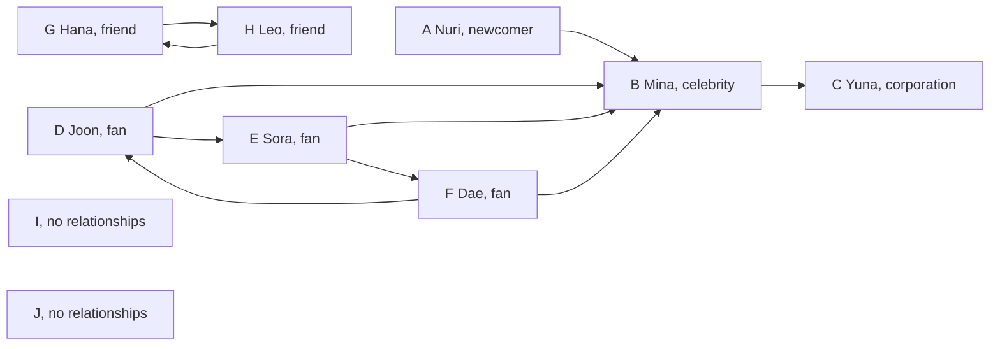

# Chapter 3. Storing Relationships in Multiple Directions

## Thinking Logically

### How do we show who follows whom?

On a social networking service (SNS), one account can follow several accounts, and several accounts can follow the same person. Mina follows Yuna. Yuna follows no one. Nuri is a newcomer who has just made a first follow: Nuri follows Mina.

Draw one dot for each account and one arrow for each follow. This collection is a **graph**. A dot is a **vertex**, and a direct relationship is an **edge**. An arrow points from the follower to the followed account. A graph whose edges have direction is a **directed graph**.

Use letters A through J for ten accounts. I and J have no relationships yet. The graph below shows the network after Nuri's first follow.



Text equivalent: the ten follows are `A -> B`, `B -> C`, `D -> B`, `D -> E`, `E -> B`, `E -> F`, `F -> D`, `F -> B`, `G -> H`, and `H -> G`. I and J have no incoming or outgoing arrows.

### How many followers and follows does an account have?

Sora follows Mina and Dae. Count the arrows leaving Sora, `E -> B` and `E -> F`: two follows. Only Joon follows Sora directly, so Sora has one follower. The number of outgoing edges is the **out-degree**. The number of incoming edges is the **in-degree**.

Mina has four followers: Joon, Sora, Dae, and Nuri. Mina follows just Yuna. Yuna has one follower and follows no one. Having no outgoing edges does not mean having no relationships.

Nuri has one outgoing follow and no followers. Before the first follow, both counts were zero. The new follow increases Mina's follower count without changing whom Mina follows.

### Where can Nuri go by following arrows?

Following `A -> B -> C` takes us from Nuri through Mina to Yuna. This sequence is a **path**. Nuri can reach Yuna even though Nuri does not follow Yuna directly.

The route stops at Yuna because Yuna follows no one. Neither Mina nor Yuna can follow arrows back to Nuri. Direction determines which routes are possible.

### Which accounts are connected?

Now ask which accounts are connected when direction does not matter. Keep all ten accounts. Remove the arrowheads and combine Hana and Leo's two opposite arrows into one line. An edge can now be followed in either direction. This is an **undirected graph** with nine edges:

```text
A—B, B—C, B—D, B—E, B—F, D—E, D—F, E—F, G—H
```

I and J each have no incident edge. Each is an **isolated vertex**. Both are active accounts in the graph. The C example stores this undirected graph. The original arrow directions are no longer part of the stored relationships.

### How should we store an undirected graph?

To leave Sora, collect Sora's direct neighbors. Store one list for each account. This representation is an **adjacency list**. Keep the same array index for each letter throughout the chapter: A is 0, B is 1, through J at 9.

| Index | Account | Neighbor letters | Stored neighbor indices |
|---|---|---|---|
| 0 | A Nuri | B | 1 |
| 1 | B Mina | A, C, D, E, F | 0, 2, 3, 4, 5 |
| 2 | C Yuna | B | 1 |
| 3 | D Joon | B, E, F | 1, 4, 5 |
| 4 | E Sora | B, D, F | 1, 3, 5 |
| 5 | F Dae | B, D, E | 1, 3, 4 |
| 6 | G Hana | H | 7 |
| 7 | H Leo | G | 6 |
| 8 | I | none | empty |
| 9 | J | none | empty |

Each edge appears at both endpoints. `E—F` puts index 5 in E's list and index 4 in F's list. Nine edges need eighteen neighbor entries. A vertex's number of neighbors is its **degree**. B has degree 5.

Each node reserves ten neighbor slots in `adj_list`. `adj_size` records how many are used. Read positions 0 through `adj_size - 1`; an empty list has size 0. The input edge order produces the table's neighbor order.

This reuses the array-list pattern from Chapter 1 at two levels. The outer `nodes` array stores node records, and `nodes_size` counts active nodes. Inside each record, `adj_list` stores neighbor indices, and `adj_size` counts active neighbors. The two counts describe different lists. Initializing a node's neighbor count to zero keeps the node active while giving it no connections yet.

### How do we find every connected group?

Starting at Nuri, follow neighbors to reach everyone connected to A. The route `B—D—E—B` returns to its starting vertex. Such a route is a **cycle**. Without a discovery record, recursive calls could keep following it.

Give each vertex a positive number as soon as its call begins. Zero means that the vertex has not been discovered. Finish a new neighbor's recursive call before continuing the current vertex's list. This is **depth-first search (DFS)**. From A, the first discoveries are `A, B, C, D, E, F`, numbered 1 through 6. Returning from C lets B continue with D. One array, `visit_num`, now records both discovery order and whether a vertex has been visited.

To label connected groups, start with all visit numbers and the group counter at zero. Increase the group counter before starting at A. Give every vertex reached from A group number 1. This is a **connected component**: a maximal group whose vertices are joined by paths. Maximal means that no outside vertex can be added while preserving that property. It does not mean the largest group.

After A's call returns, scan for the next unvisited vertex. Start at G and label G and H with 2. Then label I with 3 and J with 4. An isolated vertex receives a discovery number and a group label even though its call has no neighbors to explore.

```text
Vertex: A B C D E F G H I J
group:  1 1 1 1 1 1 2 2 3 4
current_group: 4
```

The group-labeling pass also fills `visit_num` for all ten vertices. Clear those visit numbers before starting an independent traversal.

### Which edges belong to the search tree?

The stored graph contains several routes between B, D, E, and F. To understand the recursive calls, separate the edges that discover a new vertex from the edges that meet an already discovered vertex.

When a call first reaches an unvisited neighbor, that neighbor becomes its child. The edge used for that first discovery is a **tree edge**. The first-discovery links form the **DFS tree**. Each non-root vertex has one parent in this tree even when it has several neighbors in the graph. An earlier vertex on its parent chain is an ancestor; a vertex below it is a descendant.

Starting at A with the stored neighbor order gives tree edges `A—B`, `B—C`, `B—D`, `D—E`, and `E—F`. When E examines B, B has already been discovered and is above E's parent D. This remaining edge connects a descendant to an ancestor and is a **back edge**. The back edges in this component are `B—E`, `B—F`, and `D—F`.

Each undirected edge appears in two neighbor lists. The role of the neighbor depends on which endpoint is examining it:

| Edge being examined | First examination | Reverse examination |
|---|---|---|
| Tree edge B—D | B finds unvisited D and calls its new child. | D sees B as its parent and skips the arrival edge. |
| Back edge B—E | E sees already discovered ancestor B. | Later, B sees already discovered descendant E. |

A recursive call finishes the child's whole branch before its caller continues. Thus E examines B before B's loop eventually reaches E. For this undirected DFS, every non-tree edge in the explored component connects an ancestor and a descendant. These are relationships created by the traversal, so they depend on the starting vertex and the order of checking neighbors.

For example, keep the same graph and neighbor lists but start at D. Discovery order becomes `D, B, A, C, E, F`. The tree edges become `D—B`, `B—A`, `B—C`, `B—E`, and `E—F`. B—E now discovers a child, while D—E is a back edge. Changing the neighbor order can also change which edge first discovers a vertex. The remaining examples use A and the original stored order.

### Which account can split a connected group?

Remove Mina and its incident edges. Joon, Sora, and Dae stay connected, but Nuri and Yuna each become isolated. Together with G–H, I, and J, there are now six groups instead of four. Removing Sora or Dae leaves the other members of their group connected through Mina.

A vertex whose removal increases the number of connected components is a **cut vertex**, also called an articulation point. B, at index 1, is the only cut vertex. An edge whose removal increases the number of components is a **bridge**. Here `A—B`, `B—C`, and `G—H` are bridges.

Trying every removal repeats work. Instead, record when a vertex was discovered and whether its branch can return to an earlier vertex by another edge.

### What do visit numbers and back numbers record?

Number vertices as they are first discovered from A. The array `visit_num` stores these discovery numbers, starting at 1. Vertex indices still start at 0. The starting vertex has no parent. The back-number traversal records the DFS tree's parent links in `parent` while assigning discovery numbers in the same pass:

```text
A (visit 1, index 0)
└── B (visit 2, index 1)
    ├── C (visit 3, index 2)
    └── D (visit 4, index 3)
        └── E (visit 5, index 4)
            └── F (visit 6, index 5)
```

Back edges can return from a descendant to an earlier ancestor. For example, `E—B` bypasses E's parent D. The array `back_num` stores the smallest discovery number reachable by moving down zero or more DFS tree edges and then taking at most one back edge to an ancestor. Taking no final edge is allowed. If no such route reaches an earlier vertex, keep the current vertex's own discovery number. This value is often called a **low-link value**, written `low`; discovery numbers are often written `dfn`.

At entry, increase the counter and assign the new number to both `visit_num[i]` and `back_num[i]`. For each neighbor:

- If its visit number is zero, set its parent and explore it. Its own call assigns its discovery number. On return, lower the current back number if the child's back number is smaller.
- If the neighbor is already visited and is not the parent, compare its discovery number with the current back number. Use `visit_num[adj]` for this edge.
- Skip the already visited parent. The reverse entry of the arrival edge does not provide another route.

The lecture separates these actions into four neighbor roles. The child and parent cases concern tree edges; the ancestor and descendant cases concern back edges.

| Neighbor's role | Example in this search | Record used to update the current back number |
|---|---|---|
| Newly discovered child | D calls E. | Wait for E to return, then compare E's completed `back_num`. |
| Parent | E examines D. | Skip this entry. The parent's back number is not a route around the arrival edge. |
| Already discovered ancestor, other than the parent | E examines B. | Compare B's `visit_num`, which is 2. |
| Already discovered descendant | B examines E after D's branch returns. | E's `visit_num` is larger, so the comparison leaves B's value unchanged. |

The code needs only two branches. A zero visit number selects a child. Otherwise, the non-parent branch covers both ancestors and descendants. For a descendant, `visit_num[adj] > visit_num[i]`, while `back_num[i] <= visit_num[i]`. The smaller-value test therefore fails. The lecture's rule to leave descendants unused describes this unchanged result; the code can still compare their discovery numbers.

E and F can each reach B by a non-parent edge, so their back numbers become 2. D receives 2 from its child E. C has only its parent edge to B, so its back number stays 3. B cannot use its parent edge to A as an alternative route, so B's back number stays 2.

A back number describes how far a branch can return using this rule. To decide whether a vertex is essential for keeping a component connected, compare each child's back number with that vertex's discovery number, as the cut-vertex rules below do.

| Vertex | Index | Group | `visit_num` | `back_num` | `parent` |
|---|---:|---:|---:|---:|---:|
| A | 0 | 1 | 1 | 1 | -1 |
| B | 1 | 1 | 2 | 2 | 0 |
| C | 2 | 1 | 3 | 3 | 1 |
| D | 3 | 1 | 4 | 2 | 1 |
| E | 4 | 1 | 5 | 2 | 3 |
| F | 5 | 1 | 6 | 2 | 4 |
| G | 6 | 2 | 0 | 0 | -1 |
| H | 7 | 2 | 0 | 0 | -1 |
| I | 8 | 3 | 0 | 0 | -1 |
| J | 9 | 4 | 0 | 0 | -1 |

The table follows the driver later in this chapter. Group labeling covers the whole graph. Before the back-number traversal, the driver clears visit and back numbers, resets the discovery counter, and sets every parent entry to `-1`. It then calls `save_back_num(0)`. Only A–F receive visit and back numbers. Zero in `visit_num` identifies G–J as unvisited in this pass; their zero back numbers and `-1` parents are reset values, not computed results. Their group labels remain from the earlier pass.

`save_visit_num(0)` can demonstrate discovery order on its own. It is not a prerequisite for `save_back_num(0)`: the latter assigns its own discovery numbers. Clear the visit records between independent calls so old discoveries do not prevent recursion.

### How can these numbers identify cut vertices?

A child's back number reveals whether its branch can reach above its parent. These numbers support the cut-vertex rules used in **Tarjan's algorithm**. The following deductions are a hand analysis; `lab.c` computes the numbers but does not mark cut vertices or bridges.

For a non-root vertex `u`, a DFS child `v` with `back_num[v] >= visit_num[u]` makes `u` a cut vertex. The branch can return to `u` at best. Removing `u` separates it from the parent side.

B has DFS children C and D. C gives `3 >= 2`, and D gives `2 >= 2`. Both branches depend on B to reach A. B is a cut vertex. E's back number is `2 < 4`, so D is not a cut vertex. F's back number is `2 < 5`, so E is not one either.

A root has no parent side. It is a cut vertex only when it discovers at least two DFS children. A discovers only B, so A is not a cut vertex. Count DFS children, not all neighbors.

A child edge `u—v` is a bridge when `back_num[v] > visit_num[u]`. Thus A–B gives `2 > 1`, and B–C gives `3 > 2`. B–D gives equality, so it is not a bridge. G–H is also a bridge by inspection; the run from A does not compute numbers for it.

### How do the connected pieces meet?

The four vertices B, D, E, and F are all directly connected to one another. They stay connected after any one is removed. We can describe maximal pieces with no cut vertex of their own as **blocks**, or biconnected components. Include each bridge with its two endpoints as a block and each isolated vertex as a singleton block. Some definitions reserve “biconnected” for pieces with at least three vertices; this chapter includes the smaller blocks to cover the whole graph.

The same graph has these six blocks. This table is a hand-worked extension of the stored graph, not output produced by `lab.c`.

| Block | Vertices | Edges |
|---|---|---|
| B1 | `{B, C}` | `B—C` |
| B2 | `{B, D, E, F}` | `B—D, B—E, B—F, D—E, D—F, E—F` |
| B3 | `{A, B}` | `A—B` |
| B4 | `{G, H}` | `G—H` |
| B5 | `{I}` | none |
| B6 | `{J}` | none |

Every edge belongs to one block. The cut vertex B belongs to three blocks. To show how blocks meet, draw a separate node for each block and each cut vertex. Connect each block to the cut vertices it contains. The result for one connected component is a **block-cut tree**.

```text
B1 — cut B — B2       B4       B5       B6
        |
        B3
```

The four connected components produce four trees. This collection is a **forest**. B4, B5, and B6 are one-node trees. The DFS tree records the order of discovering vertices; the block-cut forest records how blocks share cut vertices.

### What assumptions does this example use?

The C example uses ten active vertices and the nine listed undirected edges. It stores only whether vertices are connected, with no numerical edge weights. Every edge has distinct endpoints, and no pair is repeated. Such an undirected graph is called a **simple graph**.

Each stored neighbor index is between 0 and 9. Each node has room for ten neighbors, and the largest list has five entries. Initialization sets each list's size to zero. Adding the known edges appends both endpoint entries once.

Before each independent traversal, clear `visit_num` and reset `visit_time` to 0. Before labeling all groups, also reset `current_group` to 0. Before computing back numbers, initialize the root's parent to `-1`; the driver initializes all parent entries this way and clears all back numbers for readable output. The helpers assign discovery numbers when they enter, so callers do not premark vertices.

The functions assume valid indices and available space. They do not validate arbitrary input or reset the analysis arrays. A call to `alphabet_nodes_init()` empties neighbor lists but leaves the traversal records alone. The driver makes these separate preparation steps explicit.

## Calculating Efficiency

### How much work builds the graph?

Initialize ten node records. For each of nine edges, append two neighbor indices. The graph therefore stores eighteen entries. If there are `V` active vertices and `E` edges, this construction takes `O(V + E)` time. Appending one known edge takes constant work when both lists have room.

### How much work finds every connected group?

The caller clears ten visit numbers and resets the counters. The outer loop scans ten possible starting vertices. Across the recursive calls, process each vertex once and inspect all eighteen neighbor entries. An already discovered neighbor is skipped before making another call. The work grows with `V + 2E`, so component labeling takes `O(V + E)` time.

### How much work computes the two sets of numbers?

From A, `save_back_num(0)` processes six reachable vertices and sixteen neighbor entries. It assigns both discovery and back numbers during this one traversal. The reachable group has eight edges. G–H and the isolated vertices are not explored by this call.

Those sixteen entries consist of five new-child encounters, five reverse entries to parents, three back-edge encounters with ancestors, and three reverse encounters with descendants. Each entry is examined once. Only the five child encounters start another call.

Let `V_r` and `E_r` count reachable vertices and edges. The helper takes `O(V_r + E_r)` time. Including the driver's resets across all active vertices gives `O(V + V_r + E_r)`. The separate `save_visit_num(0)` demonstration visits the same six vertices and sixteen entries, but it is not required to compute back numbers. Recursive calls use at most `O(V_r)` additional space; the deepest chain here is A–B–D–E–F, with five active calls.

### How much memory is reserved and used?

Each of ten nodes reserves ten neighbor slots, for one hundred integer slots. Eighteen are used. The node data, list sizes, and four analysis arrays (`visit_num`, `group`, `back_num`, and `parent`) add storage proportional to the vertex capacity. A separate visited array is unnecessary because zero visit numbers already identify unvisited vertices.

For this fixed program, the reserved array storage is constant. If a version reserves `M` vertices and `M` neighbors per vertex, the adjacency arrays reserve `O(M²)` space even when few edges exist. The active lists contain `2E` entries. An adjacency-list representation that allocates only the needed entries can use `O(V + E)` storage, but this fixed per-node layout reserves the full capacity.

## Glossary

The following names describe the stored relationships and the records created while exploring them.

| Term | Meaning |
|---|---|
| Graph / vertex / edge | A collection of relationships / an object / a direct relationship. |
| Directed / undirected graph | Edges with direction / edges usable in either direction. |
| In-degree / out-degree | Number of incoming / outgoing edges in a directed graph. |
| Path / cycle | A route along edges / a route that returns to its start. |
| Adjacency list / degree | A vertex's direct neighbors / its number of incident edges here. |
| Isolated vertex | An active vertex with no incident edges. |
| Connected component | A maximal set of vertices joined by paths. |
| Depth-first search | Explore a newly reached vertex's branch before continuing the caller's other neighbors. |
| DFS tree / parent | First-discovery links / the vertex whose call first discovered the current vertex. |
| Tree edge / back edge | An edge used to discover a new vertex / another edge connecting a descendant to an ancestor in this undirected DFS. |
| Child / ancestor / descendant | A vertex discovered directly by the current call / an earlier vertex on its parent chain / a vertex below it in the DFS tree. |
| `visit_num` / `back_num` | Positive discovery number, with zero reserved for unvisited / earliest number reachable under the descendant-and-ancestor-edge rule. |
| Cut vertex / bridge | A vertex / edge whose removal increases the component count. |
| Block | A maximal connected piece with no cut vertex of its own, including bridge and singleton pieces here. |
| Block-cut tree / forest | A tree connecting blocks to their shared cut vertices / a collection of trees. |
| Simple graph | An undirected graph with no self-loop or repeated edge. |

## Invariant

A neighbor index tells the program where to go next. The arrays must agree about which indices and list entries are usable. A condition kept at the points where the graph is ready to be used is an **invariant**. The traversal also needs rules about when a vertex is discovered and when its results are complete.

### What must remain true about the stored graph?

At the end of initialization and after each complete edge insertion:

- `0 <= nodes_size <= 10`, where 10 is the physical length of `nodes`. Initialization activates all ten slots. Changing `nodes_size` alone would not resize the array.
- For each active node, `0 <= adj_size <= 10`, where 10 is the length of its `adj_list`. Only entries before `adj_size` belong to its neighbor list.
- Each used neighbor index is at least 0 and less than `nodes_size`. An empty list has size 0; its unused slots are not neighbors.
- For each stored edge `u—v`, u's used list contains v once, and v's used list contains u once. The fixed input contains no self-loop or repeated pair.

After all nine edges are added, the sum of list sizes is 18. I and J remain active vertices with empty lists. The paired-entry rule describes a completed insertion: `edges_init` changes two sizes and writes two entries in separate statements. Do not traverse halfway through those statements.

### What must remain true during a traversal?

A recursive helper receives a valid, unvisited index. Its first statement assigns a positive visit number before it examines neighbors. Callers recurse only when `visit_num[adj] == 0`. The direct initial call follows the same rule: begin with cleared visit numbers and call the helper without premarking the start.

Within a pass, each reached vertex changes from zero to one unique positive discovery number and keeps it. A positive value means discovered; its recursive call may still be running. A child sees its parent's positive number and avoids calling it again. `visit_time` counts discoveries so far, rather than elapsed clock time.

With the preparation shown in the driver, these guarantees hold:

| Return point | What is now known? |
|---|---|
| `save_visit_num(0)` returns | A–F have discovery numbers 1–6; G–J remain zero. `visit_time` is 6. |
| `mark_all_groups()` returns | All ten vertices have positive visit numbers and group labels. Exactly the vertices connected by paths share a label. `current_group` is 4 and `visit_time` is 10. |
| `save_back_num(i)` returns | The branch below i has been examined, and `back_num[i]` is final for this DFS tree. For a reached vertex, `1 <= back_num[i] <= visit_num[i]`. |
| `save_back_num(0)` returns | A–F have both numbers and DFS parents, with root A's parent `-1`. G–J have zero visit/back numbers and reset parent values `-1`. |

The back-number helper assigns its own discovery numbers, so its parent tree and numbers describe the same traversal. After the pass returns, use positive visit numbers to identify computed results. During recursion, a back number can still decrease even though the visit number is already fixed.

### What happens when a rule is broken?

A neighbor index of 10 is outside `nodes[10]`. A list size larger than its capacity makes a loop read beyond that list. Writing only one endpoint entry makes an intended undirected connection usable from only one side.

Reusing discovery records also breaks the intended analysis. After `save_visit_num(0)`, calling `mark_all_groups()` without a reset skips A–F. Calling `save_back_num(0)` without a reset overwrites A's number but skips its already numbered neighbor B. It does not recompute the component. Clearing only `visit_time` leaves those nonzero entries in place.

The root's parent needs preparation too. The source initializes `parent` to zero, a valid vertex index. Leaving that value would falsely describe A as the root's parent and would confuse any later rule that identifies roots by `parent == -1`. Assign `-1` to the root parent before a new back-number traversal.

### How does this example keep the rules?

Initialize before adding the known edges, add them once, and keep the stored graph unchanged during each pass. The given indices and degrees fit the fixed arrays; the code does not check arbitrary input. The driver clears all visit numbers and `visit_time` before each demonstration, resets `current_group` before grouping, and prepares back numbers and parents before the final pass.

These resets are supplied by the textbook driver. The source helpers do not perform them. Every recursive helper records its own discovery on entry, including isolated vertices and the starting vertex. Resetting visit numbers does not erase the previously computed group labels.

## Coding Plan

Build the graph, then give each pass one job. Use the current functions and global arrays from [lab.c](lab.c). The following steps follow the order of the C blocks.

### Designing and initializing a node

Keep a character, ten neighbor indices, and a neighbor count in `struct GraphNode`. Store ten nodes in `nodes`. `alphabet_nodes_init()` sets the active count to ten, assigns A–J, and empties every list by setting its size to 0.

### Adding the nine undirected edges

Read each endpoint pair from `edges[9][2]`. Save each endpoint's old list size as the insertion position and increase the size. Write v into u's list and u into v's list. Complete both writes before moving to the next edge.

### Saving discovery numbers from A

Clear visit numbers and reset `visit_time` to 0. Call `save_visit_num(0)`. Each call increases the counter and assigns it to the vertex before exploring neighbors with zero visit numbers. A–F receive 1–6. G–J stay at zero.

### Labeling all connected groups

Clear visit numbers and reset both counters. `mark_all_groups()` scans all active indices. At each unvisited index, increase `current_group` and call `mark_group`. That helper records its own discovery and assigns the shared group label. Starting at A, G, I, and J produces labels 1–4.

### Saving parents and back numbers

Clear visit numbers, reset `visit_time`, and prepare back numbers and parent entries. Call `save_back_num(0)` directly. At entry, assign the new discovery number to both arrays. For an unvisited neighbor, save its parent, recurse, and use its completed back number on return. For a visited non-parent neighbor, compare its discovery number. Skip the parent edge.

Read the two branches using the lecture's four cases: child, parent, ancestor, and descendant. An ancestor's discovery number may lower the result. A descendant's larger discovery number leaves it unchanged.

### Running and displaying the example

The driver initializes the graph and demonstrates discovery order, group labeling, and combined visit/back numbering in that order. It resets shared discovery state before every pass. The first printed line preserves the visit-only result before later passes replace it. The final table shows index, group, discovery number, back number, and parent for every vertex.

## New C Syntax Explained

The graph uses familiar arrays and structures in a few new combinations. Read each expression by separating the stored value from the position used to find it.

### An array inside a structure

`int adj_list[10];` reserves ten integers inside each `GraphNode`. In `nodes[i].adj_list[j]`, `nodes[i]` selects a node, `.adj_list` selects that node's array, and `[j]` selects one neighbor entry. The stored value is another node's index. For B, `nodes[1].adj_list[2]` is 3, the index of D. List position 2 and neighbor index 3 have different jobs.

### A two-dimensional array and nested braces

An edge needs two endpoint indices. Put each pair in an array of two integers, then gather nine such arrays. This is an array of arrays, called a **two-dimensional array**. `int edges[9][2]` declares nine rows, each containing two integers. In the initializer, `{0, 1}` supplies the two entries of the first row. `edges[i][0]` reads one endpoint of row i and `edges[i][1]` reads the other. The two bracket pairs select a row and a position within that row. For example, `edges[2][1]` is 3, the second endpoint of the B—D pair.

### Global defaults and explicit array initializers

`int visit_num[10] = {0};` initializes the first entry to zero and all remaining entries to zero too. The same form initializes `group`, `back_num`, and `parent`. Arrays defined outside functions receive zero initialization even without an explicit initializer, as `nodes` does. An ordinary local array without an initializer does not receive this automatic zero initialization.

Writing `{-1}` would set only the first entry to `-1` and the rest to zero. The driver therefore uses a loop to set every parent entry to `-1`. Initializers apply when objects are created; they do not run again whenever a function is called. A reset loop explicitly prepares an existing array for another pass.

### Assignment and comparison

`visit_num[i] = ++visit_time` stores a value. `visit_num[adj] == 0` tests whether a value equals zero. `adj != parent[i]` tests whether two indices differ. The `else if` in the back-number helper runs only when the preceding `if` did not: the neighbor was already discovered, so the next question is whether it is the parent.

In `back_num[i] = visit_num[i] = ++visit_time`, the counter increases once. The new value is assigned to `visit_num[i]`, then to `back_num[i]`. This chained assignment starts both records at the same number.

The lecture writes the same preparation as `visit_num[i] = ++visit_time;` followed by `back[i] = visit_num[i];`. Its `back` array is named `back_num` in the lab. Both versions increase the counter once and copy the same number into both records.

The lecture also combines two conditions: `adj != parent[i] && back[i] > visit_num[adj]`. The operator `&&` means both conditions must hold. C checks the left condition first and checks the right only if the left is true. Here, the body runs only for a non-parent neighbor with a smaller discovery number. The lab puts the smaller-value test inside the non-parent branch; these forms have the same effect for this code.

### Increasing before or after using a value

The postfix operator in `nodes[u].adj_size++` supplies the old size and then increases it. If B's size is 2, `u_adj_end` receives 2 and the size becomes 3. The old value is the next free list position.

The prefix operator in `++visit_time` increases the counter first and supplies the new value. Starting from zero therefore gives the first discovered vertex number 1. Zero stays available to mean unvisited. The statement `current_group++;` increases the group number before the next `mark_group` call; its expression value is unused.

### Shared arrays and separate recursive calls

Variables outside functions, such as `visit_num` and `visit_time`, are shared by all calls and last for the program's execution. Parameters and locals such as `i`, `j`, and `adj` belong to one call. A recursive call receives a copy of its integer argument. The caller waits, keeping its own loop position, and resumes after the child returns. Changing a shared array entry is visible to both calls.

The helpers return `void`, so their results are stored in arrays rather than returned as values. Functions written with `()` are called without arguments here. In C11, `(void)` explicitly declares no parameters; an empty parameter list does not provide the same parameter checking for callers.

### Printing the stored results

`#include <stdio.h>` provides declarations for `printf`, `puts`, and `putchar`. In `printf`, `%c` displays a character and `%d` displays an integer from the corresponding argument. `\n` inside a string starts a new line. `puts` adds a newline after its string; `putchar('\n')` prints just a newline. The driver's `int main(void)` takes no parameters and returns integer 0 to report successful completion.

## C Code

The first five C blocks reproduce the current `lab.c` in order, apart from trailing whitespace. The sixth block supplies reset code and a driver because `lab.c` has no `main` function. Concatenate all six blocks into a separate file to run the example as a C11 program.

The class lecture source `ppt_day_c_code.md` follows the same sequence: node storage, initialization, paired edge insertion, discovery numbers, groups, and back numbers. Its final example uses shorter names:

| Lecture code | Runnable lab code below | Purpose |
|---|---|---|
| `back[i]` | `back_num[i]` | Store the minimum discovery number reachable under the back-edge rule. |
| `save_back(i)` | `save_back_num(i)` | Discover vertices and compute back numbers in the same recursive search. |

These names identify corresponding objects and functions in two versions of the example. When following the lab, use `back_num` and `save_back_num` consistently. The lecture's separate entry assignments and combined condition are explained above. Both versions need the same caller resets shown in the driver.

### Storing and initializing the nodes

Each node contains its letter, ten neighbor slots, and the number of used slots. Initialization activates A–J and empties the lists. The unused slots are not read because neighbor loops stop at `adj_size`.

```c
struct GraphNode {
	char data;
	int adj_list[10];
	int adj_size;
};

struct GraphNode nodes[10];
int nodes_size = 0;

void alphabet_nodes_init() {
	nodes_size = 10;
	for (int i = 0; i < 10; i++) {
		nodes[i].data = 'A' + i;
		nodes[i].adj_size = 0;
	}
}
```

### Adding the nine edges

Each row of `edges` contains two endpoint indices. Save the old list sizes, increase them, and fill both new slots. Call `edges_init` once after node initialization. The fixed endpoints and degrees fit the arrays; the function does not check bounds or duplicates.

```c
void edges_init() {
	int edges[9][2] = {
		{0, 1}, {1, 2}, {1, 3}, {1, 4}, {1, 5},
		{3, 4}, {3, 5}, {4, 5}, {6, 7}};
	for (int i = 0; i < 9; i++) {
		int u = edges[i][0];
		int v = edges[i][1];
		int u_adj_end = nodes[u].adj_size++;
		int v_adj_end = nodes[v].adj_size++;
		nodes[u].adj_list[u_adj_end] = v;
		nodes[v].adj_list[v_adj_end] = u;
	}
}
```

### Saving discovery numbers from A

Begin with zero visit numbers and `visit_time = 0`, then call `save_visit_num(0)`. Each call records its own positive discovery number before exploring unvisited neighbors. The function does not print or reset anything. It reaches A–F and leaves G–J at zero.

```c
int visit_num[10] = {0};
int visit_time = 0;

void save_visit_num(int i) {
	visit_num[i] = ++visit_time;
	for (int j = 0; j < nodes[i].adj_size; j++) {
		int adj = nodes[i].adj_list[j];
		if (visit_num[adj] == 0) {
			save_visit_num(adj);
		}
	}
}
```

### Labeling every connected group

Before `mark_all_groups()`, clear visit numbers and reset `visit_time` and `current_group` to zero. The loop increases the group number before each new root. `mark_group` records discovery and labels the vertex on entry. All calls within that component share the same `current_group`. The final value 4 is both the last label and the number of groups in this prepared run.

```c
int group[10] = {0};
int current_group = 0;

void mark_group(int i) {
	visit_num[i] = ++visit_time;
	group[i] = current_group;

	for (int j = 0; j < nodes[i].adj_size; j++) {
		int adj = nodes[i].adj_list[j];

		if (visit_num[adj] == 0) {
			mark_group(adj);
		}
	}
}

void mark_all_groups() {
	for (int i = 0; i < nodes_size; i++) {
		if (visit_num[i] == 0) {
			current_group++;
			mark_group(i);
		}
	}
}
```

### Saving discovery and back numbers together

Clear visit numbers and reset the counter before this pass. Set the root parent to `-1`. The first statement assigns both numbers, so this helper does not need a preceding visit-only pass. A new neighbor receives a parent before recursion; its own call records discovery. On return, use the child's back number. For a visited non-parent neighbor, use its discovery number instead.

A visited descendant's larger discovery number cannot lower the current value. An earlier ancestor can lower it. Excluding the parent by vertex index works here because each pair has at most one edge.

This is the lecture's `save_back` routine with the lab's names and equivalent statement layout. The parent case skips a tree edge's reverse entry. The descendant case reaches the comparison but keeps the current value.

```c
int back_num[10] = {0};
int parent[10] = {0};

void save_back_num(int i) {
	back_num[i] = visit_num[i] = ++visit_time;
	for (int j = 0; j < nodes[i].adj_size; j++) {
		int adj = nodes[i].adj_list[j];
		if (visit_num[adj] == 0) {
			parent[adj] = i;
			save_back_num(adj);
			if (back_num[i] > back_num[adj]) {
				back_num[i] = back_num[adj];
			}
		} else if (adj != parent[i]) {
			if (back_num[i] > visit_num[adj]) {
				back_num[i] = visit_num[adj];
			}
		}
	}
}
```

### Running the example with explicit resets

The helper `reset_visit_numbers` below belongs to the driver, not `lab.c`. It prepares shared discovery state before each demonstration. The group labels survive the final reset, so the last table can combine whole-graph labels with A's visit/back results. All back numbers and parents are initialized before that final traversal, making untouched entries clear.

Append this block after the five blocks above. Alternatively, put it in a separate driver file with `#include "lab.c"` to reuse the source.

```c
#include <stdio.h>

void reset_visit_numbers(void) {
    for (int i = 0; i < nodes_size; i++) {
        visit_num[i] = 0;
    }
    visit_time = 0;
}

int main(void) {
    alphabet_nodes_init();
    edges_init();

    reset_visit_numbers();
    save_visit_num(0);
    printf("Visit order from A:");
    for (int i = 0; i < nodes_size; i++) {
        printf(" %d", visit_num[i]);
    }
    putchar('\n');

    reset_visit_numbers();
    current_group = 0;
    mark_all_groups();
    printf("Connected groups: %d\n", current_group);

    reset_visit_numbers();
    for (int i = 0; i < nodes_size; i++) {
        back_num[i] = 0;
        parent[i] = -1;
    }
    save_back_num(0);

    puts("Node Index Group Visit Back Parent");
    for (int i = 0; i < nodes_size; i++) {
        printf("%c %d %d %d %d %d\n", nodes[i].data, i, group[i],
               visit_num[i], back_num[i], parent[i]);
    }
    return 0;
}
```

The output is:

```text
Visit order from A: 1 2 3 4 5 6 0 0 0 0
Connected groups: 4
Node Index Group Visit Back Parent
A 0 1 1 1 -1
B 1 1 2 2 0
C 2 1 3 3 1
D 3 1 4 2 1
E 4 1 5 2 3
F 5 1 6 2 4
G 6 2 0 0 -1
H 7 2 0 0 -1
I 8 3 0 0 -1
J 9 4 0 0 -1
```

## Full C Code Explanation

This reference follows every declaration and function in the six C blocks. It explains the storage, statement order, and results left after each call. The driver shows three independent analyses, with explicit preparation between them.

### 1. Reading the program's declarations and call order

A declaration gives an object or function its name and type. `int nodes_size = 0;` declares an integer and gives it an initial value. `nodes_size = 10;` later changes that existing object. A semicolon ends either statement. Curly braces enclose structure members, function bodies, loop bodies, or initializer values according to their position.

Defining a function does not run it. Execution enters the driver's `main`, which calls the initialization and analysis functions. Those helpers return `void`; reaching the closing brace returns control to the caller. `main` returns an `int`, and `return 0;` finishes the program successfully.

Global arrays exist for the entire run. Locals are temporary. The local `edges` array ends when `edges_init` returns, but the indices copied into global `nodes` remain. The supplied graph source contains no printing; the driver supplies it.

### 2. `GraphNode` and the global node storage

`struct GraphNode` defines a structure type. `char data` stores one letter. `int adj_list[10]` stores up to ten neighbor indices. `adj_size` counts used entries. The semicolon after the structure's closing brace completes the type declaration.

`struct GraphNode nodes[10];` reserves ten structures, each with its own ten-entry neighbor array: 100 neighbor slots altogether. `nodes_size` starts at 0 because no nodes have been activated yet. Changing the active count does not resize the array.

The global fields initially have zero values. A zero in an unused neighbor slot does not mean a connection to A: only positions before `adj_size` are read. Conversely, zero in a used slot is A's valid index. List size determines which slots are neighbors.

### 3. `alphabet_nodes_init`: making ten empty lists

`nodes_size = 10;` activates all ten nodes. The loop starts i at 0, checks `i < 10` before each body, and runs `i++` afterward. It visits indices 0–9 and stops when i becomes 10.

`nodes[i].data = 'A' + i;` adds the index to A's character code. In the character encoding used here, this produces A–J. The expression computes an integer before assigning it to the character field. `nodes[i].adj_size = 0;` empties each list without clearing its unused slots.

After the loop, no vertex has a neighbor. I and J remain empty after edge insertion because no pair uses their indices. This function changes graph storage only; it does not clear any previous traversal records.

### 4. `edges_init`: appending both endpoint entries

`edges[9][2]` contains nine pairs. The literal 9 in the loop condition supplies the stopping point. At iteration i, `u = edges[i][0]` and `v = edges[i][1]` copy the endpoints into local integers. Here i is an edge-row index, not a vertex index.

`u_adj_end` saves u's old list size while increasing it. `v_adj_end` does the same for v. The next statements fill the saved positions with the opposite endpoint indices.

| Edge being added | Saved insertion positions | Completed writes and sizes |
|---|---|---|
| A–B (`0, 1`) | `u_adj_end = 0`, `v_adj_end = 0` | A's slot 0 gets 1; B's slot 0 gets 0. Both sizes become 1. |
| B–C (`1, 2`) | `u_adj_end = 1`, `v_adj_end = 0` | B's slot 1 gets 2; C's slot 0 gets 1. B's size becomes 2, C's becomes 1. |
| B–D (`1, 3`) | `u_adj_end = 2`, `v_adj_end = 0` | B's slot 2 gets 3; D's slot 0 gets 1. B's size becomes 3, D's becomes 1. |

The final sizes for A–J are `1, 5, 1, 3, 3, 3, 1, 1, 0, 0`, totaling 18. Entries are appended in input order. This input happens to produce increasing neighbor indices; the function does not sort them. It assumes initialized nodes, valid endpoints, and available list space.

### 5. `visit_num`, `visit_time`, and `save_visit_num`

The visit array starts with ten zeros. `visit_time` starts at 0 and counts discoveries. At helper entry, `visit_num[i] = ++visit_time;` increases the counter and saves its new positive value. This happens before inspecting any neighbors, including for the initial vertex and isolated vertices.

The loop variable j selects used neighbor-list positions. `adj = nodes[i].adj_list[j]` obtains a stored vertex index. If that vertex's visit number is zero, recurse. No caller assignment is needed: the neighbor's own entry records discovery before it can inspect another edge.

Starting at A, A receives 1 and calls B, which receives 2. B skips already discovered A and calls C, which receives 3. C sees only B and returns. B continues to D, then D reaches E and E reaches F. They receive 4, 5, and 6.

The final counter is 6. G–J retain zero because no path joins them to A. The helper has no entry guard for a repeated external call; the caller must supply an unvisited start. Clearing the counter alone is insufficient: the old positive array entries would still suppress neighbor calls.

### 6. `group`, `mark_group`, and `mark_all_groups`

The group array starts with zeros, meaning no positive group labels have been assigned. `current_group` also starts at 0. `mark_group(i)` first records discovery with `++visit_time`, then assigns `group[i] = current_group`. It recursively calls neighbors with zero visit numbers. Recursive calls share the group counter, and the outer loop cannot change it until the current exploration returns.

`mark_all_groups()` scans all active indices. It performs no reset. With the visit records and counters prepared by the caller, each zero entry starts a new component: increment `current_group`, then call `mark_group(i)`.

| New starting vertex | `current_group` after increment | Vertices labeled | `visit_time` after return |
|---|---:|---|---:|
| A | 1 | A–F | 6 |
| G | 2 | G, H | 8 |
| I | 3 | I | 9 |
| J | 4 | J | 10 |

After A returns, the outer loop checks B–F but skips them because their visit numbers are positive. I and J each receive a number and label before their empty loops finish. The final `current_group` is 4. The next visit reset leaves these group labels intact.

### 7. `parent` and preparation for back numbers

`back_num` and `parent` both have explicit `{0}` initializers. A parent entry stores a vertex index, not a letter or discovery number. B's index is 1, while its discovery number from A is 2.

The driver clears all visit numbers, resets `visit_time`, sets all back numbers to zero, and sets every parent entry to `-1`. Negative one cannot be a vertex index and represents no parent. This prepares both the root and readable values for vertices that the pass will not reach. The source's zero initializer alone does not establish that meaning.

Call `save_back_num(0)` after preparation. At each entry, `back_num[i] = visit_num[i] = ++visit_time;` increases the counter once and assigns the new number to both arrays. The pass therefore creates its own discovery order rather than reading numbers left by another traversal.

Before exploring a new neighbor, `parent[adj] = i;` records the current vertex as its parent. The child call then assigns discovery. The parents become B→A, C→B, D→B, E→D, and F→E. A retains `-1`.

### 8. `save_back_num`: the two kinds of update

When an unvisited neighbor's call returns, its branch has been examined. If `back_num[adj]` is smaller than `back_num[i]`, copy it upward. This carries an earlier reachable discovery number from a descendant's branch.

The `else if` handles a neighbor that was already discovered. It excludes `parent[i]` because the reverse entry of the arrival edge is not an alternative route. For any other discovered neighbor, compare `visit_num[adj]`, representing the one extra edge allowed by the back-number definition.

A discovered non-parent neighbor can be an earlier ancestor or a later descendant. A descendant's discovery number is larger than the current vertex's number and cannot lower a value already at most that number. An ancestor can lower it. Parent-by-index exclusion is sufficient for this simple graph without parallel edges.

In this search, the ancestor encounters are E→B, F→B, and F→D. Their reverse entries are examined later as D→F, B→E, and B→F, after the descendant branches have returned. For example, B later compares its back number 2 with E's discovery number 5 and keeps 2. Using E's back number at that point would confuse the child-return rule with the rule for an already discovered neighbor.

The lecture writes the non-parent and smaller-value tests together with `&&`. The lab nests the smaller-value test inside `else if (adj != parent[i])`. Both update only when the neighbor is already discovered, differs from the parent, and has a discovery number below the current back number. Neither version needs a separate descendant branch.

| Event in the A-rooted traversal | Effect |
|---|---|
| C sees only parent B | C keeps 3 and returns. B keeps 2. |
| D enters | D starts at 4, skips parent B, and calls E. |
| E sees B before calling F | E starts at 5 and lowers to B's discovery number 2. It skips parent D. |
| F examines B, D, and E | F starts at 6, lowers to 2 via B, stays at 2 when compared with D's 4, and skips parent E. |
| F returns to E | E compares 2 with its existing 2 and stays at 2. |
| E returns to D | D lowers from 4 to 2. |
| D returns to B, then B returns to A | B stays at 2; A stays at 1. |

Later comparisons with already explored descendants do not lower these values. The final back numbers for A–F are `1, 2, 3, 2, 2, 2`. G–J retain zero visit and back numbers, with `-1` parents from the driver's reset. This pass does not restart at another component.

### 9. The driver: resetting shared records and printing results

`reset_visit_numbers(void)` is an added driver helper. Its loop assigns zero to every active visit entry, then resets the counter. It leaves nodes, group labels, back numbers, and parents alone. The graph functions from `lab.c` do not call it automatically.

`main` initializes nodes and edges, resets discovery state, and calls `save_visit_num(0)`. It prints all ten visit entries, including four zeros. `putchar('\n')` ends that line. This output preserves the first demonstration before subsequent passes replace the shared visit array.

The driver resets discovery state again, sets `current_group = 0`, and calls `mark_all_groups()`. It prints the final counter as the group count. There is no separate group-count variable. With all vertices unvisited at the beginning, every group receives a fresh positive label.

Before the last pass, the driver resets discovery state once more, clears back numbers, and initializes all parents to `-1`. `save_back_num(0)` then assigns its own visit numbers and computes back numbers. The prior group labels remain available for the final table.

The table's format string has one `%c` and five `%d` conversions: letter, index, group, visit number, back number, and parent index. The row `D 3 1 4 2 1` means D is at index 3, belongs to group 1, was discovered fourth, can return to discovery number 2, and has parent index 1 (B). The back number 2 identifies B's discovery time; it does not mean vertex index 2 (C).

The row `G 6 2 0 0 -1` shows a member of group 2 that the final pass never reached. The zero visit number establishes that its back and parent entries are reset values. A also has parent `-1`, but its positive visit number identifies it as the reached root. `return 0;` finishes the program; the arrays hold the results, and printing is the separate step that displays them.
