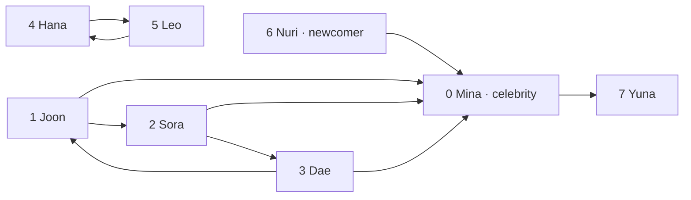

# Chapter 3. Storing Relationships in Multiple Directions

## Thinking Logically

### How do we show who follows whom?

On a social networking service (SNS), one account can follow several accounts, and several accounts can follow the same person. In this small example, Mina is a celebrity account who follows just one person, Yuna. Yuna follows no one. Nuri is a newcomer who has just made a first follow: Nuri follows Mina.

Draw one dot for each account and one arrow for each follow. An arrow points **from the follower to the followed account**, so `6 -> 0` shows Nuri following Mina. The graph below shows the network after that first follow.



Text equivalent: the ten follows are `0 -> 7`, `1 -> 0`, `1 -> 2`, `2 -> 0`, `2 -> 3`, `3 -> 0`, `3 -> 1`, `4 -> 5`, `5 -> 4`, and `6 -> 0`. Before Nuri's first follow, the same eight accounts were present, but the last arrow was absent.

### How many followers and follows does an account have?

Sora follows two accounts: Mina and Dae. Count the arrows leaving Sora, `2 -> 0` and `2 -> 3`. Only Joon follows Sora directly, so Sora has one follower. Dae can reach Sora through Joon, but this does not count as Dae following Sora.

Mina has four followers: Joon, Sora, Dae, and Nuri. Mina follows just Yuna, so four arrows enter Mina and one leaves. Yuna has one follower, Mina, and follows no one.

Nuri has one outgoing follow and no followers. Before the first follow, both counts were zero. Nuri's follow raises Mina's follower count from three to four without changing whom Mina follows.

### Where can Nuri go by following arrows?

Nuri follows Mina, and Mina follows Yuna. Following `6 -> 0 -> 7` takes us from Nuri through Mina to Yuna, even though Nuri does not follow Yuna directly.

The route stops at Yuna because Yuna follows no one. Neither Mina nor Yuna can follow arrows back to Nuri. Nuri can reach these accounts without them being able to return.

### Which accounts are connected?

Now ask who can stay in contact through other accounts. Record a new relationship: contact links allow communication in both directions. Give the same eight accounts these eight links:

```text
0—1, 0—2, 1—2, 2—3, 3—6, 3—7, 6—7, 4—5
```

These new relationships do not turn earlier follows into mutual follows.

Accounts are **vertices**; direct relationships are **edges**. Together they form a **graph**. The earlier arrows form a **directed graph**. Contact links have no direction: they form an **undirected graph**, used throughout the remaining chapter.

A **path** joins vertices through edges without repeating a vertex. Mina can reach Yuna along `0—2—3—7`. The groups are `{0, 1, 2, 3, 6, 7}` and `{4, 5}`. Each is a **connected component**: every pair is joined by a path, and no outside vertex can be added. This means maximal, not largest. An account with no links is an **isolated vertex**, forming its own component.

### How should we store an undirected graph?

To leave Sora, collect Sora's direct contacts. Such a neighbor list is an **adjacency list**:

```text
0 Mina   : 1, 2
1 Joon   : 0, 2
2 Sora   : 0, 1, 3
3 Dae    : 2, 6, 7
4 Hana   : 5
5 Leo    : 4
6 Nuri   : 3, 7
7 Yuna   : 3, 6
```

Each edge appears at both endpoints. `2—3` puts `3` in Sora's list and `2` in Dae's list. Both entries share one edge ID: eight edges need sixteen entries.

The C arrays use `head` for each list's first entry, `to` for an entry's neighbor, and `next` for the next entry's index. `-1` ends a list. Linked entries need not occupy adjacent positions. Insert each entry at its ordered position to keep neighbor numbers ascending.

### How do we find every connected component?

Starting at Mina, label everyone reachable exactly once. Without marks, the triangle `0—1—2—0` could send us around repeatedly.

1. Start with every account unmarked. Choose the smallest unmarked account and give it a new component number.
2. Read its neighbors in ascending order. For an unmarked neighbor, mark it immediately and make a recursive call to explore its neighbors with the same component number.
3. Finish that call before continuing the current account's remaining neighbors. Skip already marked neighbors.
4. When the starting call returns, choose the next unmarked account and begin another component.

Discover `0, 1, 2, 3, 6, 7`, then start at `4` and discover `5`: two components. An isolated starting account returns immediately and still receives a component number.

### Which accounts can split a connected group?

Remove Sora and its incident edges. Mina and Joon lose contact with Dae, Nuri, and Yuna. Removing Dae also splits the component. Removing Mina does not: Joon still reaches Sora.

A vertex whose removal increases the graph's number of connected components is a **cut vertex**, also called a **cut node** or articulation point. Sora (`2`) and Dae (`3`) are cut vertices. An edge whose removal increases the component count is a **bridge**. Here `2—3` and `4—5` are bridges.

Trying every removal repeats work. Instead, record whether each explored branch has another way back.

### What do dfn and low record?

A recursive call makes each newly reached account a child of its caller. These first-arrival links form a tree per component. Other edges can connect descendants to earlier ancestors.

Assign increasing numbers when accounts are first reached. **`dfn[u]`** is account `u`'s discovery number. **`low[u]`** is the smallest discovery number reachable from `u` by following zero or more first-arrival links toward descendants, then at most one other edge to an ancestor. Using no final edge is allowed. Routes using several other edges do not define `low`.

Initialize `low[u] = dfn[u]`. Then read each neighbor `v`:

- Skip the exact edge used to enter `u`, identified by `parent_edge`. Its reverse entry is not another route.
- If `v` is new, explore it completely. On return, set `low[u] = min(low[u], low[v])`.
- If `v` is an earlier ancestor, set `low[u] = min(low[u], dfn[v])`. Use its discovery number, not `low[v]`: this update represents one additional edge.

`2—0` reaches discovery number 1; `7—3` reaches discovery number 4. Returning calls carry those values upward.

| Account | `dfn` | Final `low` |
|---|---:|---:|
| 0 Mina | 1 | 1 |
| 1 Joon | 2 | 1 |
| 2 Sora | 3 | 1 |
| 3 Dae | 4 | 4 |
| 4 Hana | 7 | 7 |
| 5 Leo | 8 | 8 |
| 6 Nuri | 5 | 4 |
| 7 Yuna | 6 | 4 |

Continue numbering across components. Visiting order changes numbers, but not cut vertices.

### How does Tarjan’s algorithm find cut vertices?

A returning child's `low` reveals whether its branch reaches above its parent. This is part of **Tarjan's algorithm** for undirected graph blocks.

For a non-root account `u`, a child `v` with `low[v] >= dfn[u]` makes `u` a cut vertex. The branch can reach `u` at best; removing `u` separates it from the parent side.

Dae's return gives `4 >= 3`, identifying Sora. Nuri's return gives `4 >= 4`, identifying Dae. Equality matters: returning to Dae cannot bypass Dae's removal.

A starting root has no parent side. It is a cut vertex only if it discovers at least two new children. Count first-arrival children, not neighbors. Mina has two neighbors but only one new child, Joon, because Joon's call discovers Sora.

A child edge is a bridge only when `low[v] > dfn[u]`. Equality gives a route back to `u` that avoids that edge. Thus `2—3` is a bridge, while `3—6` is not.

### How do we separate the biconnected blocks?

Each triangle stays connected after any account is removed. We want maximal pieces with this property.

A **biconnected component**, or **block** here, is a maximal connected subgraph with no cut vertex of its own. For decomposition, include each bridge with its two endpoints as a block, and each isolated vertex as a singleton block. Definitions requiring at least three vertices call only the larger pieces biconnected; we use these additional blocks so the entire graph is represented.

Keep an array of edges waiting for a block assignment. Append a first-arrival edge before its recursive call. Append an edge to an earlier ancestor when it is inspected from its later endpoint. Do not append the reverse parent edge or an edge to a later descendant.

On return from child `v`, if `low[v] >= dfn[u]`, remove edges from the array's end through the first-arrival edge `u—v`, including that edge. Their endpoints form one block. Apply this boundary rule to roots too, even when the root is not a cut vertex.

The blocks finish in this order:

| Block | Vertices | Edges |
|---|---|---|
| B1 | `{3, 6, 7}` | `3—6, 3—7, 6—7` |
| B2 | `{2, 3}` | `2—3` |
| B3 | `{0, 1, 2}` | `0—1, 0—2, 1—2` |
| B4 | `{4, 5}` | `4—5` |

Every edge belongs to exactly one block. Cut vertices belong to multiple blocks.

### How do the blocks form a tree?

Hide each block's internal edges to show how pieces meet. Make separate nodes for blocks and cut vertices. Connect a block to each cut vertex it contains.

This is a **block-cut tree** for a connected component. Our graph gives:

```text
B3 — C2 — B2 — C3 — B1       B4
```

`C2` is Sora; `C3` is Dae. Ordinary vertices stay inside block nodes. B4 is a one-node tree. A disconnected graph produces a **forest**, or collection of trees. Singleton blocks also become isolated tree nodes.

The first-arrival tree records exploration of accounts. The block-cut tree records shared cut vertices between blocks. Their nodes represent different objects.

### What conditions must the graph keep?

Both entries of every contact edge must agree. Reserve 16 vertex positions and 120 edge positions, enough for every distinct pair.

- Active vertex numbers are consecutive from `0`; unused positions are not isolated vertices.
- Each edge joins two different active vertices. Self-loops and duplicate pairs are excluded.
- Each edge ID occurs in exactly two adjacency entries, one at each endpoint.
- Every list ends at `-1`, and the two entries are added together only after validation and capacity checks.
- Rejected additions leave the graph unchanged. Duplicate requests are rejected and leave one edge.

The example uses eight active vertices and eight edges. It stores contact existence, with no numerical edge weights.

## Calculating Efficiency

### How much work finds every connected component?

Mark eight accounts and inspect sixteen neighbor entries. Generally, process `V` active vertices and `2E` entries. Initializing active marks and scanning for starting accounts also cost `O(V)`. Total time is `O(V + E)`.

### How much work does Tarjan’s algorithm take?

Again, inspect eight accounts and sixteen entries. Each edge enters and leaves the pending array once. Per-block vertex marks avoid repeating endpoints when producing blocks and the block-cut forest. Total time, including output, is `O(V + E)`.

### How much work stores or adds an edge?

Reading all lists takes `O(V + E)`. Adding `u—v` searches for duplicates and finds both ordered insertion positions. With `d(u)` and `d(v)` neighbors, called the endpoints' **degrees**, this costs `O(1 + d(u) + d(v))`. Filling two entries then takes constant work. Repeated checked additions need not build the graph in linear time.

### How much memory is reserved and used?

Reserve `M = 16` vertex positions, `L = 120` edge positions, and `2L = 240` adjacency entries. Fixed analysis and output arrays also scale with these capacities. Reserved space is `O(M + L)`; only eight vertices and sixteen adjacency entries are active here.

Arrays sized to actual input use `O(V + E)` space, including pending edges and results. Recursive calls add at most `O(V)` space. The code initializes active analysis entries in `O(V + E)` time; reserving larger arrays does not make inactive positions into vertices.

## Glossary

These names describe the contact graph and its analysis.

| Term | Meaning |
|---|---|
| Vertex / edge | An object / a direct relationship. |
| Directed / undirected graph | Edges with direction / edges usable in either direction. |
| Adjacency list | Each vertex's direct neighbors. |
| Degree | Number of incident edges in this simple undirected graph. |
| Connected component | A maximal set of vertices joined by paths. |
| Cut vertex / bridge | A vertex / edge whose removal increases the component count. |
| First-arrival tree | Parent-child links created when new vertices are discovered. |
| `dfn` / `low` | Discovery number / earliest number reachable under the descendant-and-ancestor-edge rule. |
| Block | A maximal connected piece without its own cut vertex; bridge and singleton pieces are included here. |
| Block-cut tree | A tree linking blocks to their shared cut vertices. |
| Forest | A collection of disjoint trees. |

References: [Algorithm](https://www.cs.cmu.edu/~15451-s15/LectureNotes/lecture08.pdf), [block convention](https://www.math.tugraz.at/~cela/Vorlesungen/AlgGrTheo24/Connectivity_H.pdf), [edge partition and cost](https://www.boost.org/doc/libs/1_86_0/libs/graph/doc/biconnected_components.html).

## Coding Plan

The program builds the contact graph, labels its components, and extracts its blocks.

1. Define fixed arrays for vertices, edge IDs, and paired adjacency entries.
2. Initialize the graph and insert the eight checked contact edges.
3. Mark each new account before exploring its neighbors; restart at every unmarked account to assign `component` numbers.
4. Compute `dfn` and `low` during recursive exploration, keeping `parent_edge` and the number of newly discovered children.
5. Set `cut` with the non-root and root rules. Assign pending edges to blocks at each return boundary.
6. Give isolated vertices singleton blocks. Connect blocks to their cut vertices and print the results.

## C Code

Concatenate the following eight C blocks in order to make one complete C11 program. Each block adds the functions used by later blocks.

### Storing edges and analysis records

One undirected edge needs two neighbor entries with the same edge ID. `typedef` gives the structure the short name `Neighbor`. Its `next` field stores an array index, and `head[u]` stores the first index for account `u`. The value `-1` means no entry. All arrays here are shared by the functions below.

`pending` holds edges whose blocks are not finished. `block_vertex` and `block_edge` store all block members consecutively. Block `b` occupies indexes from `block_vertex_start[b]` up to, but not including, `block_vertex_start[b + 1]`; edges use the same pattern. These boundary arrays include one final end position. A vertex can occur once in each of several blocks, so allow up to `2 * MAX_EDGES + MAX_VERTICES` member entries. `in_block[u]` remembers the most recent block that included `u`.

```c
#include <stdio.h>

#define MAX_VERTICES 16
#define MAX_EDGES 120
#define MAX_BLOCKS (MAX_EDGES + MAX_VERTICES)
#define MAX_MEMBERS (2 * MAX_EDGES + MAX_VERTICES)

typedef struct {
    int to, edge, next;
} Neighbor;

int vertex_count, edge_count, entry_count;
int head[MAX_VERTICES], edge_u[MAX_EDGES], edge_v[MAX_EDGES];
Neighbor neighbor[2 * MAX_EDGES];
const char *name[MAX_VERTICES];

int dfn[MAX_VERTICES], low[MAX_VERTICES], component[MAX_VERTICES];
int cut[MAX_VERTICES], clock_value, component_count;
int pending[MAX_EDGES], pending_count;
int block_count, member_count, block_edge_count;
int block_vertex[MAX_MEMBERS], block_edge[MAX_EDGES];
int block_vertex_start[MAX_BLOCKS + 1], block_edge_start[MAX_BLOCKS + 1];
int in_block[MAX_VERTICES];
```

### Initializing active accounts

Initialize the graph before adding edges. The caller supplies one valid name for each active account. Set each active list head to `-1`; reserving 16 positions does not create 16 accounts. Analysis records are reset separately by `analyze`.

```c
int initialize(int count, const char *labels[]) {
    if (count < 0 || count > MAX_VERTICES) return 0;
    vertex_count = count;
    edge_count = entry_count = 0;
    for (int u = 0; u < count; ++u) {
        head[u] = -1;
        name[u] = labels[u];
    }
    return 1;
}
```

### Adding both entries of one edge

Reject inactive endpoints, self-connections, duplicates, and exhausted edge capacity before changing storage. A rejected duplicate returns 0 and preserves the existing edge. Each accepted edge adds two entries.

`link` points to the integer slot that must change: first `head[from]`, then a preceding entry’s `next`. `&` takes that slot’s address and `*link` reads or updates its integer value. Stop at the ordered insertion position. The new entry keeps the old next index, then `*link` is changed to the new entry index. `(Neighbor){...}` creates one structure value containing the three listed fields.

```c
/* Keep each account's neighbors in ascending account-ID order. */
void insert_neighbor(int from, int to, int edge) {
    int *link = &head[from];
    while (*link != -1 && neighbor[*link].to < to)
        link = &neighbor[*link].next;
    neighbor[entry_count] = (Neighbor){to, edge, *link};
    *link = entry_count++;
}

/* One undirected edge receives two neighbor entries with one shared ID. */
int add_edge(int u, int v) {
    if (u < 0 || v < 0 || u >= vertex_count || v >= vertex_count || u == v)
        return 0;
    for (int p = head[u]; p != -1; p = neighbor[p].next)
        if (neighbor[p].to == v) return 0;
    if (edge_count == MAX_EDGES) return 0;
    int edge = edge_count++;
    edge_u[edge] = u;
    edge_v[edge] = v;
    insert_neighbor(u, v, edge);
    insert_neighbor(v, u, edge);
    return 1;
}
```

### Finishing one block

Append an endpoint only if its `in_block` mark differs from the current block number. This avoids scanning an entire block for duplicates. To finish a block, take pending edges from the end, including the edge that opened the child branch. Save their edge IDs and endpoints, then record the end positions. `--pending_count` reduces the count before reading the former last entry.

```c
void add_block_vertex(int u) {
    if (in_block[u] == block_count) return;
    in_block[u] = block_count;
    block_vertex[member_count++] = u;
}

/* The next block begins immediately after this block's entries. */
void close_block(void) {
    ++block_count;
    block_vertex_start[block_count] = member_count;
    block_edge_start[block_count] = block_edge_count;
}

/* Read pending edges backward through the edge that opened this block. */
void finish_block(int opening_edge) {
    int edge;
    do {
        edge = pending[--pending_count];
        block_edge[block_edge_count++] = edge;
        add_block_vertex(edge_u[edge]);
        add_block_vertex(edge_v[edge]);
    } while (edge != opening_edge);
    close_block();
}
```

### Exploring a branch and returning

A first visit assigns both numbers and the current component label. The loop skips the arrival edge. A recursive call completes a new neighbor’s branch before the current loop continues. Returning updates `low` and checks the block boundary. Connections to earlier ancestors use their `dfn` values.

The non-root cut test and root cut test are separate. Block extraction still happens when returning to a root with just one child. This is why Mina can finish B3 without being a cut vertex.

```c
void explore(int u, int parent_edge) {
    dfn[u] = low[u] = ++clock_value;
    component[u] = component_count;
    int children = 0;

    for (int p = head[u]; p != -1; p = neighbor[p].next) {
        int v = neighbor[p].to;
        int edge = neighbor[p].edge;
        if (edge == parent_edge) continue;

        if (dfn[v] == 0) {
            ++children;
            pending[pending_count++] = edge;
            explore(v, edge);
            if (low[v] < low[u]) low[u] = low[v];

            if (low[v] >= dfn[u]) {
                if (parent_edge != -1) cut[u] = 1;
                finish_block(edge);
            }
        } else if (dfn[v] < dfn[u]) {
            /* Record this earlier connection once, from its later end. */
            pending[pending_count++] = edge;
            if (dfn[v] < low[u]) low[u] = dfn[v];
        }
    }
    if (parent_edge == -1 && children > 1) cut[u] = 1;
}
```

### Starting again in every unvisited component

Reset analysis state so the same stored graph can be analyzed again. Set `in_block` to `-1` so no account is considered part of block 0 yet. Scan all active accounts, starting another component wherever `dfn` is still zero. An isolated account receives its own component and a singleton block; its block has no edge entries.

```c
void analyze(void) {
    clock_value = component_count = pending_count = block_count = 0;
    member_count = block_edge_count = 0;
    block_vertex_start[0] = block_edge_start[0] = 0;
    for (int u = 0; u < vertex_count; ++u) {
        dfn[u] = low[u] = component[u] = cut[u] = 0;
        in_block[u] = -1;
    }

    for (int u = 0; u < vertex_count; ++u) {
        if (dfn[u] != 0) continue;
        ++component_count;
        explore(u, -1);
        /* Convention: an isolated account is a singleton block. */
        if (head[u] == -1) {
            add_block_vertex(u);
            close_block();
        }
    }
}
```

### Printing blocks and their cut-vertex links

Print each saved range instead of scanning all edges for every block. Within each block, print a block-cut link only for a member marked as a cut vertex. A block with no such links is a one-node tree. The block members are printed in extraction order; that order does not change the sets shown earlier.

```c
void print_results(void) {
    printf("Connected components: %d\n", component_count);
    puts("Account  component  dfn  low  cut");
    for (int u = 0; u < vertex_count; ++u)
        printf("%-7s  %9d  %3d  %3d  %s\n", name[u], component[u],
               dfn[u], low[u], cut[u] ? "yes" : "no");

    puts("\nBlocks (vertices; edges):");
    for (int block = 0; block < block_count; ++block) {
        printf("B%d:", block + 1);
        for (int i = block_vertex_start[block]; i < block_vertex_start[block + 1]; ++i)
            printf(" %s", name[block_vertex[i]]);
        printf(" ;");
        for (int i = block_edge_start[block]; i < block_edge_start[block + 1]; ++i) {
            int edge = block_edge[i];
            printf(" %s--%s", name[edge_u[edge]], name[edge_v[edge]]);
        }
        if (block_edge_start[block] == block_edge_start[block + 1]) printf(" (no edges)");
        putchar('\n');
    }

    puts("\nBlock-cut forest (block -- cut account):");
    for (int block = 0; block < block_count; ++block) {
        int links = 0;
        for (int i = block_vertex_start[block]; i < block_vertex_start[block + 1]; ++i) {
            int u = block_vertex[i];
            if (!cut[u]) continue;
            printf("B%d -- %s\n", block + 1, name[u]);
            ++links;
        }
        if (links == 0) printf("B%d (standalone block node)\n", block + 1);
    }
}
```

### Running the contact-graph example

The input contains exactly the eight undirected edges from the text. Build them, analyze the graph, and print the records. These fixed arrays require no dynamic allocation or cleanup.

```c
int main(void) {
    const char *labels[] = {"Mina", "Joon", "Sora", "Dae", "Hana", "Leo", "Nuri", "Yuna"};
    const int edges[][2] = {{0, 1}, {0, 2}, {1, 2}, {2, 3},
                            {3, 6}, {3, 7}, {6, 7}, {4, 5}};
    if (!initialize(8, labels)) return 1;
    for (unsigned int i = 0; i < sizeof edges / sizeof edges[0]; ++i) {
        if (!add_edge(edges[i][0], edges[i][1])) {
            fputs("Invalid edge.\n", stderr);
            return 1;
        }
    }
    analyze();
    print_results();
    return 0;
}
```

The output is:

```text
Connected components: 2
Account  component  dfn  low  cut
Mina             1    1    1  no
Joon             1    2    1  no
Sora             1    3    1  yes
Dae              1    4    4  yes
Hana             2    7    7  no
Leo              2    8    8  no
Nuri             1    5    4  no
Yuna             1    6    4  no

Blocks (vertices; edges):
B1: Dae Yuna Nuri ; Dae--Yuna Nuri--Yuna Dae--Nuri
B2: Sora Dae ; Sora--Dae
B3: Mina Sora Joon ; Mina--Sora Joon--Sora Mina--Joon
B4: Hana Leo ; Hana--Leo

Block-cut forest (block -- cut account):
B1 -- Dae
B2 -- Sora
B2 -- Dae
B3 -- Sora
B4 (standalone block node)
```
