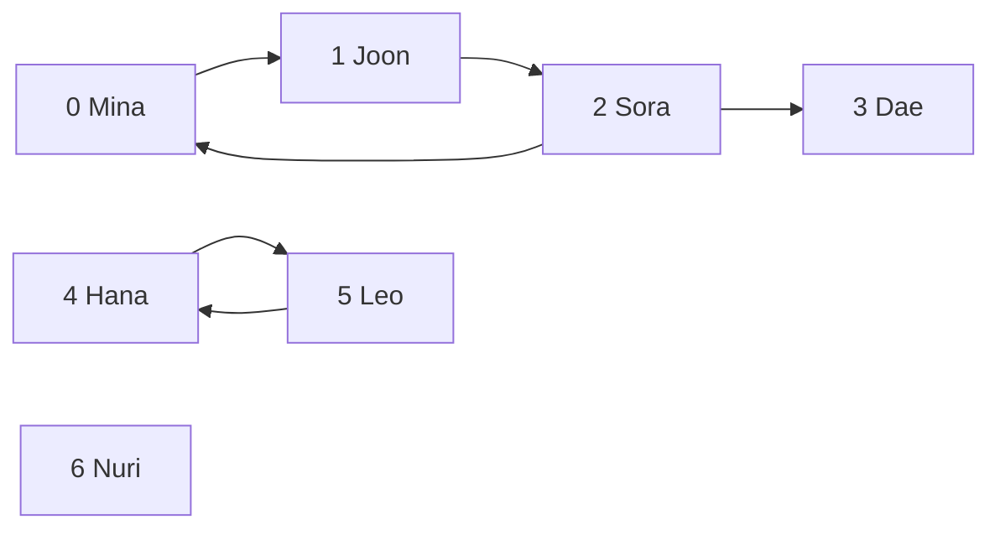

# Chapter 3. Storing Relationships in Multiple Directions

## Thinking Logically

### How do we show who follows whom?

On a social networking service (SNS), one account can follow several accounts. Several accounts can follow the same person. Accounts can also follow one another in a circle. A tree cannot represent all these relationships because a tree forbids shared children and cycles.

We need a model that permits both. Draw one dot for each account and one arrow for each follow. The model is a **graph**. Each account is a **vertex**. Each direct follow relationship is an **edge**.

### Which accounts will we use?

We will use the same seven accounts throughout this chapter. The numbers identify accounts; they do not measure popularity or priority.

| Account number | Name | Accounts this person follows |
|---|---|---|
| 0 | Mina | Joon (1) |
| 1 | Joon | Sora (2) |
| 2 | Sora | Mina (0), Dae (3) |
| 3 | Dae | None |
| 4 | Hana | Leo (5) |
| 5 | Leo | Hana (4) |
| 6 | Nuri | None |

An arrow points **from the follower to the followed account**. For example, `0 -> 1` means Mina follows Joon.



Text equivalent: the complete list of edges is `0 -> 1`, `1 -> 2`, `2 -> 0`, `2 -> 3`, `4 -> 5`, and `5 -> 4`. Nuri is an account even though no arrow touches Nuri.

### Why does direction matter?

Mina follows Joon. Joon does not follow Mina directly. These are separate facts. A graph whose edges distinguish a starting account from an ending account is a **directed graph**.

Hana and Leo follow each other. We record two edges: `4 -> 5` and `5 -> 4`. Removing either follow leaves the other one in place.

If a relationship has no direction, we draw a line without an arrow. That model is an **undirected graph**. Our follower network remains directed.

### How many followers and follows does an account have?

To count how many accounts Sora follows, count the arrows leaving Sora. There are two: `2 -> 0` and `2 -> 3`. This count is the **out-degree**.

To count Sora's followers, count the arrows entering Sora. There is one: `1 -> 2`. This count is the **in-degree**. Degree counts direct edges, not every possible route through the network.

Dae has out-degree 0 and in-degree 1. Nuri has both counts equal to 0. An account with no incoming or outgoing edges is an **isolated vertex**. Dae is not isolated because Sora follows Dae.

### What can we learn by following several arrows?

Mina follows Joon, and Joon follows Sora. Following `0 -> 1 -> 2` reaches Sora from Mina. A sequence of vertices joined by edges, without repeating a vertex, is a **path**. A directed path follows every arrow in its stated direction.

Sora follows Mina, so `0 -> 1 -> 2 -> 0` returns to the starting account. A route that returns to its start without repeating another vertex is a **cycle**. This cycle is valid in a graph.

The path `0 -> 1 -> 2 -> 3` reaches Dae from Mina. Dae has no outgoing edge, so there is no directed path back to Mina. Being reachable in one direction does not guarantee reachability in the other direction.

A follow path describes a chain of relationships. It does not automatically put Dae's posts in Mina's feed. The arrow records who follows whom, not the direction in which a post travels. Joon's posts may appear in Mina's feed because Mina follows Joon.

### Which accounts belong to one connected group?

An individual path answers whether one account can reach another. Now we want to divide the whole network into groups. We must first decide whether arrow direction matters.

Begin by temporarily treating each arrow as a line that can be followed either way. Starting at Mina, we can reach Joon, Sora, and Dae. We cannot reach Hana, Leo, or Nuri this way. Mina, Joon, Sora, and Dae therefore form one complete group under this rule.

In an undirected graph, such a group is a **connected component**. Every pair of vertices in the group is joined by a path. We include every vertex that can join the group while preserving this property. This makes the group **maximal**: it cannot be expanded. Maximal does not mean the single largest group in the graph. A smaller separate group is also a component.

For a directed graph, finding these groups after ignoring arrow directions gives the **weakly connected components**. Our network has three:

| Weak component | Why the group belongs together |
|---|---|
| {Mina, Joon, Sora, Dae} = {0, 1, 2, 3} | The cycle and Sora's follow of Dae join all four when directions are ignored. |
| {Hana, Leo} = {4, 5} | Their follow relationships join them to each other, with no link to the first group. |
| {Nuri} = {6} | No edge joins Nuri to another account. |

Ignoring direction is an analysis rule. It does not add a follow from Dae to Sora or change the stored graph.

### Which accounts can reach one another while respecting arrows?

The first weak component includes Dae, but Dae cannot follow a path back to anyone. We need a stricter rule when both directions of reachability matter.

Require a directed path from each account in a group to every other account in that group. Include every account that can satisfy the rule with the whole group. This maximal group is a **strongly connected component**.

Mina reaches Sora through Joon: `0 -> 1 -> 2`. Sora reaches Joon through Mina: `2 -> 0 -> 1`. Joon reaches Mina through Sora: `1 -> 2 -> 0`. The cycle gives all three accounts paths to one another.

Our network has four strong components:

| Strong component | Why the group cannot grow |
|---|---|
| {Mina, Joon, Sora} = {0, 1, 2} | All three can reach one another. Dae cannot return to them. |
| {Dae} = {3} | Dae cannot reach another account. |
| {Hana, Leo} = {4, 5} | Each reaches the other. Neither can reach another group. |
| {Nuri} = {6} | Nuri has no path to another account. |

An account reaches itself by taking zero edges. A single account can therefore form a strong component without a self-follow. A singleton strong component need not be isolated: Dae still has an incoming edge.

Strong connectivity does not require every pair to follow each other directly. Mina, Joon, and Sora satisfy the rule through paths. Their group is also maximal: `{Mina, Joon}` alone is not a component because Sora belongs in the same group.

Every account belongs to exactly one strong component and exactly one weak component. Each strong component lies entirely within one weak component. In the first weak component, the strong components are `{0, 1, 2}` and `{3}`. The distinction follows the standard [definitions of directed connectivity in Stanford's graph notes](https://stanford-cs161.github.io/winter2022/assets/files/lecture10-notes.pdf).

### How could components help build a feed?

A feed displays selected posts in an order. Knowing who is connected can help a service choose posts to consider. It still needs a separate rule for deciding which posts are most relevant to the viewer.

Consider a teaching design with two stages. First, collect **candidate posts**: posts eligible to be considered for the feed. Second, **rank** those candidates: assign scores and put them in order. Real feed systems can separate candidate collection and ranking; [Meta's 2021 description of News Feed](https://engineering.fb.com/2021/01/26/core-infra/news-feed-ranking/) gives one example. The component rules below are a hypothetical design for our network, not a claim that a particular SNS uses them.

For Mina's feed, the original seven-account graph gives these choices:

| Source of candidates | Example for Mina | Possible use |
|---|---|---|
| Accounts Mina directly follows | Joon | Collect eligible posts for the following part of the feed. |
| Other accounts in Mina's strong component | Sora | Consider additional posts from accounts with directed paths both ways. |
| Accounts in the same weak component but a different strong component | Dae | Explore a broader connection through Sora. |
| Accounts outside Mina's weak component | Hana, Leo, Nuri | Consider eligible public posts using interests or other signals. |

After collecting candidates, remove duplicate posts. Rank them using signals such as relevance to Mina's interests, recent interactions, and post freshness. A component label can be one signal; the label alone does not say which post should appear first.

For a small worked decision, suppose Sora and Dae each have an eligible public post. A component rule puts both posts into Mina's candidate pool. If Mina has shown interest in Dae's post topic, the ranking rule may place Dae's post first even though Dae is outside Mina's strong component.

The service could also limit how many recommended posts in a row come from one strong component and try candidates from other groups. This changes the mix of graph groups in the feed. It does not guarantee different topics or viewpoints.

Component membership needs care in this design:

- A direct follow can cross a strong-component boundary. Sora follows Dae, so restricting Sora's feed to Sora's strong component would discard a directly followed account.
- A weak component can become very large. One follow can join two previously separate weak components. Membership alone does not establish shared interests or a close social community.
- Nuri has no follow connections. A useful feed for Nuri needs other signals, such as interests selected by Nuri. It need not be empty.
- Neither a path nor a component grants permission to view a post. Candidate selection must respect visibility, blocks, and other feed eligibility rules.

The graph stores relationships between accounts. Posts, interests, interaction history, and ranking scores require additional data. This chapter explains the possible use of components by hand; implementing component-finding algorithms and a feed system is outside the C exercise.

### How should we store the follower network?

We need to answer direct questions such as “Does Sora follow Dae?” Numbering accounts lets us place each answer in a table. Use the follower's number as the row and the followed account's number as the column. Store `1` for a follow and `0` for its absence. This table is an **adjacency matrix**.

The original network has this active matrix:

```text
                    followed account
                    0  1  2  3  4  5  6
follower 0 Mina     0  1  0  0  0  0  0
         1 Joon     0  0  1  0  0  0  0
         2 Sora     1  0  0  1  0  0  0
         3 Dae      0  0  0  0  0  0  0
         4 Hana     0  0  0  0  0  1  0
         5 Leo      0  0  0  0  1  0  0
         6 Nuri     0  0  0  0  0  0  0
```

Sora's row is `[1, 0, 0, 1, 0, 0, 0]`. Counting its two `1` values gives Sora's out-degree. Looking only at `grid[0][2]` gives `0`: Mina does not directly follow Sora, even though a path connects them. A single cell does not answer a component question.

We could instead save the six endpoint pairs in an **edge list**. We could also collect outgoing neighbors separately for each account in an **adjacency list**. In the latter representation, Sora's list contains `0, 3`, and Nuri's list is empty. We compare these storage choices here and implement the matrix.

For an undirected graph, each relationship would appear in both mirror cells. Such a matrix is **symmetric**. Our directed matrix need not be symmetric: `grid[0][1]` is `1`, while `grid[1][0]` is `0`.

### What conditions must the stored graph keep?

An active account must have a valid position in the table. Our implementation reserves space for at most 16 accounts and records the number currently active in `vertex_count`. These conditions must stay true after every valid operation. They form the graph's **invariant**.

1. `vertex_count` is at most `GRAPH_MAX_VERTICES`, which is 16. Active account numbers run from `0` through `vertex_count - 1`.
2. Every cell contains either `0` or `1`.
3. Every cell in an inactive row or column remains `0`.
4. Every diagonal cell stays `0`. This model forbids an account from following itself. Such an edge would be a **self-loop**.

Nuri is active because `6 < vertex_count`, not because a cell contains `1`. With seven active accounts, rows and columns 7 through 15 are inactive. Clearing those positions prevents stale follows from appearing if they become active later.

We store only whether a follow exists. This makes the graph **unweighted**. A numerical value attached to an edge is a **weight**. A different model might attach an interaction count to each follow, but our `0` and `1` cells are not ranking scores.

### What changes when Sora unfollows Dae?

Until this point, every example has used the original six edges. Now remove only `2 -> 3`. Change row 2, column 3 from `1` to `0`. Sora's row becomes `[1, 0, 0, 0, 0, 0, 0]`, and Sora's out-degree becomes 1.

Dae now has no incoming or outgoing edge. The first weak component splits into `{0, 1, 2}` and `{3}`. There are now four weak components. The four strong components remain unchanged because Dae already had no path back to the other accounts.

A feed design using component labels would need to update affected labels after follow changes. Dae leaves Mina's weak component, but Dae's eligible public posts could still be candidates through interest matching.

## Calculating Efficiency

### How much work does one follow change take?

Adding `2 -> 3` writes one cell. Removing it writes that same cell. A direct follow check reads one cell. After checking the account numbers, each action takes a fixed amount of work: `O(1)` time.

### How much work does counting follows take?

Counting Sora's follows checks seven cells in row 2, even when only two are `1`. Counting followers would check seven cells in column 2. With `V` active accounts, either count checks `V` cells and takes `O(V)` time.

### How much work does inspecting the whole matrix take?

Seven active accounts give 7 rows of 7 cells, so reading the active square inspects 49 cells. Doubling the active account count to 14 gives 196 cells, four times as many. With `V` accounts, this scan takes `O(V²)` time. The squared term describes rows multiplied by columns.

Inspecting the cells tells us the direct edges. Computing components also requires tracing connections and tracking which accounts belong together. A matrix scan alone is not a complete component-finding algorithm.

### How much memory does the matrix reserve?

Our fixed C object always reserves 16 by 16 cells: 256 integers. Only 49 cells describe pairs of active accounts in the example, and only six contain `1` before the unfollow. Changing `vertex_count` does not resize the array.

If the reserved capacity is `M`, matrix storage grows as `M²` integers. For this implementation, `M` is fixed at 16. Initialization clears all 256 cells, including inactive positions.

An SNS with many accounts but relatively few follows per account would leave most matrix cells empty. An edge list or adjacency list can save storage by recording existing edges instead of reserving an entry for every possible account pair. The small matrix makes direction and updates easy to inspect in this chapter.

## Glossary

These terms name the relationships, groups, and storage choices used in the follower example.

| Term | Meaning |
|---|---|
| Graph | A model of objects and their relationships. |
| Vertex | One object, such as an SNS account. |
| Edge | One direct relationship, such as a follow. |
| Directed graph | A graph whose edges have a starting vertex and an ending vertex. |
| Undirected graph | A graph whose edges have no direction. |
| Out-degree | Number of direct edges leaving a vertex; accounts followed in our model. |
| In-degree | Number of direct edges entering a vertex; followers in our model. |
| Path | A sequence of vertices joined by edges without repeating a vertex; directed paths respect arrows. |
| Cycle | A route returning to its start without repeating another vertex. |
| Maximal | Cannot be expanded while preserving the required property; not necessarily largest. |
| Connected component | A maximal group joined by paths in an undirected graph. |
| Weakly connected component | A connected component obtained by ignoring a directed graph's edge directions. |
| Strongly connected component | A maximal group in which every vertex can reach every other vertex through directed paths. |
| Isolated vertex | An active vertex with no incoming or outgoing edge; a singleton under either component rule. |
| Edge list | Storage with one endpoint pair for each edge. |
| Adjacency list | Storage collecting each vertex's neighbors; outgoing neighbors for our directed graph. |
| Adjacency matrix | A table recording direct edges by source row and destination column. |
| Symmetric matrix | A matrix whose values match across the main diagonal. |
| Invariant | Conditions that must remain true after valid operations. |
| Self-loop | An edge from a vertex to itself; forbidden in our implementation. |
| Weight | A numerical value attached to an edge. |
| Unweighted graph | A graph recording edge existence without edge weights. |
| Candidate post | An eligible post being considered for a feed. |
| Ranking | Scoring candidate posts and putting them in order. |

## Coding Plan

The C exercise stores follows in the same seven-account graph. Component membership and feed choices remain reasoning exercises. The lab uses `graph_init`, `graph_add_edge`, `graph_remove_edge`, and `graph_out_degree` to package the matrix operations into functions. The examples below show the underlying steps.

1. Define the fixed grid and active account count.
2. Initialize all cells to `0` and set the active count to 7.
3. Add the six follows after checking each pair of account numbers.
4. Check one direct follow by reading a guarded matrix cell.
5. Count Sora's follows by scanning row 2.
6. Remove Sora's follow of Dae by clearing `grid[2][3]`.
7. Count Sora's follows again to observe the change from 2 to 1.

## C Code

### How do we write rows, columns, and counts in C?

The table needs two indexes. In C, `grid[16][16]` declares an array of 16 rows, each containing 16 integers. `grid[2][3]` selects row 2, column 3. This is a **two-dimensional array**.

The count and indexes use `size_t`, an unsigned integer type declared by `<stddef.h>` and used for object sizes and array counts. It cannot represent a negative value. A value of type `size_t` can still be too large, so bounds checks remain necessary. `<stdio.h>` supplies `printf`; `%zu` prints a `size_t` value.

The first block defines the type. The remaining blocks are consecutive statements to place inside `main`.

```c
#include <stddef.h>
#include <stdio.h>

#define GRAPH_MAX_VERTICES 16

struct DirectedGraph {
        size_t vertex_count;
        int grid[GRAPH_MAX_VERTICES][GRAPH_MAX_VERTICES];
};
```

### Initializing the follower network

Seven accounts fit within the capacity of 16. For an input count, reject a value above `GRAPH_MAX_VERTICES` before changing the graph. Our fixed example uses the known valid count 7.

```c
struct DirectedGraph network;

for (size_t row = 0; row < GRAPH_MAX_VERTICES; row = row + 1) {
        for (size_t col = 0; col < GRAPH_MAX_VERTICES; col = col + 1) {
                network.grid[row][col] = 0;
        }
}
network.vertex_count = 7; /* Mina, Joon, Sora, Dae, Hana, Leo, Nuri */
```

### Adding the six follows

The temporary `follows` array holds six rows of two account numbers. Each row names the follower first and the followed account second. The loop copies those relationships into the matrix.

```c
size_t follows[6][2] = {
        {0, 1}, /* Mina follows Joon */
        {1, 2}, /* Joon follows Sora */
        {2, 0}, /* Sora follows Mina */
        {2, 3}, /* Sora follows Dae */
        {4, 5}, /* Hana follows Leo */
        {5, 4}  /* Leo follows Hana */
};

for (size_t edge = 0; edge < 6; edge = edge + 1) {
        size_t from = follows[edge][0];
        size_t to = follows[edge][1];

        if (from < network.vertex_count &&
            to < network.vertex_count && from != to) {
                network.grid[from][to] = 1;
        }
}
```

An inactive account number or a self-follow fails the condition and changes no cell for that request. Adding an existing follow writes `1` again and leaves the graph in the same state. The six valid pairs produce the matrix shown earlier.

### Checking one direct follow

To check whether Mina follows Joon, read row 0, column 1 after checking both account numbers. The code assumes the initialized graph still satisfies its invariant.

```c
size_t from = 0; /* Mina */
size_t to = 1;   /* Joon */

if (from < network.vertex_count && to < network.vertex_count) {
        printf("Mina follows Joon: %d\n", network.grid[from][to]);
}
```

This prints `Mina follows Joon: 1`. It reads one edge and changes nothing. An invalid account number skips the read.

### Counting Sora's follows

Sora is account 2. Scan only the active columns of row 2 and count the cells containing `1`.

```c
size_t target_account = 2; /* Sora */
size_t outgoing_count = 0;

if (target_account < network.vertex_count) {
        for (size_t col = 0; col < network.vertex_count; col = col + 1) {
                if (network.grid[target_account][col] == 1) {
                        outgoing_count = outgoing_count + 1;
                }
        }
        printf("Sora follows before removal: %zu\n", outgoing_count);
}
```

The result is 2 because Sora follows Mina and Dae. An invalid target skips the scan and leaves `outgoing_count` unchanged.

### Removing Sora's follow of Dae

Unfollowing clears the selected cell. It does not remove either account or alter other follows.

```c
size_t cut_from = 2; /* Sora */
size_t cut_to = 3;   /* Dae */

if (cut_from < network.vertex_count && cut_to < network.vertex_count) {
        network.grid[cut_from][cut_to] = 0;
}
```

An invalid endpoint changes nothing. Removing an already absent follow writes `0` again and keeps the same graph.

### Counting after the unfollow

Start the count at zero again. Otherwise, the old count would be added to the new one.

```c
if (target_account < network.vertex_count) {
        outgoing_count = 0;
        for (size_t col = 0; col < network.vertex_count; col = col + 1) {
                if (network.grid[target_account][col] == 1) {
                        outgoing_count = outgoing_count + 1;
                }
        }
        printf("Sora follows after removal: %zu\n", outgoing_count);
}
```

The result is 1. Only `grid[2][0]` remains `1` in Sora's row. Dae is still an active account, but now both Dae's row and column contain only zeros.

Trace the final graph by hand: the weak components are `{0, 1, 2}`, `{3}`, `{4, 5}`, and `{6}`. The strong components have exactly the same memberships as before the unfollow. The C code stores the edge change; it does not compute those groups.
