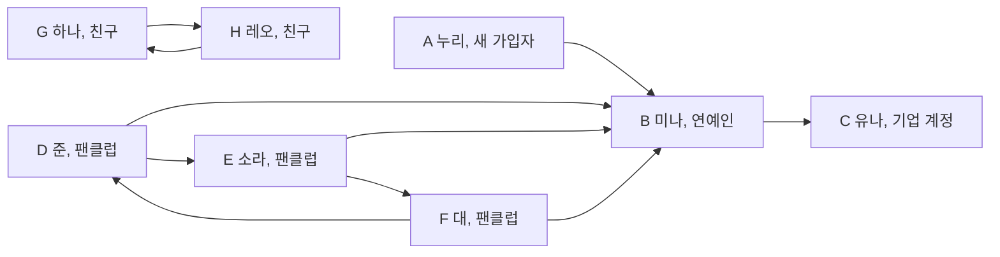

# 제3장. 여러 방향의 관계를 저장하기

## 논리적으로 생각해 보기

### 누가 누구를 팔로우하는지 어떻게 나타낼까?

소셜 네트워킹 서비스(SNS)에 새로 가입한 누리가 처음으로 유명인 미나를 팔로우한다고 생각해 보자. 준, 소라, 대는 이미 미나를 팔로우하고 있다. 미나는 유나 한 명을 팔로우하고, 유나는 아무도 팔로우하지 않는다. 계정마다 점을 하나씩 그리고 팔로우 관계마다 화살표를 하나씩 그려서 나타낸다.

화살표는 팔로우하는 계정에서 팔로우 대상 계정으로 향한다. 누리의 첫 팔로우를 추가한 `A -> B`은 누리가 미나를 팔로우한다는 뜻이다. 다음 그림은 이 팔로우를 추가한 뒤의 네트워크다.



그림에는 화살표 열 개가 있다. `A -> B`, `B -> C`, `D -> B`, `D -> E`, `E -> B`, `E -> F`, `F -> D`, `F -> B`, `G -> H`, `H -> G`이다.

### 팔로우 수와 팔로워 수는 어떻게 셀까?

누리에서 나가는 화살표는 `A -> B` 하나다. 따라서 누리의 팔로우 수는 1이다. 누리로 들어오는 화살표는 없으므로 팔로워 수는 0이다. 처음으로 누군가를 팔로우했다고 그 사람이 누리를 팔로우하는 것은 아니다.

미나로 들어오는 화살표는 준, 소라, 대, 누리에게서 온다. 미나의 팔로워 수는 4다. 미나에서 나가는 화살표는 유나를 향하는 `B -> C` 하나이므로 팔로우 수는 1이다.

유나에게는 미나에게서 들어오는 화살표 하나가 있고 나가는 화살표는 없다. 유나의 팔로워 수는 1이고 팔로우 수는 0이다. 아무도 팔로우하지 않는다는 것과 아무도 자신을 팔로우하지 않는다는 것은 다르다.

### 누리는 화살표를 따라 어디까지 갈 수 있을까?

누리는 미나를 팔로우하고, 미나는 유나를 팔로우한다. `A -> B -> C`을 따라가면 누리에서 미나를 거쳐 유나에 도달한다. 누리가 유나를 직접 팔로우하지 않아도 가능하다.

유나에게는 나가는 화살표가 없어 여기서 멈춘다. 미나나 유나에서 화살표를 따라 누리에게 돌아갈 수도 없다. 누리가 어떤 계정에 도달할 수 있어도 그 계정에서 누리에게 돌아올 수 있는 것은 아니다.

### 어떤 계정들이 연결되어 있을까?

이번에는 방향을 구분하지 않을 때 어떤 계정들이 연결되는지 알아보자. 누리의 첫 팔로우를 추가한 방향 그래프에서 여덟 계정의 위치와 연결을 그대로 둔다. 화살표 끝을 없애고, 하나와 레오 사이의 반대 방향 화살표 두 개는 선 하나로 합친다. 다음 아홉 개의 무방향 연결을 얻는다.

```text
A—B, B—C, B—D, B—E, B—F, D—E, D—F, E—F, G—H
```

### 무방향 그래프는 어떻게 저장할까?

소라에서 이동하려면 소라와 직접 연락하는 계정들을 알아야 한다.

```text
A 누리 : B
B 미나 : A, C, D, E, F
C 유나 : B
D 준   : B, E, F
E 소라 : B, D, F
F 대   : B, D, E
G 하나 : H
H 레오 : G
```

간선 하나를 양 끝 정점의 목록에 기록한다. `E—F`은 소라의 목록에 `F`, 대의 목록에 `E`를 넣는다. 두 항목은 같은 간선 번호를 가진다. 간선 아홉 개에는 항목 열여덟 개가 필요하다.

### 연결 요소를 모두 찾으려면 어떻게 할까?

누리(`A`)에서 시작하여 도달할 수 있는 모든 계정에 같은 번호를 붙이자. 방문했다는 표시가 없으면 `B—D—E—B`를 계속 돌 수 있다.

1. 모든 계정을 미방문 상태로 둔다. 알파벳순으로 가장 앞선 미방문 계정을 골라 새 연결 요소 번호를 붙인다.
2. 이웃을 알파벳순으로 확인한다. 미방문 이웃을 만나면 즉시 표시하고 같은 연결 요소 번호를 붙인다. 그 이웃을 대상으로 함수를 재귀 호출한다.
3. 호출한 함수가 이웃 쪽의 탐색을 모두 마치고 돌아온 뒤, 원래 계정의 나머지 이웃을 확인한다. 이미 표시한 이웃은 건너뛴다.
4. 시작 계정의 호출이 끝나면 다음 미방문 계정에서 새 연결 요소를 시작한다.

첫 연결 요소에서는 `A, B, C, D, E, F` 순서로 계정을 처음 발견한다. 다음은 `G`에서 시작하여 `H`를 발견한다. 미방문 계정이 없으므로 연결 요소는 두 개다. 고립 정점에서 시작한 호출은 바로 끝나지만 그 정점에도 연결 요소 번호를 붙인다.

### 어떤 계정이 사라지면 연결된 그룹이 나뉠까?

여기부터 분석과 C 예제에서는 숫자 배열 인덱스를 사용한다: `B 미나 = 0`, `D 준 = 1`, `E 소라 = 2`, `F 대 = 3`, `G 하나 = 4`, `H 레오 = 5`, `A 누리 = 6`, `C 유나 = 7`이다. 번호를 사용하는 탐색은 미나(`0`)에서 다시 시작하여 계정과 이웃을 인덱스 오름차순으로 방문한다. 이때 발견 순서는 `0, 1, 2, 3, 6, 7, 4, 5`다.

같은 연결 요소에 속해도 계정 하나가 사라지면 연결이 끊길 수 있다. 미나와 미나에 닿은 간선을 모두 지워 보자. 준, 소라, 대는 서로 연결되어 있지만 누리와 유나는 각각 고립된다. 하나와 레오는 그대로 연결되어 있으므로 전체 연결 요소 수는 두 개에서 네 개로 늘어난다. 소라나 대를 지우면 미나를 통해 원래 그룹의 나머지 계정들이 계속 연결된다.

삭제했을 때 그래프의 연결 요소 수가 증가하는 정점을 **단절점(cut vertex, cut node, articulation point)**이라고 한다. 예제의 단절점은 미나 `0` 하나다. 간선 `0—6`만 지워도 연결 요소 수가 증가한다. 이런 간선을 **브리지(bridge)**라고 한다. `0—7`과 `4—5`도 브리지다.

정점을 하나씩 지워 보며 매번 연결 요소를 구하면 같은 작업을 반복한다. 탐색한 가지에 다른 복귀 경로가 있는지 기록해 두자.

### dfn과 low에는 무엇을 기록할까?

숫자 배열 인덱스 순서의 탐색을 사용한다. 재귀 호출로 새 계정을 처음 발견하면 그 계정은 호출한 계정의 자식이 된다. 이런 최초 발견 연결만 모으면 연결 요소마다 트리가 생긴다. 나머지 간선은 자손과 먼저 발견한 조상을 연결할 수 있다.

계정을 처음 발견할 때마다 증가하는 번호를 붙인다. **`dfn[u]`**는 계정 `u`의 발견 번호다. **`low[u]`**는 `u`에서 최초 발견 연결을 따라 자손 방향으로 0번 이상 이동한 뒤, 조상으로 향하는 다른 간선을 최대 한 번 이용하여 도달할 수 있는 가장 작은 발견 번호다. 마지막 간선을 이용하지 않아도 된다. 다른 간선을 여러 번 이용한 경로는 `low`의 기준이 아니다.

처음에는 `low[u] = dfn[u]`로 둔다. 이웃 `v`를 확인할 때 다음 규칙을 적용한다.

- `u`에 들어올 때 사용한 간선은 건너뛴다. `parent_edge`로 같은 간선인지 확인한다. 반대쪽 목록 항목은 별도의 복귀 경로가 아니다.
- `v`가 미방문 정점이면 탐색을 마칠 때까지 기다린다. 돌아오면 `low[u] = min(low[u], low[v])`로 갱신한다.
- `v`가 먼저 발견한 조상이면 `low[u] = min(low[u], dfn[v])`로 갱신한다. 추가 간선 하나의 효과만 반영하므로 `low[v]`가 아닌 `dfn[v]`를 사용한다.

`2—0`과 `3—0`은 발견 번호 1에 도달한다. 호출이 돌아오면 이 값을 부모 쪽으로 전달한다. 누리와 유나에는 미나에게서 들어온 부모 간선만 있으므로 `low`는 각자의 발견 번호로 남는다.

| 계정 | `dfn` | 최종 `low` |
|---|---:|---:|
| 0 미나 | 1 | 1 |
| 1 준 | 2 | 1 |
| 2 소라 | 3 | 1 |
| 3 대 | 4 | 1 |
| 4 하나 | 7 | 7 |
| 5 레오 | 8 | 8 |
| 6 누리 | 5 | 5 |
| 7 유나 | 6 | 6 |

다음 연결 요소에서도 발견 번호를 이어서 붙인다. 방문 순서가 달라지면 번호는 바뀔 수 있지만 단절점은 바뀌지 않는다.

### 타잔 알고리즘은 단절점을 어떻게 찾을까?

자식의 탐색이 끝나면 그 자식의 `low`를 읽는다. 자식 쪽에서 부모보다 위로 돌아갈 수 있는지 알 수 있다. 발견 번호와 복귀 정보를 함께 사용하는 방법은 무방향 그래프의 블록을 구하는 **타잔 알고리즘(Tarjan's algorithm)**의 일부다.

시작 정점이 아닌 `u`에 대해 자식 `v`가 `low[v] >= dfn[u]`를 만족하면 `u`는 단절점이다. 자식 쪽은 돌아가도 `u`까지만 도달한다. `u`를 지우면 부모 쪽과 분리된다.

대가 소라로 돌아올 때는 `1 < 3`이고, 소라가 준으로 돌아올 때는 `1 < 2`다. 두 가지 모두 부모를 거치지 않고 미나에 도달하므로 소라와 준은 단절점이 아니다. 시작 정점이 아닌 정점의 판정에는 같은 경우도 포함한다. 부모까지만 돌아가는 길로는 그 부모의 삭제를 우회할 수 없기 때문이다.

시작 정점인 루트에는 부모 쪽이 없다. 루트가 새 자식을 둘 이상 발견했을 때만 단절점이다. 이웃 수가 아니라 처음 발견한 자식 수를 센다. 미나의 이웃은 다섯이지만 새 자식은 준, 누리, 유나 셋이다. 준의 호출에서 소라와 대도 발견한다. 따라서 미나는 단절점이다.

자식으로 향하는 간선이 브리지인 조건은 `low[v] > dfn[u]`다. 두 값이 같으면 그 간선 없이도 `u`로 돌아갈 수 있다. 따라서 `0—6`과 `0—7`은 브리지다. `0—1`은 `low[1] = dfn[0] = 1`이므로 브리지가 아니다.

### 이중 연결 블록은 어떻게 나눌까?

네 계정 `{0, 1, 2, 3}`은 모든 쌍이 직접 연결되어 있어 어느 하나를 지워도 남은 계정끼리 연결된다. 이런 성질을 유지하는 극대 부분을 구하자.

자기 내부에 단절점이 없는 극대 연결 부분 그래프를 **이중 연결 요소(biconnected component)**, 여기서는 **블록(block)**이라고 한다. 전체 그래프를 빠짐없이 나누기 위해 브리지와 양 끝 정점도 블록 하나로 둔다. 고립 정점도 단독 블록으로 둔다. 정점이 최소 세 개여야 한다는 정의에서는 더 큰 부분만 이중 연결이라고 부른다. 이 장의 블록 분해에는 간선 하나짜리 블록과 고립 정점 블록도 포함한다.

아직 블록을 정하지 않은 간선들을 배열에 모아 둔다. 새 자식에게 가는 간선은 재귀 호출 전에 배열 끝에 추가한다. 조상에게 가는 간선은 나중에 발견한 끝점에서 확인할 때 추가한다. 부모 간선의 반대쪽 항목과 나중에 발견한 자손으로 향하는 항목은 추가하지 않는다.

자식 `v`의 호출이 돌아왔을 때 `low[v] >= dfn[u]`이면 배열 끝에서 간선을 하나씩 꺼낸다. 최초 발견 간선 `u—v`까지 포함하여 꺼낸 간선들과 그 끝점이 블록 하나를 이룬다. 루트가 단절점이 아니어도 이 경계 규칙은 똑같이 적용한다.

예제에서는 다음 순서로 블록이 완성된다.

| 블록 | 정점 | 간선 |
|---|---|---|
| B1 | `{0, 1, 2, 3}` | `0—1, 0—2, 0—3, 1—2, 1—3, 2—3` |
| B2 | `{0, 6}` | `0—6` |
| B3 | `{0, 7}` | `0—7` |
| B4 | `{4, 5}` | `4—5` |

모든 간선은 정확히 한 블록에 속한다. 단절점은 여러 블록에 속한다. 최초 발견 간선과 조상 간선을 구분하는 규칙 없이 간선만 모아서는 올바른 블록을 얻을 수 없다.

### 블록들은 어떻게 트리를 이룰까?

블록 내부의 간선을 접어 두고 블록끼리 만나는 위치를 나타내자. 블록마다 노드를 하나 만든다. 단절점마다 별도의 노드를 만든다. 단절점이 블록에 속할 때만 그 두 노드를 연결한다.

연결 요소 하나에 대해 만든 구조를 **블록-단절점 트리(block-cut tree)**라고 한다. 예제의 결과는 다음과 같다.

```text
B1 — C0 — B3       B4
      |
      B2
```

`C0`는 B1, B2, B3가 함께 포함하는 미나다. 단절점이 아닌 정점들은 해당 블록 노드 안에 남는다. B4는 노드 하나인 트리를 이룬다. 원래 그래프가 연결되어 있지 않으면 여러 트리의 모음인 **포리스트(forest)**를 얻는다. 고립 정점 블록도 혼자 트리 하나가 된다.

최초 발견 트리는 계정을 어떤 순서로 탐색했는지 기록한다. 블록-단절점 트리는 블록들이 어떤 단절점을 공유하는지 기록한다. 두 트리의 노드는 서로 다른 대상을 나타낸다.

### 그래프는 어떤 조건을 지켜야 할까?

연락 간선의 양쪽 항목이 일치해야 올바르게 분석할 수 있다. 구현은 정점 16개와 간선 120개를 위한 자리를 확보한다. 정점 16개에서 서로 다른 모든 쌍을 연결할 수 있는 간선 수다.

- 현재 사용하는 정점 번호는 `0`부터 연속된다. 사용하지 않는 자리는 고립 정점이 아니다.
- 간선은 서로 다른 사용 중 정점 둘을 연결한다. 자기 자신으로 가는 간선과 중복 쌍은 넣지 않는다.
- 각 간선 번호는 양 끝 정점의 인접 항목에 한 번씩, 정확히 두 번 나타난다.
- 모든 목록은 `-1`에서 끝난다. 입력과 남은 용량을 확인한 뒤 양쪽 항목을 함께 추가한다.
- 추가 요청을 거절하면 그래프를 바꾸지 않는다. 중복 요청은 거절하며 기존 간선 하나를 유지한다.

예제는 정점 여덟 개와 간선 아홉 개를 사용한다. 연락 여부만 저장하며 간선에 수치 가중치를 두지 않는다.

## 효율 계산해 보기

### 연결 요소를 모두 찾는 데 얼마나 많은 작업이 필요할까?

예제에서는 계정 여덟 개를 표시하고 이웃 항목 열여덟 개를 확인한다. 일반적으로 사용 중 정점 `V`개와 인접 항목 `2E`개를 처리한다. 방문 표시의 초기화와 다음 시작점을 찾는 반복문도 정점 `V`개를 확인한다. 전체 시간은 `O(V + E)`다.

### 타잔 알고리즘은 얼마나 많은 작업이 필요할까?

같은 여덟 계정과 열여덟 항목에서 발견 번호와 복귀 정보를 구한다. 각 간선은 대기 배열에 한 번 들어갔다가 한 번 나온다. 블록별로 정점 표시를 사용하면 같은 끝점을 반복 출력하지 않고 블록의 소속 정점과 블록-단절점 포리스트를 만들 수 있다. 전체 작업량은 출력까지 포함하여 `O(V + E)`다. 정점을 하나씩 삭제해 볼 필요가 없다.

### 간선을 저장하거나 추가하는 데 얼마나 많은 작업이 필요할까?

완성된 인접 리스트를 읽는 작업은 `O(V + E)`다. `u—v`를 추가할 때는 먼저 `u`의 목록에서 중복을 찾고 양쪽 목록에서 번호순으로 넣을 위치를 찾는다. 정점에 닿은 간선 수를 **차수(degree)**라고 한다. 양 끝점의 차수가 `d(u)`, `d(v)`라면 `O(1 + d(u) + d(v))`가 든다. 위치를 찾은 뒤 항목 두 개를 채우는 작업량은 일정하다. 검사를 거쳐 간선을 반복 추가하는 구축 과정은 선형 분석 과정과 별개이며, 전체 구축 시간이 항상 선형인 것은 아니다.

### 확보한 메모리와 실제 사용하는 메모리는 얼마나 될까?

그래프는 정점 용량 `M = 16`과 간선 용량 `L = 120`을 확보한다. 인접 항목 용량은 `2L = 240`이다. 분석과 결과 배열도 `M + L`에 비례하는 고정 공간을 확보한다. 따라서 확보 공간은 점유 상태와 관계없이 `O(M + L)`이다. 예제에서 실제 사용하는 정점은 여덟 개이고 인접 항목은 열여덟 개다.

입력 크기에 맞춰 배열을 확보한다면 그래프, 분석 기록, 대기 간선, 결과의 공간은 `O(V + E)`다. 재귀 호출은 추가로 최대 `O(V)` 공간을 사용한다. 코드는 사용 중인 분석 항목을 `O(V + E)` 시간에 초기화한다. 배열 용량이 크더라도 사용하지 않는 자리가 정점이 되는 것은 아니다.

## 용어 정리

다음 이름은 연락 그래프와 그래프를 나누는 기록을 가리킨다.

| 용어 | 의미 |
|---|---|
| 정점 / 간선 | 대상 하나 / 직접적인 관계 하나. |
| 방향 / 무방향 그래프 | 간선에 방향이 있는 그래프 / 양방향으로 이용하는 그래프. |
| 인접 리스트 | 정점마다 직접 연결된 이웃을 모은 목록. |
| 차수 | 이 단순 무방향 그래프에서 한 정점에 닿은 간선 수. |
| 연결 요소 | 경로로 연결된 정점들의 극대 그룹. |
| 단절점 / 브리지 | 삭제했을 때 연결 요소 수를 늘리는 정점 / 간선. |
| 최초 발견 트리 | 새 정점을 발견할 때 생긴 부모-자식 연결. |
| `dfn` / `low` | 발견 번호 / 자손 방향 이동과 조상 간선 규칙으로 얻은 최소 발견 번호. |
| 블록 | 내부 단절점이 없는 극대 연결 부분. 여기서는 브리지와 고립 정점도 포함한다. |
| 블록-단절점 트리 | 블록과 그 블록에 속한 단절점을 연결한 트리. |
| 포리스트 | 서로 떨어진 트리들의 모음. |

참고 자료: [알고리즘](https://www.cs.cmu.edu/~15451-s15/LectureNotes/lecture08.pdf), [블록 정의](https://www.math.tugraz.at/~cela/Vorlesungen/AlgGrTheo24/Connectivity_H.pdf), [간선 분할과 비용](https://www.boost.org/doc/libs/1_86_0/libs/graph/doc/biconnected_components.html).

## 코딩 계획

프로그램은 연락 그래프를 만들고 연결 요소 번호를 붙인 뒤 블록을 구한다.

1. 정점, 간선 번호, 양쪽 인접 항목을 위한 고정 배열을 정의한다.
2. 그래프를 초기화한다. 주어진 순서대로 연락 간선 아홉 개를 검사하고 추가한다.
3. 이웃을 탐색하기 전에 새 계정을 표시한다. 모든 미방문 계정에서 다시 시작하여 `component` 번호를 붙인다.
4. 재귀 탐색 중 `dfn`과 `low`를 구한다. `parent_edge`와 새 자식 수를 기록한다.
5. 일반 정점과 루트의 규칙에 따라 `cut`을 표시한다. 호출이 돌아올 때 경계 조건에 따라 대기 간선을 블록으로 나눈다.
6. 고립 정점을 단독 블록으로 만든다. 블록과 소속 단절점을 연결하고 결과를 출력한다.

## C 코드

다음 C 코드 여덟 블록을 순서대로 이어 붙이면 완전한 C11 프로그램 하나가 됩니다. 앞 블록의 함수를 뒤 블록에서 사용합니다.

### 간선과 분석 기록 저장하기

무방향 간선 하나에는 같은 간선 번호를 가진 이웃 항목 두 개가 필요합니다. `typedef`는 구조체에 `Neighbor`라는 짧은 이름을 붙입니다. `next`는 다음 항목의 배열 번호이고, `head[u]`는 계정 `u`의 첫 항목 번호입니다. `-1`은 항목이 없다는 뜻입니다. 아래 함수들은 이 배열들을 함께 사용합니다.

`pending`에는 블록이 아직 정해지지 않은 간선을 둡니다. `block_vertex`와 `block_edge`에는 모든 블록의 정점과 간선을 연속해서 기록합니다. 블록 `b`의 정점 범위는 `block_vertex_start[b]`부터 `block_vertex_start[b + 1]` 직전까지입니다. 간선도 같은 방식입니다. 경계 배열의 마지막 항목에는 전체 끝 위치를 기록합니다. 정점 하나가 여러 블록에 속할 수 있으므로 소속 항목은 최대 `2 * MAX_EDGES + MAX_VERTICES`개를 확보합니다. `in_block[u]`에는 정점 `u`를 마지막으로 넣은 블록 번호를 둡니다.

```c
#include <stdio.h>

#define MAX_VERTICES 16
#define MAX_EDGES 120
#define MAX_BLOCKS (MAX_EDGES + MAX_VERTICES)
#define MAX_MEMBERS (2 * MAX_EDGES + MAX_VERTICES)

typedef struct {
    int to, edge, next;
} Neighbor;

int vertex_count, edge_count, entry_count;
int head[MAX_VERTICES], edge_u[MAX_EDGES], edge_v[MAX_EDGES];
Neighbor neighbor[2 * MAX_EDGES];
const char *name[MAX_VERTICES];

int dfn[MAX_VERTICES], low[MAX_VERTICES], component[MAX_VERTICES];
int cut[MAX_VERTICES], clock_value, component_count;
int pending[MAX_EDGES], pending_count;
int block_count, member_count, block_edge_count;
int block_vertex[MAX_MEMBERS], block_edge[MAX_EDGES];
int block_vertex_start[MAX_BLOCKS + 1], block_edge_start[MAX_BLOCKS + 1];
int in_block[MAX_VERTICES];
```

### 사용할 계정 초기화하기

간선을 추가하기 전에 그래프를 초기화합니다. 호출하는 쪽에서 사용 중인 계정마다 올바른 이름을 하나씩 전달합니다. 각 목록의 시작을 `-1`로 둡니다. 자리 16개를 확보해도 계정 16개를 사용하는 것은 아닙니다. 분석 기록은 `analyze`에서 따로 초기화합니다.

```c
int initialize(int count, const char *labels[]) {
    if (count < 0 || count > MAX_VERTICES) return 0;
    vertex_count = count;
    edge_count = entry_count = 0;
    for (int u = 0; u < count; ++u) {
        head[u] = -1;
        name[u] = labels[u];
    }
    return 1;
}
```

### 간선 하나의 양쪽 항목 추가하기

사용하지 않는 끝점, 자기 자신과의 연결, 중복 간선, 용량 초과는 저장 내용을 바꾸기 전에 거절합니다. 중복 요청은 0을 반환하고 기존 간선을 유지합니다. 성공한 추가 요청은 항목 두 개를 만듭니다.

`link`는 바꿔야 할 정수 칸을 가리킵니다. 처음에는 `head[from]`, 이후에는 앞 항목의 `next`입니다. `&`는 그 칸의 주소를 구하고 `*link`는 그 칸의 정수를 읽거나 바꿉니다. 번호순으로 넣을 위치에서 멈춥니다. 새 항목에 기존 다음 번호를 넣은 뒤 `*link`를 새 항목 번호로 바꿉니다. `(Neighbor){...}`는 나열된 세 값을 가진 구조체 값 하나를 만듭니다.

```c
/* Keep each account's neighbors in ascending account-ID order. */
void insert_neighbor(int from, int to, int edge) {
    int *link = &head[from];
    while (*link != -1 && neighbor[*link].to < to)
        link = &neighbor[*link].next;
    neighbor[entry_count] = (Neighbor){to, edge, *link};
    *link = entry_count++;
}

/* One undirected edge receives two neighbor entries with one shared ID. */
int add_edge(int u, int v) {
    if (u < 0 || v < 0 || u >= vertex_count || v >= vertex_count || u == v)
        return 0;
    for (int p = head[u]; p != -1; p = neighbor[p].next)
        if (neighbor[p].to == v) return 0;
    if (edge_count == MAX_EDGES) return 0;
    int edge = edge_count++;
    edge_u[edge] = u;
    edge_v[edge] = v;
    insert_neighbor(u, v, edge);
    insert_neighbor(v, u, edge);
    return 1;
}
```

### 블록 하나 완성하기

끝점의 `in_block` 표시가 현재 블록 번호와 다를 때만 정점을 추가합니다. 블록 전체를 다시 훑어 중복을 찾지 않아도 됩니다. 블록을 완성할 때는 보류 배열 끝에서 간선을 꺼내며, 자식 가지를 연 간선까지 포함합니다. 간선 번호와 끝점을 저장한 다음 끝 위치를 기록합니다. `--pending_count`는 개수를 먼저 줄인 뒤 이전 마지막 항목을 읽게 합니다.

```c
void add_block_vertex(int u) {
    if (in_block[u] == block_count) return;
    in_block[u] = block_count;
    block_vertex[member_count++] = u;
}

/* The next block begins immediately after this block's entries. */
void close_block(void) {
    ++block_count;
    block_vertex_start[block_count] = member_count;
    block_edge_start[block_count] = block_edge_count;
}

/* Read pending edges backward through the edge that opened this block. */
void finish_block(int opening_edge) {
    int edge;
    do {
        edge = pending[--pending_count];
        block_edge[block_edge_count++] = edge;
        add_block_vertex(edge_u[edge]);
        add_block_vertex(edge_v[edge]);
    } while (edge != opening_edge);
    close_block();
}
```

### 가지를 탐색하고 돌아오기

첫 방문에서 두 번호와 현재 연결 요소 번호를 기록합니다. 반복문은 도착에 사용한 간선을 건너뜁니다. 새 이웃의 재귀 호출이 그 가지를 끝내야 현재 반복문이 계속됩니다. 돌아오면 `low`를 갱신하고 블록 경계를 확인합니다. 먼저 방문한 조상과 이어진 간선에는 그 조상의 `dfn`을 사용합니다.

시작 정점이 아닌 정점과 시작 정점의 단절점 판정은 나뉩니다. 준에서 미나로 돌아오면 B1, 누리에서 돌아오면 B2, 유나에서 돌아오면 B3을 완성합니다. 모든 이웃을 확인한 뒤 새 자식이 셋이므로 미나를 단절점으로 표시합니다. 자식이 하나뿐인 시작 정점도 단절점은 아니지만 블록을 꺼내는 규칙은 똑같이 적용합니다.

```c
void explore(int u, int parent_edge) {
    dfn[u] = low[u] = ++clock_value;
    component[u] = component_count;
    int children = 0;

    for (int p = head[u]; p != -1; p = neighbor[p].next) {
        int v = neighbor[p].to;
        int edge = neighbor[p].edge;
        if (edge == parent_edge) continue;

        if (dfn[v] == 0) {
            ++children;
            pending[pending_count++] = edge;
            explore(v, edge);
            if (low[v] < low[u]) low[u] = low[v];

            if (low[v] >= dfn[u]) {
                if (parent_edge != -1) cut[u] = 1;
                finish_block(edge);
            }
        } else if (dfn[v] < dfn[u]) {
            /* Record this earlier connection once, from its later end. */
            pending[pending_count++] = edge;
            if (dfn[v] < low[u]) low[u] = dfn[v];
        }
    }
    if (parent_edge == -1 && children > 1) cut[u] = 1;
}
```

### 미방문 연결 요소에서 다시 시작하기

저장한 그래프를 다시 분석할 수 있도록 분석 기록을 초기화합니다. `in_block`을 `-1`로 두어 아직 어떤 계정도 블록 0에 넣지 않았음을 표시합니다. 사용 중인 모든 계정을 살피고 `dfn`이 0인 곳에서 새 연결 요소를 시작합니다. 고립 정점에는 연결 요소 하나와 단독 블록 하나를 부여합니다. 이 블록의 간선 범위는 비어 있습니다.

```c
void analyze(void) {
    clock_value = component_count = pending_count = block_count = 0;
    member_count = block_edge_count = 0;
    block_vertex_start[0] = block_edge_start[0] = 0;
    for (int u = 0; u < vertex_count; ++u) {
        dfn[u] = low[u] = component[u] = cut[u] = 0;
        in_block[u] = -1;
    }

    for (int u = 0; u < vertex_count; ++u) {
        if (dfn[u] != 0) continue;
        ++component_count;
        explore(u, -1);
        /* Convention: an isolated account is a singleton block. */
        if (head[u] == -1) {
            add_block_vertex(u);
            close_block();
        }
    }
}
```

### 블록과 단절점 사이의 연결 출력하기

블록마다 모든 간선을 다시 훑지 않고 저장한 범위를 출력합니다. 각 블록의 소속 정점 중 단절점으로 표시된 정점만 블록-단절점 연결로 출력합니다. 그런 연결이 없는 블록은 노드 하나인 트리입니다. 소속 정점은 추출한 순서로 출력하므로 앞의 집합 표와 나열 순서가 달라도 같은 블록입니다.

```c
void print_results(void) {
    printf("Connected components: %d\n", component_count);
    puts("Account  component  dfn  low  cut");
    for (int u = 0; u < vertex_count; ++u)
        printf("%-7s  %9d  %3d  %3d  %s\n", name[u], component[u],
               dfn[u], low[u], cut[u] ? "yes" : "no");

    puts("\nBlocks (vertices; edges):");
    for (int block = 0; block < block_count; ++block) {
        printf("B%d:", block + 1);
        for (int i = block_vertex_start[block]; i < block_vertex_start[block + 1]; ++i)
            printf(" %s", name[block_vertex[i]]);
        printf(" ;");
        for (int i = block_edge_start[block]; i < block_edge_start[block + 1]; ++i) {
            int edge = block_edge[i];
            printf(" %s--%s", name[edge_u[edge]], name[edge_v[edge]]);
        }
        if (block_edge_start[block] == block_edge_start[block + 1]) printf(" (no edges)");
        putchar('\n');
    }

    puts("\nBlock-cut forest (block -- cut account):");
    for (int block = 0; block < block_count; ++block) {
        int links = 0;
        for (int i = block_vertex_start[block]; i < block_vertex_start[block + 1]; ++i) {
            int u = block_vertex[i];
            if (!cut[u]) continue;
            printf("B%d -- %s\n", block + 1, name[u]);
            ++links;
        }
        if (links == 0) printf("B%d (standalone block node)\n", block + 1);
    }
}
```

### 연락 그래프 예제 실행하기

입력에는 본문에서 사용한 무방향 간선 아홉 개가 들어 있습니다. 간선을 추가한 다음 그래프를 분석하고 기록을 출력합니다. 고정 배열만 사용하므로 동적 메모리 할당이나 해제가 필요하지 않습니다.

```c
int main(void) {
    const char *labels[] = {"Mina", "Joon", "Sora", "Dae", "Hana", "Leo", "Nuri", "Yuna"};
    const int edges[][2] = {{0, 1}, {0, 2}, {0, 3}, {0, 6}, {0, 7},
                            {1, 2}, {1, 3}, {2, 3}, {4, 5}};
    if (!initialize(8, labels)) return 1;
    for (unsigned int i = 0; i < sizeof edges / sizeof edges[0]; ++i) {
        if (!add_edge(edges[i][0], edges[i][1])) {
            fputs("Invalid edge.\n", stderr);
            return 1;
        }
    }
    analyze();
    print_results();
    return 0;
}
```

출력은 다음과 같습니다:

```text
Connected components: 2
Account  component  dfn  low  cut
Mina             1    1    1  yes
Joon             1    2    1  no
Sora             1    3    1  no
Dae              1    4    1  no
Hana             2    7    7  no
Leo              2    8    8  no
Nuri             1    5    5  no
Yuna             1    6    6  no

Blocks (vertices; edges):
B1: Joon Dae Mina Sora ; Joon--Dae Mina--Dae Sora--Dae Mina--Sora Joon--Sora Mina--Joon
B2: Mina Nuri ; Mina--Nuri
B3: Mina Yuna ; Mina--Yuna
B4: Hana Leo ; Hana--Leo

Block-cut forest (block -- cut account):
B1 -- Mina
B2 -- Mina
B3 -- Mina
B4 (standalone block node)
```
