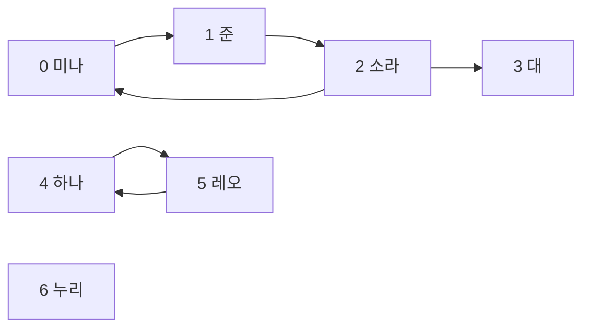

# 제3장. 여러 방향의 관계를 저장하기

## 논리적으로 생각해 보기

### 누가 누구를 팔로우하는지 어떻게 나타낼까?

소셜 네트워킹 서비스(SNS)에서는 한 계정이 여러 계정을 팔로우할 수 있다. 여러 계정이 같은 사람을 팔로우할 수도 있다. 팔로우 관계를 따라가다가 원래 계정으로 돌아올 수도 있다. 트리는 자식을 공유하거나 순환하는 구조를 허용하지 않으므로 이런 관계를 모두 나타낼 수 없다.

두 가지 관계를 모두 허용하는 모델이 필요하다. 계정마다 점을 하나씩 그린다. 팔로우 관계마다 화살표를 하나씩 그린다. 이런 모델을 **그래프(graph)**라고 한다. 각 계정은 **정점(vertex)**이다. 직접적인 팔로우 관계 하나는 **간선(edge)**이다.

### 어떤 계정들을 예제로 사용할까?

이 장에서는 다음 일곱 계정을 끝까지 사용한다. 번호는 계정을 구별한다. 인기나 우선순위를 나타내지 않는다.

| 계정 번호 | 이름 | 이 사람이 팔로우하는 계정 |
|---|---|---|
| 0 | 미나 | 준 (1) |
| 1 | 준 | 소라 (2) |
| 2 | 소라 | 미나 (0), 대 (3) |
| 3 | 대 | 없음 |
| 4 | 하나 | 레오 (5) |
| 5 | 레오 | 하나 (4) |
| 6 | 누리 | 없음 |

화살표는 **팔로우하는 계정에서 팔로우 대상 계정으로** 향한다. 예를 들어 `0 -> 1`은 미나가 준을 팔로우한다는 뜻이다.



그림을 글로 나타내면 다음과 같다. 전체 간선은 `0 -> 1`, `1 -> 2`, `2 -> 0`, `2 -> 3`, `4 -> 5`, `5 -> 4`이다. 누리에게 닿는 화살표는 없지만, 누리도 그래프에 포함된 계정이다.

### 방향은 왜 중요할까?

미나는 준을 팔로우한다. 준은 미나를 직접 팔로우하지 않는다. 두 관계는 서로 별개다. 간선의 출발 계정과 도착 계정을 구별하는 그래프를 **방향 그래프(directed graph)**라고 한다.

하나와 레오는 서로를 팔로우한다. 간선 `4 -> 5`와 `5 -> 4`를 각각 기록한다. 한쪽의 팔로우를 취소해도 반대쪽 팔로우는 남는다.

관계에 방향이 없다면 화살표 없는 선을 그린다. 이런 모델은 **무방향 그래프(undirected graph)**이다. 이 장의 팔로우 네트워크는 방향 그래프이다.

### 팔로우 수와 팔로워 수는 어떻게 셀까?

소라가 팔로우하는 계정 수를 알려면 소라에서 나가는 화살표를 센다. `2 -> 0`과 `2 -> 3`으로 두 개다. 이 수를 **진출 차수(out-degree)**라고 한다.

소라의 팔로워 수를 알려면 소라로 들어오는 화살표를 센다. `1 -> 2`로 한 개다. 이 수를 **진입 차수(in-degree)**라고 한다. 차수는 직접 연결된 간선의 수를 센다. 네트워크를 거쳐 갈 수 있는 모든 경로의 수를 세는 것은 아니다.

대의 진출 차수는 0이고 진입 차수는 1이다. 누리는 두 차수가 모두 0이다. 들어오는 간선과 나가는 간선이 모두 없는 계정을 **고립 정점(isolated vertex)**이라고 한다. 소라가 대를 팔로우하므로 대는 고립 정점이 아니다.

### 여러 화살표를 따라가면 무엇을 알 수 있을까?

미나는 준을 팔로우하고, 준은 소라를 팔로우한다. `0 -> 1 -> 2`를 따라가면 미나에서 소라에 도달한다. 정점을 반복하지 않고 간선으로 이어지는 정점들의 나열을 **경로(path)**라고 한다. 방향 그래프의 경로에서는 모든 화살표를 지정된 방향으로 따라간다.

소라는 미나를 팔로우한다. 따라서 `0 -> 1 -> 2 -> 0`을 따라가면 출발 계정으로 돌아온다. 출발점을 제외한 정점을 반복하지 않고 간선을 따라 출발점으로 돌아오는 구조를 **순환(cycle)**이라고 한다. 그래프에서는 이런 순환을 허용한다.

`0 -> 1 -> 2 -> 3`을 따라가면 미나에서 대에 도달한다. 대에게는 나가는 간선이 없다. 따라서 대에서 미나로 돌아가는 방향 경로는 없다. 한 방향으로 도달할 수 있다고 해서 반대 방향으로도 도달할 수 있는 것은 아니다.

팔로우 경로는 여러 관계가 이어져 있음을 나타낸다. 경로가 있다고 대의 게시물이 미나의 피드에 자동으로 나타나지는 않는다. 화살표는 누가 누구를 팔로우하는지 기록한다. 게시물이 전달되는 방향을 기록하지 않는다. 미나가 준을 팔로우하므로 준의 게시물이 미나의 피드에 나타날 수 있다.

### 어떤 계정들이 하나의 연결된 그룹에 속할까?

경로 하나를 보면 한 계정에서 다른 계정에 도달할 수 있는지 알 수 있다. 이제 네트워크 전체를 그룹으로 나누려 한다. 먼저 화살표의 방향을 따질지 정해야 한다.

각 화살표를 잠시 양쪽으로 따라갈 수 있는 선으로 생각해 보자. 미나에서 출발하면 준, 소라, 대에 도달할 수 있다. 같은 방법으로 하나, 레오, 누리에는 도달할 수 없다. 이 규칙에 따라 미나, 준, 소라, 대가 하나의 연결된 그룹을 이룬다.

무방향 그래프에서 이런 그룹을 **연결 요소(connected component)**라고 한다. 그룹 안의 모든 정점 쌍은 경로로 이어져 있다. 이 성질을 유지하면서 그룹에 넣을 수 있는 정점을 모두 포함한다. 더는 확장할 수 없는 이런 상태를 **극대(maximal)**라고 한다. 극대는 그래프 전체에서 크기가 가장 크다는 뜻이 아니다. 따로 떨어진 작은 그룹도 연결 요소가 된다.

방향 그래프에서 화살표 방향을 무시하고 구한 연결 요소를 **약한 연결 요소(weakly connected component)**라고 한다. 이 네트워크에는 세 개가 있다.

| 약한 연결 요소 | 같은 그룹에 속하는 이유 |
|---|---|
| {미나, 준, 소라, 대} = {0, 1, 2, 3} | 방향을 무시하면 순환과 소라가 대를 팔로우하는 관계가 네 계정을 모두 연결한다. |
| {하나, 레오} = {4, 5} | 서로 팔로우하지만 첫 번째 그룹과 연결되는 간선은 없다. |
| {누리} = {6} | 누리를 다른 계정과 연결하는 간선이 없다. |

방향을 무시하는 것은 분석할 때 적용하는 규칙이다. 대가 소라를 팔로우하는 관계를 추가하지 않는다. 저장된 그래프도 바꾸지 않는다.

### 화살표 방향을 지켜도 서로 도달할 수 있을까?

첫 번째 약한 연결 요소에는 대가 포함된다. 하지만 대에서는 다른 누구에게도 돌아가는 경로가 없다. 양방향 도달 가능성이 중요하다면 더 엄격한 규칙이 필요하다.

그룹 안의 각 계정에서 같은 그룹의 다른 모든 계정으로 가는 방향 경로가 있어야 한다. 같은 그룹의 모든 계정과 서로 도달할 수 있는 계정을 빠짐없이 포함한다. 이런 극대 그룹을 **강한 연결 요소(strongly connected component)**라고 한다.

미나는 준을 거쳐 소라에 도달한다. 경로는 `0 -> 1 -> 2`이다. 소라는 미나를 거쳐 준에 도달한다. 경로는 `2 -> 0 -> 1`이다. 준은 소라를 거쳐 미나에 도달한다. 경로는 `1 -> 2 -> 0`이다. 순환 덕분에 세 계정은 모두 서로에게 도달할 수 있다.

이 네트워크에는 강한 연결 요소가 네 개 있다.

| 강한 연결 요소 | 그룹을 더 확장할 수 없는 이유 |
|---|---|
| {미나, 준, 소라} = {0, 1, 2} | 세 계정은 모두 서로에게 도달할 수 있다. 대에서는 이들에게 돌아올 수 없다. |
| {대} = {3} | 대에서는 다른 계정에 도달할 수 없다. |
| {하나, 레오} = {4, 5} | 서로에게 도달할 수 있다. 둘 다 다른 그룹에는 도달할 수 없다. |
| {누리} = {6} | 누리에서 다른 계정으로 가는 경로가 없다. |

간선을 하나도 지나지 않아도 계정은 자기 자신에 도달한다. 따라서 자신을 팔로우하지 않아도 계정 하나가 강한 연결 요소를 이룰 수 있다. 정점 하나인 강한 연결 요소가 반드시 고립 정점인 것은 아니다. 대에게는 여전히 들어오는 간선이 있다.

강하게 연결되려면 모든 계정 쌍이 서로를 직접 팔로우해야 하는 것은 아니다. 미나, 준, 소라는 경로를 통해 규칙을 만족한다. 이 그룹은 극대이기도 하다. 소라까지 같은 그룹에 포함해야 하므로 `{미나, 준}`만으로는 하나의 연결 요소가 되지 않는다.

각 계정은 정확히 하나의 강한 연결 요소와 하나의 약한 연결 요소에 속한다. 강한 연결 요소 하나는 항상 약한 연결 요소 하나에 완전히 포함된다. 첫 번째 약한 연결 요소 안에는 강한 연결 요소 `{0, 1, 2}`와 `{3}`이 있다. 이 구분은 [스탠퍼드 그래프 강의 노트의 방향 그래프 연결성 정의](https://stanford-cs161.github.io/winter2022/assets/files/lecture10-notes.pdf)를 따른다.

### 연결 요소를 피드 구성에 어떻게 활용할까?

피드는 선택한 게시물을 순서대로 보여 준다. 어떤 계정들이 연결되어 있는지 알면 검토할 게시물을 고르는 데 도움이 된다. 그중 어떤 게시물이 사용자에게 가장 적합한지 결정하려면 별도의 규칙이 필요하다.

두 단계로 이루어진 학습용 설계를 생각해 보자. 먼저 **후보 게시물(candidate post)**을 모은다. 후보 게시물은 피드에 표시할 조건을 만족하여 검토 대상이 된 게시물이다. 다음으로 후보에 점수를 매기고 순서를 정한다. 이 과정을 **순위 결정(ranking)**이라고 한다. 실제 피드 시스템도 후보 수집과 순위 결정을 나눌 수 있다. [메타의 2021년 뉴스피드 설명](https://engineering.fb.com/2021/01/26/core-infra/news-feed-ranking/)이 한 예다. 아래의 연결 요소 규칙은 이 장의 네트워크를 위한 가상 설계이다. 특정 SNS가 이 규칙을 사용한다는 뜻은 아니다.

처음의 일곱 계정 그래프에서 미나의 피드 후보를 다음과 같이 고를 수 있다.

| 후보를 가져올 계정 | 미나의 경우 | 활용 방법 |
|---|---|---|
| 미나가 직접 팔로우하는 계정 | 준 | 팔로우한 계정의 게시물을 보여 주는 피드 영역에 넣을 후보를 모은다. |
| 미나와 같은 강한 연결 요소의 다른 계정 | 소라 | 양방향으로 경로가 있는 계정의 게시물을 추가로 검토한다. |
| 같은 약한 연결 요소에 있지만 강한 연결 요소는 다른 계정 | 대 | 소라를 통해 더 넓게 연결된 계정의 게시물을 탐색한다. |
| 미나의 약한 연결 요소 밖에 있는 계정 | 하나, 레오, 누리 | 관심사 등의 정보를 이용해 표시 조건을 만족하는 공개 게시물을 검토한다. |

후보를 모은 뒤에는 중복 게시물을 제거한다. 미나의 관심사와의 관련성, 최근 상호작용, 게시물이 얼마나 최근에 올라왔는지 등의 정보를 이용해 순위를 정한다. 어느 연결 요소에 속하는지도 하나의 판단 정보로 쓸 수 있다. 하지만 소속 정보만으로 어떤 게시물을 먼저 보여 줄지는 정할 수 없다.

작은 예를 들어 보자. 소라와 대가 표시 조건을 만족하는 공개 게시물을 하나씩 올렸다고 가정한다. 연결 요소 규칙에 따라 두 게시물을 모두 미나의 후보 목록에 넣는다. 미나가 대의 게시물 주제에 관심을 보였다면 순위 결정 규칙은 대의 게시물을 먼저 배치할 수 있다. 대가 미나의 강한 연결 요소 밖에 있어도 가능하다.

하나의 강한 연결 요소에서 가져온 추천 게시물이 연속으로 나오는 횟수를 제한할 수도 있다. 대신 다른 그룹의 후보를 시도한다. 이렇게 하면 피드에 등장하는 그래프 그룹의 구성이 달라진다. 서로 다른 주제나 관점까지 보장되는 것은 아니다.

이 설계에서 연결 요소를 사용할 때는 다음을 구별해야 한다.

- 한 계정이 다른 계정을 직접 팔로우하더라도 두 계정은 서로 다른 강한 연결 요소에 속할 수 있다. 소라는 대를 팔로우한다. 소라의 피드를 소라의 강한 연결 요소로만 제한하면 직접 팔로우한 계정의 게시물을 제외하게 된다.
- 약한 연결 요소는 매우 커질 수 있다. 팔로우 하나가 이전에 분리되어 있던 두 약한 연결 요소를 합칠 수 있다. 같은 연결 요소에 속한다고 관심사가 같거나 가까운 사회적 집단을 이루는 것은 아니다.
- 누리에게는 팔로우 연결이 없다. 누리에게 유용한 피드를 만들려면 누리가 직접 고른 관심사 같은 다른 정보가 필요하다. 피드가 비어 있을 필요는 없다.
- 경로나 연결 요소가 게시물을 볼 권한을 부여하지는 않는다. 후보를 고를 때는 공개 범위, 차단 관계, 그 밖의 피드 표시 조건을 지켜야 한다.

그래프는 계정 사이의 관계를 저장한다. 게시물, 관심사, 상호작용 이력, 순위 점수에는 별도의 데이터가 필요하다. 이 장에서는 작은 예제를 직접 따라가며 연결 요소의 활용 가능성을 설명한다. 연결 요소를 찾는 알고리즘과 피드 시스템의 구현은 C 실습 범위에 포함하지 않는다.

### 팔로우 네트워크는 어떻게 저장할까?

“소라가 대를 팔로우하는가?”와 같은 직접적인 질문에 답해야 한다. 계정에 번호를 붙이면 각 답을 표에 저장할 수 있다. 팔로우하는 계정의 번호를 행으로 사용한다. 팔로우 대상 계정의 번호를 열로 사용한다. 팔로우하면 `1`, 그렇지 않으면 `0`을 저장한다. 이런 표를 **인접 행렬(adjacency matrix)**이라고 한다.

처음 네트워크에서 현재 사용하는 계정들의 행렬은 다음과 같다.

```text
                        팔로우 대상 계정
                        0  1  2  3  4  5  6
팔로우하는 계정 0 미나  0  1  0  0  0  0  0
               1 준     0  0  1  0  0  0  0
               2 소라   1  0  0  1  0  0  0
               3 대     0  0  0  0  0  0  0
               4 하나   0  0  0  0  0  1  0
               5 레오   0  0  0  0  1  0  0
               6 누리   0  0  0  0  0  0  0
```

소라의 행은 `[1, 0, 0, 1, 0, 0, 0]`이다. 값이 `1`인 두 칸을 세면 소라의 진출 차수를 얻는다. `grid[0][2]`만 읽으면 값은 `0`이다. 미나에서 소라로 가는 경로가 있어도 미나가 소라를 직접 팔로우하지는 않기 때문이다. 칸 하나만 읽어서는 연결 요소에 관한 질문에 답할 수 없다.

다른 방법으로는 여섯 간선의 출발점과 도착점 쌍을 **간선 리스트(edge list)**에 저장할 수 있다. 계정별로 나가는 간선이 연결된 이웃들을 **인접 리스트(adjacency list)**에 모아 둘 수도 있다. 인접 리스트를 사용하면 소라의 목록에는 `0, 3`이 들어간다. 누리의 목록은 비어 있다. 이 장에서는 저장 방법을 비교하고 행렬을 구현한다.

무방향 그래프에서는 관계 하나를 대각선 양쪽의 대응하는 칸에 똑같이 기록한다. 이런 행렬을 **대칭 행렬(symmetric matrix)**이라고 한다. 이 방향 그래프의 인접 행렬은 대칭일 필요가 없다. `grid[0][1]`은 `1`이지만 `grid[1][0]`은 `0`이다.

### 저장된 그래프는 어떤 조건을 지켜야 할까?

현재 사용하는 계정은 표 안에 유효한 위치를 가져야 한다. 이 구현은 최대 16개 계정의 공간을 확보한다. 현재 사용하는 계정 수는 `vertex_count`에 기록한다. 올바른 연산을 마친 뒤에도 다음 조건을 유지해야 한다. 이런 조건들이 그래프의 **불변식(invariant)**을 이룬다.

1. `vertex_count`는 `GRAPH_MAX_VERTICES`, 즉 16 이하여야 한다. 현재 사용하는 계정 번호는 `0`부터 `vertex_count - 1`까지다.
2. 모든 칸에는 `0` 또는 `1`만 들어 있다.
3. 사용 범위 밖의 행이나 열에 속하는 모든 칸은 `0`으로 남아 있어야 한다.
4. 모든 대각선 칸은 `0`으로 유지한다. 이 모델은 계정이 자기 자신을 팔로우하는 것을 허용하지 않는다. 자신으로 향하는 간선을 **자기 루프(self-loop)**라고 한다.

누리가 현재 사용하는 계정인 이유는 `6 < vertex_count`이기 때문이다. 어떤 칸에 `1`이 들어 있기 때문이 아니다. 일곱 계정을 사용하면 7번부터 15번까지의 행과 열은 사용 범위 밖에 있다. 이 위치들을 비워 두면 나중에 사용 범위에 포함되어도 이전 팔로우 정보가 나타나지 않는다.

이 모델은 팔로우 관계의 존재 여부만 저장한다. 따라서 **비가중 그래프(unweighted graph)**이다. 간선에 붙이는 수치를 **가중치(weight)**라고 한다. 다른 모델에서는 각 팔로우 관계에 상호작용 횟수를 붙일 수도 있다. 하지만 이 행렬의 `0`과 `1`은 순위 점수가 아니다.

### 소라가 대를 그만 팔로우하면 무엇이 달라질까?

지금까지의 모든 예제는 처음의 간선 여섯 개를 사용했다. 이제 `2 -> 3`만 제거한다. 2번 행의 3번 열 값을 `1`에서 `0`으로 바꾼다. 소라의 행은 `[1, 0, 0, 0, 0, 0, 0]`이 된다. 소라의 진출 차수는 1이 된다.

이제 대에게는 들어오는 간선도 나가는 간선도 없다. 첫 번째 약한 연결 요소가 `{0, 1, 2}`와 `{3}`으로 나뉜다. 약한 연결 요소는 총 네 개가 된다. 강한 연결 요소 네 개는 그대로다. 대에서는 원래도 다른 계정으로 돌아가는 경로가 없었기 때문이다.

연결 요소의 소속 정보를 사용하는 피드 설계에서는 팔로우 관계가 바뀔 때 영향을 받는 소속 정보도 갱신해야 한다. 대는 미나의 약한 연결 요소에서 빠진다. 그래도 관심사가 맞는다면 대의 공개 게시물 중 표시 조건을 만족하는 게시물을 후보로 고를 수 있다.

## 효율 계산해 보기

### 팔로우 하나를 바꾸는 데 얼마나 많은 작업이 필요할까?

`2 -> 3`을 추가하면 한 칸에 값을 쓴다. 삭제할 때도 같은 칸에 값을 쓴다. 직접 팔로우하는지 확인할 때는 한 칸을 읽는다. 계정 번호를 검사한 뒤 각 작업에 드는 일의 양은 일정하다. 시간 복잡도는 `O(1)`이다.

### 팔로우 수를 세는 데 얼마나 많은 작업이 필요할까?

소라가 팔로우하는 계정 수를 세려면 2번 행의 일곱 칸을 확인한다. `1`이 두 칸에만 있어도 일곱 칸을 모두 확인해야 한다. 소라의 팔로워 수를 세려면 2번 열의 일곱 칸을 확인한다. 현재 사용하는 계정이 `V`개라면 어느 쪽이든 `V`칸을 확인한다. 시간 복잡도는 `O(V)`이다.

### 행렬 전체를 살펴보는 데 얼마나 많은 작업이 필요할까?

현재 사용하는 계정이 일곱 개이면 일곱 칸으로 이루어진 행이 일곱 개다. 사용 범위의 정사각형을 모두 읽으면 49칸을 확인한다. 계정 수를 두 배인 14개로 늘리면 확인할 칸은 196개로 네 배가 된다. 계정이 `V`개일 때 이 작업의 시간 복잡도는 `O(V²)`이다. 제곱은 행의 수와 열의 수를 곱한 결과다.

각 칸을 확인하면 직접 연결된 간선을 알 수 있다. 연결 요소를 구하려면 연결을 따라가며 어떤 계정들이 같은 그룹에 속하는지도 추적해야 한다. 행렬의 칸을 한 번씩 읽는 작업만으로 연결 요소를 구하는 알고리즘이 완성되지는 않는다.

### 행렬은 메모리를 얼마나 확보할까?

고정 크기인 이 C 객체는 항상 16행 16열을 확보한다. 정수 256개를 저장할 공간이다. 예제에서 현재 사용하는 계정 쌍을 나타내는 칸은 49개다. 팔로우를 취소하기 전에는 그중 여섯 칸만 `1`이다. `vertex_count`를 바꿔도 배열 크기는 바뀌지 않는다.

확보한 계정 용량을 `M`이라 하면 행렬에는 정수 `M²`개를 저장할 공간이 필요하다. 이 구현에서 `M`은 16으로 고정되어 있다. 초기화는 사용 범위 밖의 위치까지 포함해 256칸을 모두 `0`으로 만든다.

계정은 많지만 계정마다 팔로우하는 수가 상대적으로 적은 SNS라면 행렬의 대부분이 빈칸으로 남는다. 간선 리스트나 인접 리스트는 가능한 모든 계정 쌍의 자리를 확보하는 대신 존재하는 간선을 기록하므로 저장 공간을 줄일 수 있다. 이 장에서는 방향과 변경 결과를 쉽게 살펴보려고 작은 행렬을 사용한다.

## 용어 정리

다음 용어는 팔로우 예제에서 다룬 관계와 그룹, 저장 방법의 이름이다.

| 용어 | 의미 |
|---|---|
| 그래프 | 대상들과 그 관계를 나타내는 모델. |
| 정점 | SNS 계정과 같은 대상 하나. |
| 간선 | 팔로우와 같은 직접적인 관계 하나. |
| 방향 그래프 | 간선에 시작 정점과 도착 정점이 있는 그래프. |
| 무방향 그래프 | 간선에 방향이 없는 그래프. |
| 진출 차수 | 한 정점에서 직접 나가는 간선 수. 이 모델에서는 팔로우하는 계정 수. |
| 진입 차수 | 한 정점으로 직접 들어오는 간선 수. 이 모델에서는 팔로워 수. |
| 경로 | 정점을 반복하지 않고 간선으로 이어지는 정점의 나열. 방향 그래프에서는 화살표를 따른다. |
| 순환 | 시작 정점으로 돌아오며 다른 정점은 반복하지 않는 이동. |
| 극대 | 필요한 성질을 유지하면서 더 확장할 수 없는 상태. 크기가 가장 크다는 뜻은 아니다. |
| 연결 요소 | 무방향 그래프에서 경로로 연결된 정점들의 극대 그룹. |
| 약한 연결 요소 | 방향 그래프의 간선 방향을 무시했을 때 얻는 연결 요소. |
| 강한 연결 요소 | 모든 정점이 방향을 따르는 경로로 서로에게 도달할 수 있는 극대 그룹. |
| 고립 정점 | 들어오거나 나가는 간선이 없는, 현재 사용하는 정점. 약한 연결 요소와 강한 연결 요소의 어느 기준으로도 혼자 하나의 요소를 이룬다. |
| 간선 리스트 | 각 간선의 양 끝 정점 쌍을 하나씩 기록하는 저장 방법. |
| 인접 리스트 | 정점마다 이웃을 모아 기록하는 저장 방법. 이 방향 그래프에서는 나가는 간선의 이웃을 모은다. |
| 인접 행렬 | 출발 정점의 행과 도착 정점의 열에 직접 연결된 간선을 기록하는 표. |
| 대칭 행렬 | 주대각선을 기준으로 마주 보는 값이 같은 행렬. |
| 불변식 | 올바른 연산을 수행한 뒤에도 유지되어야 하는 조건. |
| 자기 루프 | 한 정점에서 자기 자신으로 향하는 간선. 이 구현에서는 허용하지 않는다. |
| 가중치 | 간선에 붙인 수치. |
| 비가중 그래프 | 간선의 가중치 없이 간선의 존재 여부를 기록하는 그래프. |
| 후보 게시물 | 피드에 표시할 조건을 갖추고 선택 대상으로 검토 중인 게시물. |
| 순위 결정 | 후보 게시물에 점수를 매기고 순서를 정하는 작업. |

## 코딩 계획

C 실습에서도 같은 일곱 계정의 그래프에 팔로우를 저장한다. 연결 요소에 속하는 계정과 피드에 넣을 게시물은 생각으로 판단하는 연습으로 남겨 둔다. 실습에서는 `graph_init`, `graph_add_edge`, `graph_remove_edge`, `graph_out_degree`로 행렬 연산을 함수에 묶는다. 아래 예제는 그 바탕이 되는 단계를 보여 준다.

1. 고정 크기 격자와 현재 사용하는 계정 수를 정의한다.
2. 모든 칸을 `0`으로 초기화하고 현재 사용하는 계정 수를 7로 설정한다.
3. 각 계정 번호 쌍을 검사한 뒤 여섯 팔로우를 추가한다.
4. 범위를 검사한 행렬의 한 칸을 읽어 직접 팔로우하는지 확인한다.
5. 2번 행을 읽으며 소라가 팔로우하는 계정 수를 센다.
6. `grid[2][3]`을 `0`으로 만들어 소라가 대를 팔로우하는 관계를 삭제한다.
7. 소라가 팔로우하는 계정 수를 다시 세어 2에서 1로 바뀐 것을 확인한다.

## C 코드

### C에서 행과 열, 개수를 어떻게 나타낼까?

표의 한 칸을 고르려면 인덱스 두 개가 필요하다. C에서 `grid[16][16]`은 정수 16개를 담는 행이 16개인 배열을 선언한다. `grid[2][3]`은 2번 행의 3번 열을 선택한다. 이런 배열을 **이차원 배열(two-dimensional array)**이라 한다.

개수와 인덱스에는 `size_t`를 사용한다. `<stddef.h>`에 선언된 부호 없는 정수형으로, 객체 크기와 배열의 개수를 나타낼 때 사용한다. 음수는 표현할 수 없다. 그래도 값이 배열 범위보다 클 수 있으므로 범위 검사는 필요하다. `<stdio.h>`는 `printf`의 선언을 제공한다. `%zu`는 `size_t` 값을 출력한다.

첫 코드 블록은 자료형을 정의한다. 나머지 블록은 `main` 안에 순서대로 넣을 문장들이다.

```c
#include <stddef.h>
#include <stdio.h>

#define GRAPH_MAX_VERTICES 16

struct DirectedGraph {
        size_t vertex_count;
        int grid[GRAPH_MAX_VERTICES][GRAPH_MAX_VERTICES];
};
```

### 팔로우 네트워크 초기화하기

일곱 계정은 용량 16 안에 들어간다. 계정 수를 입력받는다면 그래프를 바꾸기 전에 `GRAPH_MAX_VERTICES`보다 큰 값을 거부해야 한다. 고정된 이 예제에서는 유효한 값인 7을 사용한다.

```c
struct DirectedGraph network;

for (size_t row = 0; row < GRAPH_MAX_VERTICES; row = row + 1) {
        for (size_t col = 0; col < GRAPH_MAX_VERTICES; col = col + 1) {
                network.grid[row][col] = 0;
        }
}
network.vertex_count = 7; /* 미나, 준, 소라, 대, 하나, 레오, 누리 */
```

### 여섯 팔로우 추가하기

임시 배열 `follows`는 계정 번호 두 개씩을 담은 여섯 행으로 이루어진다. 각 행의 첫 번호는 팔로우하는 계정이다. 둘째 번호는 팔로우받는 계정이다. 반복문은 그 관계를 행렬에 복사한다.

```c
size_t follows[6][2] = {
        {0, 1}, /* 미나가 준을 팔로우한다. */
        {1, 2}, /* 준이 소라를 팔로우한다. */
        {2, 0}, /* 소라가 미나를 팔로우한다. */
        {2, 3}, /* 소라가 대를 팔로우한다. */
        {4, 5}, /* 하나가 레오를 팔로우한다. */
        {5, 4}  /* 레오가 하나를 팔로우한다. */
};

for (size_t edge = 0; edge < 6; edge = edge + 1) {
        size_t from = follows[edge][0];
        size_t to = follows[edge][1];

        if (from < network.vertex_count &&
            to < network.vertex_count && from != to) {
                network.grid[from][to] = 1;
        }
}
```

사용 범위 밖의 계정 번호나 자기 자신을 팔로우하는 요청은 조건을 통과하지 못한다. 그 요청으로는 어떤 칸도 바뀌지 않는다. 이미 있는 팔로우를 추가하면 `1`을 다시 쓰므로 그래프 상태는 그대로다. 유효한 여섯 쌍을 추가하면 앞에서 본 행렬이 된다.

### 직접 팔로우하는지 확인하기

미나가 준을 팔로우하는지 확인하려면 두 계정 번호를 검사한 뒤 0번 행의 1번 열을 읽는다. 이 코드는 초기화한 그래프가 여전히 불변식을 만족한다고 가정한다.

```c
size_t from = 0; /* 미나 */
size_t to = 1;   /* 준 */

if (from < network.vertex_count && to < network.vertex_count) {
        printf("Mina follows Joon: %d\n", network.grid[from][to]);
}
```

`Mina follows Joon: 1`이 출력된다. 미나가 준을 팔로우한다는 뜻이다. 간선 하나를 읽을 뿐 그래프는 바꾸지 않는다. 유효하지 않은 계정 번호라면 읽기를 건너뛴다.

### 소라의 팔로우 수 세기

소라의 계정 번호는 2다. 2번 행에서 현재 사용하는 열만 읽으며 `1`인 칸을 센다.

```c
size_t target_account = 2; /* 소라 */
size_t outgoing_count = 0;

if (target_account < network.vertex_count) {
        for (size_t col = 0; col < network.vertex_count; col = col + 1) {
                if (network.grid[target_account][col] == 1) {
                        outgoing_count = outgoing_count + 1;
                }
        }
        printf("Sora follows before removal: %zu\n", outgoing_count);
}
```

`Sora follows before removal: 2`가 출력된다. 삭제 전 소라가 팔로우하는 계정이 두 개라는 뜻이다. 소라는 미나와 대를 팔로우한다. 대상 계정 번호가 유효하지 않으면 행을 읽지 않고 `outgoing_count`를 그대로 둔다.

### 소라가 대를 팔로우하는 관계 삭제하기

팔로우를 취소하면 선택한 칸을 `0`으로 만든다. 두 계정은 그대로 남는다. 다른 팔로우 관계도 바뀌지 않는다.

```c
size_t cut_from = 2; /* 소라 */
size_t cut_to = 3;   /* 대 */

if (cut_from < network.vertex_count && cut_to < network.vertex_count) {
        network.grid[cut_from][cut_to] = 0;
}
```

어느 한쪽 계정 번호가 유효하지 않으면 아무것도 바꾸지 않는다. 이미 없는 팔로우를 삭제하면 `0`을 다시 쓰므로 그래프 상태는 그대로다.

### 팔로우를 취소한 뒤 다시 세기

개수를 다시 `0`에서 시작한다. 그러지 않으면 이전 개수에 새 개수가 더해진다.

```c
if (target_account < network.vertex_count) {
        outgoing_count = 0;
        for (size_t col = 0; col < network.vertex_count; col = col + 1) {
                if (network.grid[target_account][col] == 1) {
                        outgoing_count = outgoing_count + 1;
                }
        }
        printf("Sora follows after removal: %zu\n", outgoing_count);
}
```

`Sora follows after removal: 1`이 출력된다. 삭제 후 소라가 팔로우하는 계정이 하나라는 뜻이다. 소라의 행에서는 `grid[2][0]`만 `1`로 남는다. 대는 여전히 현재 사용하는 계정이다. 다만 이제 대의 행과 열은 모두 `0`이다.

마지막 그래프를 손으로 따라가 보자. 약한 연결 요소는 `{0, 1, 2}`, `{3}`, `{4, 5}`, `{6}`이다. 각 강한 연결 요소의 구성은 팔로우를 취소하기 전과 정확히 같다. C 코드는 간선의 변경을 저장한다. 연결 요소를 계산하지는 않는다.
