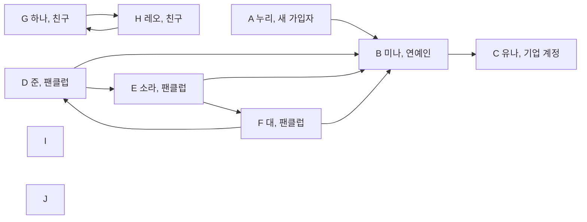

# 제3장. 여러 방향의 관계를 저장하기

## 논리적으로 생각해 보기

연락 관계를 따라가면 직접 아는 사람 너머의 사람도 만난다. 이런 관계를 저장하고, 서로 이어진 사람들을 찾아보자.

### 누가 누구를 팔로우하는지 어떻게 나타낼까?

소셜 네트워킹 서비스(SNS)에 새로 가입한 누리가 처음으로 유명인 미나를 팔로우한다고 생각해 보자. 준, 소라, 대는 이미 미나를 팔로우하고 있다. 미나는 유나 한 명을 팔로우하고, 유나는 아무도 팔로우하지 않는다. 계정마다 점을 하나씩 그리고 팔로우 관계마다 화살표를 하나씩 그린다.

대상 하나를 나타내는 점을 **정점(vertex)**이라고 한다. 직접적인 관계 하나를 나타내는 연결을 **간선(edge)**이라고 한다. 정점과 간선으로 관계를 표현한 구조가 **그래프(graph)**다. 팔로우처럼 간선의 방향을 구분하는 그래프는 **방향 그래프(directed graph)**다.

화살표는 팔로우하는 계정에서 팔로우 대상 계정으로 향한다. `A -> B`는 누리가 미나를 팔로우한다는 뜻이다. 다음 그림은 누리의 첫 팔로우를 추가한 뒤의 네트워크다. 별도의 이름을 붙이지 않은 계정 I와 J도 함께 둔다.



그림에는 정점 열 개와 화살표 열 개가 있다. 화살표는 `A -> B`, `B -> C`, `D -> B`, `D -> E`, `E -> B`, `E -> F`, `F -> D`, `F -> B`, `G -> H`, `H -> G`다. 아무 간선도 닿지 않은 I와 J는 **고립 정점(isolated vertex)**이다. 빈 배열 자리가 아니라 그래프에 포함된 정점이다.

계정을 배열에 넣을 때는 다음 인덱스를 사용한다. 본문과 C 코드에서 끝까지 같은 대응을 유지한다. 코드는 사람의 이름 대신 알파벳 한 글자를 저장한다.

| 인덱스 | 정점 | 이름 |
|---:|---|---|
| 0 | A | 누리 |
| 1 | B | 미나 |
| 2 | C | 유나 |
| 3 | D | 준 |
| 4 | E | 소라 |
| 5 | F | 대 |
| 6 | G | 하나 |
| 7 | H | 레오 |
| 8 | I | 이름 없음 |
| 9 | J | 이름 없음 |

### 팔로우 수와 팔로워 수는 어떻게 셀까?

누리에서 나가는 화살표는 `A -> B` 하나다. 따라서 누리의 팔로우 수는 1이다. 누리로 들어오는 화살표는 없으므로 팔로워 수는 0이다. 처음으로 누군가를 팔로우했다고 그 사람이 누리를 팔로우하는 것은 아니다.

미나로 들어오는 화살표는 누리, 준, 소라, 대에게서 온다. 미나의 팔로워 수는 4다. 미나에서 나가는 화살표는 유나를 향하는 하나이므로 팔로우 수는 1이다.

정점에서 나가는 간선 수를 **진출 차수(out-degree)**라고 한다. 들어오는 간선 수를 **진입 차수(in-degree)**라고 한다. 유나의 진출 차수는 0이고 진입 차수는 1이다. 아무도 팔로우하지 않는다는 것과 아무도 자신을 팔로우하지 않는다는 것은 다르다.

### 누리는 화살표를 따라 어디까지 갈 수 있을까?

누리는 미나를 팔로우하고, 미나는 유나를 팔로우한다. `A -> B -> C`를 따라가면 누리에서 미나를 거쳐 유나에 도달한다. 누리가 유나를 직접 팔로우하지 않아도 가능하다.

유나에게는 나가는 화살표가 없어 여기서 멈춘다. 미나나 유나에서 화살표를 따라 누리에게 돌아갈 수도 없다. 누리가 어떤 계정에 도달할 수 있어도 그 계정에서 누리에게 돌아올 수 있는 것은 아니다.

### 어떤 계정들이 연결되어 있을까?

이번에는 방향을 구분하지 않을 때 어떤 계정들이 연결되는지 알아보자. 정점 열 개를 그대로 둔다. 화살표 끝을 없애고, 하나와 레오 사이의 반대 방향 화살표 두 개는 선 하나로 합친다. 간선을 양쪽으로 이용하는 **무방향 그래프(undirected graph)**를 얻는다.

```text
A—B, B—C, B—D, B—E, B—F, D—E, D—F, E—F, G—H
```

간선은 아홉 개다. I와 J에는 여전히 간선이 없다. 이후의 손 계산과 `lab.c`는 이 무방향 그래프를 사용한다. 연락 여부만 저장하므로 관계에 거리나 비용 같은 수치를 붙이지 않는다. 간선에 붙이는 그런 수치를 **가중치(weight)**라고 한다.

### 무방향 그래프는 어떻게 저장할까?

소라에서 이동하려면 소라와 직접 연결된 계정들을 알아야 한다. 모든 간선을 매번 찾는 대신 계정마다 이웃의 목록을 두자. 이런 저장 방법을 **인접 리스트(adjacency list)**라고 한다.

```text
A 누리 : B
B 미나 : A, C, D, E, F
C 유나 : B
D 준   : B, E, F
E 소라 : B, D, F
F 대   : B, D, E
G 하나 : H
H 레오 : G
I      : 없음
J      : 없음
```

간선 하나를 양 끝 정점의 목록에 기록한다. `E—F`는 소라의 목록에 F의 인덱스 `5`, 대의 목록에 E의 인덱스 `4`를 넣는다. 간선 아홉 개에는 이웃 항목 열여덟 개가 필요하다. 정점에 닿은 간선 수를 **차수(degree)**라고 한다. 미나의 차수는 5이고, 미나의 목록에도 항목 다섯 개가 있다.

`lab.c`는 정점마다 정수 배열 `adj_list[10]`을 둔다. `adj_size`는 실제 이웃 수이고 `adj_cap`은 확보한 자리 수다. 목록은 `0`번부터 `adj_size - 1`번까지 읽는다. 끝을 나타내는 `-1`을 찾지 않는다. 이웃이 없는 I와 J는 `adj_size`가 0이다.

간선의 양 끝 인덱스를 쌍으로 모으면 **간선 리스트(edge list)**가 된다. 코드의 `edges[9][2]`가 이 목록이다. `edges[i][0]`과 `edges[i][1]`은 i번째 간선의 양 끝이다. 코드는 이 쌍들을 차례로 읽어 각 정점의 인접 리스트 끝에 이웃을 추가한다. 별도로 정렬하지 않는다. 위 목록의 순서는 주어진 간선 배열에서 나온다.

### 같은 계정을 계속 방문하지 않으려면 어떻게 할까?

누리에서 출발해 미나의 이웃을 차례로 살펴보자. 미나의 첫 이웃은 누리다. 방문 기록이 없으면 누리와 미나 사이를 계속 오간다. `B—D—E—B`처럼 한 바퀴 돌아오는 경로도 있다.

새 계정에 들어가면 먼저 방문했다고 표시한다. 그다음 이웃을 확인한다. 이미 표시된 계정에서는 탐색을 반복하지 않는다. 한 이웃 쪽을 끝까지 살펴보고 돌아온 뒤 다음 이웃으로 가는 방법을 **깊이 우선 탐색(depth-first search)**이라고 한다. 앞 장의 재귀 호출로 같은 순서를 만들 수 있다.

A에서 B로 가면 B를 표시한다. B의 첫 이웃 A는 이미 표시되어 있다. 다음 이웃 C를 방문한 뒤 B로 돌아온다. 그다음 D에서 E, F로 들어간다. 첫 방문 순서는 `A, B, C, D, E, F`다. G, H, I, J는 A에서 도달할 수 없다.

### 연결 요소를 모두 찾으려면 어떻게 할까?

A에서의 탐색만으로는 다른 계정의 연결 상태를 알 수 없다. 모든 계정을 훑다가 아직 방문하지 않은 계정이 있으면 그 계정에서 새 탐색을 시작하자. 한 번의 탐색으로 도달한 계정들에는 같은 그룹 번호를 붙인다.

서로 경로로 연결되어 있고, 바깥 정점을 더 넣으면 이 성질을 유지할 수 없는 그룹을 **연결 요소(connected component)**라고 한다. 더 확장할 수 없다는 뜻으로 이런 그룹을 극대 그룹이라고 부른다.

1. A에서 시작하여 A–F에 그룹 0을 붙인다.
2. G에서 시작하여 G와 H에 그룹 1을 붙인다.
3. I에서 시작하여 I에 그룹 2를 붙인다. 확인할 이웃이 없어 바로 돌아온다.
4. J에서 시작하여 J에 그룹 3을 붙인다.

```text
group: 0 0 0 0 0 0 1 1 2 3
```

연결 요소는 네 개다. `mark_all_groups()`가 모든 정점에 그룹 번호를 붙인다. 뒤에서 사용할 두 번호 계산 함수는 A에서만 시작한다. 그룹을 모두 찾는 범위와 A에서 탐색하는 범위를 구분해야 한다.

### 처음 발견한 순서를 어떻게 기록할까?

어떤 계정이 먼저 발견되었는지 알려면 방문 여부만으로는 부족하다. 첫 방문마다 증가하는 번호를 저장하자. `search_num[i]`가 정점 i의 발견 번호다. `search_time`을 0에서 시작하여 A에는 0, B에는 1을 붙인다.

새 계정을 발견한 쪽을 그 계정의 부모로 두면 **최초 발견 트리(DFS tree)**를 얻는다. 부모는 그래프에 원래 정해진 관계가 아니다. 탐색이 만든 관계다. A가 루트이고 C와 D는 B의 자식이다. E는 D의 자식이고 F는 E의 자식이다.

```text
A
└─ B
   ├─ C
   └─ D
      └─ E
         └─ F
```

`save_search_nums()`는 방문 표시를 지우고 `start_index = 0`인 A에서 시작한다. 방문한 A–F에만 번호를 붙인다. 새 실행에서 모든 `search_num`은 `-1`로 시작하므로 G–J는 `-1`로 남는다. 부모 관계는 이 순서로 정해지지만 `parent` 배열에 기록하는 일은 뒤의 두 번째 탐색에서 한다.

### 부모를 거치지 않고 얼마나 앞쪽으로 돌아갈 수 있을까?

처음 발견한 연결만 보면 D, E, F는 한 줄로 보인다. 하지만 실제 그래프에는 `D—B`, `E—B`, `F—B`가 모두 있다. 한 가지에서 더 앞서 발견한 계정으로 돌아가는 다른 길이 있는지 기록하자.

정점 i에서 최초 발견 트리의 자식 방향으로 0번 이상 이동한 뒤, 부모에게서 들어온 간선과 다른 간선으로 조상에게 최대 한 번 이동한다고 생각한다. 그런 이동으로 얻는 가장 작은 발견 번호를 `back_num[i]`에 저장한다. 마지막 간선 이동을 하지 않아도 된다. 이 값을 **최소 복귀 번호(low-link value)**라고 한다.

처음에는 자기 발견 번호를 넣는다. 새 자식의 탐색이 끝나면 자식의 `back_num`과 비교하여 더 작은 값을 남긴다. 이미 방문한 이웃이 부모가 아니면 그 이웃의 `search_num`과 비교한다. 이 경우 이웃의 `back_num`을 사용하지 않는다. 조상에게 가는 마지막 간선 하나의 효과를 반영하기 때문이다.

무방향 간선은 양쪽 목록에 있으므로 부모로 향하는 항목도 다시 보게 된다. 들어올 때 사용한 간선의 반대쪽 항목은 별도의 우회 경로가 아니다. 코드는 `neighbor != parent[i]`로 부모를 제외한다. 주어진 그래프에는 같은 두 정점을 잇는 중복 간선이 없으므로 정점 번호만 비교해도 된다.

F에서는 부모 E를 제외한다. B의 발견 번호 1과 D의 발견 번호 3을 확인하여 `back_num[F]`는 1이 된다. E는 F를 방문하기 전에 B의 번호 1을 확인했다. F에서 E로 돌아오면 E는 1을 유지한다. E에서 D로 돌아오면 D도 1을 받는다. C에는 부모 B밖에 없으므로 C의 값은 자기 발견 번호 2다. B는 부모 A를 제외하므로 1을 유지한다. A의 값은 0이다.

이미 방문한 이웃이 나중에 발견한 자손일 때도 코드의 비교문은 실행될 수 있다. 하지만 자손의 발견 번호는 현재 정점보다 크다. 현재 `back_num`은 자기 발견 번호 이하이므로 그 비교로 값이 작아지지 않는다.

| 정점 | 인덱스 | `group` | `search_num` | `back_num` | `parent` |
|---|---:|---:|---:|---:|---:|
| A 누리 | 0 | 0 | 0 | 0 | -1 |
| B 미나 | 1 | 0 | 1 | 1 | 0 |
| C 유나 | 2 | 0 | 2 | 2 | 1 |
| D 준 | 3 | 0 | 3 | 1 | 1 |
| E 소라 | 4 | 0 | 4 | 1 | 3 |
| F 대 | 5 | 0 | 5 | 1 | 4 |
| G 하나 | 6 | 1 | -1 | -1 | -1 |
| H 레오 | 7 | 1 | -1 | -1 | -1 |
| I | 8 | 2 | -1 | -1 | -1 |
| J | 9 | 3 | -1 | -1 | -1 |

두 번호는 별도의 탐색으로 구한다. `save_search_nums()`를 먼저 호출하고 `save_back_nums()`를 호출한다. 두 호출 사이에는 시작 정점, 간선, 이웃 목록의 순서를 그대로 유지한다. 그래야 두 번째 탐색이 첫 번째 탐색의 발견 번호와 같은 트리를 사용한다.

### 어떤 계정이 사라지면 그룹이 나뉠까?

계정 하나를 지우면 남은 사람들이 서로 연락하지 못할 수 있다. 미나 B와 B에 닿은 간선들을 지워 보자. A와 C는 각각 고립된다. D, E, F는 서로 연결되어 있다. G–H, I, J도 그대로 남는다. 연결 요소 수가 네 개에서 여섯 개로 늘어난다.

삭제했을 때 연결 요소 수가 증가하는 정점을 **단절점(cut vertex)**이라고 한다. 이 그래프의 단절점은 B 하나다. 간선 하나를 삭제했을 때 연결 요소 수가 증가하면 그 간선을 **브리지(bridge)**라고 한다. `A—B`, `B—C`, `G—H`가 브리지다.

여기부터 블록-단절점 트리까지는 계산한 번호와 그림을 이용하는 손 계산 확장이다. `lab.c`에는 단절점, 브리지, 블록을 판정하거나 출력하는 함수가 없다.

루트가 아닌 정점 u의 자식 v가 `back_num[v] >= search_num[u]`를 만족하면 u는 단절점이다. 자식 쪽에서 u보다 먼저 발견한 조상으로 돌아가는 길이 없기 때문이다. B의 자식 C는 `2 >= 1`, 자식 D는 `1 >= 1`을 만족한다. 따라서 B를 지우면 자식 쪽이 부모 A 쪽과 분리된다.

루트에는 부모 쪽이 없다. 루트는 처음 발견한 자식이 둘 이상일 때 단절점이다. A의 자식은 B 하나이므로 A는 단절점이 아니다. 이웃 수와 처음 발견한 자식 수는 다르다. B의 이웃은 다섯이지만 자식은 C와 D 둘이다.

자식으로 향하는 간선 `u—v`는 `back_num[v] > search_num[u]`일 때 브리지다. 따라서 `A—B`는 `1 > 0`, `B—C`는 `2 > 1`로 확인된다. `B—D`는 두 값이 1로 같으므로 브리지가 아니다. `G—H`는 이 코드의 번호가 모두 `-1`이므로 이 표로 판정하지 않는다. 그림에서 유일한 간선을 지워 G와 H가 떨어지는 것으로 확인한다.

### 한 계정에 의존하지 않는 부분은 어디일까?

B, D, E, F는 모든 쌍이 직접 연결되어 있다. 네 계정 중 하나를 지워도 나머지 계정은 서로 연결된다. A나 C까지 넣으면 B를 지웠을 때 그 성질을 잃는다. 이런 부분들을 나누어 보자.

자기 내부에 단절점이 없는 극대 연결 부분 그래프를 **블록(block)**이라고 한다. 정점이 셋 이상인 이런 부분을 **이중 연결 요소(biconnected component)**라고 부른다. 이 장의 블록 분해에는 브리지와 양 끝 정점도 블록 하나로 넣는다. 고립 정점도 단독 블록으로 넣는다.

| 블록 | 정점 | 간선 |
|---|---|---|
| B1 | `{B, C}` | `B—C` |
| B2 | `{B, D, E, F}` | `B—D, B—E, B—F, D—E, D—F, E—F` |
| B3 | `{A, B}` | `A—B` |
| B4 | `{G, H}` | `G—H` |
| B5 | `{I}` | 없음 |
| B6 | `{J}` | 없음 |

블록은 여섯 개다. B1, B2, B3는 B만 공유한다. 모든 간선은 정확히 한 블록에 속한다. 위 표는 그림에서 직접 나눈 결과다. 코드에 이 블록들을 담는 배열은 없다.

### 블록들은 어떻게 트리를 이룰까?

블록 안의 간선을 접어 두고 블록들이 만나는 위치를 나타내자. 블록마다 노드를 하나 만든다. 단절점마다 별도의 노드를 만든다. 단절점이 블록에 속할 때만 그 두 노드를 연결한다.

연결 요소 하나에 대해 만든 구조를 **블록-단절점 트리(block-cut tree)**라고 한다. 이 예제는 다음 구조를 가진다.

```text
B1 — 단절점 B — B2       B4       B5       B6
          |
          B3
```

B4, B5, B6는 각각 노드 하나인 트리다. 원래 그래프에는 연결 요소 네 개가 있으므로 트리도 네 개다. 이렇게 서로 떨어진 트리들의 모음을 **포리스트(forest)**라고 한다.

최초 발견 트리는 계정을 어떤 순서로 탐색했는지 기록한다. 블록-단절점 트리는 블록들이 어떤 단절점을 공유하는지 기록한다. 이 그림 역시 손 계산이며 `lab.c`의 출력은 아니다.

### 이 코드는 어떤 실행 순서를 가정할까?

같은 결과를 얻으려면 같은 그래프를 같은 순서로 탐색해야 한다. 이 장에서는 프로그램을 새로 실행한 뒤 정점과 간선을 한 번 초기화한다. 그룹을 모두 찾고, A에서 두 번호를 차례로 계산한다.

- `alphabet_nodes_init()`은 A–J 열 정점을 모두 사용 중으로 만든다.
- `edges_init()`은 정해진 아홉 간선을 각 목록 끝에 추가한다. 자기 자신으로 가는 간선과 중복 간선은 이 입력에 없다.
- 모든 이웃 인덱스는 `0`부터 `9` 사이이고, 가장 긴 목록도 항목 다섯 개이므로 확보한 열 칸에 들어간다.
- `save_search_nums()`와 `save_back_nums()`는 방문 표시를 다시 지운다. `search_num`, `back_num`, `parent` 전체를 초기화하는 함수는 아니다.

자기 자신으로 향하는 간선이 없고 같은 두 정점 사이의 간선이 중복되지 않는 무방향 그래프를 **단순 그래프(simple graph)**라고 한다. 이 예제의 입력은 이 조건을 만족한다.

코드는 입력 검사나 추가 요청 거절을 구현하지 않는다. 정해진 입력으로 A에서 한 번 실행하는 예제다. 시작점을 바꾸거나 여러 번 재사용하려면 결과 배열의 초기화도 별도로 설계해야 한다. 이번 실행에서 G–J의 번호가 `-1`인 이유는 A에서 방문하지 않았기 때문이다. 그룹이 없다는 뜻은 아니다.

## 효율 계산해 보기

같은 열 정점과 아홉 간선으로 작업량을 세어 보자. 실제로 읽는 이웃 항목 수와 미리 확보한 배열 크기를 따로 계산한다.

### 그래프를 만드는 데 얼마나 많은 작업이 필요할까?

초기화는 정점 열 개의 글자, 용량, 이웃 수를 기록한다. 간선 초기화는 아홉 쌍을 읽고 이웃 항목 열여덟 개를 쓴다. 각 간선은 목록 끝 위치를 바로 사용하므로 기존 이웃을 훑지 않는다.

정점 수를 V, 간선 수를 E라고 하면 정점 초기화는 `O(V)`, 간선 추가 전체는 `O(E)`다. 구축 시간은 합쳐서 `O(V + E)`다. 이 비용은 주어진 입력을 검사 없이 넣는 현재 코드의 비용이다.

### 연결 요소를 모두 찾는 데 얼마나 많은 작업이 필요할까?

방문 표시 열 개를 지운다. 다음 시작점을 찾으면서 정점 열 개를 확인한다. 탐색 중에는 각 정점을 한 번 표시하고 이웃 항목 열여덟 개를 읽는다. 고립 정점 I와 J도 한 번씩 처리한다.

일반적으로 정점 V개와 이웃 항목 `2E`개를 처리하므로 `mark_all_groups()`의 시간은 `O(V + E)`다. 이미 방문한 이웃에서 재귀 호출이 바로 끝나는 작업도 각 항목 확인에 포함된다.

### A에서 두 번호를 구하는 데 얼마나 많은 작업이 필요할까?

각 번호 계산 함수는 먼저 방문 표시 열 개를 지운다. 그다음 A–F 여섯 정점과 그 사이 간선 여덟 개를 탐색한다. 간선은 양쪽 목록에 있으므로 탐색마다 이웃 항목 열여섯 개를 읽는다. G–J의 목록은 읽지 않는다.

A에서 도달하는 정점 수를 `V_r`, 그 연결 요소의 간선 수를 `E_r`라고 하자. 각 함수의 탐색 부분은 `O(V_r + E_r)`다. 전체 방문 배열 초기화까지 포함하면 `save_search_nums()`와 `save_back_nums()`는 각각 `O(V + V_r + E_r)`다. 두 번 계산해도 같은 성장률이다. 마지막 결과 출력은 정점 열 개를 한 번씩 읽으므로 `O(V)`다.

### 확보한 메모리와 실제 사용하는 메모리는 얼마나 될까?

각 정점은 이웃을 넣을 정수 칸 열 개를 가진다. 정점 열 개가 있으므로 이웃용으로 확보한 칸은 100개다. 그중 간선을 기록한 칸은 열여덟 개다. I와 J도 정점으로 사용하지만 이웃 칸은 사용하지 않는다.

현재 배열 크기는 모두 고정되어 있다. 같은 방식을 정점 용량 M으로 확대하고 정점마다 이웃 M칸을 두면 `M × M`칸을 확보한다. 확보 공간은 `O(M²)`다. 인접 리스트라는 이름만으로 확보 공간이 `O(V + E)`가 되는 것은 아니다. 실제 이웃 항목 수는 `2E`지만 현재 구현은 정점마다 최대 용량을 미리 둔다.

`visited`, `group`, `search_num`, `back_num`, `parent`는 각각 열 칸을 확보한다. 용량 M으로 확대하면 이런 기록은 `O(M)` 공간이다. 재귀 호출에는 현재 끝나지 않은 경로를 유지할 공간도 필요하다. A에서의 번호 계산에는 최대 `O(V_r)`, 전체 그룹 탐색에는 최대 `O(V)`의 추가 공간이 필요하다. 서로 다른 그룹의 재귀 호출은 차례로 실행되므로 동시에 쌓이지 않는다.

## 용어 정리

다음 이름은 앞에서 다룬 관계와 탐색 기록을 가리킨다.

| 용어 | 의미 |
|---|---|
| 정점 / 간선 | 대상 하나 / 직접적인 관계 하나. |
| 방향 / 무방향 그래프 | 방향을 구분하는 그래프 / 간선을 양쪽으로 이용하는 그래프. |
| 진입 / 진출 차수 | 들어오는 간선 수 / 나가는 간선 수. |
| 차수 | 이 예제의 무방향 그래프에서 정점에 닿은 간선 수. |
| 가중치 | 간선에 붙인 거리나 비용 같은 수치. |
| 간선 리스트 | 간선의 양 끝 정점을 쌍으로 모은 목록. |
| 인접 리스트 | 정점마다 직접 연결된 이웃을 모은 목록. |
| 고립 정점 | 그래프에 포함되어 있지만 간선이 없는 정점. |
| 연결 요소 | 경로로 연결되고 더 확장할 수 없는 정점 그룹. |
| 깊이 우선 탐색 | 한 이웃 쪽을 끝까지 탐색하고 돌아온 뒤 다음 이웃을 확인하는 방법. |
| 최초 발견 트리 | 새 정점을 처음 발견할 때 만든 부모-자식 연결. |
| `search_num` | A에서 시작하여 처음 발견한 순서를 0부터 기록한 번호. |
| `back_num` | 자손 방향 이동과 조상으로 향하는 다른 간선을 최대 한 번 사용하여 얻는 최소 발견 번호. |
| 단절점 / 브리지 | 삭제하면 연결 요소 수가 늘어나는 정점 / 간선. |
| 블록 | 내부 단절점이 없는 극대 연결 부분. 브리지와 고립 정점도 포함한다. |
| 블록-단절점 트리 | 블록과 그 블록에 속한 단절점을 연결한 트리. |
| 포리스트 | 서로 떨어진 트리들의 모음. |

## 코딩 계획

프로그램은 그래프를 만들고 모든 정점에 그룹 번호를 붙인다. 그다음 A에서 발견 번호와 최소 복귀 번호를 차례로 계산한다.

1. `GraphNode`와 정점 배열을 정의한다. `alphabet_nodes_init()`으로 A–J를 초기화한다.
2. `edges_init()`으로 아홉 간선의 양쪽 이웃 항목을 추가한다.
3. `visited_init()`과 `graph_recursion()`으로 방문 표시와 재귀 탐색의 기본 동작을 확인한다.
4. `search_connected_group()`과 `mark_all_groups()`로 네 그룹을 찾는다.
5. `save_search_num()`과 `save_search_nums()`로 A–F의 발견 순서를 기록한다.
6. `save_back_num()`과 `save_back_nums()`로 같은 탐색 순서의 최소 복귀 번호와 부모를 기록한다.
7. 별도의 실행 예제에서 그룹 수와 정점별 기록을 출력한다.

단절점, 브리지, 블록, 블록-단절점 트리는 위 기록을 해석하는 손 계산 확장이다. 다음 코드에는 그 결과를 만드는 기능을 추가하지 않는다.

## C 코드

앞의 계산에 사용한 그래프를 실제 코드로 확인하자. 아래 여섯 C 블록은 `module_03_graph/student/lab.c`를 순서대로 나눈 원문이다. 마지막 실행 예제 블록을 이어 붙이면 결과를 출력하는 C 프로그램이 된다. `lab.c` 자체에는 `main`이 없다.

### 정점과 이웃 목록 초기화하기

각 계정에는 글자 하나와 이웃 목록이 필요하다. `struct GraphNode`는 이 값들을 묶는다. `nodes[i].data`는 i번째 정점의 글자다. `'A' + i`로 A부터 J까지 붙인다. `nodes_size = nodes_cap`이므로 열 자리 모두 사용 중이다.

이웃 목록은 정점마다 열 칸을 확보하지만 처음에는 비어 있다. `adj_size = 0`이므로 탐색은 그 칸들을 읽지 않는다.

```c
struct GraphNode {
    char data;
    int adj_list[10];
    int adj_cap;
    int adj_size;
};

struct GraphNode nodes[10];
int nodes_cap = 10;
int nodes_size = 0;

void alphabet_nodes_init() {
    nodes_size = nodes_cap;

    for (int i = 0; i < nodes_cap; i++) {
        nodes[i].data = 'A' + i;
        nodes[i].adj_cap = 10;
        nodes[i].adj_size = 0;
    }
}
```

### 간선 양쪽에 이웃 추가하기

이동 방향에 관계없이 같은 연결을 사용할 수 있어야 한다. 각 간선의 양 끝을 u와 v로 읽고 서로의 목록에 인덱스를 넣는다. 예를 들어 첫 쌍 `{0, 1}`은 A의 목록에 `1`, B의 목록에 `0`을 넣는다.

`nodes[u].adj_size++`는 현재 크기를 값으로 사용한 다음 크기를 1 늘린다. 따라서 `u_adj_end`는 증가 전의 크기이며, 새 이웃을 쓸 자리다. 이 코드는 목록 끝에 바로 추가한다. `adj_cap`은 저장하지만 용량 검사에는 사용하지 않는다.

```c
void edges_init() {
    int edges[9][2] = {{0, 1}, {1, 2}, {1, 3}, {1, 4}, {1, 5}, {3, 4}, {3, 5}, {4, 5}, {6, 7}};
    int edges_count = 9;
    for (int i = 0; i < edges_count; i++) {
        int u = edges[i][0];
        int v = edges[i][1];
        int u_adj_end = nodes[u].adj_size++;
        int v_adj_end = nodes[v].adj_size++;
        nodes[u].adj_list[u_adj_end] = v;
        nodes[v].adj_list[v_adj_end] = u;
    }
}
```

### 방문 표시를 남기고 이웃 탐색하기

다른 계정에서 같은 계정으로 돌아올 수 있으므로 먼저 방문 여부를 확인한다. `visited`가 0일 때만 표시를 1로 바꾸고 이웃을 탐색한다. 재귀 호출보다 먼저 표시하므로 순환이 있어도 같은 목록을 계속 탐색하지 않는다.

`graph_recursion()`은 기본 동작을 보여 주는 함수다. `data_read`는 정점의 글자를 읽지만 이후에 사용하거나 출력하지 않는다. 이 함수를 직접 확인하려면 초기화된 그래프에서 `visited_init()` 다음 `graph_recursion(0)`을 호출한다. 마지막 실행 예제는 그룹과 번호를 기록하는 함수들을 사용한다.

```c
int visited[10] = {0};

void visited_init() {
    for (int i = 0; i < nodes_size; i++) {
        visited[i] = 0;
    }
}

void graph_recursion(int i) {
    if (visited[i] == 0) {
        visited[i] = 1;
        char data_read = nodes[i].data;
        for (int j = 0; j < nodes[i].adj_size; j++) {
            graph_recursion(nodes[i].adj_list[j]);
        }
    }
}
```

### 모든 정점에 그룹 번호 붙이기

한 번의 탐색이 끝나도 방문하지 않은 계정이 남을 수 있다. `mark_all_groups()`는 모든 정점을 확인하여 새 출발점을 찾는다. 각 탐색은 같은 `current_group`을 기록한다.

`current_group = groups_count++`는 증가 전의 그룹 수를 현재 그룹 번호로 쓰고 그룹 수를 하나 늘린다. 처음에는 그룹 번호가 0이고 그룹 수는 1이 된다. 마지막에는 그룹 번호가 0–3이고 `groups_count`는 4다. 이웃이 없는 I와 J에도 각각 번호가 붙는다.

```c
int group[10] = {-1, -1, -1, -1, -1, -1, -1, -1, -1, -1};
int groups_count = 0;
int current_group = 0;

void search_connected_group(int i) {
    if (visited[i] == 0) {
        visited[i] = 1;
        group[i] = current_group;
        for (int j = 0; j < nodes[i].adj_size; j++) {
            search_connected_group(nodes[i].adj_list[j]);
        }
    }
}

void mark_all_groups() {
    visited_init();
    groups_count = 0;

    for(int i = 0; i < nodes_size; i++) {
        if (visited[i] == 0) {
            current_group = groups_count++;
            search_connected_group(i);
        }
    }
}
```

### A에서 발견 번호 기록하기

그룹 번호만으로는 그룹 안의 발견 순서를 알 수 없다. `search_num[i] = search_time++`는 현재 순서를 저장한 다음 다음 정점을 위한 번호를 늘린다. 이웃이 아직 방문되지 않았을 때만 재귀 호출한다.

`start_index`는 0이므로 A에서 출발한다. `save_search_nums()`는 방문 표시와 순서 카운터를 초기화한다. `search_num` 배열 전체를 다시 지우지는 않는다. 이 장은 `search_num`의 모든 칸이 `-1`로 시작하는 새 실행을 사용한다.

```c
int search_num[10] = {-1, -1, -1, -1, -1, -1, -1, -1, -1, -1};
int search_time = 0;

void save_search_num(int i) {
    visited[i] = 1;
    search_num[i] = search_time++;
    for (int j = 0; j < nodes[i].adj_size; j++) {
        int neighbor = nodes[i].adj_list[j];
        if (visited[neighbor] == 0) {
            save_search_num(neighbor);
        }
    }
}

int start_index = 0;

void save_search_nums() {
    visited_init();
    search_time = 0;

    save_search_num(start_index);
}
```

### 같은 탐색에서 최소 복귀 번호 기록하기

새 자식에게 들어가기 전에 부모 인덱스를 기록한다. 자식의 호출이 끝나면 자식의 최소 복귀 번호를 읽는다. 이미 방문한 이웃이 부모가 아니면 그 이웃의 발견 번호를 읽는다. 두 경우 모두 현재 값보다 작을 때만 바꾼다.

먼저 `save_search_nums()`를 실행해야 한다. 시작 정점, 간선, 이웃 순서를 그대로 둔 채 `save_back_nums()`를 실행한다. `parent`와 `back_num`은 새 프로그램 실행에서 `-1`로 시작한다. 이 함수도 두 배열 전체를 재초기화하지 않는다.

```c
int back_num[10] = {-1, -1, -1, -1, -1, -1, -1, -1, -1, -1};
int parent[10] = {-1, -1, -1, -1, -1, -1, -1, -1, -1, -1};

void save_back_num(int i) {
    visited[i] = 1;
    back_num[i] = search_num[i];
    for (int j = 0; j < nodes[i].adj_size; j++) {
        int neighbor = nodes[i].adj_list[j];
        if (visited[neighbor] == 0) {
            parent[neighbor] = i;
            save_back_num(neighbor);
            if (back_num[i] > back_num[neighbor]) {
                back_num[i] = back_num[neighbor];
            }
        }
        else if (neighbor != parent[i]) {
            if (back_num[i] > search_num[neighbor]) {
                back_num[i] = search_num[neighbor];
            }
        }
    }
}

void save_back_nums() {
    visited_init();
    save_back_num(start_index);
}
```

### 한 번 실행하고 기록 확인하기

정점과 간선을 한 번 만든 뒤 그룹, 발견 번호, 최소 복귀 번호 순서로 계산한다. 각 함수는 방문 표시를 다시 지우므로 앞의 그룹 탐색이 다음 탐색을 막지 않는다. 다음 블록은 실행을 위해 덧붙이는 예제다.

위 여섯 블록 뒤에 붙인다. 또는 별도의 실행용 C 파일에서 `#include "lab.c"`로 기존 코드를 포함한 뒤 사용할 수 있다. `stdio.h`는 아래 `printf`와 `puts` 선언을 제공한다.

```c
#include <stdio.h>

int main(void) {
    alphabet_nodes_init();
    edges_init();
    mark_all_groups();
    save_search_nums();
    save_back_nums();

    printf("Connected groups: %d\n", groups_count);
    puts("Node Index Group Search Back Parent");
    for (int i = 0; i < nodes_size; i++) {
        printf("%c %d %d %d %d %d\n", nodes[i].data, i, group[i],
               search_num[i], back_num[i], parent[i]);
    }
    return 0;
}
```

각 행은 정점, 인덱스, 그룹, 발견 번호, 최소 복귀 번호, 부모 인덱스 순서다. 새로 실행하면 다음 결과를 얻는다.

```text
Connected groups: 4
Node Index Group Search Back Parent
A 0 0 0 0 -1
B 1 0 1 1 0
C 2 0 2 2 1
D 3 0 3 1 1
E 4 0 4 1 3
F 5 0 5 1 4
G 6 1 -1 -1 -1
H 7 1 -1 -1 -1
I 8 2 -1 -1 -1
J 9 3 -1 -1 -1
```

A의 부모가 `-1`인 이유는 시작 정점이기 때문이다. G–J의 발견 번호, 최소 복귀 번호, 부모가 `-1`인 이유는 두 번호 계산에서 방문하지 않았기 때문이다. G–J의 그룹 번호는 이미 전체 그룹 탐색에서 기록되었다.
