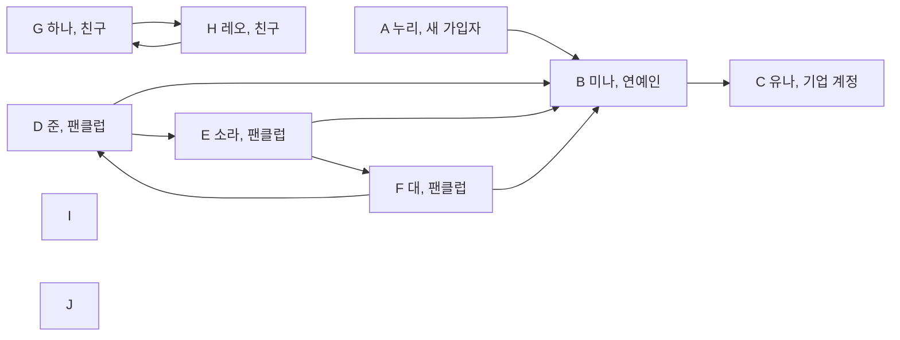

# 제3장. 여러 방향의 관계를 저장하기

## 논리적으로 생각해 보기

연락 관계를 따라가면 직접 아는 사람 너머의 사람도 만난다. 이런 관계를 저장하고, 서로 이어진 사람들을 찾아보자.

### 누가 누구를 팔로우하는지 어떻게 나타낼까?

소셜 네트워킹 서비스(SNS)에 새로 가입한 누리가 처음으로 유명인 미나를 팔로우한다고 생각해 보자. 준, 소라, 대는 이미 미나를 팔로우하고 있다. 미나는 유나 한 명을 팔로우하고, 유나는 아무도 팔로우하지 않는다. 계정마다 점을 하나씩 그리고 팔로우 관계마다 화살표를 하나씩 그린다.

대상 하나를 나타내는 점을 **정점(vertex)**이라고 한다. 직접적인 관계 하나를 나타내는 연결을 **간선(edge)**이라고 한다. 정점과 간선으로 관계를 표현한 구조가 **그래프(graph)**다. 팔로우처럼 간선의 방향을 구분하는 그래프는 **방향 그래프(directed graph)**다.

화살표는 팔로우하는 계정에서 팔로우 대상 계정으로 향한다. `A -> B`는 누리가 미나를 팔로우한다는 뜻이다. 다음 그림은 누리의 첫 팔로우를 추가한 뒤의 네트워크다. 별도의 이름을 붙이지 않은 계정 I와 J도 함께 둔다.



그림에는 정점 열 개와 화살표 열 개가 있다. 화살표는 `A -> B`, `B -> C`, `D -> B`, `D -> E`, `E -> B`, `E -> F`, `F -> D`, `F -> B`, `G -> H`, `H -> G`다. 아무 간선도 닿지 않은 I와 J는 **고립 정점(isolated vertex)**이다. 빈 배열 자리가 아니라 그래프에 포함된 정점이다.

계정을 배열에 넣을 때는 다음 인덱스를 사용한다. 본문과 C 코드에서 끝까지 같은 대응을 유지한다. 코드는 사람의 이름 대신 알파벳 한 글자를 저장한다.

| 인덱스 | 정점 | 이름 |
|---:|---|---|
| 0 | A | 누리 |
| 1 | B | 미나 |
| 2 | C | 유나 |
| 3 | D | 준 |
| 4 | E | 소라 |
| 5 | F | 대 |
| 6 | G | 하나 |
| 7 | H | 레오 |
| 8 | I | 이름 없음 |
| 9 | J | 이름 없음 |

### 팔로우 수와 팔로워 수는 어떻게 셀까?

누리에서 나가는 화살표는 `A -> B` 하나다. 따라서 누리의 팔로우 수는 1이다. 누리로 들어오는 화살표는 없으므로 팔로워 수는 0이다. 처음으로 누군가를 팔로우했다고 그 사람이 누리를 팔로우하는 것은 아니다.

미나로 들어오는 화살표는 누리, 준, 소라, 대에게서 온다. 미나의 팔로워 수는 4다. 미나에서 나가는 화살표는 유나를 향하는 하나이므로 팔로우 수는 1이다.

정점에서 나가는 간선 수를 **진출 차수(out-degree)**라고 한다. 들어오는 간선 수를 **진입 차수(in-degree)**라고 한다. 유나의 진출 차수는 0이고 진입 차수는 1이다. 아무도 팔로우하지 않는다는 것과 아무도 자신을 팔로우하지 않는다는 것은 다르다.

### 누리는 화살표를 따라 어디까지 갈 수 있을까?

누리는 미나를 팔로우하고, 미나는 유나를 팔로우한다. `A -> B -> C`를 따라가면 누리에서 미나를 거쳐 유나에 도달한다. 누리가 유나를 직접 팔로우하지 않아도 가능하다.

유나에게는 나가는 화살표가 없어 여기서 멈춘다. 미나나 유나에서 화살표를 따라 누리에게 돌아갈 수도 없다. 누리가 어떤 계정에 도달할 수 있어도 그 계정에서 누리에게 돌아올 수 있는 것은 아니다.

### 어떤 계정들이 연결되어 있을까?

이번에는 방향을 구분하지 않을 때 어떤 계정들이 연결되는지 알아보자. 정점 열 개를 그대로 둔다. 화살표 끝을 없애고, 하나와 레오 사이의 반대 방향 화살표 두 개는 선 하나로 합친다. 간선을 양쪽으로 이용하는 **무방향 그래프(undirected graph)**를 얻는다.

```text
A—B, B—C, B—D, B—E, B—F, D—E, D—F, E—F, G—H
```

간선은 아홉 개다. I와 J에는 여전히 간선이 없다. 이후의 손 계산과 `lab.c`는 이 무방향 그래프를 사용한다. 연락 여부만 저장하므로 관계에 거리나 비용 같은 수치를 붙이지 않는다. 간선에 붙이는 그런 수치를 **가중치(weight)**라고 한다.

### 무방향 그래프는 어떻게 저장할까?

소라에서 이동하려면 소라와 직접 연결된 계정들을 알아야 한다. 모든 간선을 매번 찾는 대신 계정마다 이웃의 목록을 두자. 이런 저장 방법을 **인접 리스트(adjacency list)**라고 한다.

```text
A 누리 : B
B 미나 : A, C, D, E, F
C 유나 : B
D 준   : B, E, F
E 소라 : B, D, F
F 대   : B, D, E
G 하나 : H
H 레오 : G
I      : 없음
J      : 없음
```

간선 하나를 양 끝 정점의 목록에 기록한다. `E—F`는 소라의 목록에 F의 인덱스 `5`, 대의 목록에 E의 인덱스 `4`를 넣는다. 간선 아홉 개에는 이웃 항목 열여덟 개가 필요하다. 정점에 닿은 간선 수를 **차수(degree)**라고 한다. 미나의 차수는 5이고, 미나의 목록에도 항목 다섯 개가 있다.

`lab.c`는 정점마다 정수 배열 `adj_list[10]`을 둔다. 제1장에서 배운 배열 리스트처럼 배열과 사용 크기를 함께 관리한다. 여기서는 원소가 이웃 정점의 인덱스이고, `adj_size`가 실제 이웃 수다. 배열 선언의 `10`이 확보한 자리 수다. 목록은 `0`번부터 `adj_size - 1`번까지 읽는다. 끝을 나타내는 `-1`을 찾지 않는다. 이웃이 없는 I와 J는 `adj_size`가 0이다.

간선의 양 끝 인덱스를 쌍으로 모으면 **간선 리스트(edge list)**가 된다. 코드의 `edges[9][2]`가 이 목록이다. `edges[i][0]`과 `edges[i][1]`은 i번째 간선의 양 끝이다. 코드는 이 쌍들을 차례로 읽어 각 정점의 인접 리스트 끝에 이웃을 추가한다. 별도로 정렬하지 않는다. 위 목록의 순서는 주어진 간선 배열에서 나온다.

### 같은 계정을 계속 방문하지 않으려면 어떻게 할까?

누리에서 출발해 미나의 이웃을 차례로 살펴보자. 미나의 첫 이웃은 누리다. 방문 기록이 없으면 누리와 미나 사이를 계속 오간다. `B—D—E—B`처럼 한 바퀴 돌아오는 경로도 있다.

아직 만나지 않은 계정에는 0을 남겨 두자. 계정에 처음 들어가면 양수인 번호를 기록한다. 이후에는 번호가 0인 이웃에게만 재귀 호출한다. 호출된 함수는 이웃을 확인하기 전에 자기 번호부터 기록한다. 첫 시작점도 같은 규칙을 따른다. 별도의 방문 표시 배열은 필요하지 않다.

한 이웃 쪽을 끝까지 살펴보고 돌아온 뒤 다음 이웃으로 가는 방법을 **깊이 우선 탐색(depth-first search)**이라고 한다. 앞 장의 재귀 호출로 같은 순서를 만들 수 있다.

A에서 함수가 시작하면 A에 번호를 붙인다. B로 호출하면 B가 자기 번호를 붙인다. B의 첫 이웃 A는 이미 번호가 있으므로 건너뛴다. 다음 이웃 C를 방문한 뒤 B로 돌아온다. 그다음 D에서 E, F로 들어간다. 첫 방문 순서는 `A, B, C, D, E, F`다. G, H, I, J는 A에서 도달할 수 없다.

### 연결 요소를 모두 찾으려면 어떻게 할까?

A에서의 탐색만으로는 다른 계정의 연결 상태를 알 수 없다. 모든 계정을 훑다가 아직 방문하지 않은 계정이 있으면 그 계정에서 새 탐색을 시작하자. 한 번의 탐색으로 도달한 계정들에는 같은 그룹 번호를 붙인다.

서로 경로로 연결되어 있고, 바깥 정점을 더 넣으면 이 성질을 유지할 수 없는 그룹을 **연결 요소(connected component)**라고 한다. 더 확장할 수 없다는 뜻으로 이런 그룹을 극대 그룹이라고 부른다.

1. A에서 시작하여 A–F에 그룹 1을 붙인다.
2. G에서 시작하여 G와 H에 그룹 2를 붙인다.
3. I에서 시작하여 I에 그룹 3을 붙인다. 확인할 이웃이 없어 바로 돌아온다.
4. J에서 시작하여 J에 그룹 4를 붙인다.

```text
group: 1 1 1 1 1 1 2 2 3 4
```

연결 요소는 네 개다. `mark_all_groups()`가 모든 정점에 그룹 번호를 붙인다. 호출하는 쪽에서 먼저 발견 번호와 발견 횟수를 0으로 지운다. `current_group`도 0으로 되돌린다. 새 출발점을 찾을 때마다 `current_group`을 1 늘린 뒤 탐색한다. 따라서 처음 번호는 1이고 마지막 값 4가 연결 요소 수다. 뒤에서 A만 출발점으로 삼는 탐색과 전체 그룹을 찾는 탐색의 범위를 구분해야 한다.

### 같은 간선의 역할이 탐색마다 달라질까?

연락을 한 사람씩 이어 가며 누가 누구에게 처음 소식을 전했는지 적어 보자. 원래 알고 지낸 모든 관계와 처음 소식을 전한 관계는 다르다. 이미 소식을 들은 사람과도 직접 연락할 수 있기 때문이다.

탐색에서도 새 계정을 처음 발견한 간선만 남길 수 있다. 새 계정을 발견한 쪽을 부모로 두면 **최초 발견 트리(DFS tree)**를 얻는다. 이 트리를 이루는 간선을 **트리 간선(tree edge)**이라고 한다. A에서 위의 이웃 목록 순서로 탐색하면 트리 간선은 `A—B`, `B—C`, `B—D`, `D—E`, `E—F`다.

```text
A
└─ B
   ├─ C
   └─ D
      └─ E
         └─ F
```

트리에 넣지 않은 `B—E`, `B—F`, `D—F`도 원래 그래프에 남아 있다. 이 간선들은 최초 발견 트리의 후손과 조상을 직접 잇는다. 이런 간선을 **역방향 간선(back edge)**이라고 한다. 강의 자료에서는 같은 간선을 **빽 간선**이라고 부른다. 그래프 자체에 방향이 생기는 것은 아니다. 후손 쪽에서 조상으로 돌아가는 용도를 나타낸 이름이다.

이웃 하나의 역할은 현재 정점에서 어느 쪽을 보고 있는지에 따라 달라진다. 트리 간선을 따라 미방문 이웃을 처음 발견하면 그 이웃은 자식이다. 자식 쪽에서 같은 간선의 반대쪽 항목을 읽으면 이웃은 부모다. 역방향 간선은 후손 쪽에서 처음 확인할 때 조상을 만난다. 조상 쪽에서 반대쪽 항목을 읽을 때는 이미 발견된 후손을 만난다. 따라서 이미 방문한 이웃을 모두 조상으로 취급하면 안 된다.

부모와 자식은 그래프에 원래 정해진 관계가 아니다. 시작점과 이웃을 읽는 순서가 만든 관계다. 예를 들어 B의 목록에서 E를 C와 D보다 먼저 읽으면 `B—E`가 트리 간선이 된다. 시작점이나 순서를 바꾸면 발견 트리와 두 종류의 간선이 달라질 수 있다. `G—H`는 A에서 도달할 수 없으므로 이번 탐색의 트리 간선이나 역방향 간선으로 분류하지 않는다.

이웃 목록을 그대로 두고 D에서 시작해 보자. 발견 순서는 `D, B, A, C, E, F`다. 트리 간선은 `D—B`, `B—A`, `B—C`, `B—E`, `E—F`가 된다. B—E는 트리 간선이 되고 D—E는 역방향 간선이 된다. 이후 예제는 다시 A에서 시작하여 원래 이웃 순서를 따른다.

### 처음 발견한 순서를 어떻게 기록할까?

어떤 계정이 먼저 발견되었는지 알려면 방문 여부만으로는 부족하다. 첫 방문마다 증가하는 번호를 저장하자. `visit_num[i]`가 정점 i의 발견 번호다. `visit_time`을 0에서 시작한다. 계정에 들어올 때마다 1을 더한 뒤 번호를 저장하므로 A에는 1, B에는 2를 붙인다. 번호 0은 아직 방문하지 않았다는 뜻으로 남는다.

호출하는 쪽에서 `visit_num` 전체와 `visit_time`을 0으로 만든 뒤 `save_visit_num(0)`을 호출한다. 함수는 `visit_num[i] = ++visit_time`으로 자기 발견 번호부터 기록한다. A–F는 1–6을 받고, A에서 도달하지 못한 G–J는 0으로 남는다. 번호 자체로 방문 여부를 구분할 수 있다. 이 함수는 부모를 배열에 기록하지 않는다. 뒤의 최소 복귀 번호 계산에서 부모 배열도 함께 채운다.

### 부모를 거치지 않고 얼마나 앞쪽으로 돌아갈 수 있을까?

처음 발견한 연결만 보면 D, E, F는 한 줄로 보인다. 하지만 실제 그래프에는 `D—B`, `E—B`, `F—B`가 모두 있다. 한 가지에서 더 앞서 발견한 계정으로 돌아가는 다른 길이 있는지 기록하자.

정점 i에서 최초 발견 트리의 자식 방향으로 0번 이상 이동한 뒤, 역방향 간선으로 조상에게 최대 한 번 이동한다고 생각한다. 그런 이동으로 얻는 가장 작은 발견 번호를 `back_num[i]`에 저장한다. 마지막 간선 이동을 하지 않아도 된다. 이 값을 **최소 복귀 번호(low-link value)**라고 한다. 강의 자료의 배열 `back`과 함수 `save_back`은 `lab.c`의 `back_num`과 `save_back_num`에 해당한다. 교재의 코드와 실행 결과는 `lab.c`의 이름을 사용한다.

처음에는 자기 발견 번호를 넣는다. 새 자식의 탐색이 끝나면 자식의 `back_num`과 비교하여 더 작은 값을 남긴다. 이미 방문한 이웃이 부모가 아니면 그 이웃의 `visit_num`과 비교한다. 이 경우 이웃의 `back_num`을 사용하지 않는다. 조상에게 가는 마지막 간선 하나의 효과를 반영하기 때문이다.

네 가지 이웃 관계는 다음 코드 동작으로 이어진다. i는 현재 정점이고 `adj`는 지금 읽는 이웃이다. 자식의 번호는 자식 쪽 탐색이 모두 끝난 뒤 사용한다. 조상의 발견 번호는 처음 방문했을 때 이미 정해진 값이다.

| 현재 정점에서 본 이웃의 역할 | 같은 예제의 상황 | 실제 분기와 사용하는 기록 |
|---|---|---|
| 자식 | D가 미방문 E를 발견한다. | `visit_num[adj] == 0`에서 `parent[adj] = i`를 기록하고 재귀 호출한다. 반환 후 `back_num[adj]`가 작으면 `back_num[i]`를 바꾼다. |
| 부모 | E가 들어올 때 사용한 D를 다시 본다. | 이미 방문했고 `adj == parent[i]`이므로 `else if (adj != parent[i])`에 들어가지 않는다. 부모의 두 번호 모두 사용하지 않는다. |
| 조상 | E가 역방향 간선으로 B를 본다. | 이미 방문했고 `adj != parent[i]`이므로 `visit_num[adj]`와 비교한다. 그 값 2가 작으므로 현재 값을 2로 바꾼다. |
| 후손 | D가 E의 호출을 마친 뒤 F를 본다. | 이미 방문했고 부모가 아니므로 같은 분기에서 `visit_num[adj]`와 비교한다. 후손의 발견 번호는 더 크므로 현재 값을 바꾸지 못한다. |

무방향 간선은 양쪽 목록에 있으므로 부모로 향하는 항목도 다시 보게 된다. 들어올 때 사용한 간선의 반대쪽 항목은 별도의 우회 경로가 아니다. 코드는 `adj != parent[i]`로 부모를 제외한다. 주어진 그래프에는 같은 두 정점을 잇는 중복 간선이 없으므로 정점 번호만 비교해도 된다.

F에서는 부모 E를 제외한다. B의 발견 번호 2와 D의 발견 번호 4를 확인하여 `back_num[F]`는 2가 된다. E는 F를 방문하기 전에 B의 번호 2를 확인했다. F에서 E로 돌아오면 E는 2를 유지한다. E에서 D로 돌아오면 D도 2를 받는다. C에는 부모 B밖에 없으므로 C의 값은 자기 발견 번호 3이다. B는 부모 A를 제외하므로 2를 유지한다. A의 값은 1이다.

이미 방문한 이웃이 나중에 발견한 자손일 때도 코드의 비교문은 실행될 수 있다. 하지만 자손의 발견 번호는 현재 정점보다 크다. 현재 `back_num`은 자기 발견 번호 이하이므로 그 비교로 값이 작아지지 않는다.

이 번호는 위의 경로 규칙으로 도달할 수 있는 최소 발견 번호다. 언제나 반드시 거쳐야 하는 조상의 번호라는 뜻은 아니다. C처럼 사용할 역방향 간선이 없으면 자기 번호가 남는다. 정점이나 간선이 꼭 필요한지는 뒤에서 부모와 자식의 번호 관계를 함께 비교한다.

전체 그룹을 기록한 뒤 발견 번호를 지우고 A에서 최소 복귀 번호를 계산하면 다음 상태가 된다. 실행 예제는 탐색 전에 모든 부모 칸을 -1로 두고 모든 최소 복귀 번호 칸을 0으로 둔다.

| 정점 | 인덱스 | `group` | `visit_num` | `back_num` | `parent` |
|---|---:|---:|---:|---:|---:|
| A 누리 | 0 | 1 | 1 | 1 | -1 |
| B 미나 | 1 | 1 | 2 | 2 | 0 |
| C 유나 | 2 | 1 | 3 | 3 | 1 |
| D 준 | 3 | 1 | 4 | 2 | 1 |
| E 소라 | 4 | 1 | 5 | 2 | 3 |
| F 대 | 5 | 1 | 6 | 2 | 4 |
| G 하나 | 6 | 2 | 0 | 0 | -1 |
| H 레오 | 7 | 2 | 0 | 0 | -1 |
| I | 8 | 3 | 0 | 0 | -1 |
| J | 9 | 4 | 0 | 0 | -1 |

G–J의 그룹은 전체 그룹 탐색에서 정해졌다. 하지만 마지막 탐색에서는 방문하지 않았다. `visit_num`이 0이므로 최소 복귀 번호의 0과 부모의 -1은 초기값으로 남았음을 알 수 있다. A는 발견 번호가 1이고 부모가 -1이므로 실제로 방문한 루트다.

`save_back_num(0)`은 발견 번호와 최소 복귀 번호를 같은 탐색에서 계산한다. 들어오자마자 `back_num[i] = visit_num[i] = ++visit_time`으로 두 칸에 같은 새 번호를 넣는다. 앞서 `save_visit_num(0)`을 실행할 필요는 없다. 이전 탐색의 번호를 남겨 두면 이웃을 이미 방문했다고 판단한다. 그러므로 독립된 탐색 전에는 호출하는 쪽에서 발견 번호와 횟수를 초기화해야 한다. 루트의 부모 -1도 호출하는 쪽에서 준비한다.

### 어떤 계정이 사라지면 그룹이 나뉠까?

계정 하나를 지우면 남은 사람들이 서로 연락하지 못할 수 있다. 미나 B와 B에 닿은 간선들을 지워 보자. A와 C는 각각 고립된다. D, E, F는 서로 연결되어 있다. G–H, I, J도 그대로 남는다. 연결 요소 수가 네 개에서 여섯 개로 늘어난다.

삭제했을 때 연결 요소 수가 증가하는 정점을 **단절점(cut vertex)**이라고 한다. 이 그래프의 단절점은 B 하나다. 간선 하나를 삭제했을 때 연결 요소 수가 증가하면 그 간선을 **브리지(bridge)**라고 한다. `A—B`, `B—C`, `G—H`가 브리지다.

여기부터 블록-단절점 트리까지는 계산한 번호와 그림을 이용하는 손 계산 확장이다. `lab.c`에는 단절점, 브리지, 블록을 판정하거나 출력하는 함수가 없다.

루트가 아닌 정점 u의 자식 v가 `back_num[v] >= visit_num[u]`를 만족하면 u는 단절점이다. 자식 쪽에서 u보다 먼저 발견한 조상으로 돌아가는 길이 없기 때문이다. B의 자식 C는 `3 >= 2`, 자식 D는 `2 >= 2`를 만족한다. 따라서 B를 지우면 자식 쪽이 부모 A 쪽과 분리된다.

루트에는 부모 쪽이 없다. 루트는 처음 발견한 자식이 둘 이상일 때 단절점이다. A의 자식은 B 하나이므로 A는 단절점이 아니다. 이웃 수와 처음 발견한 자식 수는 다르다. B의 이웃은 다섯이지만 자식은 C와 D 둘이다.

자식으로 향하는 간선 `u—v`는 `back_num[v] > visit_num[u]`일 때 브리지다. 따라서 `A—B`는 `2 > 1`, `B—C`는 `3 > 2`로 확인된다. `B—D`는 두 값이 2로 같으므로 브리지가 아니다. `G—H`는 마지막 탐색에서 방문하지 않아 `visit_num`이 0이므로 이 표의 번호로 판정하지 않는다. 그림에서 유일한 간선을 지워 G와 H가 떨어지는 것으로 확인한다.

### 한 계정에 의존하지 않는 부분은 어디일까?

B, D, E, F는 모든 쌍이 직접 연결되어 있다. 네 계정 중 하나를 지워도 나머지 계정은 서로 연결된다. A나 C까지 넣으면 B를 지웠을 때 그 성질을 잃는다. 이런 부분들을 나누어 보자.

자기 내부에 단절점이 없는 극대 연결 부분 그래프를 **블록(block)**이라고 한다. 정점이 셋 이상인 이런 부분을 **이중 연결 요소(biconnected component)**라고 부른다. 이 장의 블록 분해에는 브리지와 양 끝 정점도 블록 하나로 넣는다. 고립 정점도 단독 블록으로 넣는다.

| 블록 | 정점 | 간선 |
|---|---|---|
| B1 | `{B, C}` | `B—C` |
| B2 | `{B, D, E, F}` | `B—D, B—E, B—F, D—E, D—F, E—F` |
| B3 | `{A, B}` | `A—B` |
| B4 | `{G, H}` | `G—H` |
| B5 | `{I}` | 없음 |
| B6 | `{J}` | 없음 |

블록은 여섯 개다. B1, B2, B3는 B만 공유한다. 모든 간선은 정확히 한 블록에 속한다. 위 표는 그림에서 직접 나눈 결과다. 코드에 이 블록들을 담는 배열은 없다.

### 블록들은 어떻게 트리를 이룰까?

블록 안의 간선을 접어 두고 블록들이 만나는 위치를 나타내자. 블록마다 노드를 하나 만든다. 단절점마다 별도의 노드를 만든다. 단절점이 블록에 속할 때만 그 두 노드를 연결한다.

연결 요소 하나에 대해 만든 구조를 **블록-단절점 트리(block-cut tree)**라고 한다. 이 예제는 다음 구조를 가진다.

```text
B1 — 단절점 B — B2       B4       B5       B6
          |
          B3
```

B4, B5, B6는 각각 노드 하나인 트리다. 원래 그래프에는 연결 요소 네 개가 있으므로 트리도 네 개다. 이렇게 서로 떨어진 트리들의 모음을 **포리스트(forest)**라고 한다.

최초 발견 트리는 계정을 어떤 순서로 탐색했는지 기록한다. 블록-단절점 트리는 블록들이 어떤 단절점을 공유하는지 기록한다. 이 그림 역시 손 계산이며 `lab.c`의 출력은 아니다.

### 이 코드는 어떤 실행 순서를 가정할까?

같은 결과를 얻으려면 같은 그래프를 같은 순서로 탐색해야 한다. 이 장의 실행 예제는 정점과 간선을 한 번 초기화한다. A에서 발견 번호를 구하고, 전체 그룹을 찾은 뒤, A에서 발견 번호와 최소 복귀 번호를 함께 다시 계산한다.

- `alphabet_nodes_init()`은 A–J 열 정점을 모두 사용 중으로 만든다.
- `edges_init()`은 정해진 아홉 간선을 각 목록 끝에 추가한다. 자기 자신으로 가는 간선과 중복 간선은 이 입력에 없다.
- 모든 이웃 인덱스는 `0`부터 `9` 사이이고, 가장 긴 목록도 항목 다섯 개이므로 확보한 열 칸에 들어간다.
- 독립된 탐색 전마다 호출하는 쪽에서 `visit_num`을 모두 0으로 만들고 `visit_time = 0`으로 되돌린다. 탐색 함수 안에는 이 초기화가 없다.
- 전체 그룹을 새로 구하기 전에는 `current_group = 0`도 필요하다. 모든 정점을 다시 방문하므로 각 `group` 값은 새 번호로 덮어쓴다.
- 최소 복귀 번호 탐색 전에는 루트의 부모를 -1로 정해야 한다. 실행 예제는 모든 `parent` 칸을 -1, 모든 `back_num` 칸을 0으로 두어 방문하지 않은 정점도 초기 상태로 남긴다.

자기 자신으로 향하는 간선이 없고 같은 두 정점 사이의 간선이 중복되지 않는 무방향 그래프를 **단순 그래프(simple graph)**라고 한다. 이 예제의 입력은 이 조건을 만족한다.

코드는 입력 검사나 추가 요청 거절을 구현하지 않는다. 정해진 입력을 사용하는 예제다. 재사용할 때도 호출하는 쪽이 이 초기화 순서를 지켜야 한다. 마지막 탐색에서 G–J의 발견 번호는 0이므로 A에서 방문하지 않았음을 알 수 있다. 그룹이 없다는 뜻은 아니다.

## 효율 계산해 보기

같은 열 정점과 아홉 간선으로 작업량을 세어 보자. 실제로 읽는 이웃 항목 수와 미리 확보한 배열 크기를 따로 계산한다.

### 그래프를 만드는 데 얼마나 많은 작업이 필요할까?

초기화는 사용 중인 정점 수를 10으로 정하고 정점 열 개의 글자와 이웃 수를 기록한다. 간선 초기화는 아홉 쌍을 읽고 이웃 항목 열여덟 개를 쓴다. 각 간선은 목록 끝 위치를 바로 사용하므로 기존 이웃을 훑지 않는다.

정점 수를 V, 간선 수를 E라고 하면 정점 초기화는 `O(V)`, 간선 추가 전체는 `O(E)`다. 구축 시간은 합쳐서 `O(V + E)`다. 이 비용은 주어진 입력을 검사 없이 넣는 현재 코드의 비용이다.

### 연결 요소를 모두 찾는 데 얼마나 많은 작업이 필요할까?

호출하는 쪽에서 발견 번호 열 개를 지운다. 다음 시작점을 찾으면서 정점 열 개를 확인한다. 탐색 중에는 각 정점에 한 번 번호를 붙이고 이웃 항목 열여덟 개를 읽는다. 고립 정점 I와 J도 한 번씩 처리한다.

일반적으로 정점 V개와 이웃 항목 `2E`개를 처리하므로 `mark_all_groups()`의 시간은 `O(V + E)`다. 앞의 초기화까지 포함해도 같은 성장률이다. 이미 번호가 있는 이웃은 조건만 확인하고 재귀 호출을 건너뛴다.

### A에서 두 번호를 구하는 데 얼마나 많은 작업이 필요할까?

A에서 한 번 탐색하면 A–F 여섯 정점과 그 사이 간선 여덟 개를 처리한다. 간선은 양쪽 목록에 있으므로 이웃 항목 열여섯 개를 읽는다. G–J의 목록은 읽지 않는다. `save_visit_num(0)`은 발견 번호를 기록한다. `save_back_num(0)`은 발견 번호와 최소 복귀 번호를 함께 기록한다. 두 함수 모두 같은 수의 이웃 항목을 읽는다.

열여섯 항목은 새 자식을 만나는 다섯 항목, 부모를 다시 보는 다섯 항목, 역방향 간선으로 조상을 보는 세 항목, 반대쪽에서 후손을 보는 세 항목으로 나뉜다. 항목마다 한 번 확인하고, 새 자식을 만나는 다섯 항목에서만 재귀 호출한다.

A에서 도달하는 정점 수를 `V_r`, 그 연결 요소의 간선 수를 `E_r`라고 하자. 각 함수의 탐색 부분은 `O(V_r + E_r)`다. 호출하는 쪽은 탐색 전 발견 번호 열 칸을 초기화한다. 마지막 탐색 전에는 최소 복귀 번호와 부모 열 칸도 초기화한다. 이런 전체 배열 초기화까지 포함하면 각 실행은 `O(V + V_r + E_r)`다.

실행 예제는 각 함수의 결과를 보여 주려고 A에서 두 번 탐색한다. 최소 복귀 번호만 필요하면 `save_back_num(0)` 한 번으로 두 번호를 얻는다. 마지막 결과 출력은 정점 열 개를 한 번씩 읽으므로 `O(V)`다.

### 확보한 메모리와 실제 사용하는 메모리는 얼마나 될까?

각 정점은 이웃을 넣을 정수 칸 열 개를 가진다. 정점 열 개가 있으므로 이웃용으로 확보한 칸은 100개다. 그중 간선을 기록한 칸은 열여덟 개다. I와 J도 정점으로 사용하지만 이웃 칸은 사용하지 않는다.

현재 배열 크기는 모두 고정되어 있다. 같은 방식을 정점 용량 M으로 확대하고 정점마다 이웃 M칸을 두면 `M × M`칸을 확보한다. 확보 공간은 `O(M²)`다. 인접 리스트라는 이름만으로 확보 공간이 `O(V + E)`가 되는 것은 아니다. 실제 이웃 항목 수는 `2E`지만 현재 구현은 정점마다 최대 용량을 미리 둔다.

`group`, `visit_num`, `back_num`, `parent`는 각각 열 칸을 확보한다. 발견 번호가 방문 여부도 나타내므로 별도의 방문 표시 배열은 없다. 용량 M으로 확대하면 이런 기록은 `O(M)` 공간이다. 재귀 호출에는 현재 끝나지 않은 경로를 유지할 공간도 필요하다. A에서의 번호 계산에는 최대 `O(V_r)`, 전체 그룹 탐색에는 최대 `O(V)`의 추가 공간이 필요하다. 서로 다른 그룹의 재귀 호출은 차례로 실행되므로 동시에 쌓이지 않는다.

## 용어 정리

다음 이름은 앞에서 다룬 관계와 탐색 기록을 가리킨다.

| 용어 | 의미 |
|---|---|
| 정점 / 간선 | 대상 하나 / 직접적인 관계 하나. |
| 방향 / 무방향 그래프 | 방향을 구분하는 그래프 / 간선을 양쪽으로 이용하는 그래프. |
| 진입 / 진출 차수 | 들어오는 간선 수 / 나가는 간선 수. |
| 차수 | 이 예제의 무방향 그래프에서 정점에 닿은 간선 수. |
| 가중치 | 간선에 붙인 거리나 비용 같은 수치. |
| 간선 리스트 | 간선의 양 끝 정점을 쌍으로 모은 목록. |
| 인접 리스트 | 정점마다 직접 연결된 이웃을 모은 목록. |
| 고립 정점 | 그래프에 포함되어 있지만 간선이 없는 정점. |
| 연결 요소 | 경로로 연결되고 더 확장할 수 없는 정점 그룹. |
| 깊이 우선 탐색 | 한 이웃 쪽을 끝까지 탐색하고 돌아온 뒤 다음 이웃을 확인하는 방법. |
| 최초 발견 트리 | 새 정점을 처음 발견할 때 만든 부모-자식 연결. |
| 트리 간선 | 이번 탐색에서 미방문 정점을 처음 발견할 때 사용한 간선. |
| 역방향 간선 / 빽 간선 | 이번 무방향 탐색의 발견 트리에서 후손과 조상을 잇는 비트리 간선. 강의의 빽 간선은 역방향 간선과 같은 뜻이다. |
| `visit_num` | 처음 발견한 순서를 1부터 기록한 번호. 0은 이번 탐색에서 미방문임을 뜻한다. |
| `back_num` | 자손 방향 이동과 역방향 간선을 최대 한 번 사용하여 얻는 최소 발견 번호. 강의의 `back`에 해당한다. |
| 단절점 / 브리지 | 삭제하면 연결 요소 수가 늘어나는 정점 / 간선. |
| 블록 | 내부 단절점이 없는 극대 연결 부분. 브리지와 고립 정점도 포함한다. |
| 블록-단절점 트리 | 블록과 그 블록에 속한 단절점을 연결한 트리. |
| 포리스트 | 서로 떨어진 트리들의 모음. |

## 규칙

같은 배열을 여러 함수가 함께 사용하므로 저장된 값의 의미가 일정해야 한다. 초기화나 간선 추가를 마친 뒤 유지해야 할 조건을 **불변식(invariant)**이라고 한다. 탐색에는 호출 전과 반환 후에 지켜야 할 조건도 있다.

### 저장 공간은 어떤 조건을 지켜야 할까?

정점을 읽기 전에 사용 범위와 이웃 목록의 범위가 올바르게 정해져 있어야 한다.

- 사용 중인 정점 수는 `0 <= nodes_size <= 10`을 만족한다. 사용 중인 정점 인덱스는 `0` 이상 `nodes_size` 미만이다.
- 정점 초기화가 끝나면 사용 중인 각 정점은 `0 <= adj_size <= 10`을 만족한다. 정점 수와 이웃 수의 한도는 배열 선언의 `10`이다.
- 목록의 사용 중인 칸마다 유효한 이웃 인덱스를 저장한다. 사용 범위 밖의 칸은 읽지 않는다. 이웃 수는 `adj_size`로 판단한다.
- 간선 하나의 추가가 끝나면 u의 목록에는 v가, v의 목록에는 u가 있다. 같은 쌍을 중복해서 넣지 않고 자기 자신도 이웃으로 넣지 않는다.

`edges_init()`은 크기를 늘린 뒤 두 이웃 칸을 차례로 쓴다. 두 문장 사이에는 아직 한쪽 연결이 완성되지 않았다. 양쪽 이웃 조건은 간선 하나를 모두 기록한 시점에 적용한다. 아홉 간선을 모두 넣으면 각 정점의 `adj_size`를 더한 값은 18이다. 간선을 기록하는 도중에 탐색을 시작하지 않는다.

### 탐색 기록은 어떤 조건을 지켜야 할까?

발견 번호는 지금 실행 중인 탐색에서 이미 발견한 계정을 구분한다. 번호를 붙였다고 그 계정의 모든 이웃을 처리한 것은 아니다.

- 독립된 탐색 전에는 사용 중인 모든 `visit_num`과 `visit_time`을 0으로 둔다. 시작 인덱스는 `0` 이상 `nodes_size` 미만이어야 한다.
- `visit_num[i] == 0`이면 미방문이다. 재귀 함수에 들어오면 먼저 `++visit_time`으로 자기 번호를 붙인다. 이웃은 그 번호가 0일 때만 호출한다.
- 그룹을 새로 계산하기 전에는 `current_group = 0`으로 둔다. `mark_all_groups()`가 끝나면 모든 사용 중 정점이 방문되었다. 각 `group[i]`는 `1` 이상 `current_group` 이하이며, 같은 연결 요소의 정점들은 같은 번호를 가진다.
- `save_back_num()`은 발견 번호와 최소 복귀 번호를 같은 탐색에서 만든다. 앞선 발견 번호 계산에 의존하지 않는다.
- 최소 복귀 번호 탐색의 루트 부모는 호출하는 쪽에서 -1로 둔다. 새 자식의 `parent`는 호출 전에 기록한다. `back_num[i]`의 최종값은 i의 재귀 호출이 끝날 때 정해진다.
- 탐색을 마친 뒤 `visit_num[i] > 0`인 정점의 기록만 이번 탐색 결과로 읽는다. 마지막 실행 예제에서는 미방문 정점의 `back_num`은 0, `parent`는 -1로 남는다.
- 탐색 함수는 배열과 카운터를 자동으로 초기화하지 않는다. 발견 번호를 지워도 그룹, 최소 복귀 번호, 부모 기록까지 지워지지는 않는다.

### 규칙이 깨지면 어떻게 될까?

이웃 인덱스가 범위를 벗어나면 `nodes[adj]`나 `visit_num[adj]`가 배열 밖에 접근할 수 있다. `adj_size`가 용량보다 크면 목록 밖에 쓰거나 읽을 수 있다. `nodes_size`의 숫자만 늘려도 실제 `nodes[10]`이 커지지는 않는다.

한쪽 이웃만 저장하면 어느 쪽에서 시작했는지에 따라 도달 범위가 달라진다. 같은 두 정점 사이에 중복 간선을 넣으면 부모 정점 번호만 제외하는 현재 최소 복귀 번호 계산을 그대로 적용할 수 없다.

다른 탐색의 발견 번호를 그대로 두면 찾아야 할 이웃을 건너뛴다. 예를 들어 A–F에 번호를 붙인 직후 초기화 없이 그룹을 찾으면 A–F를 새 그룹에 기록하지 않는다. 번호만 지우고 `visit_time`을 남기면 다음 탐색의 번호가 1에서 시작하지 않는다. 그룹 카운터를 되돌리지 않으면 그룹 수가 이전 실행부터 누적된다.

`parent`의 전역 초기값은 0이다. 루트 부모를 -1로 준비하지 않으면 루트에도 부모가 있는 것처럼 기록이 남는다. 예를 들어 B에서 시작해도 `parent[1]`의 0은 A를 부모로 가리킨다. 루트에는 부모가 없으므로 -1을 명시해야 한다.

### 현재 예제는 규칙을 어떻게 지킬까?

정점을 먼저 초기화한 뒤 정해진 아홉 간선을 한 번 넣는다. 끝점은 모두 `0`부터 `9` 사이이고 중복 쌍과 자기 연결은 없다. 가장 긴 목록도 항목 다섯 개이므로 열 칸 안에 들어간다. 간선 추가를 모두 마친 뒤 탐색한다.

실행 예제의 `reset_visit_numbers()`가 각 독립된 탐색 전에 발견 번호와 횟수를 지운다. 이 보조 함수는 실행 예제에 추가한 것이며 `lab.c`에는 없다. 전체 그룹을 찾기 전에는 그룹 카운터도 지운다. 마지막 탐색 전에는 모든 최소 복귀 번호를 0, 모든 부모를 -1로 만든 뒤 `save_back_num(0)`을 호출한다. 각 탐색 함수가 들어온 정점에 스스로 번호를 붙이므로 호출 전에 루트를 방문 처리하지 않는다.

이런 호출 순서와 고정 입력으로 조건을 유지한다. 코드가 입력을 검사하거나 잘못된 요청을 거절하는 것은 아니다.

## 코딩 계획

구현을 저장, 연결, 발견 번호, 그룹, 최소 복귀 번호, 실행 순서로 나누자. 각 탐색 전에는 호출하는 쪽이 기록을 새로 준비한다.

### 정점과 이웃 저장 공간 준비하기

글자, 이웃 배열, 이웃 수를 `GraphNode`로 묶는다. `nodes`에 열 정점을 확보한다. `alphabet_nodes_init()`은 A–J를 사용 중으로 만들고 각 이웃 수를 0으로 둔다.

### 간선 양쪽을 목록 끝에 넣기

아홉 쌍의 끝점을 차례로 읽는다. 양쪽의 증가 전 이웃 수를 새 저장 위치로 보관하면서 이웃 수를 하나씩 늘린다. 저장해 둔 두 위치에 반대편 정점의 인덱스를 쓴다. 두 기록을 모두 마친 뒤 다음 간선으로 간다.

### A에서 발견 순서 기록하기

`save_visit_num()`은 들어온 정점에 `++visit_time`을 기록한다. 번호가 0인 이웃에게만 재귀 호출한다. A에서 시작하면 발견 순서 `A, B, C, D, E, F`에 1–6을 붙인다. 0인 칸은 미방문으로 남긴다.

### 모든 연결 요소에 번호 붙이기

`mark_all_groups()`는 사용 중인 정점을 훑는다. 미방문 정점을 만나면 `current_group`을 먼저 늘리고 `mark_group()`을 호출한다. 각 호출은 자기 발견 번호와 현재 그룹 번호를 기록한다. 고립 정점 I와 J도 각각 그룹 하나가 된다.

### 부모와 최소 복귀 번호 기록하기

`save_back_num()`은 자기 발견 번호와 최소 복귀 번호에 같은 새 번호를 넣는다. 새 자식의 부모를 기록하고 탐색한 뒤 자식의 최종값을 반영한다. 이미 방문한 이웃이 부모가 아니면 그 이웃의 발견 번호를 반영한다. 앞의 발견 번호 탐색 없이도 두 번호를 함께 구한다.

### 탐색마다 초기화하고 결과 출력하기

별도의 실행 예제에서 `reset_visit_numbers()`로 발견 번호와 횟수를 지운다. `main`은 정점과 간선을 만든 뒤 A의 발견 번호, 전체 그룹, A의 발견 번호와 최소 복귀 번호를 차례로 계산한다. 각 탐색 전의 초기화를 명시한다. 그룹 탐색 전에는 `current_group`을 0으로, 마지막 탐색 전에는 부모를 모두 -1로 둔다. 단절점과 블록은 본문의 손 계산 확장으로 남긴다.

## 새로운 C 문법 설명

앞 장의 구조체와 재귀 문법을 그래프의 배열에 적용하자. 같은 기호라도 선언, 저장, 비교 중 어느 동작에 쓰이는지 구분한다.

### 구조체 안의 배열과 겹친 인덱스

정점 하나에 여러 이웃을 저장하려면 구조체 멤버도 배열로 둘 수 있다. `struct GraphNode`의 `int adj_list[10]`은 정점마다 정수 열 칸을 둔다. `nodes[i].adj_list[j]`는 i번째 정점을 고르고, 그 정점의 이웃 배열에서 j번째 값을 읽는다. i는 정점 인덱스이고 j는 목록 안의 위치다. 읽은 값이 실제 이웃 정점의 인덱스다.

### 두 끝점을 묶은 배열 초기화

간선마다 끝점 두 개를 함께 보관해야 한다. 배열의 원소를 다시 배열로 두면 이런 묶음을 저장할 수 있다. 이 구조를 **이차원 배열(two-dimensional array)**이라고 한다. `int edges[9][2]`는 정수 두 개짜리 배열을 아홉 개 묶은 배열이다. 바깥 배열의 원소 하나를 행 하나로 볼 수 있다. `{0, 1}`은 첫 행을 초기화한다. 바깥 중괄호는 아홉 행을 묶는다. `edges[i]`로 i번째 묶음을 고르고, `edges[i][0]`과 `edges[i][1]`로 그 안의 두 끝점을 읽는다.

### 전역 배열의 초기값과 일부만 적은 초기값

배열의 첫 값을 알려면 선언 위치와 초기값을 함께 봐야 한다. `int visit_num[10] = {0}`은 첫 칸과 남은 칸을 모두 0으로 초기화한다. `group`, `back_num`, `parent`도 같은 선언을 사용한다. 함수 밖의 배열은 초기값을 적지 않아도 프로그램이 시작할 때 모든 칸이 0이다. 함수 안의 지역 배열은 초기값을 적지 않으면 0으로 초기화되지 않는다. 값을 저장하기 전에는 그 칸을 읽지 않는다.

`{-1}`만 쓰면 첫 칸만 -1이고 나머지는 0이다. 실행 예제는 반복문으로 모든 부모 칸에 -1을 쓴다. 전역 배열의 초기값은 프로그램을 시작할 때 한 번 적용된다. 함수를 다시 호출한다고 그 배열이 자동으로 초기화되지는 않는다.

### 대입과 비교 구분하기

값을 바꾸는 문장과 값을 확인하는 조건은 다르다. `visit_num[i] = 1`은 1을 저장한다. `visit_num[adj] == 0`은 값이 0인지 비교한다. `adj != parent[i]`는 두 값이 다른지 비교한다. 비교 결과가 참일 때 `if`의 본문을 실행한다.

같은 값을 두 칸에 넣을 때 대입을 연결할 수 있다. `back_num[i] = visit_num[i] = ++visit_time`은 카운터를 한 번 늘린다. 그 값을 먼저 `visit_num[i]`에 저장하고 같은 값을 `back_num[i]`에도 저장한다. 대입은 오른쪽부터 묶인다. 카운터를 두 번 늘리는 문장이 아니다.

강의 자료는 같은 동작을 `visit_num[i] = ++visit_time;`과 `back[i] = visit_num[i];`의 두 문장으로 나눈다. `back`을 소스의 이름 `back_num`으로 바꾸면 연결 대입과 같은 결과다. 어느 쪽도 이전 탐색에서 만든 발견 번호를 필요로 하지 않는다.

조건 두 개를 모두 만족해야 할 때는 `&&`로 묶는다. 강의의 `adj != parent[i] && back[i] > visit_num[adj]`가 그 예다. 왼쪽 조건이 거짓이면 오른쪽 조건은 확인하지 않는다. `lab.c`는 부모가 아닌지 `else if`로 확인한 뒤 내부 `if`에서 더 작은 번호인지 확인한다. 배열 이름을 대응시키면 같은 두 조건을 같은 순서로 확인한다.

### 후위 증가와 전위 증가 구분하기

새 이웃을 넣을 때는 지금의 빈칸 위치가 필요하다. 발견 번호를 붙일 때는 0을 남겨 두고 다음 양수를 사용해야 한다. 증가 기호의 위치로 어느 값을 사용할지 정한다.

`x++`는 증가 전 값을 사용하고 x를 1 늘리는 후위 증가다. `u_adj_end = nodes[u].adj_size++`에서 이웃 수가 0이면 끝 위치에 0을 저장하고 이웃 수는 1이 된다.

`++x`는 x를 먼저 1 늘린 뒤 새 값을 사용하는 전위 증가다. `visit_num[i] = ++visit_time`에서 카운터가 0이면 발견 번호와 카운터가 모두 1이 된다. 0을 미방문 상태로 남기기 위한 순서다. `current_group++`는 따로 실행하는 문장이므로 이전 값을 사용하지 않는다. 다음 문장인 `mark_group(i)`는 증가한 그룹 번호를 읽는다.

### 공유 기록과 재귀 호출마다 다른 변수

여러 함수가 같은 그래프와 기록을 읽어야 한다. 함수 밖의 `nodes`, `group`, 번호 배열과 카운터들은 전역 변수다. 프로그램 실행 동안 유지된다. 함수 안의 `u`, `v`, `adj`, `j`와 매개변수 `i`는 지역 변수다. 재귀 호출마다 자기 i와 j를 가진다. 자식 호출이 끝나면 부모는 호출 바로 다음 문장에서 실행을 계속한다. 발견 번호 배열은 공유하므로 자식은 앞선 호출들이 기록한 번호를 읽는다.

### 반환 타입과 매개변수 읽기

함수는 필요한 값을 받아 작업한다. `void save_visit_num(int i)`는 정수 인수 하나를 지역 매개변수 i로 받고 값을 반환하지 않는다. 예제의 `void mark_all_groups()` 같은 함수는 인수 없이 호출한다. C11에서 선언의 빈 `()`는 인수 형식을 검사하는 원형이 아니다. 인수가 없음을 명시하는 원형은 `(void)`다. 실행 예제의 `int main(void)`는 인수를 받지 않고 정수를 반환한다.

### 문자와 정수를 화면에 쓰기

배열에 값을 저장하는 것만으로는 결과가 보이지 않는다. `#include <stdio.h>`는 출력 함수의 선언을 제공한다. `printf`의 `%c`에는 문자로 표시할 값을, `%d`에는 정수 값을 전달한다. 형식 문자열의 순서와 인수 순서가 일치해야 한다. `\n`은 줄을 바꾼다. `puts`는 문자열을 출력하고 끝에 줄바꿈을 붙인다. `putchar('\n')`은 줄바꿈 문자 하나를 출력한다. `return 0`은 `main`의 정상 종료를 나타낸다.

## C 코드

앞의 계산에 사용한 그래프를 실제 코드로 확인하자. 아래 첫 다섯 C 블록은 `module_03_graph/student/lab.c`를 순서대로 나눈 원문이다. 여섯 번째 실행 예제 블록을 이어 붙이면 결과를 출력하는 C 프로그램이 된다. `lab.c` 자체에는 `main`과 초기화 보조 함수가 없다.

강의 원고 `ppt_day_c_code.md`도 정점 저장, 초기화, 간선 추가, 발견 번호, 그룹, 최소 복귀 번호 순서로 설명한다. 마지막 예제의 이름은 다음과 같이 대응한다. 실습할 때는 아래 코드의 이름을 일관되게 사용한다.

| 강의 코드 | 아래 실습 코드 | 역할 |
|---|---|---|
| `back[i]` | `back_num[i]` | 역방향 간선 규칙으로 얻는 최소 발견 번호를 저장한다. |
| `save_back(i)` | `save_back_num(i)` | 한 번의 재귀 탐색에서 발견 번호와 최소 복귀 번호를 계산한다. |

강의의 두 초기 대입과 `&&` 조건은 앞의 문법 설명에서 실습 코드와 비교했다. 두 버전 모두 실행 예제처럼 호출 전 기록을 초기화해야 한다.

### 정점과 이웃 목록 초기화하기

각 계정에는 글자 하나와 이웃 목록이 필요하다. `struct GraphNode`는 이 값들을 묶는다. `nodes[i].data`는 i번째 정점의 글자다. `'A' + i`로 A부터 J까지 붙인다. `nodes_size = 10`이므로 열 자리 모두 사용 중이다.

이웃 목록은 정점마다 열 칸을 확보하지만 처음에는 비어 있다. `adj_size = 0`이므로 탐색은 그 칸들을 읽지 않는다.

```c
struct GraphNode {
	char data;
	int adj_list[10];
	int adj_size;
};

struct GraphNode nodes[10];
int nodes_size = 0;

void alphabet_nodes_init() {
	nodes_size = 10;
	for (int i = 0; i < 10; i++) {
		nodes[i].data = 'A' + i;
		nodes[i].adj_size = 0;
	}
}
```

### 간선 양쪽에 이웃 추가하기

이동 방향에 관계없이 같은 연결을 사용할 수 있어야 한다. 각 간선의 양 끝을 u와 v로 읽고 서로의 목록에 인덱스를 넣는다. 예를 들어 첫 쌍 `{0, 1}`은 A의 목록에 `1`, B의 목록에 `0`을 넣는다.

`nodes[u].adj_size++`는 현재 크기를 값으로 사용한 다음 크기를 1 늘린다. 따라서 `u_adj_end`는 증가 전의 크기이며, 새 이웃을 쓸 자리다. 이 코드는 목록 끝에 바로 추가한다. 한도 10을 넘는지 검사하는 문장은 없다.

```c
void edges_init() {
	int edges[9][2] = {
		{0, 1}, {1, 2}, {1, 3}, {1, 4}, {1, 5},
		{3, 4}, {3, 5}, {4, 5}, {6, 7}};
	for (int i = 0; i < 9; i++) {
		int u = edges[i][0];
		int v = edges[i][1];
		int u_adj_end = nodes[u].adj_size++;
		int v_adj_end = nodes[v].adj_size++;
		nodes[u].adj_list[u_adj_end] = v;
		nodes[v].adj_list[v_adj_end] = u;
	}
}
```

### A에서 발견 번호 기록하기

같은 계정에 여러 번 들어가지 않으면서 발견 순서도 남겨야 한다. `visit_num[i] = ++visit_time`은 카운터를 먼저 늘리고 현재 정점에 양수인 번호를 붙인다. 첫 호출도 자기 번호부터 기록한다. 번호가 0인 이웃에게만 재귀 호출하므로 순환이 있어도 이미 방문한 정점에 다시 들어가지 않는다.

호출하는 쪽에서 발견 번호와 횟수를 모두 0으로 둔 뒤 `save_visit_num(0)`으로 A에서 시작한다. A–F는 1–6을 받고 G–J는 0으로 남는다. 이 함수는 탐색 전의 초기화를 하지 않는다.

```c
int visit_num[10] = {0};
int visit_time = 0;

void save_visit_num(int i) {
	visit_num[i] = ++visit_time;
	for (int j = 0; j < nodes[i].adj_size; j++) {
		int adj = nodes[i].adj_list[j];
		if (visit_num[adj] == 0) {
			save_visit_num(adj);
		}
	}
}
```

### 모든 정점에 그룹 번호 붙이기

한 번의 탐색이 끝나도 방문하지 않은 계정이 남을 수 있다. `mark_all_groups()`는 모든 정점을 확인하여 새 출발점을 찾는다. 미방문 정점을 만나면 `current_group`을 늘린 뒤 `mark_group()`을 호출한다. 각 호출은 자기 발견 번호와 현재 그룹 번호를 기록한다.

호출 전 발견 번호, 발견 횟수, 그룹 카운터를 0으로 둔다. 처음 그룹 번호는 1이다. 마지막에는 그룹 번호가 1–4이고 `current_group`도 4다. 이웃이 없는 I와 J에도 각각 번호가 붙는다. `mark_all_groups()` 안에는 초기화가 없으므로 이전 발견 번호를 남기면 해당 정점들을 건너뛴다.

```c
int group[10] = {0};
int current_group = 0;

void mark_group(int i) {
	visit_num[i] = ++visit_time;
	group[i] = current_group;

	for (int j = 0; j < nodes[i].adj_size; j++) {
		int adj = nodes[i].adj_list[j];

		if (visit_num[adj] == 0) {
			mark_group(adj);
		}
	}
}

void mark_all_groups() {
	for (int i = 0; i < nodes_size; i++) {
		if (visit_num[i] == 0) {
			current_group++;
			mark_group(i);
		}
	}
}
```

### 발견 번호와 최소 복귀 번호 함께 기록하기

새 정점에 들어오면 발견 번호와 최소 복귀 번호를 함께 만든다. `back_num[i] = visit_num[i] = ++visit_time`은 새 발견 번호를 두 칸에 저장한다. 앞서 발견 번호만 계산하는 함수를 호출할 필요가 없다.

새 자식에게 들어가기 전에 부모 인덱스를 기록한다. 자식 호출이 끝나면 자식의 최소 복귀 번호를 읽는다. 이미 방문한 이웃이 부모가 아니면 그 이웃의 발견 번호를 읽는다. 두 경우 모두 현재 값보다 작을 때만 바꾼다.

강의의 `save_back`도 같은 계산을 한다. 강의는 초기 대입을 두 문장으로 나누고, 이미 방문한 이웃의 두 조건을 `&&`로 묶는다. 아래 `save_back_num`은 초기 대입을 연결하고 두 조건을 중첩한다. 부모는 제외하고 후손의 번호는 비교해도 더 작아지지 않는다는 동작은 같다.

호출하는 쪽에서 발견 번호와 횟수를 초기화하고 루트 부모를 -1로 정해야 한다. 실행 예제는 모든 부모를 -1, 모든 최소 복귀 번호를 0으로 준비한다. `parent`의 소스 선언 `{0}`이 루트에 필요한 -1을 자동으로 만들지는 않는다.

```c
int back_num[10] = {0};
int parent[10] = {0};

void save_back_num(int i) {
	back_num[i] = visit_num[i] = ++visit_time;
	for (int j = 0; j < nodes[i].adj_size; j++) {
		int adj = nodes[i].adj_list[j];
		if (visit_num[adj] == 0) {
			parent[adj] = i;
			save_back_num(adj);
			if (back_num[i] > back_num[adj]) {
				back_num[i] = back_num[adj];
			}
		} else if (adj != parent[i]) {
			if (back_num[i] > visit_num[adj]) {
				back_num[i] = visit_num[adj];
			}
		}
	}
}
```

### 탐색마다 초기화하고 기록 확인하기

정점과 간선을 한 번 만든 뒤 A의 발견 번호, 전체 그룹, A의 발견 번호와 최소 복귀 번호를 차례로 계산한다. 실행 예제에 추가한 `reset_visit_numbers()`가 각 독립된 탐색 전에 발견 번호와 횟수를 지운다. 그룹을 찾기 전에는 `current_group`도 0으로 둔다. 마지막 탐색 전에는 모든 최소 복귀 번호를 0, 모든 부모를 -1로 둔다.

다음 블록을 위 다섯 블록 뒤에 붙인다. 또는 별도의 실행용 C 파일에서 `#include "lab.c"`로 기존 코드를 포함한 뒤 사용할 수 있다. `stdio.h`는 출력 함수들의 선언을 제공한다.

```c
#include <stdio.h>

void reset_visit_numbers(void) {
    for (int i = 0; i < nodes_size; i++) {
        visit_num[i] = 0;
    }
    visit_time = 0;
}

int main(void) {
    alphabet_nodes_init();
    edges_init();

    reset_visit_numbers();
    save_visit_num(0);
    printf("Visit order from A:");
    for (int i = 0; i < nodes_size; i++) {
        printf(" %d", visit_num[i]);
    }
    putchar('\n');

    reset_visit_numbers();
    current_group = 0;
    mark_all_groups();
    printf("Connected groups: %d\n", current_group);

    reset_visit_numbers();
    for (int i = 0; i < nodes_size; i++) {
        back_num[i] = 0;
        parent[i] = -1;
    }
    save_back_num(0);

    puts("Node Index Group Visit Back Parent");
    for (int i = 0; i < nodes_size; i++) {
        printf("%c %d %d %d %d %d\n", nodes[i].data, i, group[i],
               visit_num[i], back_num[i], parent[i]);
    }
    return 0;
}
```

첫 줄은 A에서 발견 번호만 계산한 결과다. 마지막 표의 각 행은 정점, 인덱스, 그룹, 발견 번호, 최소 복귀 번호, 부모 인덱스 순서다. 마지막 탐색은 두 번호를 함께 다시 계산한다. 새로 실행하면 다음 결과를 얻는다.

```text
Visit order from A: 1 2 3 4 5 6 0 0 0 0
Connected groups: 4
Node Index Group Visit Back Parent
A 0 1 1 1 -1
B 1 1 2 2 0
C 2 1 3 3 1
D 3 1 4 2 1
E 4 1 5 2 3
F 5 1 6 2 4
G 6 2 0 0 -1
H 7 2 0 0 -1
I 8 3 0 0 -1
J 9 4 0 0 -1
```

A의 부모 -1은 실행 예제에서 명시적으로 기록한 값이다. G–J도 부모가 -1이지만 발견 번호가 0이므로 마지막 탐색에서 방문하지 않은 정점이다. 이 정점들의 최소 복귀 번호 0도 초기값으로 남았다. G–J의 그룹 번호는 이미 전체 그룹 탐색에서 기록되었다. 그룹에 속한다는 것과 A에서 번호를 계산했다는 것은 다르다.

## C 코드 전체 설명 (Full C Code Explanation)

소스의 선언과 함수를 위에서부터 읽어 보자. 각 문장이 바꾸는 값과 재귀 호출에서 돌아온 뒤 남는 값을 구분한다. 마지막 실행 예제까지 같은 A–J 그래프를 사용한다.

### 1. `GraphNode`와 전역 정점 배열

관계 하나가 아니라 정점 하나를 단위로 저장한다. `struct GraphNode`의 `char data`는 글자, `adj_list`는 이웃 인덱스, `adj_size`는 이웃 수다. 이웃 목록마다 배열 리스트의 배열과 사용 크기를 다시 둔 것이다. 구조체를 정의한 것만으로 정점이 만들어지지는 않는다. `struct GraphNode nodes[10]`이 실제 정점 열 개의 공간을 확보한다.

`nodes_size = 0`은 아직 사용 중인 정점이 없음을 나타낸다. 실제 용량은 `nodes[10]`과 `adj_list[10]`의 선언에 정해져 있다. `nodes_size`를 바꾸어도 배열 길이는 바뀌지 않는다. 함수 밖의 `nodes`는 처음에 0으로 초기화된다. 따라서 초기의 이웃 칸에도 0이 있지만, 그 값을 A와 연결되었다는 뜻으로 읽으면 안 된다. 어떤 칸을 사용할지는 초기화 이후 `adj_size`로 정한다.

### 2. `alphabet_nodes_init`: 열 정점을 사용 중으로 만들기

탐색 전에 정점의 글자와 빈 목록 상태를 정한다. `nodes_size = 10`은 사용 중인 정점 수를 10으로 바꾼다. 반복문의 `int i = 0`은 처음 한 번 실행한다. `i < 10`을 만족하면 본문을 실행하고 `i++`로 다음 정점에 간다. i가 10이 되면 멈춘다.

`nodes[i].data = 'A' + i`는 수업 환경의 문자 코드 순서로 A–J를 만든다. `adj_size = 0`은 이웃이 없다는 뜻이다. 각 목록의 용량은 배열 선언에 적힌 10이다. 목록의 정수 칸을 모두 덮어쓰지는 않는다. 사용 크기가 0이므로 예전 칸의 값은 탐색에서 읽지 않는다. 함수가 끝나도 전역 배열에 저장한 글자와 크기는 유지된다.

### 3. `edges_init`: 끝 위치를 구하고 양쪽에 쓰기

빈 목록에 본문의 아홉 간선을 넣는다. 지역 배열 `edges`의 원소는 각각 정수 두 개를 담은 배열이다. 반복문의 `i < 9`가 그 아홉 묶음을 처리하게 한다. 여기의 i는 정점 번호가 아니라 간선 배열의 행 번호다. `u = edges[i][0]`, `v = edges[i][1]`은 이번 간선의 양 끝을 복사한다.

첫 행에서는 u가 0, v가 1이다. 두 정점의 `adj_size`는 0이다. `u_adj_end = nodes[u].adj_size++`는 u의 끝 위치 0을 저장하고 u의 크기를 1로 바꾼다. v에도 같은 작업을 한다. 다음 두 대입이 `nodes[0].adj_list[0] = 1`, `nodes[1].adj_list[0] = 0`을 기록한다. 이제 A와 B에서 서로를 찾을 수 있다.

앞의 세 간선에서 `u_adj_end`와 `v_adj_end`는 다음 값을 가진다. 두 값 모두 증가 전 크기이므로 새 항목을 쓸 위치다.

| 간선 행 i | u | v | `u_adj_end` | `v_adj_end` | 추가 후 양쪽 `adj_size` |
|---:|---|---|---:|---:|---|
| 0 | A(0) | B(1) | 0 | 0 | A: 1, B: 1 |
| 1 | B(1) | C(2) | 1 | 0 | B: 2, C: 1 |
| 2 | B(1) | D(3) | 2 | 0 | B: 3, D: 1 |

아홉 번을 마치면 이웃 항목은 열여덟 개다. 지역 배열 `edges`와 임시 정수들은 함수가 끝나면 사라지지만 복사한 이웃들은 `nodes`에 남는다. 중복과 용량을 검사하는 문장은 없다.

### 4. `visit_num`, `visit_time`, `save_visit_num`: 들어오면 번호 붙이기

같은 계정을 다시 탐색하지 않으면서 첫 발견 순서도 남긴다. `visit_num[10] = {0}`은 처음에 모든 정점을 미방문으로 둔다. `visit_time`은 이번 탐색에서 지금까지 발견한 정점 수다. 새로운 탐색을 시작하기 전에 호출하는 쪽이 배열과 카운터를 0으로 되돌린다.

`save_visit_num(int i)`의 i는 지금 들어온 정점이다. 첫 문장 `visit_num[i] = ++visit_time`은 카운터를 늘린 뒤 그 값을 기록한다. A에 들어오면 카운터와 A의 번호가 1이 된다. B에는 2, C에는 3을 기록한다. C에서 돌아온 뒤 D에는 4, E에는 5, F에는 6을 기록한다. 마지막 `visit_time`은 방문한 정점 수인 6이다.

j는 현재 정점의 이웃 목록 위치다. `j < nodes[i].adj_size`까지만 읽고 `adj`에 그 칸의 이웃 인덱스를 저장한다. `visit_num[adj] == 0`이면 `save_visit_num(adj)`를 호출한다. 부모 쪽은 이웃의 번호를 먼저 쓰지 않는다. 자식 함수가 들어오자마자 자기 번호를 쓴다. 자식 호출이 끝나야 부모의 반복문이 다음 j로 간다.

A는 B를 호출한다. B는 번호가 있는 A를 건너뛰고 C를 호출한다. C는 B만 이웃이므로 새 호출 없이 돌아온다. B는 다음 이웃 D로 진행한다. 이웃이 모두 방문되었거나 목록이 비어 있으면 반복문이 끝나고 함수가 돌아온다. A에서 도달하지 못한 G–J는 발견 번호 0으로 남는다.

### 5. `group`과 `mark_group`: 한 탐색의 공통 번호

도달한 정점들이 같은 그룹이라는 기록을 남긴다. `group[10] = {0}`은 아직 그룹 번호를 붙이지 않은 상태다. `current_group = 0`은 지금까지 시작한 그룹이 없음을 나타낸다. 전체 그룹 탐색은 새로운 출발점마다 이 값을 하나 늘린다.

`mark_group(int i)`는 첫 문장 `visit_num[i] = ++visit_time`으로 자기 방문을 기록한다. 다음 문장 `group[i] = current_group`은 소속 번호를 기록한다. 같은 연결 요소를 탐색하는 동안 `current_group`을 바꾸지 않는다. 따라서 도달한 정점 모두에 같은 번호가 붙는다.

이웃을 읽는 i, j, `adj`의 역할은 발견 번호 탐색과 같다. 번호가 0인 이웃에게만 재귀 호출한다. 그 함수도 자기 번호와 그룹을 기록한다. I나 J처럼 이웃이 없어도 함수 앞의 두 대입은 실행된다.

### 6. `mark_all_groups`: 네 출발점 고르기

A에서 닿지 않는 정점도 찾아야 한다. 바깥 반복문의 i는 사용 중인 정점 0–9를 순서대로 확인한다. 이미 번호가 있으면 새 탐색을 시작하지 않는다. 이 함수에는 배열과 카운터를 지우는 문장이 없다. 호출 전에 발견 번호, 발견 횟수, 그룹 카운터를 모두 초기화해야 한다.

첫 정점 A는 미방문이므로 `current_group++`으로 번호를 1로 바꾼다. `mark_group(0)`이 A–F를 방문하며 그룹 1을 붙인다. 바깥 반복문은 번호가 있는 B–F를 건너뛴다. 새 시작점에서의 기록은 다음과 같다.

| 시작점 | 증가 후 `current_group` | 이번 호출에서 번호를 받는 정점 |
|---|---:|---|
| A | 1 | A, B, C, D, E, F |
| G | 2 | G, H |
| I | 3 | I |
| J | 4 | J |

I와 J는 각각 독립된 탐색을 시작하므로 그룹 하나씩을 가진다. 마지막 `current_group`은 마지막 번호이자 그룹 수인 4다. `group`은 `1, 1, 1, 1, 1, 1, 2, 2, 3, 4`다. 모든 사용 중 정점을 다시 방문하므로 그룹 배열을 따로 0으로 지우지 않아도 각 칸이 이번 번호로 덮인다.

이 탐색에서도 발견 번호는 증가한다. 그룹 하나가 끝났다고 `visit_time`을 되돌리지는 않는다. 전체 그룹 탐색이 끝나면 A–J의 발견 번호는 1–10이다. 뒤에서 A만 다시 탐색하기 전에 이 번호들을 모두 지워야 한다.

### 7. `back_num`, `parent`, `save_back_num`: 내려갈 때의 기록

부모 인덱스와 돌아갈 수 있는 번호는 별도의 기록이다. 두 전역 배열은 `{0}`으로 시작한다. `parent[i]`는 i를 처음 발견한 정점의 인덱스다. `back_num[i]`는 본문에서 정한 경로 규칙으로 얻는 최소 발견 번호다. 인덱스 0은 A를 가리키지만 발견 번호 0은 미방문이다. 두 숫자의 역할을 구분해야 한다.

호출하는 쪽은 먼저 발견 번호와 횟수를 지우고 루트의 부모를 -1로 둔다. 실행 예제는 모든 부모 칸을 -1로 초기화한다. 자식의 부모는 탐색에서 덮어쓴다. 방문하지 않은 정점은 -1로 남는다.

`save_back_num(int i)`에 들어오면 `back_num[i] = visit_num[i] = ++visit_time`을 실행한다. 카운터가 한 번 증가한다. 증가한 값을 발견 번호에 저장하고 같은 값을 최소 복귀 번호에도 저장한다. 앞선 별도 탐색의 번호를 읽는 과정이 아니다. 여기서 기록한 최소 복귀 번호는 아직 최종값이 아니다.

강의의 `save_back`은 발견 번호를 먼저 대입한 뒤 `back[i] = visit_num[i]`를 실행한다. 소스의 `back_num`과 강의의 `back`은 같은 기록이다. 문장 수가 달라도 한 번 증가한 같은 번호로 두 칸을 시작한다.

반복문에서 미방문 `adj`를 찾으면 `parent[adj] = i`로 발견한 쪽을 기록한다. 그다음 자식 함수를 호출한다. 자식은 들어오자마자 자기 발견 번호를 붙이고 준비된 부모 인덱스로 이웃을 검사한다. 부모는 자식의 발견 번호를 미리 쓰지 않는다.

### 8. `save_back_num`: 돌아온 뒤 더 작은 값 남기기

자식 쪽 전체를 확인한 다음에야 자식의 최종값을 사용할 수 있다. `save_back_num(adj)`에서 돌아오면 `back_num[i] > back_num[adj]`를 확인한다. 자식 값이 작으면 그 값을 현재 정점에 복사한다. 값이 같거나 크면 유지한다.

이미 방문한 이웃에서는 새 호출을 하지 않는다. `else if (adj != parent[i])`는 들어올 때 사용한 부모 연결의 반대쪽 항목을 제외한다. 부모 이외의 이웃이면 `visit_num[adj]`와 비교한다. 이 분기에서 이웃의 `back_num`을 사용하면 본문에서 정한 마지막 간선 하나의 규칙과 달라질 수 있다.

강의는 이 두 검사를 `adj != parent[i] && back[i] > visit_num[adj]`로 묶는다. 소스는 바깥 조건을 만족한 경우에만 안쪽 비교를 한다. 부모를 제외한 뒤 조상 또는 후손의 발견 번호를 읽는 순서는 같다. 자식일 때만 재귀 호출에서 반환된 `back_num[adj]`를 읽는다.

C에는 부모 B만 있으므로 3을 유지한다. E는 부모 D를 제외하지만 먼저 만난 B의 발견 번호 2를 반영한다. 그다음 F를 호출한다. F도 B를 통해 2를 얻으며 D의 번호 4는 더 작지 않다. F에서 E로 돌아오면 E는 이미 2이므로 유지한다. E에서 D로 돌아오면 D는 4에서 2로 바뀐다. B는 2, A는 1을 유지한다.

이미 방문한 이웃이 자손이면 그 발견 번호는 현재 정점보다 크다. 현재 값은 자기 발견 번호 이하이므로 값이 줄어들지 않는다. 모든 이웃을 확인하고 함수가 반환될 때 `back_num[i]`가 최종값이다.

실행 후 A–F의 부모는 `-1, 0, 1, 1, 3, 4`이고 최소 복귀 번호는 `1, 2, 3, 2, 2, 2`다. G–J는 이 탐색에서 방문하지 않아 발견 번호와 최소 복귀 번호는 0, 부모는 -1로 남는다. 부모가 -1이라는 사실만으로 루트라고 판단하지 않는다. 먼저 발견 번호가 양수인지 확인한다.

### 9. `reset_visit_numbers`: 독립된 탐색 준비하기

앞선 탐색 기록이 다음 탐색을 막지 않도록 지운다. 실행 예제에 추가한 `reset_visit_numbers(void)`는 사용 중인 모든 `visit_num[i]`에 0을 쓴다. 이어서 `visit_time = 0`으로 카운터도 되돌린다. 그래프와 그룹, 최소 복귀 번호, 부모는 바꾸지 않는다.

발견 번호만 지우면 이전 카운터 다음부터 번호가 붙는다. 카운터만 지우면 번호가 남은 이웃을 건너뛴다. 둘을 함께 초기화해야 1부터 시작하는 새 탐색을 얻는다. 이 보조 함수는 `lab.c`의 일부가 아니며 마지막 실행 예제에만 있다.

### 10. `main`: 준비한 순서대로 실행하고 출력하기

각 단계의 결과를 한 번에 확인한다. 덧붙인 `main`은 정점과 간선을 한 번 만든다. 첫 `reset_visit_numbers()` 뒤 `save_visit_num(0)`을 호출한다. 반복문으로 발견 번호를 출력하면 `1 2 3 4 5 6 0 0 0 0`이 보인다. `putchar('\n')`으로 그 줄을 마친다.

다시 발견 번호를 지우고 `current_group = 0`으로 둔다. `mark_all_groups()`를 호출하면 전체 그룹 번호가 기록된다. 이어지는 `printf`는 `current_group`의 값 4를 출력한다.

마지막 탐색 전에 발견 번호와 횟수를 한 번 더 지운다. 반복문은 사용 중인 모든 정점의 `back_num`을 0, `parent`를 -1로 만든다. 이어서 `save_back_num(0)`이 A–F의 발견 번호와 최소 복귀 번호를 함께 만든다. 여기에는 첫 번째 발견 번호 탐색의 결과가 필요하지 않다. 그룹 번호는 따로 지우지 않았으므로 전체 그룹 탐색의 결과가 유지된다.

`puts`는 표의 제목을 출력한다. 반복문의 i는 모든 사용 중 정점을 순서대로 고른다. `printf`의 `%c`는 `nodes[i].data`를 글자로, 이어지는 다섯 `%d`는 인덱스, 그룹, 발견 번호, 최소 복귀 번호, 부모 인덱스를 정수로 출력한다. 마지막 `\n`으로 한 정점당 한 행을 만든다.

A는 방문된 루트라서 발견 번호가 1이고 부모가 -1이다. G–J는 발견 번호가 0이므로 마지막 탐색의 미방문 정점이다. 최소 복귀 번호 0과 부모 -1도 초기값으로 남았다. G와 H는 그룹 2, I는 그룹 3, J는 그룹 4이므로 그래프에서 빠진 정점이 아니다. `return 0`으로 실행을 마친다. 단절점이나 블록을 출력하는 문장은 없다.
