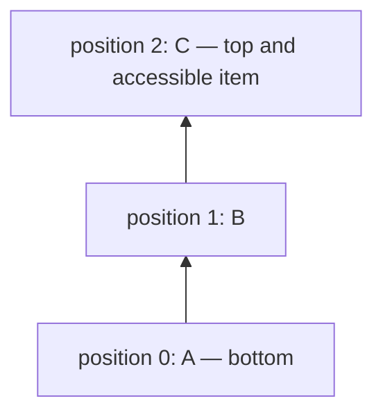
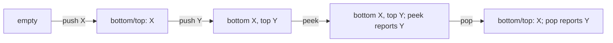
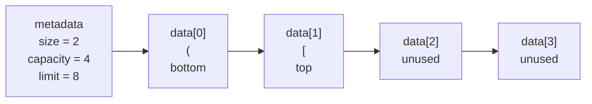
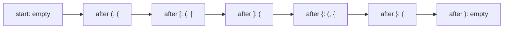
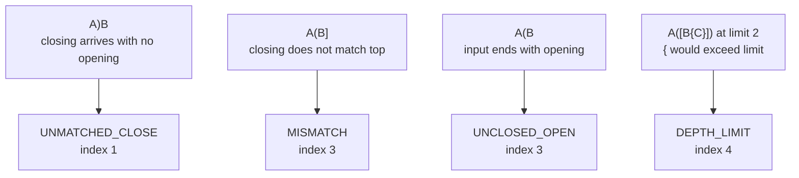
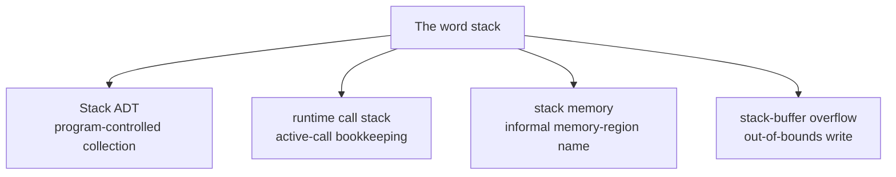
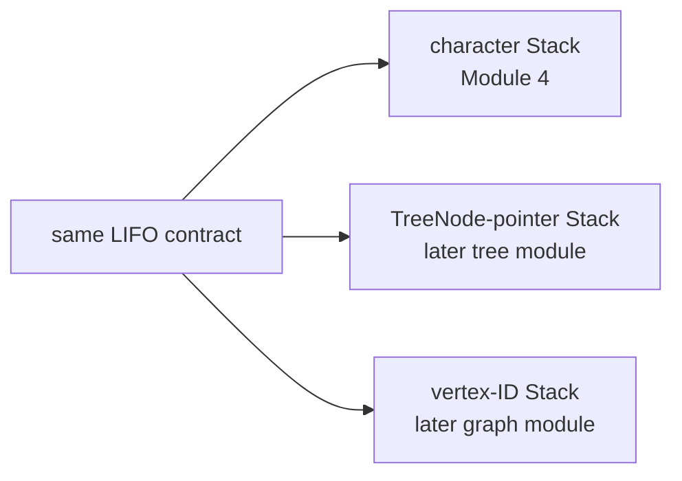

# Module 4 Stack Models

Every visual below has an exact text equivalent. Students may use the
diagram, the table or list, tactile objects, or a spoken description.

## 1. One accessible end

A **Stack** is a collection that permits access at one end, called the
**top**. **Last in, first out (LIFO)** means the item added most recently is
the first item that may be removed.



Text equivalent:

```text
Stack size: 3
Bottom item: A at position 0
Middle item: B at position 1
Top item: C at position 2
Only C is currently accessible for inspection or removal.
The next successful removal reports C.
```

The arrows show bottom-to-top order. They do not mean that items are
connected objects.

## 2. Push, peek, and pop

An **operation** is one task supplied by a data structure. `push` adds an
item at the top. `peek` reports the top without removing it. `pop` removes
and reports the top.



Text equivalent:

| Step | Reported item | Complete state from bottom to top |
|---|---|---|
| start | none | empty |
| push `X` | none | `X` |
| push `Y` | none | `X`, `Y` |
| peek | `Y` | `X`, `Y` |
| pop | `Y` | `X` |

Peek leaves the complete state unchanged. Pop removes only the former top.

## 3. ArrayList-backed storage

An **ArrayList** is a resizable numbered sequence. A **backend** is the
lower-level storage used to make the Stack operations work. An **index** is
a numbered position; C begins at zero. **Metadata** is information that
describes other stored data; here it means `size`, `capacity`, and `limit`.



Text equivalent:

| Fact | Exact value or meaning |
|---|---|
| `size` | `2`; two characters currently belong to the Stack |
| `capacity` | `4`; four character slots are allocated |
| `limit` | `8`; the task permits at most eight Stack items |
| `data[0]` | `(`; the bottom item |
| `data[1]` | `[`; the top because `size - 1` equals 1 |
| `data[2]` | allocated but not a current Stack item |
| `data[3]` | allocated but not a current Stack item |

The arrows in the diagram show increasing array indexes. They are not
pointers stored between characters.

## 4. Canonical delimiter trace

A **delimiter** is a mark that begins or ends a group. The matching pairs are
`()`, `[]`, and `{}`. A **trace** is a step-by-step record of changing
state. The trace below omits ordinary letters because they do not change the
Stack.



Text equivalent:

```text
Expression: A(B[C]{D})
All states are written from bottom to top.
Start: empty.
Read (: push it. State is (.
Read [: push it. State is (, [.
Read ]: peek reports [, which matches; pop it. State is (.
Read {: push it. State is (, {.
Read }: peek reports {, which matches; pop it. State is (.
Read ): peek reports (, which matches; pop it. State is empty.
Ordinary characters A, B, C, and D cause no Stack operation.
Greatest size: 2.
Final result: valid delimiters.
```

## 5. Four rejection cases

A **function** is a named block of computer instructions that performs one
task. A **validator** is a function that checks stated rules. An **error
index** is the numbered input position at which it reports a problem. C
begins indexes at zero. `SIZE_MAX` is the greatest value of the nonnegative C
count type `size_t`; this module uses it to mean that successful validation
has no error index.



Text equivalent:

| Input | Limit | Exact decision | Status | Error index |
|---|---:|---|---|---:|
| `A)B` | 2 | `)` arrives while the Stack is empty | `DELIMITER_UNMATCHED_CLOSE` | `1` |
| `A(B]` | 2 | `]` arrives while `(` is at the top | `DELIMITER_MISMATCH` | `3` |
| `A(B` | 2 | input ends while `(` remains | `DELIMITER_UNCLOSED_OPEN` | `3`, the string length |
| `A([B{C}])` | 2 | `{` would increase size from 2 to 3 | `DELIMITER_DEPTH_LIMIT` | `4` |

For comparison, `A(B[C]{D})` with limit 2 reports `DELIMITER_OK` and writes
`SIZE_MAX`.

## 6. Similar names, different mechanisms

A **runtime call stack** is bookkeeping commonly used for active function
calls. A **call frame** is the saved information for one active call.
**Stack memory** is an informal name for a memory region many C
implementations use for calls and local variables. A **buffer** is a bounded
area holding a sequence of values.



Text equivalent:

| Phrase | Exact meaning |
|---|---|
| Stack ADT | A program-controlled collection used through operations such as `push`, `peek`, and `pop` |
| runtime call stack | Bookkeeping commonly used by a C implementation for active function calls |
| stack memory | An informal name for a memory region many implementations use for calls and local variables |
| stack-buffer overflow | An out-of-bounds write past a buffer in that commonly named region |

The four phrases are not interchangeable. Using a Stack ADT does not itself
cause or prevent every stack-buffer overflow.

## 7. Contract transfer to later modules

An **item type** states what kind of value a collection stores. A
**TreeNode pointer** stores the address of one tree node. A **vertex ID** is
a small number naming one graph vertex.



Text equivalent:

```text
All three typed Stacks follow the same LIFO contract.
The Module 4 Stack stores character values.
A later tree Stack stores TreeNode pointer values.
A later graph Stack stores vertex-ID values.
The item type changes; push, peek, pop, and LIFO behavior remain.
```

Depth-first search, shortened to DFS, is a later algorithm for exploring tree
nodes or graph vertices. It can use LIFO storage for unfinished work. This
module previews only that connection; it does not teach a DFS procedure or
trace.
