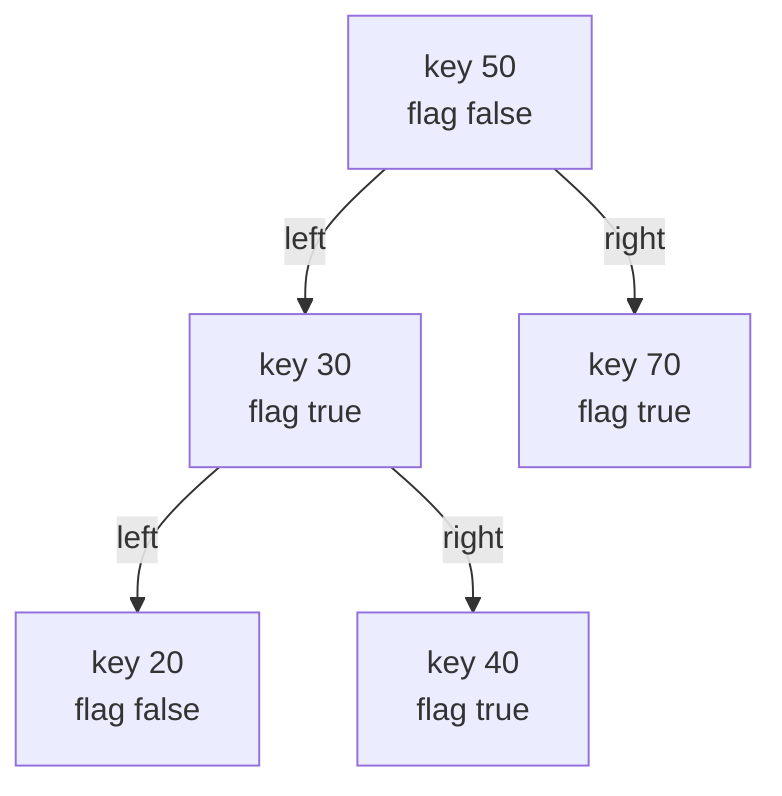
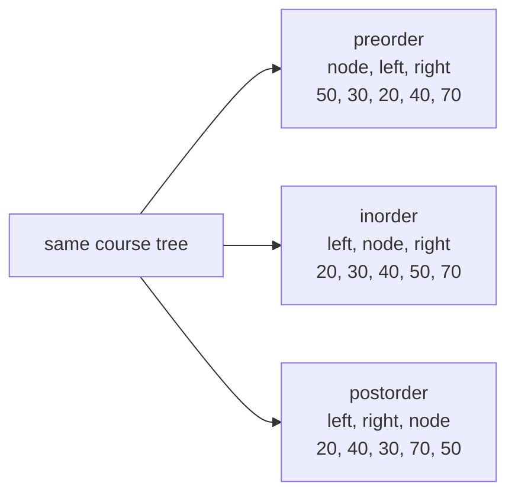
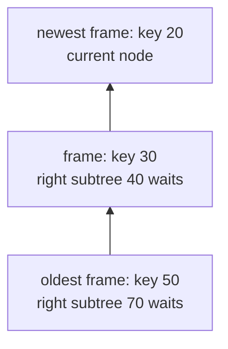
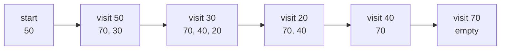
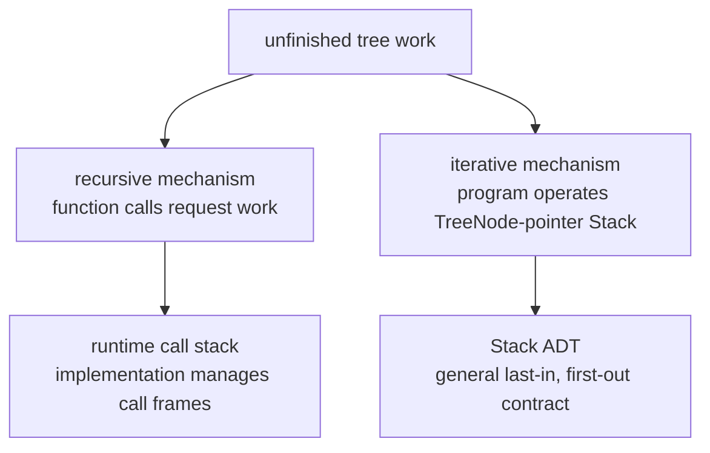
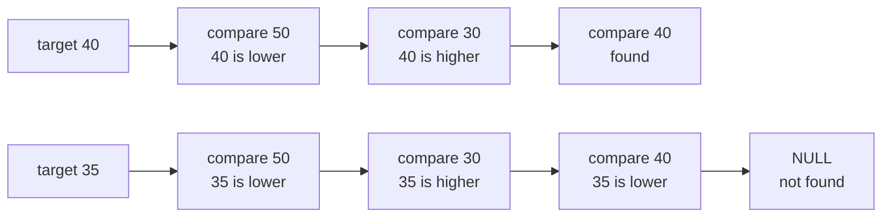
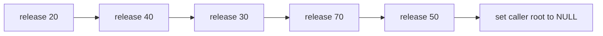
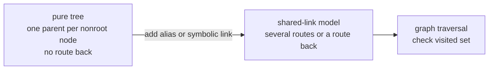

# Module 5 Tree DFS Models

Every visual below has an exact text equivalent. Students may use the
diagram, the text, tactile objects, or a spoken description.

The examples are synthetic. They are invented for safe study. A directory
organizes entries so stored items can be located. A policy is a set of
rules. These examples do not represent a real directory or security policy.

## 1. Canonical course tree

A **node** is one stored item in a tree. Its **key** is the whole number used
for identification or comparison. A **flag** is a stored yes-or-no marker.



Text equivalent:

```text
Root key 50 has flag false.
Its left child is key 30 with flag true.
Its right child is key 70 with flag true.
Key 30's left child is key 20 with flag false.
Key 30's right child is key 40 with flag true.
Keys 20, 40, and 70 have no children.
```

## 2. Three depth-first orders

A **tree traversal** visits nodes in a stated order. **Depth-first search
(DFS)** finishes one subtree before moving to another.



Text equivalent:

| Order | Visit rule | Complete key output |
|---|---|---|
| Preorder | node, left subtree, right subtree | `50, 30, 20, 40, 70` |
| Inorder | left subtree, node, right subtree | `20, 30, 40, 50, 70` |
| Postorder | left subtree, right subtree, node | `20, 40, 30, 70, 50` |

Every public traversal records all five nodes as key-and-flag copies. Reading
the complete preorder output and selecting true flags reports `30, 40, 70`.

## 3. Recursive calls while key 20 is active

**Recursion** occurs when a function calls itself. A **call frame** stores
information for one active call. The C implementation commonly manages
active frames in a **runtime call stack**. `NULL` means “no node.”



Text equivalent:

```text
Recursive preorder has reached key 20.
The active non-NULL calls, oldest to newest, are 50, 30, 20.
The call for 30 must resume with its right subtree at 40.
The call for 50 must later resume with its right subtree at 70.
Calls for either NULL child of 20 return immediately and visit nothing.
```

The `NULL` case is the **base case**, the input that stops more calls.

## 4. Iterative preorder states

An **explicit Stack** is a last-in, first-out collection directly operated
by the program. This one stores `const TreeNode *` pointers: node addresses
used to inspect, but not change, nodes. Items below are listed from bottom
to top.



Text equivalent:

| Completed visit | Complete Stack state, bottom to top | Recorded keys |
|---|---|---|
| none | `50` | empty |
| 50 | `70, 30` | `50` |
| 30 | `70, 40, 20` | `50, 30` |
| 20 | `70, 40` | `50, 30, 20` |
| 40 | `70` | `50, 30, 20, 40` |
| 70 | empty | `50, 30, 20, 40, 70` |

After visiting a node, the algorithm pushes its right child before its left
child. Last-in, first-out access then makes the left child come out next.

## 5. Recursive and explicit storage are different

The **Stack abstract data type (Stack ADT)** is the general last-in,
first-out rule. A **mechanism** is the way a task is carried out.



Text equivalent:

```text
Recursive traversal makes function calls.
The C implementation commonly keeps their call frames in a runtime call stack.
Iterative traversal directly pushes and pops TreeNode pointers.
That explicit collection follows the Stack ADT contract.
The mechanisms can produce the same preorder output, but they are not the
same stored object.
```

## 6. Strict BST search

A **binary search tree (BST)** has lower keys throughout each left subtree
and higher keys throughout each right subtree. **Strict** means equal keys
are not allowed. A **status code** is a named result reporting success or
one kind of failure.



Text equivalent:

```text
Search for 40 compares keys 50, 30, and 40, then reports TREE_DFS_OK.
Search for 35 compares keys 50, 30, and 40, then reaches the NULL left child
of 40 and reports TREE_DFS_NOT_FOUND.
On TREE_DFS_NOT_FOUND, out_node remains unchanged.
```

## 7. Postorder destruction

**Dynamic allocation** obtains storage while a program runs. **Ownership**
is responsibility for eventually releasing requested storage.
`tree_node_release` is the supplied function that releases one separately
allocated node.



Text equivalent:

```text
Postorder release sequence: 20, 40, 30, 70, 50.
Each child is released before its parent.
The parent stays alive while its child pointers are read.
After the root is released, tree_destroy_postorder writes NULL to the
caller's root pointer.
```

## 8. Pure tree versus shared links

A **graph** is a general structure of nodes and relationships. A **symbolic
link** is a directory entry that refers to another location. A **visited
set** records which nodes have already been reached.



Text equivalent:

```text
This module's pure tree gives each nonroot node one parent and has no route
back to an ancestor.
An alias can give one target several incoming routes.
A symbolic link can also create a route back to an earlier node.
Those relationships require a graph model.
A cycle is a route that returns to an already reached node.
A graph traversal checks a visited set to avoid repeated work and cycles.
```
