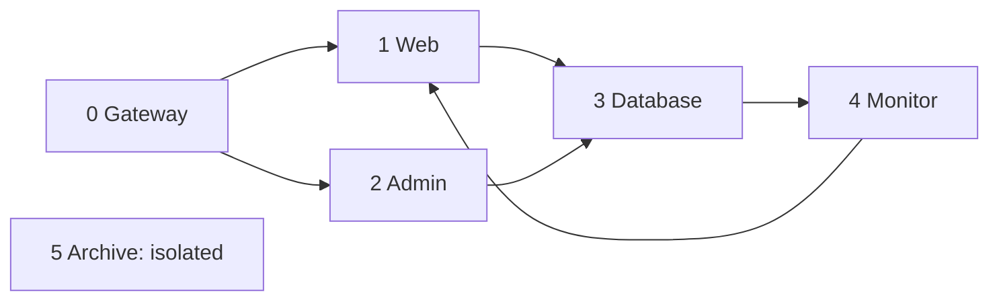
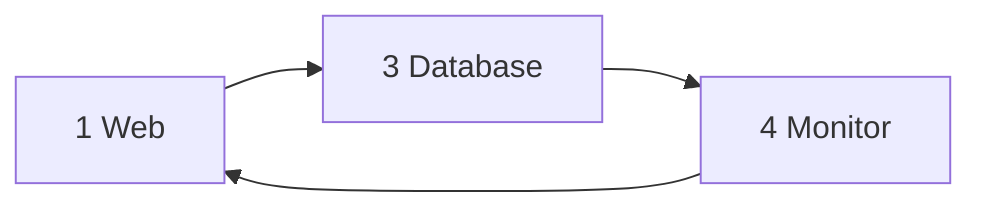
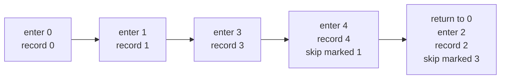
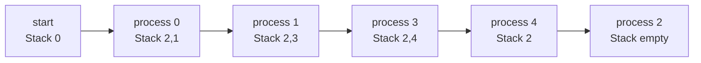
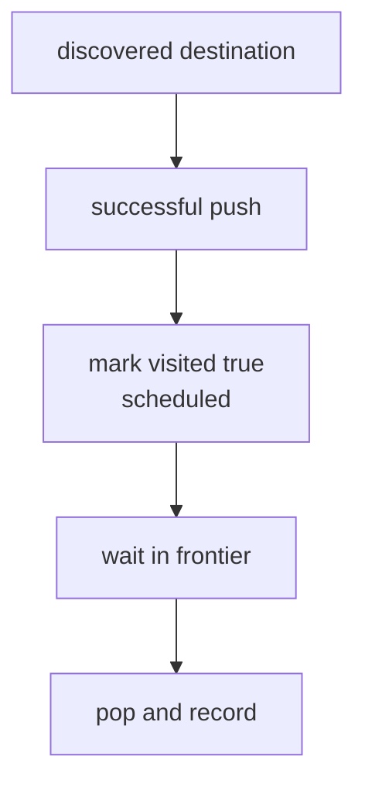
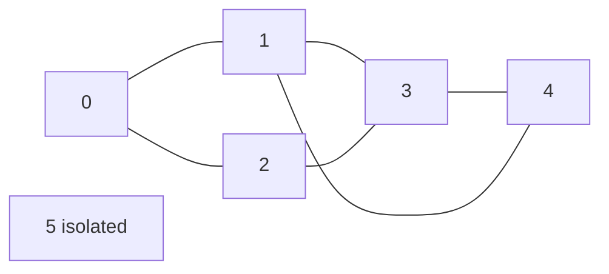
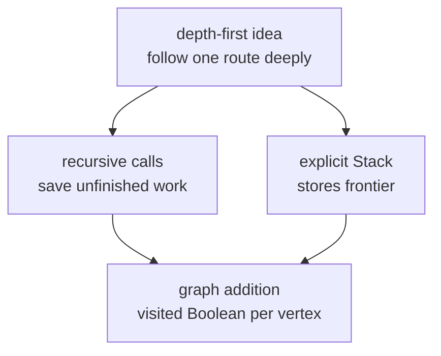
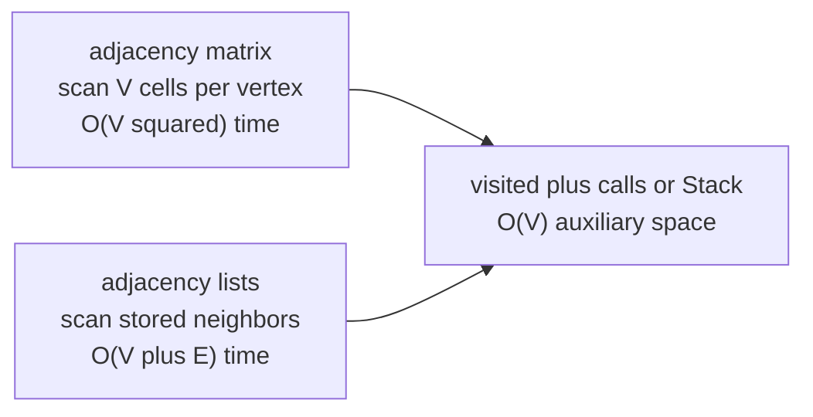

# Module 6 Graph DFS Models

Every visual below has a complete text equivalent. Students may use the
diagram, edge list, outgoing-neighbor lists, table, tactile objects, or a
spoken description. No meaning depends on color.

The service examples are synthetic, meaning invented for safe practice. A
**service** is a program that performs a task for another program. A
**graph** stores vertices and direct relationships. A **vertex** is one
item. An **edge** is one direct relationship.

## 1. Course directed graph

A **directed edge** works in one direction. The arrow label `0 → 1` means
the edge starts at vertex 0 and ends at vertex 1.



Exact edge-list equivalent:

```text
0 → 1
0 → 2
1 → 3
2 → 3
3 → 4
4 → 1
```

Exact outgoing-neighbor equivalent:

```text
0:[1,2]  1:[3]  2:[3]  3:[4]  4:[1]  5:[]
```

Exact sentence equivalent:

1. Gateway, vertex 0, leads to Web, vertex 1.
2. Gateway leads to Admin, vertex 2.
3. Web leads to Database, vertex 3.
4. Admin leads to Database.
5. Database leads to Monitor, vertex 4.
6. Monitor leads to Web.
7. Archive, vertex 5, has no edge entering or leaving it.

## 2. Why graph DFS needs visited state

**Depth-first search (DFS)** follows one available route deeply before
returning to an unfinished choice. A **cycle** is a route that returns to an
earlier vertex. A **visited array** stores one true-or-false value per
vertex. To **discover** means to reach for the first time. To **schedule**
means to arrange for work. To **record** means to append a vertex to output.
In this module, a marked vertex has been discovered and scheduled. The
**source** is the starting vertex.



Exact text equivalent:

```text
The cycle is 1 → 3 → 4 → 1.
DFS marks 1 before following 1 → 3.
It later marks 3 and then 4.
At edge 4 → 1, visited[1] is true.
The edge creates no new work, so the cycle stops.
```

An edge from 2 to 3 also reaches a marked destination after the first branch
has finished. It creates no second record for 3.

## 3. Recursive DFS

**Recursion** occurs when a function calls itself. A **call frame** stores
information for one active function call. Recursive DFS marks and records a
vertex on entry, then checks destinations from lower number to higher
number.



Exact event equivalent:

1. Enter, mark, and record 0.
2. Enter, mark, and record 1.
3. Enter, mark, and record 3.
4. Enter, mark, and record 4.
5. Skip edge `4 → 1` because vertex 1 is marked.
6. Return until the unfinished choice at 0 is active.
7. Enter, mark, and record 2.
8. Skip edge `2 → 3` because vertex 3 is marked.

Exact output and final visited set:

```text
Output: 0, 1, 3, 4, 2
Visited: {0, 1, 2, 3, 4}
Unmarked: {5}
```

## 4. Iterative DFS frontier

An **iterative algorithm** uses a loop instead of recursive calls. A
**loop** repeats instructions while its condition holds. An explicit
**Stack** is a last-in, first-out collection operated by the program. Its
**frontier** contains marked vertices still waiting to be processed.
`push` adds an item; `pop` removes the newest item.

Iterative DFS checks destinations from higher number to lower number. It
marks a destination only after its push succeeds. Stack items are listed
bottom to top.



Exact table equivalent:

| Completed processing | Visited vertices | Stack, bottom to top | Output |
|---|---|---|---|
| none | `{0}` | `0` | empty |
| 0 | `{0,1,2}` | `2,1` | `0` |
| 1 | `{0,1,2,3}` | `2,3` | `0,1` |
| 3 | `{0,1,2,3,4}` | `2,4` | `0,1,3` |
| 4 | `{0,1,2,3,4}` | `2` | `0,1,3,4` |
| 2 | `{0,1,2,3,4}` | empty | `0,1,3,4,2` |

Exact linear equivalent:

1. Initially, 0 is marked and waiting; output is empty.
2. After processing 0, 0, 1, and 2 are marked. The Stack is 2 then 1.
3. After processing 1, 3 is also marked. The Stack is 2 then 3.
4. After processing 3, 4 is also marked. The Stack is 2 then 4.
5. After processing 4, only 2 remains on the Stack.
6. After processing 2, the Stack is empty.
7. The recorded order is 0, 1, 3, 4, 2.

## 5. Marked is not the same as recorded

To **schedule** means to arrange for work to occur. To **record** means to
append a vertex number to output.



Exact text equivalent:

1. An unmarked destination is discovered.
2. Its vertex number is pushed.
3. Only after successful push is its visited value changed to true.
4. The marked vertex may wait in the frontier.
5. It is recorded later when popped.

After vertex 0 is processed, vertices 0, 1, and 2 are marked, but only
vertex 0 is recorded. If a push fails, that destination remains unmarked and
the caller's old output remains unchanged.

## 6. Undirected connected components

An **undirected edge** connects both ways. A **connected component** is one
separate group in an undirected graph whose vertices have routes to one
another. An **isolated vertex** has no edge; it forms a component of one.

This is a separate undirected practice graph. It uses the same six pairs of
vertex numbers as the course directed graph, but each relationship connects
both ways.



Exact undirected edge-list equivalent:

```text
{0,1}  {0,2}  {1,3}  {2,3}  {3,4}  {4,1}
```

Exact neighbor-list equivalent:

```text
0:[1,2]
1:[0,3,4]
2:[0,3]
3:[1,2,4]
4:[1,3]
5:[]
```

Exact component and order equivalent:

```text
Components: {0,1,2,3,4} and {5}
Count: 2
Recursive whole-graph order: 0,1,3,2,4 | 5
Iterative whole-graph order: 0,1,3,4,2 | 5
```

The vertical line separates searches started for different components.
Different valid orders may identify the same groups.

## 7. Tree-to-graph transfer



Exact table equivalent:

| Question | Tree DFS | Graph DFS |
|---|---|---|
| Current item | node | vertex |
| Next choices | left/right children | out-neighbors |
| Start | root | chosen source |
| Route can reconnect? | no, in a valid tree | yes |
| Visited state needed? | no | yes |
| Saved-work choices | recursive calls or explicit Stack | recursive calls or explicit Stack |
| One start covers all? | yes, from the root | only vertices reachable from the source |

## 8. Representation-sensitive cost

**Time complexity** describes how work grows. Let `V` mean vertex count and
`E` mean edge count. **Auxiliary space** is temporary working storage
separate from the graph and output.
**Big-O notation** writes a growth pattern as `O(...)`.

An **adjacency matrix** is a row-and-column table of possible edges. An
**adjacency list** stores one list of outgoing neighbors for each vertex.



Exact text equivalent:

1. A full adjacency-matrix DFS scans `V` possible destinations for each of
   `V` vertices, giving `O(V²)` time.
2. A full adjacency-list DFS scans vertices and stored edges, giving
   `O(V+E)` time.
3. The visited array plus recursive calls or explicit Stack uses `O(V)`
   auxiliary space.
