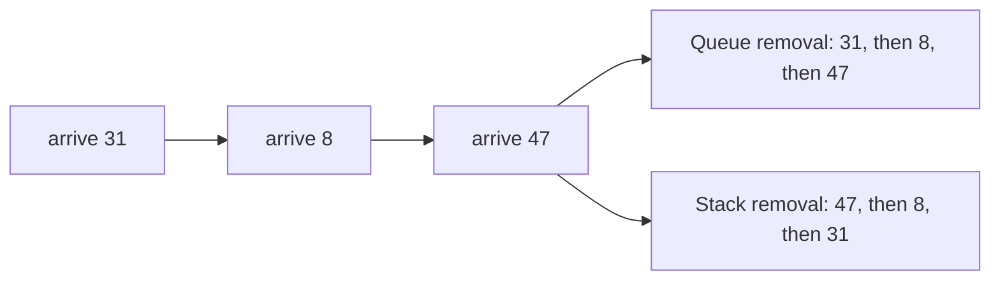
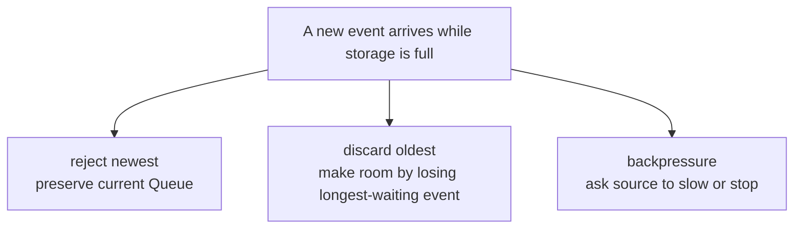
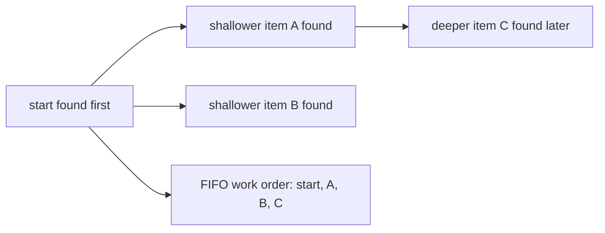

# Module 7 Queue Models

Every visual has a numbered text equivalent. Students may use the diagram,
table, numbered description, tactile objects, or spoken description. Labels,
not color, carry all meaning.

## 1. FIFO Queue and LIFO Stack

A **Queue** uses first-in, first-out (FIFO): the oldest item leaves first. A
**Stack** uses last-in, first-out (LIFO): the newest item leaves first.



Numbered linear equivalent:

1. Event 31 arrives first.
2. Event 8 arrives second.
3. Event 47 arrives third.
4. A FIFO Queue removes 31, then 8, then 47.
5. A LIFO Stack removes 47, then 8, then 31.
6. The codes are identifiers; neither rule sorts them numerically.

## 2. Stored fields and derived positions

A **pointer** stores a memory address. The course Queue stores four fields:

| Field | Exact meaning |
|---|---|
| `data` | pointer to the integer array |
| `capacity` | fixed number of physical positions |
| `head` | physical index of the front when nonempty |
| `size` | number of current logical items |

The `%` operator gives the **remainder** after whole-number division. For
positive capacity:

```text
tail = (head + size) % capacity
physical index of logical item k = (head + k) % capacity
```

Numbered linear equivalent:

1. `data` points to one fixed array.
2. `capacity` states how many physical positions exist.
3. `head` locates the oldest item when one exists.
4. `size` states how many items are live.
5. Tail is calculated and is not a stored field.
6. Logical offset 0 is the front.
7. The formulas are used only when capacity is greater than zero.

## 3. Capacity-three reveal

`LIVE` means a value belongs to the Queue. `STALE` means a physical value no
longer belongs to it. `UNUSED` means the trace has never stored a value in
that position.

| Completed request | Index 0 | Index 1 | Index 2 | `head` | `size` | tail | Logical order |
|---|---|---|---|---:|---:|---:|---|
| initialize | UNUSED | UNUSED | UNUSED | 0 | 0 | 0 | empty |
| enqueue 71 | 71 LIVE | UNUSED | UNUSED | 0 | 1 | 1 | `71` |
| enqueue 24 | 71 LIVE | 24 LIVE | UNUSED | 0 | 2 | 2 | `71, 24` |
| dequeue reports 71 | 71 STALE | 24 LIVE | UNUSED | 1 | 1 | 2 | `24` |
| enqueue 83 | 71 STALE | 24 LIVE | 83 LIVE | 1 | 2 | 0 | `24, 83` |
| enqueue 36 | 36 LIVE | 24 LIVE | 83 LIVE | 1 | 3 | 1 | `24, 83, 36` |

Numbered linear equivalent:

1. Initialization has three unused positions and an empty logical order.
2. Event 71 enters index 0, then event 24 enters index 1.
3. Dequeue reports 71; its value becomes stale, head becomes 1, and 24 is
   the only live event.
4. Event 83 enters index 2.
5. The next insertion position wraps to index 0, where event 36 is stored.
6. Final physical indexes 0, 1, and 2 contain live events 36, 24, and 83.
7. Final logical order is 24, 83, 36.
8. Final head and tail both equal 1; size 3 proves the Queue is full.

## 4. Capacity-five Cognitive Pause model

### Starting state

| Physical index | 0 | 1 | 2 | 3 | 4 |
|---:|---|---|---|---|---|
| State | 18 LIVE | 77 LIVE | UNUSED | 42 LIVE | 9 LIVE |

`head == 3`, `size == 4`, tail is 2, and logical order is
`42, 9, 18, 77`.

Numbered linear equivalent:

1. Index 0 stores live event 18.
2. Index 1 stores live event 77.
3. Index 2 is unused.
4. Index 3 stores live event 42 and is the head.
5. Index 4 stores live event 9.
6. Four live events form logical order 42, 9, 18, 77.
7. The next insertion position is index 2.

### After enqueue 55, then dequeue

| Physical index | 0 | 1 | 2 | 3 | 4 |
|---:|---|---|---|---|---|
| State | 18 LIVE | 77 LIVE | 55 LIVE | 42 STALE | 9 LIVE |

Dequeue reports 42. Final `head == 4`, `size == 4`, tail is 3, and logical
order is `9, 18, 77, 55`.

Numbered linear equivalent:

1. Event 55 enters unused index 2.
2. Dequeue reports event 42 from index 3.
3. Physical value 42 remains stale at index 3.
4. Final head is 4 and final size is 4.
5. Final logical order is 9, 18, 77, 55.
6. The next insertion position is index 3.

### After enqueue 55, then attempted enqueue 66

| Physical index | 0 | 1 | 2 | 3 | 4 |
|---:|---|---|---|---|---|
| State | 18 LIVE | 77 LIVE | 55 LIVE | 42 LIVE | 9 LIVE |

The attempt reports `EVENT_QUEUE_FULL`. The complete state remains
unchanged: `head == 3`, `size == 5`, tail is 3, and logical order is
`42, 9, 18, 77, 55`.

Numbered linear equivalent:

1. Event 55 enters index 2 and makes all five items live.
2. Event 66 is rejected.
3. No field or physical position changes.
4. Head and tail both equal 3.
5. Size 5 proves the Queue is full rather than empty.

## 5. Capacity-four course trace

| Completed request | Index 0 | Index 1 | Index 2 | Index 3 | `head` | `size` | tail | Logical order or result |
|---|---|---|---|---|---:|---:|---:|---|
| initialize | UNUSED | UNUSED | UNUSED | UNUSED | 0 | 0 | 0 | empty |
| enqueue 31, 8, 47, 19 | 31 LIVE | 8 LIVE | 47 LIVE | 19 LIVE | 0 | 4 | 0 | `31, 8, 47, 19` |
| dequeue 31, then 8 | 31 STALE | 8 STALE | 47 LIVE | 19 LIVE | 2 | 2 | 0 | `47, 19` |
| enqueue 62 | 62 LIVE | 8 STALE | 47 LIVE | 19 LIVE | 2 | 3 | 1 | `47, 19, 62` |
| enqueue 5 | 62 LIVE | 5 LIVE | 47 LIVE | 19 LIVE | 2 | 4 | 2 | `47, 19, 62, 5` |
| attempt enqueue 90 | 62 LIVE | 5 LIVE | 47 LIVE | 19 LIVE | 2 | 4 | 2 | `EVENT_QUEUE_FULL`; unchanged |
| drain all four | 62 STALE | 5 STALE | 47 STALE | 19 STALE | 0 | 0 | 0 | reports `47, 19, 62, 5` |

Numbered linear equivalent:

1. Four successful enqueues fill indexes 0 through 3 with 31, 8, 47, 19.
2. Two dequeues report 31 and 8. Head becomes 2; those two physical values
   are stale.
3. Enqueue 62 reuses index 0.
4. Enqueue 5 reuses index 1.
5. Physical order is 62, 5, 47, 19; logical order is 47, 19, 62, 5.
6. Attempted event 90 is rejected and changes nothing.
7. Four dequeues report 47, 19, 62, 5.
8. The final empty Queue has head 0 and size 0; all displayed numbers are
   stale.

## 6. Equal head and tail: empty or full

| State | Capacity | `head` | `size` | tail | Meaning |
|---|---:|---:|---:|---:|---|
| required empty form | 4 | 0 | 0 | 0 | no live items |
| wrapped full | 4 | 2 | 4 | 2 | four live items |
| capacity-one empty | 1 | 0 | 0 | 0 | no live items |
| capacity-one full | 1 | 0 | 1 | 0 | one live item |

Numbered linear equivalent:

1. Equal head and tail do not determine whether a Queue is empty or full.
2. Size 0 means empty.
3. Size equal to capacity means full.
4. Capacity 1 demonstrates both cases with head and tail equal to 0.

## 7. Three explicit full policies



Numbered linear equivalent:

1. Reject-newest refuses the attempted item and preserves the full Queue.
2. Discard-oldest removes the item that has waited longest, then accepts the
   new item.
3. Backpressure asks the source to slow or stop.
4. The course Queue uses reject-newest.
5. A real system must report its choice; silent event loss is never safe.

## 8. Three Queue representations

| Representation | Typical enqueue | Typical dequeue | Storage fact | Main trade-off |
|---|---:|---:|---|---|
| shifting fixed array | `O(1)` with room | `O(n)` | one fixed array | removal moves remaining items |
| fixed circular array | `O(1)` | `O(1)` | one fixed array | explicit full policy required |
| linked nodes with front/back pointers | `O(1)` | `O(1)` | usually one allocation per item | pointer and allocation rules add risk |

`O(1)` means fixed work. `O(n)` means work may grow with `n` items.

Numbered linear equivalent:

1. A shifting array commonly adds at the physical end but moves up to `n`
   items after removing the front.
2. A circular array changes indexes instead of shifting items.
3. A linked Queue changes front/back links and commonly allocates a node per
   added item.
4. The course representation is the fixed circular array.

## 9. Limited BFS preview

Breadth-first search (BFS) is a later algorithm that explores shallower
levels before deeper levels.



Numbered linear equivalent:

1. The start item is found first.
2. Shallower items A and B are found next.
3. Deeper item C is found later.
4. FIFO storage can preserve that order as start, A, B, C.
5. This diagram previews only the storage connection; it does not teach the
   BFS procedure.
