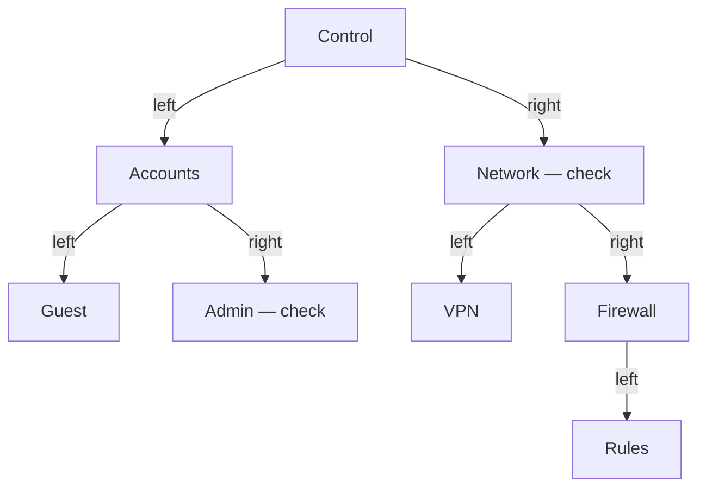
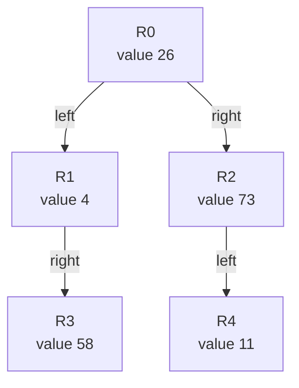
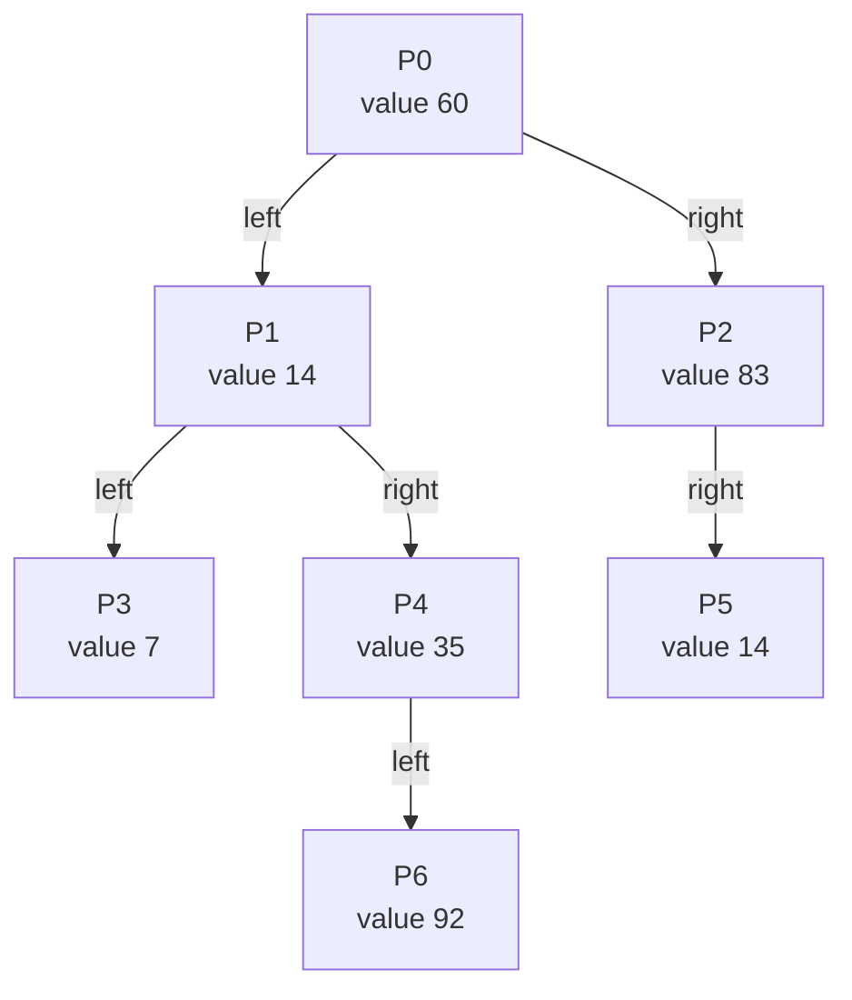
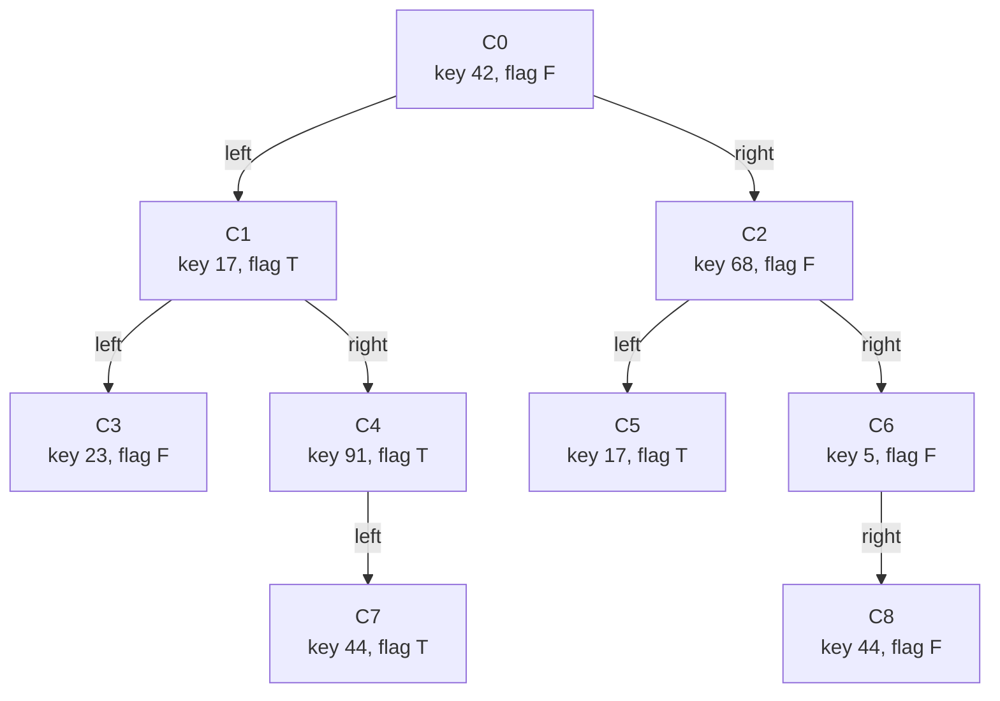
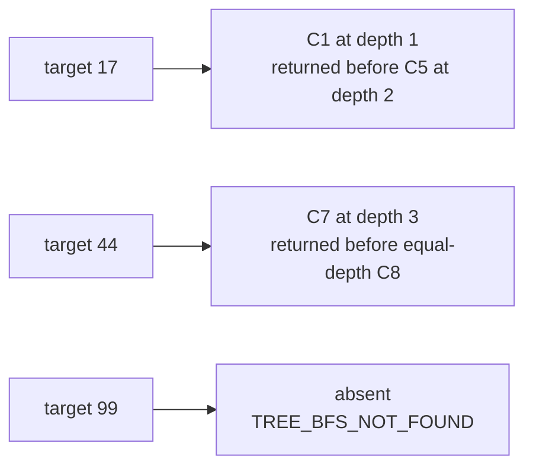
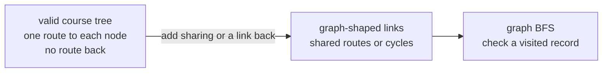

# Module 8 Tree BFS Models

Every visual has an exact numbered or linear text equivalent. Students may
use the diagram, table, numbered description, tactile objects, or a spoken
description. Labels, not color, carry all meaning.

## Reading key

**Breadth-first search (BFS)** visits smaller **depths** before larger ones;
depth is the child-link count from the root. A **Queue** removes work in
first-in, first-out order. The **frontier** is the Queue of discovered nodes
still waiting. `C1@2` means node label `C1` at depth 2. `T` means a yes-or-no
flag is true; `F` means false. A **tree** connects stored items called
**nodes** from one starting **root**. A **key** is a node's stored search
value. A **binary tree** gives each node at most a left and right child.
`check` marks an item that needs attention in the practice scenario.

`n` means node count, `w` maximum level width, and `h` edge height—the
greatest downward-link count to a leaf. `O(n)`, `O(w)`, and `O(h)` are read
“order n,” “order w,” and “order h”; each says work or storage grows in
proportion to its named quantity. **Auxiliary space** is temporary working
storage separate from the tree and output. **Depth-first search (DFS)**
follows one branch before returning to another.

## 1. Inquiry hierarchy



Numbered equivalent:

1. `Control` is the root.
2. `Control` has left child `Accounts` and right child `Network`.
3. `Accounts` has left child `Guest` and right child `Admin`.
4. `Network` has left child `VPN` and right child `Firewall`.
5. `Firewall` has left child `Rules` and no right child.
6. `Guest`, `Admin`, `VPN`, and `Rules` have no children.
7. `Network` and `Admin` carry check markers.

After calibration, the nearer-first, left-first inspection order is:

```text
Control, Accounts, Network, Guest, Admin, VPN, Firewall, Rules
```

## 2. Representation-reveal tree



Numbered equivalent:

1. `R0`, value 26, is the root.
2. `R0` has left child `R1`, value 4, and right child `R2`, value 73.
3. `R1` has no left child and has right child `R3`, value 58.
4. `R2` has left child `R4`, value 11, and no right child.
5. `R3` and `R4` have no children.

Frontier states, front first:

| Completed visit | Complete frontier |
|---|---|
| none | `R0@0` |
| `R0` | `R1@1, R2@1` |
| `R1` | `R2@1, R3@2` |
| `R2` | `R3@2, R4@2` |
| `R3` | `R4@2` |
| `R4` | empty |

Numbered frontier equivalent:

1. Begin with `R0` at depth 0.
2. After `R0`, wait for `R1` at depth 1, then `R2` at depth 1.
3. After `R1`, wait for `R2` at depth 1, then `R3` at depth 2.
4. After `R2`, wait for `R3` at depth 2, then `R4` at depth 2.
5. After `R3`, only `R4` at depth 2 remains.
6. After `R4`, the frontier is empty.

## 3. Cognitive Pause calibration



Numbered equivalent:

1. `P0`, value 60, is the root.
2. `P0` has children `P1`, value 14, and `P2`, value 83.
3. `P1` has children `P3`, value 7, and `P4`, value 35.
4. `P2` has only right child `P5`, value 14.
5. `P4` has only left child `P6`, value 92.
6. `P3`, `P5`, and `P6` have no children.

Calibrated results:

```text
visit/depth:
P0@0, P1@1, P2@1, P3@2, P4@2, P5@2, P6@3

target 14:
P1 at depth 1

level widths:
1, 2, 3, 1

maximum width:
3

edge height:
3
```

## 4. Canonical course tree



Numbered equivalent:

1. `C0`, key 42 and flag F, is the root.
2. `C0` has left child `C1` and right child `C2`.
3. `C1`, key 17 and flag T, has children `C3` and `C4`.
4. `C2`, key 68 and flag F, has children `C5` and `C6`.
5. `C3`, key 23 and flag F, has no children.
6. `C4`, key 91 and flag T, has only left child `C7`.
7. `C5`, key 17 and flag T, has no children.
8. `C6`, key 5 and flag F, has only right child `C8`.
9. `C7`, key 44 and flag T, has no children.
10. `C8`, key 44 and flag F, has no children.

This is a general binary tree. Numeric order does not control its links, and
repeated keys are valid.

## 5. Canonical frontier and visits

| Completed visit | Frontier from front to back | Visit record |
|---|---|---|
| none | `C0@0` | none |
| `C0` | `C1@1, C2@1` | `42,F,0` |
| `C1` | `C2@1, C3@2, C4@2` | `17,T,1` |
| `C2` | `C3@2, C4@2, C5@2, C6@2` | `68,F,1` |
| `C3` | `C4@2, C5@2, C6@2` | `23,F,2` |
| `C4` | `C5@2, C6@2, C7@3` | `91,T,2` |
| `C5` | `C6@2, C7@3` | `17,T,2` |
| `C6` | `C7@3, C8@3` | `5,F,2` |
| `C7` | `C8@3` | `44,T,3` |
| `C8` | empty | `44,F,3` |

Numbered equivalent:

1. Visit `C0@0`; then wait for `C1@1, C2@1`.
2. Visit `C1@1`; then wait for `C2@1, C3@2, C4@2`.
3. Visit `C2@1`; then wait for `C3@2, C4@2, C5@2, C6@2`.
4. Visit `C3@2`; then wait for `C4@2, C5@2, C6@2`.
5. Visit `C4@2`; then wait for `C5@2, C6@2, C7@3`.
6. Visit `C5@2`; then wait for `C6@2, C7@3`.
7. Visit `C6@2`; then wait for `C7@3, C8@3`.
8. Visit `C7@3`; then wait for `C8@3`.
9. Visit `C8@3`; the frontier becomes empty.

Complete key order:

```text
42, 17, 68, 23, 91, 17, 5, 44, 44
```

## 6. Levels, width, and height

| Depth | Node labels | Width |
|---:|---|---:|
| 0 | `C0` | 1 |
| 1 | `C1, C2` | 2 |
| 2 | `C3, C4, C5, C6` | 4 |
| 3 | `C7, C8` | 2 |

Numbered equivalent:

1. Depth 0 contains `C0`; width is 1.
2. Depth 1 contains `C1` and `C2`; width is 2.
3. Depth 2 contains `C3`, `C4`, `C5`, and `C6`; width is 4.
4. Depth 3 contains `C7` and `C8`; width is 2.
5. Maximum width is 4.
6. The root's edge height is 3.

A **balance factor** is left-child height minus right-child height. Node
heights and balance factors:

| Node | Height | Balance factor |
|---|---:|---:|
| `C0` | 3 | 0 |
| `C1` | 2 | -1 |
| `C2` | 2 | -1 |
| `C3` | 0 | 0 |
| `C4` | 1 | 1 |
| `C5` | 0 | 0 |
| `C6` | 1 | -1 |
| `C7` | 0 | 0 |
| `C8` | 0 | 0 |

Numbered equivalent:

1. `C0` has height 3 and balance factor 0.
2. `C1` has height 2 and balance factor -1.
3. `C2` has height 2 and balance factor -1.
4. `C3` has height 0 and balance factor 0.
5. `C4` has height 1 and balance factor 1.
6. `C5` has height 0 and balance factor 0.
7. `C6` has height 1 and balance factor -1.
8. `C7` has height 0 and balance factor 0.
9. `C8` has height 0 and balance factor 0.

## 7. Shallowest repeated values



Numbered equivalent:

1. Searching for 17 returns `C1` at depth 1; `C5` has depth 2.
2. Searching for 44 returns `C7` at depth 3.
3. `C8` also stores 44 at depth 3, but left-first discovery places `C7`
   first.
4. Searching for 99 visits all nine nodes, reports not found, and preserves
   the caller's old match.

## 8. BFS and DFS working-space comparison

| Shape | BFS working need | DFS working need |
|---|---|---|
| wide and shallow | may be larger because `w` is large | may be smaller because `h` is small |
| one-child chain | stays near one waiting node | grows with `h` |

Numbered equivalent:

1. BFS uses `O(w)` auxiliary space, where `w` is maximum width.
2. DFS uses `O(h)` auxiliary space, where `h` is edge height.
3. Both complete traversals take `O(n)` time for `n` nodes.
4. A Queue can contain adjacent depths during a transition, so its peak
   count need not equal one level's width.

## 9. One balance preview

A **rotation** is a small link rearrangement that preserves binary-search
order.

Before:

```text
    30
   /
  20
 /
10
```

After one supplied right rotation at 30:

```text
   20
  /  \
10   30
```

Numbered equivalent:

1. Before rotation, 30 is the root, its left child is 20, and 20's left
   child is 10.
2. Heights are 0 for 10, 1 for 20, and 2 for 30.
3. Balance factors are 0 for 10, 1 for 20, and 2 for 30.
4. After rotation, 20 is root, 10 is its left child, and 30 is its right
   child.
5. The new root height is 1 and every balance factor is 0.
6. **Inorder** visits everything below the left child, the node, then
   everything below the right child; it remains `10, 20, 30`.
7. Rotation implementation waits until Module 14.

## 10. Tree boundary and graph forward link



Numbered equivalent:

1. A valid course tree gives each nonroot node one parent.
2. No tree child-link route returns to an earlier node.
3. A graph may provide several routes to one item or a route back.
4. Graph BFS records reached vertices so they are not repeatedly added.
