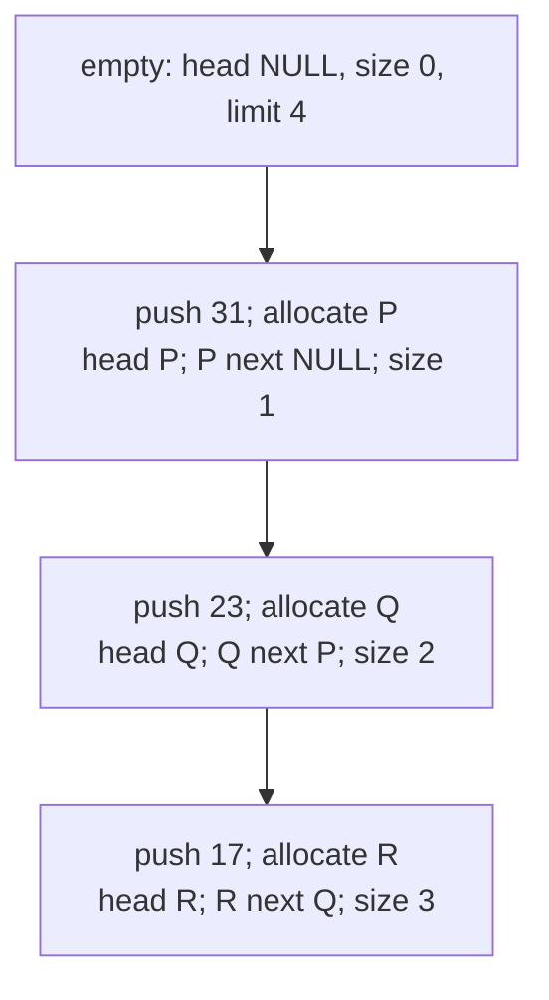
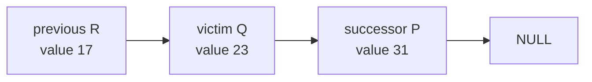
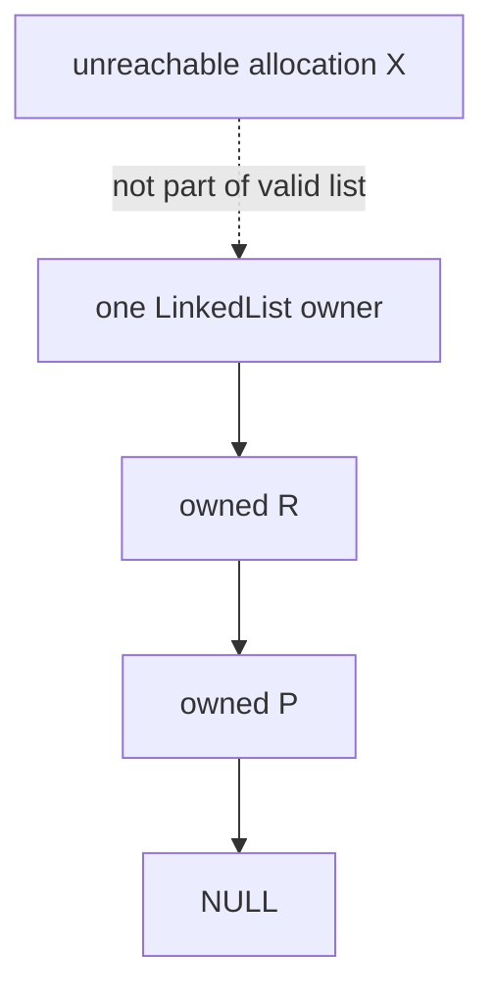
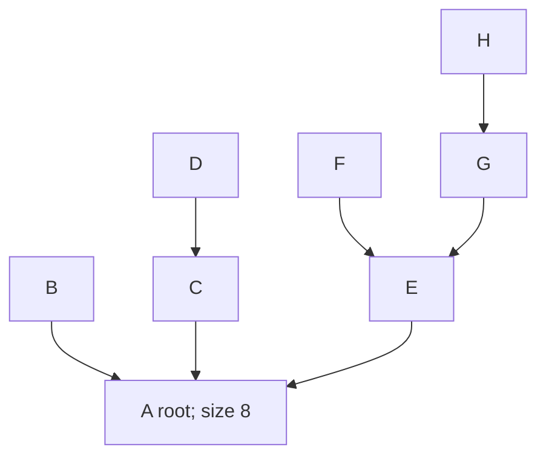
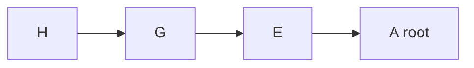

# Linked-List and DSU Models with Exact Linear Equivalents

Every visual in this file has an exact text or table equivalent. Arrows
show stored links; color, position, and arrow shape carry no independent
meaning.

## Model 1 - Canonical separately allocated nodes

A **node** is one allocated object. P, Q, and R are symbolic location
labels, not numeric addresses.


Exact text equivalent:

```text
head=R, size=3, limit=4
R: value=17, next=Q
Q: value=23, next=P
P: value=31, next=NULL
traversal values: 17,23,31
```

The drawing's spacing does not mean that the objects are adjacent in
memory.

## Model 2 - Push-front trace

**Push-front** allocates a node and places it before the prior first node.



Exact linear equivalent:

| Step | New node | New node's `next` | Head | Size | Values |
|---:|---|---|---|---:|---|
| 0 | none | none | `NULL` | 0 | empty |
| 1 | P stores 31 | `NULL` | P | 1 | 31 |
| 2 | Q stores 23 | P | Q | 2 | 23,31 |
| 3 | R stores 17 | Q | R | 3 | 17,23,31 |

Allocation failure at any push leaves the entire prior row unchanged.

## Model 3 - Safe removal of the first 23



Safe operation order:

1. traversal compares R, then Q;
2. save `successor=Q->next`, which is P;
3. write `R->next=P`;
4. release Q;
5. decrease size from 3 to 2.

Exact result:

```text
head=R, size=2, limit=4
R: value=17, next=P
P: value=31, next=NULL
released exactly once: Q
```

Duplicates are valid. The operation removes only the first match. An
absent value is successful with `out_removed=false` and no topology change.

## Model 4 - Destruction and the lifetime defect

Correct destruction from `R->P->NULL`:

| Iteration | Current | Save before release | Release |
|---:|---|---|---|
| 1 | R | P | R |
| 2 | P | `NULL` | P |

Exact destroyed state:

```text
head=NULL
size=0
limit=0
```

Incorrect isolated deletion:

```text
release Q
then read Q.next
```

Exact interpretation: Q's lifetime ends at release. Reading its field
afterward is a use-after-free even if the bytes appear unchanged. The
faulty object file is never linked into normal builds.

## Model 5 - List invariant and ownership boundary



Exact invariant checklist:

| Rule | Valid canonical state |
|---|---|
| empty correspondence | head is `NULL` exactly when size is zero |
| exact reachability | exactly `size` distinct nodes, then `NULL` |
| bound | `size <= limit <= 16` |
| no cycle | no node is reached twice |
| one owner | no shallow copy shares the nodes |

The validator can check bounded visible links. It cannot prove that an
arbitrary address is live or uniquely owned.

## Model 6 - Parent arrays encode a forest

After all seven canonical unions:

```text
ID:             A B C D E F G H
parent:         A A A C A E E G
component_size: 8 0 0 0 0 0 0 0
```



Exact linear parent paths:

```text
A: A
B: B->A
C: C->A
D: D->C->A
E: E->A
F: F->E->A
G: G->E->A
H: H->G->E->A
```

A root has itself as parent and stores the exact component size. Every
nonroot stores component size zero.

## Model 7 - Complete canonical union timeline

Equal component sizes use the smaller root ID.

| Step | Roots before merge | Winner | `parent[A..H]` | `component_size[A..H]` | Components |
|---:|---|---|---|---|---:|
| make A–H | none | each ID | `[A,B,C,D,E,F,G,H]` | `[1,1,1,1,1,1,1,1]` | 8 |
| A-B | A,B | A | `[A,A,C,D,E,F,G,H]` | `[2,0,1,1,1,1,1,1]` | 7 |
| C-D | C,D | C | `[A,A,C,C,E,F,G,H]` | `[2,0,2,0,1,1,1,1]` | 6 |
| A-C | A,C | A | `[A,A,A,C,E,F,G,H]` | `[4,0,0,0,1,1,1,1]` | 5 |
| E-F | E,F | E | `[A,A,A,C,E,E,G,H]` | `[4,0,0,0,2,0,1,1]` | 4 |
| G-H | G,H | G | `[A,A,A,C,E,E,G,G]` | `[4,0,0,0,2,0,2,0]` | 3 |
| E-G | E,G | E | `[A,A,A,C,E,E,E,G]` | `[4,0,0,0,4,0,0,0]` | 2 |
| A-E | A,E | A | `[A,A,A,C,A,E,E,G]` | `[8,0,0,0,0,0,0,0]` | 1 |

Attaching a root does not rewrite every descendant immediately. Later find
operations create shortcuts.

## Model 8 - Two-pass find on H

First pass:



Exact path:

```text
H->G->E->A
```

Second pass assigns root A to the visited nonroots. E already has parent A;
G and H change.

```text
before: [A,A,A,C,A,E,E,G]
after:  [A,A,A,C,A,E,A,A]
size:   [8,0,0,0,0,0,0,0] unchanged
components: 1 unchanged
```

Compression changes parent links only. It does not add or remove members.

## Model 9 - Same-set union D-H

Begin after finding H:

```text
parent: [A,A,A,C,A,E,A,A]
```

Root searches:

```text
D->C->A; compress D to A
H->A
```

Both roots equal A:

```text
merged=false
cycle-producing relationship=true
component count=1
final parent=[A,A,A,A,A,E,A,A]
component_size=[8,0,0,0,0,0,0,0]
```

For an incoming undirected relationship, equal roots mean that an earlier
route already joins the endpoints.

## Model 10 - Incident records to one edge list

An **incident record** describes one edge as stored at one endpoint.
**Reciprocal records** store the two directions of one undirected edge.
Distinct edge IDs preserve **parallel edges**, which share endpoints but
are separate edges.

| Edge ID | Incident record 1 | Incident record 2 | Logical output |
|---:|---|---|---|
| 0 | A to B, weight 1 | B to A, weight 1 | A-B, weight 1 |
| 1 | A to B, weight 4 | B to A, weight 4 | A-B, weight 4 |
| 2 | A to C, weight 3 | C to A, weight 3 | A-C, weight 3 |
| 3 | B to C, weight 2 | C to B, weight 2 | B-C, weight 2 |
| 4 | C to D, weight 5 | D to C, weight 5 | C-D, weight 5 |

Exact sorted output:

```text
ID 0 A-B weight 1
ID 3 B-C weight 2
ID 2 A-C weight 3
ID 1 A-B weight 4
ID 4 C-D weight 5
```

A relational comparator checks weight, normalized endpoints, then edge ID
with less-than and greater-than. It never subtracts, so `INT64_MIN` and
`INT64_MAX`, the smallest and largest signed 64-bit values, cannot cause
comparator subtraction overflow. A self-loop uses two identical incident
records carrying one edge ID.

## Model 11 - Cost, scope, and Spiral 5 bridge

| Operation or change | Actual cost or preserved meaning | Forward bridge |
|---|---|---|
| list push-front core | `O(1)` field changes | local link discipline |
| list search/remove/destroy | `O(n)` | bounded pointer traversal |
| full list validator | `O(n)` and separate | integrity checking |
| DSU make-set | `O(1)` per new dense ID | incremental components |
| optimized find/union | amortized `O(alpha(n))` | Kruskal cycle checks |
| list relink | one owned acyclic chain remains | Module 15 AVL, a height-balanced search-tree, link repair |
| path compression | same component membership | shallower parent forest |
| root attachment | two complete components merge | reject graph cycles |

`alpha` grows extraordinarily slowly; no derivation is required. The
amortized DSU bound excludes a complete diagnostic scan before each
operation.

Exact scope statement:

```text
DSU can report shared membership in processed undirected relationships.
It does not provide authorization, trust, an actual route, a shortest
path, resilience, or efficient deletion support.
```
